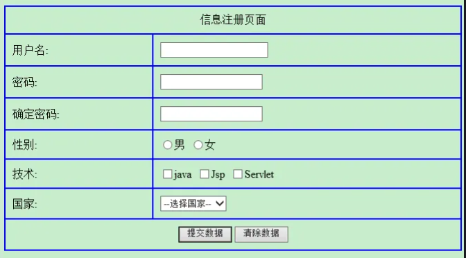
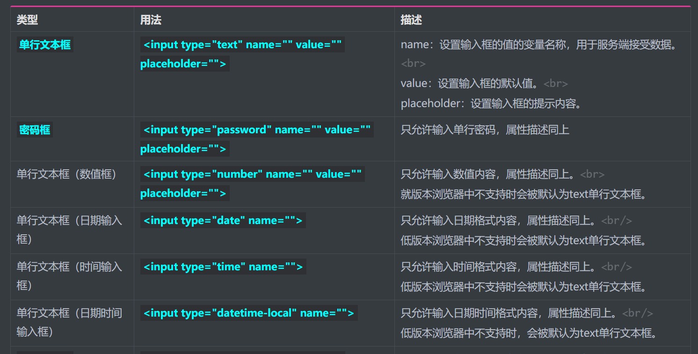
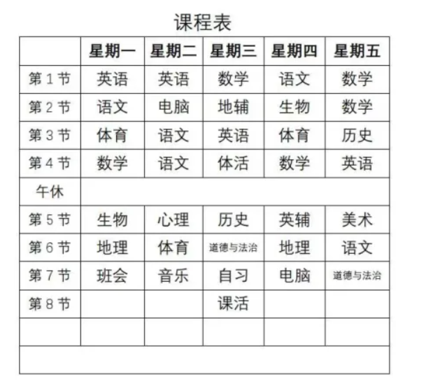

1. 使用table+表单，把课堂上的form标签的代码，整理成以下格式（不要外观）：

   

   ```html
   <!DOCTYPE html>
   <html lang="en">
   <head>
       <meta charset="UTF-8">
       <title>Title</title>
   </head>
   <body>
       <form action="http://httpbin.org/post" method="post" enctype="multipart/form-data">
           <input type="hidden" name="hide" value="1.0">
           <label>账号：
           <input type="text" name="username" value="root" disabled placeholder="请输入账号">
           </label><br>
           <label>密码：
           <input type="password" name="password" value="" maxlength="16" placeholder="请输入密码">
           </label><br>
           <label>年龄：
               <input type="number" name="age" value="" placeholder="请输入年龄">
           </label><br>
           <label>出生年月
               <input type="date" name="born">
           </label>
           <br>
           <label>时间：
               <input type="time" name="time">
           </label>
           <br>
           <label>本地日期时间：
               <input type="datetime-local" name="datetime">
           </label>
           <br>
           头像[单文件]：<input type="file" name="avatar"><br>
           头像[多文件]：<input type="file" multiple name="imgs[]">
           <br>
           性别：
               <label><input type="radio" name="sex" value="1"> 男</label>
               <label><input type="radio" name="sex" value="2"> 女</label>
           <br>
           爱好：
               <label><input type="checkbox" name="fav" value="1">篮球</label>
               <label><input type="checkbox" name="fav" value="2">足球</label>
               <label><input type="checkbox" name="fav" value="3">排球</label>
               <label><input type="checkbox" name="fav" value="4">水球</label>
               <label><input type="checkbox" name="fav" value="5">气球</label>
           <br>
           城市：
           <select name="city">
               <option value="1">北京</option>
               <option value="2">天津</option>
               <option value="3">唐山</option>
               <option value="4">廊坊</option>
               <option value="5">上海</option>
               <option value="6">其他</option>
           </select>
           <br>
           个性签名：<br>
           <textarea name="description" cols="30" rows="10"></textarea>
           <br>
           <input type="submit" value="提交表单">
           <input type="button" value="普通按钮">
           <button></button>
           <input type="reset" value="重置表单数据">
       </form>
   </body>
   </html>
   ```

   

2. 使用table标签，把笔记中**表单项标签**制作成网页。

   

   

3. 使用table标签，把下面的课程表使用表格实现。



