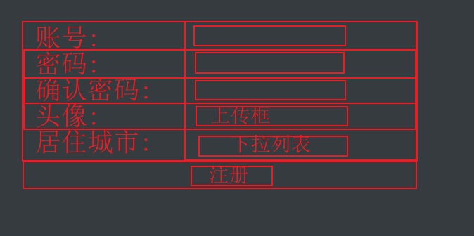

通过w3c网站或者手册, 查看以下标签的用法.完成作业要求

2. iframe、frameset标签, 在网页中显示一个子网页, 子网页的地址是: http://www.baidu.com

3. table标签, 完成以下效果.

   

   | 1    | 5    | 8    |
   | ---- | ---- | ---- |
   | 12   | 2    | 9    |
   | 10   | 6    | 3    |
   | 4    | 11   | 7    |

   要求:

   ​	表格的宽度为: 600px

   ​    表格有边框, 并且第一行内容加粗, 所有行的内容靠左对齐.

4. 使用表格与表单完成以下效果.不需要设置边框的颜色。

   

   