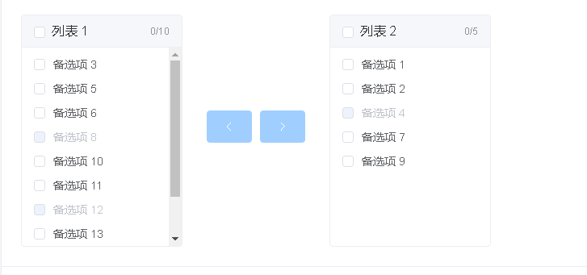
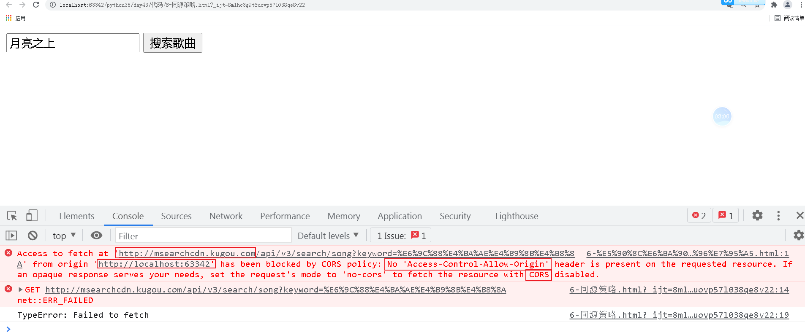

软件架构体系：

C/S: client/Server  客户端/服务端

QQ, 酷狗, 爱奇艺, 王者荣耀等3D游戏


B/S: browser/Server 浏览器/服务端

百度/淘宝/京东/网页版的爱奇艺/基于web前端技术实现的一些手机APP[例如：百度地图、喜马拉雅、消消乐、斗地主]


web前端技术是基于浏览器实现客户端的一套综合技术，包括了HTML、CSS、javascript等。

UI客户端技术是基于UI模块实现客户端的一种UI模块+打包模块，包括了pygame、pyqt5、Tkinter、wxPython、PyGUI等 结合pyinstaller。

发展历史

Linux--> 90年 --> GUNLinux

美苏冷战（2极争霸-> 1超多强）--> 美国 --> 阿帕网（Unix的母公司、IBM）->冷战结束 -> 博纳斯·李主导设计出了互联网

 -> 把网络技术推广进行民用 -> 博纳斯·李（互联网之父） -> 通过计算机网络来推广计算机技术（SGML[仅仅显示文字的格式，不支持图片，视频、音频]->HTML[支持文字、图片、视频、音频]） --> 普通人怎么看得懂HTML代码？ -> 设计出了世界上第一款开源的浏览器以及浏览器内核引擎 -> 网景(现在已经没有了) -> 世界上第一款的商用浏览器（占据世界95%份额）-> 导航者浏览器 -> 微软 --> IE浏览器(2.0, 3.0) --> 进入第一次互联网大战 -> 以微软（IE） 与 网景（导航者）分2大阵营 --> 最开始以插件多少优劣抢夺市场。布兰登·艾克基于java部分语法设计出livescript插件(后改名为javascript，实际上与java没有半毛钱关系)，让导航者浏览器一下打垮了IE浏览器。 但是微软并不想放弃，后面也实现了一个jscript的插件，但是模仿是很难超越，所以微软开始让windows系统免费捆绑IE浏览器（著名的IE6.0），并卸载导航者浏览器卸载。后面网景就失去了浏览器的市场，随着网景公司的浏览器市场流失，网景直接把微软告上了法庭，由此衍生了世界上第一款反垄断商业法律，经过了十几年后，网景倒闭了，微软基于IE6.0彻底拿下来世界上最多的浏览器份额赢得了第一次互联网大战，但是官司失败了，赔了100亿美元。网景的原高管--> Mobila -> 基于导航者浏览器开发出了一款新的浏览器（火狐浏览器）-> 进入了第二次互联网大战（IE阵营对抗 现代浏览器阵营[谷歌浏览器、火狐浏览器、欧朋浏览器、苹果浏览器]），最终IE浏览器寿终正寝，微软放弃了IE浏览器，投向了现代浏览器阵营 -> 收购了美国的一个斯巴达浏览器（Edge），基于斯巴达浏览器结合IE浏览器重新在windows10版本进行发布，最后现代浏览器阵营赢得了第二次互联网大战。所以，目前世界上使用人数最多的浏览器就变成了谷歌浏览器（2/3）。目前是世界上所有的浏览器多达上百款，其中浏览器的内核引擎（关系到了HTML语法，CSS语法，Javascript语法）只有3款：IE浏览器内核（Trident）、火狐浏览器内核（Gecko）、谷歌浏览器内核（Webkit，后面升级为了Blink）。像苹果浏览器、欧朋浏览器，遨游浏览器，UC浏览器，360极速浏览器，QQ浏览器，搜狗浏览器等等都是基于谷歌内核设计出来了。


## w3c标准

w3c: 是一个公益基金组织，由互联网之父（博纳斯·李）牵头组织起来的。w3c（万维网联盟）专门去维护互联网相关技术的发展与规范的。

w3c标准为了实现互联网网页制作的统一规范，所以设计了三大标准：结构标准、外观标准与行为标准。

web开发技术栈一共有3门语言。分别是：

+ HTML：译作超文本标记语言，负责通过标签来表达网页的**内容页面结构**。

  开发者要遵循结构标准，就需要使用HTML来开发网页的内容与结构，需要遵循HTML语法。

+ CSS：译作层叠样式表标记语言，负责通过属性标记来表达网页的**外观效果**。

  开发者要遵循外观标准，就需要使用CSS来设计或修改网页的外观效果，需要遵循CSS语法。

+ javascript: 简称js，负责通过编程代码来表达网页的**行为特效**。

  开发者要遵循行为标准，就需要使用javascript来编写网页的动态特效以及数据交互能力，需要遵循javascript ECMA语法。


## HTML

`Hyper Text Markup Language` ，译作超文本标记语言，是一门标记语言，不是编程语言。所以它没有变量，也没有任何语句结构。

所谓的超文本，就是超越了文本范畴的文档格式，普通文本只能显示文字，而超文本可以显示各种的媒体资源，例如：html网页，doc文档，xls文档等等。

同时，HTML发展至今，一共经历6个版本：HTML1.0，HTML2.0，HTML3.0，HTML4.0，XHTML1.0（过渡版本），HTML5.0（现行）。

> HTML在4.0版本（1999）时，W3C组织与浏览器厂商发生过一次分歧，W3C组织认为HTML作为标记语言，本身的语法不够严谨（就是乱写HTML代码也不会报错），所以发布了新的一门语法更加严谨的标记语言-XML，但是这门语言比HTML更加的复杂和难以使用，所以浏览器厂商要使用XML替代HTML，实际上需要耗费大量成本的，而且在当时全球有上百万的网站使用的都是HTML，所以如果直接从HTML转变到XML，很多公司是无法接受。因此，在2000年时W3C推出了HTML转换成XML的过渡版本，就是XHTML1.0版本。这个版本既有HTML的语法，也兼顾了XML的部分语法，但是在XHTML2.0版本推出的时候，浏览器厂商与W3C闹翻了，浏览器厂商不跟W3C玩了，而是自己组织了一个新的HTML标准团队-WHATWG，发展HTML5.0版本。在随后几年（2004）年，正式推出了HTML5.0试验版本，随后在2014年W3C迷途知返，重新与浏览器厂商的团队合并，在2014年重新发布了HTML5.0版本，同时也宣告了XML替代HTML计划失败，最终XML就慢慢变成了软件的配置文档，数据转换格式的结构，类似json的作用。
>
> python3在出来的时候，实际上也会很多不愿意使用新版本，很多人停留在python2，因为python的开发离不开各种第三方模块，而如果升级到了python3，意味着很多的项目都需要把原来的语法改成python3，因为python2存在的时间跨度太大的历史原因，很多python2的模块已经没有人维护，项目要升级，必须模块也要升级，导致很多人不愿意去升级项目到python3，后续就推出了一个过渡版本python2.7，这个版本既兼容了python2的语法，也兼容了python3的语法。

html的代码必须编写到.html文档中。以`.html`或者`.htm`结尾的文件中。

> `.htm`的出现是基于计算机发展的历史遗留问题，早期计算机的存储能力不强，所以针对文件名的命名存在了`8.3规范`：要求文件名必须在8个字符以内，文件后缀必须是3个字符以内。因为.html是4个字符，所以不符合`8.3规范`，因此改成了.htm，类似的情况，还有图片格式里面jpeg，在早期是jpg格式的。

因为HTML网页属于浏览器端代码，所以不存在操作系统兼容问题，因此一套HTML代码可以任何操作系统下的浏览器下正常运行。

### HTML网页基本结构

`1-html-第一个网页.html` ，代码：

```html
<!DOCTYPE html>
<html lang="en">
 <head>
 	<title>我的网页标题</title>
 </head>
 <body>
 	<h1>大冷门！中国男排以3比0战胜世界排名第一的巴西男排</h1>
 	<p>相信没有多少人能预料到这样一个结果，就在北京时间6月12日晚，在2022年世界男排联赛巴西利亚站最后一轮比赛中，没有任何心理压力的中国男排表现出不畏强敌的顽强作风和出众的技战术水平，近30年来国际赛场上第一次以3比0掀翻世界排名第一的东道主巴西男排，爆出本年度世界男排联赛一大冷门，得到全场最高的25分的主攻手张景胤更是成为中国最强攻击点。</p>
 </body>
</html>
```


代码说明：

| 标签名                     | 类型   | 描述                                                         |
| -------------------------- | ------ | ------------------------------------------------------------ |
| `<!DOCTYPE html>`          | 单标签 | 告诉浏览器接下来所有的内容是HTML代码， 需要使用HTML解析器来识别。 |
| `<html></html>`            | 双标签 | 告诉浏览器，这对html标签里面的内容就是网页内容。             |
| `<head></head>`            | 双标签 | 告诉浏览器，这是html网页的头部信息，例如：网页标题，编码类型，网页关键字等.... |
| `<body></body>`            | 双标签 | 告诉浏览器，这是html网页的正文内容。                         |
| `<title></title>`          | 双标签 | 属于head的子标签，告诉浏览器，这是html网页的网页标题。       |
| `<meta charset="UTF-8" />` | 单标签 | 告诉浏览器，这是一个utf-8编码的网页。                        |

### 语法

HTML中的语法有2种：标签、注释。

注释，不会被用户所看到，但是可以在浏览器中，通过鼠标右键->查看网页源代码，让开发人员查看。

```html
<!DOCTYPE html>
<html lang="en">
<head>
    <meta charset="UTF-8">
    <title>Title</title>
</head>
<body>
    <!-- HTML的注释 -->
    <!-- h1表示大标题，一般 一个网页中只会出现1次，往往用于展示网站的标题，或者网络的logo -->
    <h1>h1标题</h1>
    <!-- p标签代表的就是一个文本段落，每一个段落就使用1个p标签，一篇文章可以有多个段落-->
    <p>内容段落</p>
</body>
</html>
```


### 标签

标签[Tag]，表示HTML网页内容的一个最基本的组织单元，类似语文里面的标点符号，标签的作用就是告诉浏览器当前标签中的内容是有什么作用，要以什么格式进行展示的。

标签从书写结构上分2种：

+ 单标签，格式：`<标签名>`  或者 `<标签名 />`。
+ 双标签。格式：`<标签名>标签内容</标签名>`。

标签从组织结构上分2种：内容标签和结构标签。

+ 内容标签：主要包含和展示内容的，部分标签可以包含其他的内容标签。
+ 结构标签：主要用于包含其他标签，一般结构标签内部不会直接包含网页内容[文本、图片、视频、音频等]。

#### 单标签

只有1个标签名的标签闭合的就是单标签。书写格式：

```html
    <标签名>
    <标签名 />
    <标签名 属性名="属性值"/>  
```

常见的单标签

| 标签名        | 描述                                                         |
| ------------- | ------------------------------------------------------------ |
| **`<meta>`**  | 元信息标签                                                   |
| **`<link>`**  | css外观样式的外链引入标签，类似python中的import，可以导入css代码到html文档中 |
| ``       | 图片标签                                                     |
| **`<input>`** | 输入框标签                                                   |
| **`<br />`**  | 换行标签，浏览器默认是不识别HTML源码文件中的换行与空格的，所以需要使用br标签告诉浏览器在什么位置需要换行。 |
| **`<hr>`**    | 分割线标签，代表分割内容的一条横线，代表前面的内容已经结束了，横线下方的内容与上方内容没有关联。 |

#### 双标签

成对标签名出现，有开始标签与结束标签的，就是双标签。书写格式：

```html
<标签名></标签名>
<标签名 属性名="属性值" 属性名></标签名>
```

常见的双标签

| 标签名                | 描述                                             |
| --------------------- | ------------------------------------------------ |
| **`<h1></h1>`**       | 网页的一级标题                                   |
| **`<h2></h2>`**       | 网页的二级标题                                   |
| ...                   |                                                  |
| **`<h6></h6>`**       | 网页的六级标题                                   |
| `<p></p>`             | 网页的段落                                       |
| **`<a></a>`**         | 网页超链接                                       |
| **`<div></div>`**     | 块级结构标签                                     |
| **`<span></span>`**   | 行级结构标签                                     |
| **`<form></form>`**   | 表单标签，表示网页的一个提供给用户输入数据的表单 |
| **`<ul></ul>`**       | 无序列表结构标签，表示网页的一个内容列表         |
| **`<li></li>`**       | 列表项目标签                                     |
| **`<table></table>`** | 表格标签，表示网页的一个表格                     |


### 常见标签使用

#### 标题和段落

```html
<!DOCTYPE html>
<html lang="en">
<head>
    <meta charset="UTF-8">
    <title>Title</title>
</head>
<body>
    <!-- HTML中的标签是HTML语法提供的，所以每一个标签都是固定标签名 -->
    <h1>h1标题:常用于网站的logo，网站标题</h1>
    <h2>h2标题:常用于网站的板块标题、栏目标题</h2>
    <h3>h3标题:常用于网站的板块标题、栏目标题</h3>
    <h4>h4标题:常用于网站的附加板块标题，或者文章的标题</h4>
    <h5>h5标题:更小级别的标题，基本用不到</h5>
    <h6>h6标题:更小级别的标题，基本用不到</h6>
    <p>p->段落：Hyper Text Markup Language</p>
</body>
</html>
```


#### 标签的属性

标签的作用就是用于展示内容，但是内容有时候并非文本，而且文本的展示需要附加一些额外效果时，就需要使用标签的属性来声明。不管是什么标签，都有属性[Attribute]。标签的属性有两种：

+ 普通属性：

  属性与属性值使用 = 号关联 ，属性值使用单引号或双引号圈住，建议使用双引号。

+ 布尔属性：

  只有属性名，没有属性值。当标签里面写上这个属性名，则其值就是True，标签没有属性名，则为False

```html
<!DOCTYPE html>
<html lang="en"> <!-- lang 就是HTML标签的属性，代表当前网页的默认语言language：en表示 english -->
<head>
    <meta charset="UTF-8"> <!-- charset，是meta元信息标签的属性，表示当前网页的编码是utf-8 -->
    <title>Title_python学习网页</title>
</head>
<body>
    <!-- 双标签的属性 -->
    <!--
    align：文本的水平对齐方式：left左[默认值],center中,right右
    title：表示当前标签的补充提示，当用户把鼠标放在当前标签上方则自动title属性的值
    -->
    <h1 align="left" title="提示文本">h1标题:常用于网站的logo，网站标题</h1>
    <h2 align="center" title="用于提示而已">h2标题:常用于网站的板块标题</h2>
    <h3 align="right">h3标题:常用于网站的板块标题</h3>
    <h4>h4标题</h4>
    <h5>h5标题</h5>
    <h6>h6标题</h6>
    <p align="center" title="用于提示而已">p->段落：Hyper Text Markup Language</p>

    <!-- 单标签的属性：单标签是没有内容的，所以需要依赖于属性来展示对应的内容 -->
     <!-- src就是用于展示图片的内容 -->
    <input type="number">   <!-- 输入框标签[数值输入框]，number表示只允许当前输入框中只能输入数值 -->
    <input type="password"> <!-- 输入框标签[密码输入框]，password表示当前输入任何内容都是密码，所以不会展示出来  -->
    <input type="text">     <!-- 输入框标签[单行文本输入框]，text表示只允许用于输入一行内容内容，不能回车换行 -->
    <input type="datetime-local"> <!-- 时间输入框，只需要用户输入时间日期 -->
</body>
</html>
```

#### 换行、分割与超链接

```html
<!DOCTYPE html>
<html lang="en"> <!-- lang 就是HTML标签的属性，代表当前网页的默认语言language：en表示 english -->
<head>
    <meta charset="UTF-8"> <!-- charset，是meta元信息标签的属性，表示当前网页的编码是utf-8 -->
    <title>Title_python学习网页</title>
</head>
<body>
    <h1>将进酒</h1>
    <a href="https://baike.baidu.com/item/将进酒">李白</a>
    <p>君不见黄河之水天上来，奔流到海不复回。<br>
    君不见高堂明镜悲白发，朝如青丝暮成雪。<br><br>
    人生得意须尽欢，莫使金樽空对月。<br>
    天生我材必有用，千金散尽还复来。<br>
    烹羊宰牛且为乐，会须一饮三百杯。<br>
    岑夫子，丹丘生，将进酒，杯莫停。<br>
    与君歌一曲，请君为我倾耳听。<br><br>
    钟鼓馔玉不足贵，但愿长醉不愿醒。<br>
    古来圣贤皆寂寞，惟有饮者留其名。<br>
    陈王昔时宴平乐，斗酒十千恣欢谑。<br>
    主人何为言少钱，径须沽取对君酌。<br><br>
    五花马、千金裘，呼儿将出换美酒，与尔同销万古愁。</p>
    <hr>
    <h2>译文</h2>
    <p>你难道没有看见吗？那黄河之水犹如从天上倾泻而来，波涛翻滚直奔大海从来不会再往回流。<br>
    你难道没有看见，在高堂上面对明镜，深沉悲叹那一头白发？早晨还是黑发到了傍晚却变得如雪一般。<br>
    人生得意之时就要尽情的享受欢乐，不要让金杯无酒空对皎洁的明月。<br>
    上天造就了我的才干就必然是有用处的，千两黄金花完了也能够再次获得。<br>
    且把烹煮羔羊和宰牛当成一件快乐的事情，如果需要也应当痛快地喝三百杯。<br>
    岑勋，元丹丘，快点喝酒，不要停下来。<br>
    我给你们唱一首歌，请你们为我倾耳细听。<br>
    山珍海味的豪华生活算不上什么珍贵，只希望能醉生梦死而不愿清醒。<br>
    自古以来圣贤都是被世人冷落的，只有会喝酒的人才能够留传美名。<br>
    陈王曹植当年设宴平乐观，喝着名贵的酒纵情地欢乐。<br>
    你为何说我的钱不多？只管把这些钱用来买酒一起喝。<br>
    名贵的五花良马，昂贵的千金皮衣，叫侍儿拿去统统换美酒，让我们一起来消除这无尽的长愁！
    </p>
</body>
</html>
```

超链接有2种常用用法：页面跳转、下载文件。

```html
<!DOCTYPE html>
<html lang="en">
<head>
    <meta charset="UTF-8">
    <title>Title</title>
</head>
<body>
    <!--页面跳转: 如果href的值是网络地址，可以跳转到跳转到指定的网页-->
    <a href="http://www.baidu.com">跳转到百度</a>
    <!--页面跳转: 如果href的值是本地地址，则可以跳转到本地的内部网页 -->
    <a href="11-超链接页面.html">跳转到本地页面</a>
    <!-- 下载资源：当href的值是一个浏览器无法直接展示的内容格式时，浏览器会自动下载当前路径对应的内容 -->
    <a href="./html.chm">点击下载手册</a>
    <!-- 下载资源：当href的值是一个浏览器可以直接识别并展示的内容格式时，用户可以鼠标右键，对当前href的数值的内容进行另存为下载 -->
    <a href="./goods.png">点击下载图片[鼠标右键,另存为]</a>
</body>
</html>
```

> 实际上页面跳转也是属于下载文件。因为用户能在浏览器里面看到的所有内容，实际上都是经过浏览器下载到本地，用户才能看到的。我们可以通过 F12 -> 打开开发者工具 -> network（网络）


#### 列表标签

列表是一种结构标签，可以让网页的内容形成列表格式。


或


列表标签在HTML中提供提供了4种：

1. 无序列表（UnorderList，ul）

   就是没有序号的，内容不分先后的列表。

2. 有序列表（OrderList，ol）

3. 定义列表（DefineList，dl）

4. 菜单列表（Menu）

除了定义列表结构特殊以外，其他的3种列表都有列表项目（List Item, li）。

```html
<!DOCTYPE html>
<html lang="en">
<head>
    <meta charset="UTF-8">
    <title>Title</title>
</head>
<body>
    <!--
    无序列表, unordered list，简写: ul
    列表的单项  list item 简写：li
    -->
    <ul type="circle">
        <li>列表的第一项</li>
        <li>列表的第二项</li>
        <li>列表的第三项</li>
    </ul>

    <!--
    有序列表, ordered list，简写：ol
    列表的单项  list item   li
    -->
    <ol>
        <li>列表的第一项</li>
        <li>列表的第二项</li>
        <li>列表的第三项</li>
    </ol>

    <!--
    和任何一个双标签一样，标签内部可以嵌套的标签来使用。
    -->
    <ul>
        <li>
            <p>第一章：开端</p>
            <ul>
                <li>第一节：下山</li>
                <li>第二节：命案</li>
                <li>第三节：奇遇</li>
                <li></li>
                <li></li>
            </ul>
        </li>
    </ul>

    <dl>
       <dt>赵本山</dt>
       <dd>春晚常驻选手，国内一线大品牌</dd>
       <dd>乡村爱情故事，二人转，小品</dd>
       <dt>小明</dt>
       <dd>国内所有小朋友的同学，每次都从教室里面滚出去的哪一个。</dd>
    </dl>

    <!-- 菜单列表是HTML版本中新增的列表标签，实际上就是ul标签（无序列表） -->
    <menu>
        <li>首页</li>
        <li>商品分类</li>
        <li>购物狂欢节</li>
        <li>会员中心</li>
    </menu>
</body>
</html>
```

几种列表标签中最常用的只有**`ul`**，当然也有新版本的menu标签。其他的2种标签（ol与dl），基本不使用。


#### 表单标签

是HTML中最终的标签之一，主要是提供了输入框或按钮等标签提供给用户进行交互输入数据。将来表单可以提交到指定服务端程序中进行数据处理。

##### form标签

| 属性          | 描述                                                         |
| ------------- | ------------------------------------------------------------ |
| **`action`**  | 设置当前表单的表单数据处理应用程序的url地址，默认值是当前url地址。 |
| **`method`**  | 设置当前表单的HTTP提供方式，默认是get。<br/>      get，以**查询字符串**的格式，把表单数据附加在url地址栏上提交数据<br/>      post，以**数据包**格式，把表单数据附在HTTP网络请求体中提交数据 |
| **`enctype`** | 设置当前表单提交的数据格式，默认值是application/x-www-form-urlencoded。<br/>      application/x-www-form-urlencoded：以普通表达数据格式提交<br/>      **`multipart/form-data`**：以多种数据格式提交<br/>      text/plain：以纯文本数据格式提交 |


##### 表单项标签

| 类型                         | 用法                                                         | 描述                                                         |
| ---------------------------- | ------------------------------------------------------------ | ------------------------------------------------------------ |
| **`单行文本框`**             | **`<input type="text" name="" value="" placeholder="">`**    | name：设置输入框的值的变量名称，用于服务端接受数据。<br>value：设置输入框的默认值。<br>placeholder：设置输入框的提示内容。 |
| **`密码框`**                 | **`<input type="password" name="" value="" placeholder="">`** | 只允许输入单行密码，属性描述同上                             |
| 单行文本框（数值框）         | **`<input type="number" name="" value="" placeholder="">`**  | 只允许输入数值内容，属性描述同上。<br>就版本浏览器中不支持时会被默认为text单行文本框。 |
| 单行文本框（日期输入框）     | **`<input type="date" name="">`**                            | 只允许输入日期格式内容，属性描述同上。<br/>低版本浏览器中不支持时会被默认为text单行文本框。 |
| 单行文本框（时间输入框）     | **`<input type="time" name="">`**                            | 只允许输入时间格式内容，属性描述同上。<br/>低版本浏览器中不支持时会被默认为text单行文本框。 |
| 单行文本框（日期时间输入框） | **`<input type="datetime-local" name="">`**                  | 只允许输入日期时间格式内容，属性描述同上。<br/>低版本浏览器中不支持时，会被默认为text单行文本框。 |
| **`文件上传框`**             | **`<input type="file" multiple name="">`**                   | multiple：布尔属性，允许一次性上传多个文件。<br>其他属性描述同上。 |
| **`单选框`**                 | **`<input type="radio" name="" value="">`**                  | 用于提供一组多个选择让用户选一个选项的按钮组。<br>多个单选框必须name值相同才能为一组。<br>同一组单选框中的value值必填，而且值要唯一。 |
| **`多选框`**                 | **`<input type="checkbox" name="fav" value="1">`**           | 用于提供一组多个选择让用户选多个选项的按钮组。<br>多个多选框必须name值相同才能为一组。<br>同一组多选框中的value值必填，而且值要唯一。 |
| **`下拉列表框`**             | **`<select name="">`**<br>    **`<option value="选项1值">选项1</option>`**<br>    **`<option value="选项2值">选项2</option>`**<br>    **`<option value="...">...</option>`**<br>    **`<option value="选项n值">选项n</option>`**<br>**`</select>`** | 属性描述同上。                                               |
| **`多行文本框/文本域`**      | **`<textarea name="" cols="" rows=""></textarea>`**          | cols：设置多行文本框默认列数[宽度]<br>rows：设置多行文本框默认行数[高度]<br>注意：多行文本框标签中的任意内容都会被原样记录。 |
| **`提交按钮`**               | `<input type="submit" value="提交">`                         | value：表示当前按钮的提示文本。<br>用于提交表单数据到action属性对应的地址中。 |
| 普通按钮                     | `<input type="button" value="">`                             | 属性描述同上，主要用于配合js完成网页特效。                   |
| **`普通按钮`**               | **`<button></button>`**                                      | 普通按钮，中间可以显示图片或文本。<br>主要用于配合js完成网页特效。 |
| 重置按钮                     | `<input type="reset" value="重置">`                          | 点击以后，会把当前表单中用户输入的所有内容进行还原到页面刚刷新状态。 |
| 隐藏域输入框                 | `<input type="hidden" name="" value="">`                     | 隐藏域输入框的作用是附带一些默认数据提交给服务端，但是不希望用户看到。 |

表单项的常用属性

| 属性名         | 描述                                                         |
| -------------- | ------------------------------------------------------------ |
| **`name`**     | 表示当前表单项的值的变量名，用于提供服务端获取本次提交的数据项。 |
| **`value`**    | 表示当前表单项的值，如果值在代码中提前设置了，则为默认值     |
| **`type`**     | 表示input框的类型                                            |
| **`disabled`** | 布尔属性，设置当前输入框是否被禁用                           |
| maxlength      | 设置当前输入框[textarea，input]中最大输入内容的长度。        |
| **`multiple`** | 设置允许文件上传框选择上传多个文件                           |

代码：

```html
<!DOCTYPE html>
<html lang="en">
<head>
    <meta charset="UTF-8">
    <title>Title</title>
</head>
<body>
    <form action="http://httpbin.org/post" method="post" enctype="multipart/form-data">
        <input type="hidden" name="hide" value="1.0">
        <label>账号：
        <input type="text" name="username" value="root" disabled placeholder="请输入账号">
        </label><br>
        <label>密码：
        <input type="password" name="password" value="" maxlength="16" placeholder="请输入密码">
        </label><br>
        <label>年龄：
            <input type="number" name="age" value="" placeholder="请输入年龄">
        </label><br>
        <label>出生年月
            <input type="date" name="born">
        </label>
        <br>
        <label>时间：
            <input type="time" name="time">
        </label>
        <br>
        <label>本地日期时间：
            <input type="datetime-local" name="datetime">
        </label>
        <br>
        头像[单文件]：<input type="file" name="avatar"><br>
        头像[多文件]：<input type="file" multiple name="imgs[]">
        <br>
        性别：
            <label><input type="radio" name="sex" value="1"> 男</label>
            <label><input type="radio" name="sex" value="2"> 女</label>
        <br>
        爱好：
            <label><input type="checkbox" name="fav" value="1">篮球</label>
            <label><input type="checkbox" name="fav" value="2">足球</label>
            <label><input type="checkbox" name="fav" value="3">排球</label>
            <label><input type="checkbox" name="fav" value="4">水球</label>
            <label><input type="checkbox" name="fav" value="5">气球</label>
        <br>
        城市：
        <select name="city">
            <option value="1">北京</option>
            <option value="2">天津</option>
            <option value="3">唐山</option>
            <option value="4">廊坊</option>
            <option value="5">上海</option>
            <option value="6">其他</option>
        </select>
        <br>
        个性签名：<br>
        <textarea name="description" cols="30" rows="10"></textarea>
        <br>
        <input type="submit" value="提交表单">
        <input type="button" value="普通按钮">
        <button></button>
        <input type="reset" value="重置表单数据">
    </form>
</body>
</html>
```


#### 表格标签

表格系列标签主要是可以数据以表格的格式展示出来。但是现在table表格已经很少使用了，而是改成div+css实现更漂亮的表格。

| 标签                  | 描述                                                         |
| --------------------- | ------------------------------------------------------------ |
| **`<table></table>`** | 表示网页的一个表格，内部一般直接嵌套的是tr标签。             |
| **`<tr></tr>`**       | 表示表格的一行，内部直接嵌套的只能是td或者th标签。           |
| **`<td></td>`**       | 表示表格的一个单元格，也可以是一列，可以包含其他标签或内容。 |
| **`<th></th>`**       | 表示表格的表头的一个单元格，可以包含其他标签或内容。         |

##### 基本使用

```html
<!DOCTYPE html>
<html lang="en">
<head>
    <meta charset="UTF-8">
    <title>Title</title>
</head>
<body>
    <!--1行1列的表格-->
    <table border="1"> <!-- border 表示设置表格边框的宽度，不推荐使用bother，以后会学到css，可以设置更好看的边框 -->
        <tr>
            <td>1行1列</td>
        </tr>
    </table>
    <hr>
    <!--1行2列的表格-->
    <table border="1">
        <tr>
            <td>1行1列</td>
            <td>1行2列</td>
        </tr>
    </table>
    <hr>
    <!--2行1列的表格-->
    <table border="1">
        <tr>
            <td>1行1列</td>
        </tr>
        <tr>
            <td>2行1列</td>
        </tr>
    </table>
    <hr>
    <!--2行2列的表格-->
    <table border="1">
        <tr>
            <td>1行1列</td>
            <td>1行2列</td>
        </tr>
        <tr>
            <td>2行1列</td>
            <td>2行2列</td>
        </tr>
    </table>
    <hr>
    <!-- 有表头的表格 -->
    <table border="1" width="600">
        <tr>
            <th>ID</th>
            <th>姓名</th>
            <th>年龄</th>
        </tr>
        <tr>
            <td>3</td>
            <td>小明</td>
            <td>17</td>
        </tr>
        <tr>
            <td>5</td>
            <td>小黑</td>
            <td>16</td>
        </tr>
    </table>

</body>
</html>
```

##### 合并单元格

```html
<!DOCTYPE html>
<html lang="en">
<head>
    <meta charset="UTF-8">
    <title>Title</title>
</head>
<body>
    <table width="800" border="1">
        <tr>
            <!-- colspan 表示当前单元格[td,th]占据2列 -->
            <th colspan="2">form标签属性说明</th>
        </tr>
        <!-- tr>th*2 -->
        <tr>
            <th>属性</th>
            <th>描述</th>
        </tr>
        <tr>
            <td>action</td>
            <td>设置当前表单的表单数据处理应用程序的url地址，默认值是当前url地址。</td>
        </tr>
        <!-- tr>td*2 -->
        <tr>
            <!--设置当前单元格，占据3行的空间  -->
            <td rowspan="3">method</td>
            <td>设置当前表单的HTTP提供方式，默认是get。</td>
        </tr>
        <tr>
            <td>get，以<b>查询字符串</b>的格式，把表单数据附加在url地址栏上提交数据</td>
        </tr>
        <tr>
            <td>post，以<b>数据包</b>格式，把表单数据附在HTTP网络请求体中提交数据</td>
        </tr>
        <tr>
            <td rowspan="4">enctype</td>
            <td>设置当前表单提交的数据格式</td>
        </tr>
        <tr>
            <td>application/x-www-form-urlencoded：默认值，以普通表达数据格式提交</td>
        </tr>
        <tr>
            <td><b>multipart/form-data</b>：以多种数据格式提交</td>
        </tr>
        <tr>
            <td>text/plain：以纯文本数据格式提交</td>
        </tr>
    </table>
</body>
</html>
```

##### 表格嵌套

```html
<!DOCTYPE html>
<html lang="en">
<head>
    <meta charset="UTF-8">
    <title>Title</title>
</head>
<body>
    <table width="1680" align="center">
        <tr>
            <td>
                <table align="center" width="1024">
                    <tr>
                        <td><a href="">奥运首页</a></td>
                        <td><a href="">中国军团</a></td>
                        <td><a href="">赛程赛果</a></td>
                        <td><a href="">奖牌榜</a></td>
                        <td><a href="">诸强</a></td>
                    </tr>
                </table>
            </td>
        </tr>
        <tr>
            <td>
                <table width="100%" border="1">
                    <tr>
                        <td width="300">
                            <table>
                                <tr>
                                    <td>全部赛程</td>
                                    <td width="20%">更多 > </td>
                                </tr>
                                <tr>
                                    <td colspan="2">
                                        <ul>
                                            <li>中国对日本</li>
                                            <li>韩国对日本</li>
                                            <li>朝鲜对日本</li>
                                            <li>俄罗斯对日本</li>
                                        </ul>
                                    </td>
                                </tr>
                            </table>
                        </td>
                        <td>
                            
                        </td>
                        <td width="450">右</td>
                    </tr>
                </table>
            </td>
        </tr>
    </table>
</body>
</html>
```

早期的很多网页为了排版方便都是采用table布局（table标签来控制页面内容的排版），但是这种方式现在已经没有人使用了。而是改城了div标签+css样式来进行排版，这种方式更加容易入门，更加容易维护代码，更加美观好看。


#### 媒体标签

之前说过所谓的超文本，就是超出文本范畴的文档，所以我们在网页编写过程中，经常也需要在网页中展示或播放一些媒体资源，例如：图片，音频，视频。

| 标签                                                         | 常见格式                                                     | 描述 |
| ------------------------------------------------------------ | ------------------------------------------------------------ | ---- |
| **``**                                    | **`png`**，**`jpg/jpeg`**，**`gif`**(动态图片格式)，**`svg`**，**`webp`**，**`tiff`** | 图片 |
| **`<audio controls autoplay>`**<br>**`<source src="">`**<br>**`</audio>`** | **`mp3`**，**`mpeg`**，**`ogg`**，wma，**`aac`**，ogv        | 音频 |
| **`<video width="" controls autoplay src=""></video>`**      | **`mp4`**，**`mpeg`**，**`ogg`**，ogv，**`mov`**，flv，      | 视频 |

##### 图片

```html
<!DOCTYPE html>
<html lang="en">
<head>
    <meta charset="UTF-8">
    <title>Title</title>
</head>
<body>
  <!-- src: source的简写，表示当前图片的资源路径，HTML中可以展示网络连接中的图片资源，也可以本地资源。
       alt：补充说明，当图片的路径不正确或者图片无法正确显示的时候，浏览器就会展示alt中的文本信息
   -->
  本地图片 <br>
  <br>
  网络图片 <br>
  
  <br>
  图片的格式或者文件名本身不重要，最重要的路径指向的内容是不是真正的图片 <br>
  <img src="data:image/jpeg;base64,/9j/4AAQSkZJRgABAQEASABIAAD/2wBDAA0JCgsKCA0LCgsODg0PEyAVExISEyccHhcgLikxMC4pLSwzOko+MzZGNywtQFdBRkxOUlNSMj5aYVpQYEpRUk//2wBDAQ4ODhMREyYVFSZPNS01T09PT09PT09PT09PT09PT09PT09PT09PT09PT09PT09PT09PT09PT09PT09PT09PT0//wAARCAEsASwDASIAAhEBAxEB/8QAGwAAAQUBAQAAAAAAAAAAAAAABAABAgMFBgf/xAA4EAEAAQMDAwIEBAUEAgIDAAABAgADEQQhMRJBUQVhE3GBkQYUIqEyscHR4RVCUvAjkkOCFoPx/8QAGQEAAwEBAQAAAAAAAAAAAAAAAAECAwQF/8QAIREBAQEBAAIDAQEBAQEAAAAAAAERAiExAxJBE1EiFGH/2gAMAwEAAhEDEQA/AOV2pLjiq+rFLqEqrGsppqZ3oe7ckDirbjtQ8zO9Y9Tyr2jG5LP+KujcWhsYal1Ac7VnYcElxqZc480E3A70i8Zxml9aqNKN3HGKsjerLL5nK1Yag80vrTakb1Wxv4+dZRqDzUjUnkoyhsGpxUzVb1jGpPNSNSeSjyGyao9qmao9qxTUHmpmoMc70DGwao9qmao23KxTUHk+9SNQeSjRjaNUe1TNUVil88/vUi+eaNDaNSe1SNSeaxS/71Iv+9GnjbNSeSnNSeSsUv8AvtTl98/vRpNs1BnkpzUnkrE+O45/enNQ+aNDa/MHml+ZPJWL+YfNJ1D5p6G1+ZPJS/NHtWJ+Zc80vzKd6NDbdQPeoTvGOSsf80vel+afNAaTeHvVU7pigHU1F1GaQGt4GnL5nkrNlfB5qp1Qd6JQ2PzAdyl+aPNYktYBzVTrd+aqUkHYqPVUnc96gmN67KwhMjfNVyYZpTFNmqJqd6y6i4U5G+KqZbbZqMlc71DPvUSK1Jc8U8N5fRf2poAuHl4aNsaKd23K5EQiI484otk9nJaCHbelnFKUWLhN6WKB5PndaQ0wZaWE+dGHqRJ80/U+ahSoyDU+t8u3vT/El2Wq3OKRnFGQat+JL/k/enLsjiTVQ0qWQ15fmf7qkaifmqBpzOKVkOCTU3DvmpGqmGc0KPzp84pfWKwV+bmU5rZ+M0JlxTLt3z2pfWEN/PPj96f/AFB8P3rPWlmn9Ynw0D1DfGGpGvKy8+9LNP6wa1DXRe+Kf89HHNZOaXVR9C1rmsg9/wB6f83DPNY/V9qXV4aPoexr/mo+aX5mD3rI6ny0up8tH0LY1m/F7lVTuD3/AHrOJJ3fvS63y0fQbBM5iO9VMjNVdT5pZ96c5Gxrhkpk2qcTHenSuqueB5mCh7p3M0ZI5oe6b8VnVwImFqCVdI5qpMVnVntHVcDy4rpfw5auF6Qw67aYRNkrn9HFnqYByteieiWLOl0Nv4xhd6w+brPDTiawvVvw9uz0wttzhDc8Vy92zOzcYTiiOMV6/ppaeR0wBHbCiNA+s/hnSep2W5pwt3sODHLS47s8U+pNeVRMyKXejdb6ff0GslZ1EGMjOMntQWPvW8sqMJ/bNLJmlj33pe9AKlmnxmnIrjmjQanpyKU/Qm9LYqGMeacwcU/SlIi0tOEY5zSfanxtSRxRqsRztTLTo0yfegrDGFx96iuV7HipYxFe7tUHxVRNLNMtKmpotLNIyuCpxtzlFkD0nLiibXp9+dskRQTKuwHlo2QstBvNN3qc4sZJnYcZqFMqVKlSoGlSpZpqC0+aWaZd6VBa3IVPG3FQg1b2WuhnFUzGaFuhRc+Ghru+azrSBZmM1U5Grpm+KqRzkPpWVq41fQNKajViRRgivauzncZz6Q/SbGO1Yn4YtkNLcvMcSdita3F6lM5rg+bvesdXx8+NaNiEIBMMSHdDFalm5Jj1QOp7g/vWPYuMDfeLyeKOs3GLmDke5zU8dH1yj+IPSLfrOh2gGoiLCWN32a8p1Omuaa8wuxYophPDivabF8QJnO4+9cz+OPQPzViPqGlBbf8AHEORea6eO2HUx5s804bD2aunYlG5KKYR4q+GmXBjg3rW9yROBY21xtRMNOpnFG2NIobftWhY0SmMVj18n+KnLINKrxVhpXHFbkNCpxxVxodjaovdXOXMz0qGxVJYR45rqbvp6nH7UOenK8OPlRO7BjA+A77U0rCYMV0P+nOOP2pPpqv8NH9KeOcbKHHNQlZTtXRT9OR449qpdCjlNjfinPlsLGFctpgxwb/OqJRStu7pXdxvUdJ6Nf12oLdmCmd3GxWnPyT9KxjWrU70yNuKr4rpPSvwlqtQF3UQYW+QeWur9J9B0XpdsWJcvd1M4a07uoIQxueAN6XXy76E4c5L8P27VuI2cxNwxtnzQPrmnlZ0QIg7kQ2x5fPsV0l3UylMVXxHNUfiXTx1HoZcwCchWUu32qzI8uuLKbu+1Qqy8/rQABwBVdds9Oa+ypUuaVMjUzT5pqCKlSpUybltKtOKotuCrhErW0pEZtD3DNEPPNVTDCVl1caSBugko9+Hw1KxGMrnw7ojnAnJ/enRjuOKJ0VxlegTiSROTdPn5rC3wuR1ensws6C1CGExlasht3xVcpQIQAQwYw1Iug7jXn93a7OfEFQuMUR4oi1KLhi4R2M7UESEGpRkjkcntSmw/bYs33GLhk8n860dNcjIbU8MUxh4SsXTXkPfx3rRtShcBEJHc2rfisu45n8Sfh0sX2/Yh/45udjhrLt6BJ8V6R0w1GnbV0EfNY9/0wt3XBtV9bmxnJPVc/Y0Ptz7UfZ0QYcftWpb0gHFFQ04HFZ5avxGZDRnjmrDSHitMsgcU5a9qr60bGY6Me1R/Ix8Favw8dqZiG+KMLWb+SiHFRdHHHFaSHimQ8UYesieiHO1CXtEA4K32JjKVW2hyyACpw9c7D0id+ZtiGcL2K17FrT6SyW7IBEwptn5tPf1Bj4doCJy+aGZ5xlwHtStk9HJohvrLpgLtzwVUxmqymB86gXFyRKeMJLly/Spt1UmITg52MFX6i3DU+j6myi/pzt58UwGNz7tX2Isrd2KfpYJgafFul3PDyvWaeNq7IIuz5oGXOxit/1TSJfuAb5ds8Vi3bTF359q7+Otjl6ilpqdKatGdKmzSpdqaaTSpUqCbERO1WjtTkKkRccUr2uRHGaZj/KrcJSY5Gs+rrSQOxJbYq7TWwuxTPJs05D2ojSgXAlxmsrfCp7bswYR6uQN/wC/96UJ9CElHwmRqVwG3EHG3OapgSiozMeHc/xXFfddU9DoXYoAD9KIhmX8AZ9kz9qCtfAVesXHEnOPtzV8NVZtxz8QPHRHFVIL/wDBZYk467aPkMVdAlCQqJ5Nn/NAmsty4u3VfMypmoFwrvwtV4ifNbumu7dK7nD5KNlEuWs7KcVztq7ImI99nPJW1p7mwLvgzWnHX5WXXOeYdhjtU4mTiosjMorvUhxgGnLNL8SxvUiJj3qpkilSHbdxVSwsSIcnYqE4ZNqmqFVsjYzStgkqpjgfNQwtXDnJUJyjAf3pWRW1VIIxzNwFZ2r1bcGMEjHsHNR1+rWaeHYHtWe3Fdg37tZddfkacz9q1ZOcceaWNt0D51X1Y2UX57VCVxdkyVmsQMTh2q6CyTK/IoKMVRjk912q+GTmWE+dEAplE26MPvV2ikNyQjuNBF6Q4ZD86N0KSvDn7VfHsuvTlvV9Ol+5iOBWuZ1dhFyYr0b1TREiTjC+1cf6jpyMnMVfeumXK5q5aZhSoUVqodMnbBQztXTzdjLqZTZpqdpqpJUqXmlQl0xAe1IjubUT0VBjjiua1vIrYYOKiR3ogiMaixxKhUVkMpRmltxZgm2arhAcY58NH6S1mRkefFL8H6IvgQj7d6CZMZbu3zrR1Ns6QHG1Z1+ICLvXF1M6rq59JCII5fd3KuhH4o/riTxkXG/s/wB6y5TuQeqC7c4on83O30ylpvixTKjhqpLStEli8SBjiWcp2flWroNK3DCYTCm/FU6WVu/YLtlcBlin6oe1a2huGQUZHCcI9z69qvMvlNq21o+i4x2YuU+TR9qHSiu4B86ondIonarIXeoMO9VMiLtWNsLjNeXOKfOFfaqpXOqD3Sq/iqA7Lhc0Wz8KQTy5zzUtslVWnMjfark2flVQr4QuS2xnGWqWWcA96V0erLx4qmEhj1L3clRb5VJ4XxkgvihtTJZSN8OMbURBBPFK7bjcFezseafuDcrn9XDM0BwG7QM7iSTg7Fb92wSznZUV9isDWwkalDPTztWVjSU5cCJvlfFW27hk2B8JQpGEgFlkOTgqcG3bwRvK55TNEh60rPw1PiQTPc4aIbFuUUhPJ2F4rNsXEf0zivgyP2dmii7BySJwljubf4qpILqu5anbl5K0vS7b8QU2xloS3cJOC4yDs8lavpwKtPmTZie74EamwTgmO1cp6voTKkf2rs5YRKyfUbRKLkrasZ5eaa/SAr0tYt2HSpiu19UsBmuT1sCM3DWnx9ecR1AVL6UnmlW7KmpUqVMncTtsXiqpRK079gxxQdy24a443DG2zUU3p55i5phzhpymutRym1aejiiYdqA0wKVr2IhDNLq5FSbUdQ5EcccpWHqpMbqSg4zyKVt3kkJQUrPU4UPDmuXfOt/wLZ0ty7FxCbFNnGT9t/2oiPpt6FuM4mcPAiJ8ner7ENTp5E7NzOORaPseqTXov2wQxkMVpMTdD2Izi5jHouhth5+Y1bK62bhegIL+uAcPkptTdtycpmPaRslCN1I56ycMYXufM/rStgka0tXmAiImRO5V+l1HVgJZUcb1haeb1Stq9DuP/F80boicZkHkn58cn9amXyGv8Zymco4+nOat6eoiucm+Kqhbh1Ljdw4O/wD0om2jIV+9XImrrQAJ9KvFyjVdqOQ3zhxVpEcvfmtZPDO3ypuGYPt3oKY247Gy5xR9wQccYqiURRe+dqjqKlUF3Nsffeq56hNhflTziBIDA9is3UzY3Mb5Df2qLbFSSjy5GWy8Zy0NO3ZN8KuxtutByvsc857HmqW/OUpA52wq8e1TKrFHqriTG3MMcRJBt55rGdRO1cws15xgStu/ajcRQZYyGxmhZaGRluThGSbGTirmBC1q2VvNyBjsJRdi+ri3NAx+mW4UI2FxC1iWOUqUY/BkDM6vA5xU3VRv6SxK65dsdzCfetrTWi1HBzWP6PJXGcjW/gYmK1+OSzWXdu4S0Jq49UGiXaqrwMWqqY4/1a1zXG+oxxJrv/VbWRa4r1W1hWnxcpdRhtNTy2ai11xz0mlSpfWmT1C9jGCgbsc581oXzNCMc5ri10Yy70XLUIW3O3ejr9vZ81C1bcDRL5GJ6aGErUgdMNjtQtiBko4Ag0u74acwJeXKUDdWLsZ8UddFWqJWsm5tXL+tQ1rUXCQOOdnJRXU3I7hn5n96Hu2o/Koxnj9KZTvT0YtWcVHOHu8VVBlG4op3pyQIxmxfJ/irAhc56eo7hh+3FLdAmzCFxkx2Qch/M/tRUJdNuM1/VFBXv4fttQWmJ2rhMeoDk7fPxV8kCSfwvPt/3k+VVEtGGtx0qmP4U9xz/KrdNcXXNpcx5N9uf/7XP3b8rZMyo4lt5HD+yNa1i4tsuG8jO/fHiqlv6VdDplY4cbtX8PPNZmhuvQ5zkdtvFHxmSeM1vzdjKzKV2axkHjFBymd02cb/AH/rVt2ZGTF8UJqbjEUM4c8VPV1Ui9IsV23OfHis7UwHqXbff+1W2dR8SZHsAp7tR1ASUdwc1nbsXIy520ypgdjy/wBqHjFXKYDOCjrpKa5OOfFDziZwIexUKDRtrcZzVku2O3ir4aeCGSc/m7Uo245Fy/tmj9PjO3NVKVA39KytsISnBeyOFoe36RcjluTJSXLh3x8q3rmtt2o4uA+dtqEdRauS64gPjGKqyYJaN9MtFmEYhh75rbiBE+VY+ikyTfetbD0lafHmM+/aE+dqquv6Kskb1GZmKe1OlHP+prhxXGeqoLvXcep2sxXHauI9Xt4ZeaXHsdOcn/E4qFTly/OoNds9OelSpUsU0vU7pmqujZohjlpuivP114CuW8nFQjbwYxRsoVEt78UtGI2oYq92jShHBxSuGIu1Lq7FSKEFVqubjPapSUPehrk1cFYVoquudxqh3cPPmrZwZOOKUIGd8DSwFbtkgFB80VZ07gXGTnLyVCECPKhnZSjbduaGEXtk/wCtXIFNq0xuLCZvwGcjzj+dFulJHxIuFEQNk/7vVctLcjcFk78bbfftV0FiozReSWz/AJ+f3zVzxPKaytVaLZ+rOznfxhH9k+1HaGb/AKeuEXO6+DmgPUSXxJJMRNx70bp7kXSRE3YJ9ylpY0dNcbcE5xkyNaNm4g78bjnjDWXpg6Jj7n7VdCU/hoO++flVy5Cs0ZcuMrr0Yef8fyqrW2+rTI5y4xh7ZoTQTkTxOWcqHyztR+uUjbRwI5+hRLs0ZlAaS1MuKnv83/G1ETEkxRynZojREZx6gd3OXmpXY4mrsdsUZ40b5wDO0McY2O3mg7tlMqIeDvWyW+ox04PeoXbDJ3TB2Kmy1WsUinbDV1uGTGcntRFzTo7efFPatYd1+1KSjUrehhccpl93aoX9FKLlYh4CjrQxDmiYRjcEkDmtZJZibcoL0y1iY9q2enaqbFiFuT0mKIeMVrxzkZdXaonHfioJtV06gm1FnkSsn1CJ0O1cV6zaFdq7r1AOlPauP9St5k4qfVP3HG3dOklCofl3PFbc9Nl4qP5YXitJ8tnhP0jF+A+Kf8u+K2fy2/FL8r7Uf2o+kdybtOhipBikFcmujEGOe1IgeKs2pwoGKyOCq7o44onG1UXTZKdGALjgdqDZHXiir5haCmA52zWN9qEEohuU0pQIrgoU+JLGPsNT+DOZu9uKPI1XPVkHGJuPCVTqfXL1q0/DGBxjOVouGiAlckcGQd65z1OS6pAyRjkP610fFzLcrPu2TTXPWfUFZt5jlyCtW6T8RaiEwvybkfdrDnNlJVaSmDDv324rtvxc2Zjl/tZXeaXUW9dZJwc45Gi4rFA4NjNcj+HdW2tZG2v6Z7Ya6yTnCc9s1wfLx9Ljr46+01q2EbZn71O2oi8q5KF0c824nn+9EyMRkeN/3qZfB2KSRauOcmER7Jtmi9RqbdyxGKuQ3DvQF6K3g7BQnqGo/KaSVybwbZeWibuQXGj/AKvZ0cElOMANsuMFC/8A5Z6cTScpKPIDl+9ee6/XXtTeZyk4XY9qhpNR+XuFxtwuCJiZk3K6+fgueaw6+aS5HrXp3rWi1bi3dc+HFaF27bHB34ryXTXYkiemmxmbocPs12ugvat0kbpNuW8D7n3rLufXwvmzry6JiSNhp4WwMoUHpNfG4AmHvR0JkvnUTKqo3JETAb+AqOnuvUkkPap3UIrkD22oGM4l0x57VXqlPMbdvfDV3JQmmnmJs0UO21b83wx68VBMtMm1TajLYp4NZmuMxa5rW2cydq6nVgjWFqrYrWPdyteZ4YbY34qPwDxWk2t+Kb4Rnio1WM74B4pfAPFaHwtuKf4RRoxqhSxUsUqhZqfFLFPigGeKqud6vxtVdw2aAzb8cuaBuxzsmfatK8YzQkwzuVNgUWoACP0aKjDLnpfnUAB22q6A43/nShrQGGN8Nch67p5WdSzD9KMV8Hauujg74obX6OGrtohnGNzmtPj7+t1PU2Y86uQYyw1EFcBmug1fod+EkgZj2Ez9sVRD0XVSdokffFd0+bmz2478N0FolhrLOOSRmu6HMDHOM5rmrfpRpJkrj1SEd+M10lg6rMcOTBlrl+fudWY6Pi5snkXo1A3ef2rVt2y7DGN0wtZenFkB5y10Wk03RDpRcZX/AL3rPjm1p1cgB0+6puqI/PH9K5H8a3G3C3ZHGXKV6FO0klAROK4X8V6G5rL/AMS2ZIjFHmteZOepazttlxw1+OJDjAhiqsvG+CteGhZwbV8+HMdl2H69qpl6fG1cI3L0HPEYPUv2zXXPknpy347um9MinVccgce7XqX4ZsdHpxG4ZGIJjviuO9C9Fuam5blO2wtRRIvK9l/tXfW2Gk08LQuAxv3a5++pa6OObJiu56cFxlbHC52KXwrltyvyE4oyzdjPw+cVDUuygFZ/We4rb6oGd1jtMz86a0wZZ6aovTWfZav0VuVy4ZNqnduK9RraSKxFNqLziq4R6Yh7U+a6JMmMLdp12qE3apLVVyW1O0SeQmpcjWVfBXzWjqJc1nXXK1z93y35ngMx3pdJ4qxKjioWgxHtS6TxUsUsHtQQulTeKf6UjPT96iU9APUZmzUs+1RXZ2oAK+c7tBScNaF82azruy0qRZPrTkg4d6pVHb+dIZ8kX6DU2HomFx22D3xV8ZEs5xvQJJHfJ9KItXN+aDEfCzuce9RlaccfapxkPc+rmpNzbA5pyjGZqtL1RXCyBcHaifStFNhD4mcY3DkKuEV3TPKUVptRGNyMBydjNXJKTRhpP/GFuJIzvjvWpatSMdWyBw+1V2GEYIP6fFHQRMLubV1ccyMO+qE1MV06xcJuOOKy4aGOqsjMznPJ781t3EBDfyVTprULEWEADKh7vNLriWlOrI5XU+inxGDbHfxzUbHoNu1LrdPPJvjG1dmyggsBx2xVU7ttEVi+EqL8cn6c+S38YEbfTEj0loMYDmkweozLG/K81frZRynRGYmMq0BAtkj9OH2VrO+Gk8xraZMHD5cVfOUSKuMYrMtXoQ2EHxxRLdhKDl7VUszE2eVN25blNCB86L0MMHVjmgbdrruZzkzWraCMAKfM26OvWLmWDeokheahKXvTDWms8WrVV12qTLaqZuaLTk8hL6tBTHO1H3DPah5R3axvmtZ4CMXNRTFEsM9qj8OpxWh0abD/ANKIYB2qPTRg1PNOYqA04j3pBOnphPNLJ5oBykmSlk81Ffeg1F2IjWdfAVRfrWpPc52+VAagAXP1xSsAJknAh5Nv3qDI73HPs011wvDVSuf4T6lTSXFwNm4vzqyFyIn6jP1oTc/2wxUoyB3LX2pDWjC4Yyo/JqDfmSxgx4zzVNq4bAwfYjUphJzgi45CgxRdJRyD752oR10beoAMo75qy0JtnrO7nloL1LTSH41nk5qp7OZ+uj03rK2wl0uDu4rV03q0EBTG24159pdVKVpZgSHDjhot11y0RLceuUnbLsVc76lxpfj5s16DHVWrib4y4DPeiWX6ROQ8ZrnfSNLdvRhqNVIjLH6YHB71ttzDggKHGcZrfnq2bXJ3zJchXbsJOESX86AvXbcJKkv/AGa0J9EzeQPOEzisrWy+GvQE/OB/vU96OcUXb7Jfhi+3TmhpF1P4H7YqFzWTio2wPCYqBrs//HD6Z/vWVutJ4XwhcN2ODsrRNsyYZxDuNC29XNdrcD7v9aMtXpu6nywU5hWirMYRMkirmeO5Q5eTlM/IpN1eQfpVyyJsXdavNTGh4yy8FWksBvTlTYmy96hJyVCU8VBu0WnIeW9VyCoyulVN0zUVUWdOaZjVfxTzSbx5pGdjS6SofFM80/xTzTwA25jvUS/h5oG5q4nKlVfmiRkclLBrVNQeaf8AMHmsd1HvTOp96WHrYdQeai6g81kOpwc1B1Xhowa156gw5cULdvDn+tZ7qs96rlqsjj70qNX3bgdwqnrHjL7tC3NQLyq+KVq6yefoVNl9jRKo7v0pEk7beVxTG5tt71BMOV/vSlC+FzfnPyP6tEkxBX6NZrcRwbVbbvEe+9GCUaXInt7FNK+YxhQ5zVJIQfsVCbPGx3oVKG1RGKzgdI9veitD0RmTuOU4OcUJes3JmZbg7FXWIXLeDkNqvxivtcx0+m9SmARnHHubNaH54nAjKfS+29cta6jJue1G2poxVwnDnmnOqzsldBb1EOjOJL2V2oLVau6TVthHyRyfXGEoR1YnTkHGEf8AHP8AM96gXZ5UnLbkH9QefEj96q21PpcapkL8Ikd23NcfTn9qlFs3e+HxKBL+WEqkuQkjchGWeJwelfpw/KpSciwS4HZ2kfWlh6JhaiGY24TPNuTn7NWErYYzOL4d/wC1Z5fiuFYSO0tn796tjqbhguBI9/6NMhfUrsj8mpwXjf60NDpuOYKPh/vRdqMgBPvRDWw23qTICoux3KpnJ3qvUT7Tnc5qmVxzVcptVqtTaqROVxqpk0lWoI1OjDs2mZe9RR8UyO+1GjD9TT9dQw0sPijRjmNTc1rEJaK5bXbLDBTaUuRAnz3M10F/1bSaiHRO3JPGaHL3psgzbmOOzXRcrGbGTduooNUTvpjCZ+dbsJelxzguGfJTTj6XcmKyMO36SlkPax+rMM5M/Oq43WTjL963W16ZIwXMZ8xKpNHoDPRfjv5KV5glZVyXSC96l0koDxR93Q2bgEdRb++KjLQTY4hdtL2/UDUWf4qVmfDFQz96ssxBx4+1XXNFf04zmEjuxkP7FCF/M9ooHkqbLTlaI7VXKmJ/pN6jOe2zWOXVmmgZKGlNHI1Kc3OM0POWXBW3PP8AqLRdvVog+d2jLN+NxcptWMy6dzn+tIvyiGHvTvx76E7x0UmCJk23acYRirisCetlHKuyVTP1WQBl+dE+Lq+hfkk9ujdVCJkcmag60lFB2d/lXNR9RkrFXCc+Kg66ccxX5YrSfDUX5Y6aGq+Ih1fqOHNFWtQTCKpI3A2fme/t3rkNNrZEzK81rxv9USWd3fmp64vN8nO9bZqMrF6epM44jP5eH/vNQnqViyiqHO+JQrMNSXIpccmd05H/AJH8kqUbspTIScXo/wAMs7S9n59mpzD3WkavqAvBcg8SNk+dFWpIDB64PI9qx7blZBhNpRa0dGsUYLjuPaptONnS2yWEyHhrWsWtg/as/RMZAhh744rYsG1XxB1cD37WIu1Zt3ItbeoAi5rF1OCT3qu5g58qFzzSx9qZTzmnHFY60JiUukp802dqNBIVFiU6lNnNLQZiU3SeKlSxRocB/pKcatPp/mmfS7hxrD7P96GdXMMi4qP5qS4y12/9ubORT6dfONYfvS/Iao41kf8A2aFdRIU6nb3pOpkYOpz33p/9FkFfk9ccaqL/APdpvy3qJxqIv/7KG/MzwpJ27ZpGrnj+J+9H/X+Fk/0T8L1Q/wDlP/cpH+rR4kv/ANhof83P/k0vzk/NHn/Dyf6JbvqwZYqHsNVy1Oukhd/SLvkCqZaub3qiV6Undac533C3P1uQunwzc4pSumOaw+qWNlPrTZudlx86z/hN9tP6X/GtO4K7lVMwVyVnLcfNRSbgw1U+KT9Te7/g+dwwGT33quV+A5zn5UH0y96f4b4qpxIn7W/iy/qOrY4odVqbbTLioI1pJJ6ZdW32Q4an1CA9uGq8VIjJdhfpT8JmnHpchWjptUfD6V4oSOnvzCJBTO1Hab0m9IyiZKy7vOea14l3wnDUBcJG/k8ncowkSig5YmYvmPj6VXD0a8GRc0Tb9LvxYpLeL3rC3n8raSrbFz4mJj+s2l7nmtbTYAkOB/as/T+nTt3M9X6Xt7NHWdNcjgZOGsri5re0MjAHOK2rEgib1zOkJWneS1p2tUxAzV82QWWtHVTCDhrEvqyaLu6jqMZoST1LU93VczFSNLfxU8ZOKWMVmpD50qklJKMCKbvtTU/JTI+aMBlpZpJ5aWDxRgY5+GNDcts8SIx2el2qJ+GdA2y4EwMY75rbMgBgfapm0k33535zV/06/wBL6c/4wr/4c016XWAHSCRMBjv86Cn+FYdf6bknffLv866qGYiBs8mdn5lNagxJAoSNw70T5ep+i8c38cdd/CeoEbctny0Pf/C2stgxRXneu5lH9BAXBuGeKZywLeViOw45qp83UTfi5rgZfhvXxMsTDxjvUH8Pa4MyhjPHfNehTiqCAm21NdPiozBTBkPFP/0dD+PLz6XoGtObae+OSo/6NqIoMJZfavRLqXOkTMQwbG1QlAlYIdJk4U3+vmj/ANHRfx5eeOguRlhi/WrdToXTSjBcrEkhyKZx9q7t0ennZGcBuZXONvtVF30zSSC50Jec5y7PvR/a/p/zk9OF+BLlE7lJtGdq7Z9H01yBOUp9Q7x7J86jP0m3eIwnjpHbAGM8m3bYo/sPo4wsuM470vgcicV2Fr0K2txZ4IDkcGceKUvRbdwSL0xBVDFH9i+jkCyJjFOaWL2rqo/h+1OUiM55DO2MvyKsj6Hp7duNwZTFwi7Uf1v4Po5GOkiOQzV8NInEX7V18vR7NuYQhkTIvNSfT7ZaZBhHCPapvy2ifHHKQGKAOTtij7Fy5gCLj5VtHp0DEmAvO5ye1Wmkh1BCAOOKi21U5wBYlNMo/aiiPA1YWpk2AYTtipRt3DAihy0e1YbBtgc1IFUDcqyNqXTkFT6UpRnLDEx5DbFAxGKoKcc0/VI3HZ4M0pW5xxMMjs57VEhP4axMg5zzSC3rc7745pm5gU3zxVZCTLA4HbOakWp9bbw9T7lG08OXJCih4qTcMbvFR6GVtBMw7HOXtS6SUeoRTk4aAkyHGHdpLnzUFIhMMi4y9qeQweo3i7CcfamDkjikyMviozERMI7ZDikxRBXKc84+dBJKb5WmE8tMmMdSme7/ADquUo52mUAUxE7UgA9ynKb/AHUlEmy0hQDFP/anxtQDY23pgxvjNSKZaWAzv5+VLBimkuCn7UA2Nu1Pjbbmk0vNGAxs4xUyMWDlc9tqjHmnXdphEi7lJE7fWpK4aXelgQDnzSyqD32qX+6maASsZZEUMCUy5imNvc71IMlN3aYIyoimOKTnKBgeacpHagEyyEXLE4McUkGIYcnd7fKk8UxQDzkqLjJwY2qBKZcJqGODHPzqyXJ86i8tMHZHV1GwvAbU85MpZ2xzgqPemHeloSLk2w25AucjShJtyzAQTcXPzqJy0w7tMjuIomcrvl2f7UmSzZnbOMO+ffzTv8L86i7UjKMm3cEx04MnmlCbbv8AXgRzk4qLz9qd4+tMYdYkpdMTpeBch71GFyUYMEEd3Lj5VB5pS2NvFIjxnKMhw5iuAdvanuSZLKJiTnqc7P0qE+D6UjemEyX6AI7gZXGz7e1Vtoy9EXHyqR3+dNmlgf/Z" alt="">
  即便文件没有扩展名后缀，一点也不影响网页展示图片，只要内容是图片就可以了。<br>
  
</body>
</html>
```

##### 图片的类型

> 图片一般分2种类型：
>
> 矢量图：一种以线、面作为基本画面组织单位的图片。矢量图在放大缩小的时候，不会失真。常见的矢量图格式：cdr，svg格式。
>
> 位图：一种以像素(pixel)作为基本画面组织单位的图片。位图在放大缩小的时候，会失真，出现锯齿状边沿或出现马赛克。常见的位图格式：png，jpg/jpeg，gif(动态图片格式)，webp，tiff
>
> 浏览器默认支持部分矢量和所有的位图的。像素，就是组成位图的最小画面组织单位，一个像素只能存储一种颜色。
>
> 位图按是否支持图层分2种。
>
> ​       支持图层：psd（photoshop designer），png，cdr，gif。 除了gif以外，其他几种常用于UI工作人员进行设计原稿的制作。
>
> ​       不支持图层：jpg/jpeg，webp，tiff。一般用于在浏览器中展示的。
>
> 位图按是否支持动画效果也分2种：
>
> ​       动画图片：gif
>
> ​       其他图片都是不支持动画
>
> 位图按是否支持透明效果（alpha颜色通道），也分2种：
>
> ​      支持透明效果：png、gif、tiff，网页的背景一般经常会使用透明图片作为背景，特别是背景是非矩形。
>
> ​      不支持透明效果：jpeg/jpg，webp

##### 音频

```html
<!DOCTYPE html>
<html lang="en">
<head>
    <meta charset="UTF-8">
    <title>Title</title>
</head>
<body>
    <audio controls>
        <source src="assets/bg3.mp3">
    </audio>
    <hr>
    <audio controls>
        <source src="assets/horse.ogv">
    </audio>

</body>
</html>
```


##### 视频

默认提供的视频标签仅仅是基于浏览器提供的视频内容的播放效果以及画中画效果，但是如果要实现视频播放过程中的多倍播放，封面图片，广告图片，弹幕，实际上都要通过js特效来实现的。

```html
<!DOCTYPE html>
<html lang="en">
<head>
    <meta charset="UTF-8">
    <title>Title</title>
</head>
<body>
    <video width="600px" controls autoplay src="assets/movie.ogv"></video>
    <hr>
    <video width="600px" controls autoplay src="assets/1.mp4"></video>
</body>
</html>
```


#### 实体字符

在HTML网页中，因为标签本身占用了一些特殊符号，而且HTML代码中是不识别的空格的，所以如果我们要在网页中展示一些特殊符号或者空格，就需要使用实体字符（Character entities）。

| 实体符号 | 实体编码   |
| -------- | ---------- |
| <        | `&lt;`     |
| >        | `&gt;`     |
| 空格     | `&nbsp;`   |
| &        | `&amp;`    |
| "        | `&quot;`   |
| ×        | `&times;`  |
| ÷        | `&divide;` |
| ©        | `&copy;`   |
| ®        | `&reg;`    |

更多的实体字符：https://www.w3school.com.cn/charsets/ref_html_8859.asp


## CSS

层叠样式表，`Cascading Style Sheets`

告诉浏览器，怎么美化HTML标签。

css代码可以写在html标签中作为标签的属性值存在，也可以写在html网页中，作为附加代码存在，也可以写在单独的css文档中，通过html的link标签引入使用。

### css入门使用

#### 行间样式/行内样式

css可以作为在每一个标签的style属性中作为值使用。

```html
<!DOCTYPE html>
<html lang="en">
<head>
    <meta charset="UTF-8">
    <title>Title</title>
</head>
<body style="background-color: pink; color: deepskyblue">
    故人西辞黄鹤楼，<br>
    烟花三月下扬州。<br>
</body>
</html>
```


#### 内部样式

css可以作为在网页中的附加代码写在style标签内部存在。

```html
<!DOCTYPE html>
<html lang="en">
<head>
    <meta charset="UTF-8">
    <title>Title</title>
    <style>
    body {
        background-color: hotpink;
        color: deepskyblue;
    }
    </style>
</head>
<body>
    故人西辞黄鹤楼，<br>
    烟花三月下扬州。<br>
</body>
</html>
```

#### 外部样式

css还可以作为单独的文件存在，通过html的link标签引入到网页中。

```html
<!DOCTYPE html>
<html lang="en">
<head>
    <meta charset="UTF-8">
    <title>Title</title>
    <link rel="stylesheet" href="./index.css">
</head>
<body>
    故人西辞黄鹤楼，<br>
    烟花三月下扬州。<br>
</body>
</html>
```

index.css，代码： 

```css
body {
    background-color: pink;
    color: deepskyblue;
}
```


### css的基本语法

css的语法主要由三部分构成：选择符，属性和属性值。

选择符: 只要是指代我们要美化的一个或多个HTML标签.

属性: 就设置标签的外观名称

属性值: 外观的具体效果描述

 

书写结构：

```css
选择符 {
    样式属性: 样式属性值;
    样式属性: 样式属性值;
    样式属性: 样式属性值, 样式属性值, 样式属性值;
}

上面三种引入css代码的方式中，
body就是选择符，表示告诉浏览器，html网页中所有的body标签全部添加样式。
background-color，表示告诉浏览器，标签的背景颜色是什么。
color，表示告诉浏览器，标签内文本字体的颜色。
```

#### 选择符

selector，选择符。主要是为了按照查找规则，告诉浏览器，哪些元素需要添加样式。

##### 元素选择符

通过选择符直接查找到目标，添加样式。

```css
*       通配选择符，表示所有的html标签。
Tag     类型选择符，表示通过指定标签名作为选择符，给他们添加样式
#ID     ID选择符，表示通过给标签添加ID属性值，给唯一的ID属性值单个标签添加样式
.class  类选择符，表示通过给标签添加class属性值，给所有具有当前class属性值的标签添加样式。
```

代码：

```html
<!DOCTYPE html>
<html lang="en">
<head>
    <meta charset="UTF-8">
    <title>Title</title>
    <style>
        /* 通配选择符 */
       * {
            padding: 0;
            margin: 0;
        }

        /* 类型选择符 */
        p{
            background-color: black;
            color: gray;
        }
        div{
            background-color: black;
            color: gray;
        }
        /* ID选择符 */
        #p1{
            color: orange;
        }
        /* 类选择符 */
        .p2{
            color: lightblue;
        }
    </style>
</head>
<body>
    <p>一个段落</p>
    <p id="p1">一个段落</p>
    <div class="p2">另一个段落</div>
    <p class="p2">一个段落</p>
</body>
</html>
```

##### 关系选择符

```css
/* 重点 */
选择符1,选择符2{}         /* 群组选择符  */
祖先选择符 后代选择符{}    /* 包含选择符,后代选择符 */
父选择符>子选择符{}        /* 子选择符 */

/* 很少使用到 */
选择符A+选择符 {}      /* 相邻选择符: 控制紧跟着选择符A的下一个选择符 */
兄选择符~弟选择符 {}   /* 兄弟选择符 */
```

代码:

```html
<!DOCTYPE html>
<html lang="en">
<head>
    <meta charset="UTF-8">
    <title>Title</title>
    <style>

/*    h1 {
        background-color: pink;
        color: gray;
    }
    .p1{
        background-color: pink;
        color: gray;
    }*/
    /* 群组选择符, 表示一次性给多个选择符添加外观效果 */
    h1, .p1{
        background-color: pink;
        color: gray;
    }
    /* 包含选择符 */
    p a{ /* p标签里面的a标签 */
        text-decoration: none; /* 文本-修饰线条: 无; */
    }
    ul .a1{
        text-decoration: line-through;/* 文本-修饰线条: 贯穿线; */
    }
    /* 子选择符: 可以控制指定选择符的子级选择符 */
    .list>li{
        list-style: none; /* 列表-样式: 无; */
    }
    /* 兄弟选择符: 只会设置到当前选择符之后的同一级h1 */
    .p1~h1{
        border-bottom: 1px solid blue;
    }
    /* 相邻选择符: 设置紧跟在.p1之后的h1 */
    .p1+h1{
        font-size: 12px;
    }
    </style>
</head>
<body>
    <h1>标题</h1>
    <p class="p1">第1段内容</p>
    <h1>标题</h1>
    <p class="p1">第2段内容</p>
    <p>第3段内容</p>
    <p>第4段内容</p>
    <p><a href="">第5段内容</a></p>
    <p><a class="a1" href="">第6段内容</a></p>
    <ul class="list">
        <li><a href="">第1个li</a></li>
        <li><a clasa="a1" href="">第2个li</a></li>
        <li><a class="a1" href="">第3个li</a></li>
        <li>
            <ul>
                <li><p>1</p></li>
                <li>2</li>
                <li>3</li>
            </ul>
        </li>
    </ul>
</body>
</html>
```


##### 属性选择符

```css
/* 重点 */
选择符[属性=属性值]

/* 很少用 */
选择符[属性]
```

代码:

```html
<!DOCTYPE html>
<html lang="en">
<head>
    <meta charset="UTF-8">
    <title>Title</title>
    <style>
    input[type=text]{
        outline: none; /* 外线条: 无; */
    }
    </style>
</head>
<body>
    账号: <input type="text"><br>
    密码: <input type="password"><br>
    <input type="submit">
</body>
</html>
```


##### 伪类选择符

```css
/* 常用 */
选择符:hover

/* 很少用 */
选择符:first-child
选择符:last-child
选择符:nth-child(序号)
```

代码:

```html
<!DOCTYPE html>
<html lang="en">
<head>
    <meta charset="UTF-8">
    <title>Title</title>
    <style>
    /* 伪类选择符, 是针对选择符对应的选择处于某种状态时进行外观设置 */
    h1:hover{ /* :hover 表示当鼠标悬放在元素内容的上方时 */
        color: yellow;
        background: red;
    }
    /* :first-child 当选择符对应的元素处于父级元素的第一个子元素时 */
    li:first-child{
        color: red;
    }
    /* :last-child 当选择符对应的元素处于父级元素的最后一个子元素时 */
    li:last-child{
        color: blue;
    }
    /* :nth-child(n) 当选择符对应的元素处于父级元素的第n个子元素时 */
    li:nth-child(3){
        color: orange;
    }
    li:nth-child(2n){ /*2n 表示一个偶数, 表示当选择符对应的元素处于父元素的第2n个子元素时, */
        /*background: yellow;*/
    }
    li:nth-child(2n-1){ /* 2n-1 表示一个奇数, 表示当选择符对应的元素处于父元素的第2n-1个元素时 */
        background: cadetblue;
    }
    </style>
</head>
<body>
    <h1>标题</h1>
    <ul>
        <li>1</li>
        <li>2</li>
        <li>2</li>
        <li>2</li>
        <li>2</li>
        <li>3</li>
    </ul>
</body>
</html>
```


##### 伪对象选择符

```css
/* 重点 */
选择符::after

/* 很少用 */
选择符::before
选择符::placeholder
选择符::selection
```

代码:

```html
<!DOCTYPE html>
<html lang="en">
<head>
    <meta charset="UTF-8">
    <title>Title</title>
    <style>
    /* 伪对象选择符, 用于控制元素在某个状态下的部分元素内容效果 */
    /* ::selection  控制用户选择的部分内容的效果 */
    p::selection{
        background: brown;
        color: #fff;
    }
    /* ::after, 给元素末尾追加内容,追加效果... */
    p::after{
        content: "...."
    }
    /* ::before 给元素前面追加内容,追加效果 */
    p::before{
        content: "$"
    }
    /* ::placeholder 只用于设置表单输入框里面的提示文本信息 */
    input::placeholder{
        font-size: 12px;
        color: orange;
    }
    </style>
</head>
<body>
    <h1>标题</h1>
    <p>一个基本的文章内容</p>
    <p>100</p>
    <input type="text" placeholder="请输入您的银行卡号">
</body>
</html>
```


#### 样式属性

```csss
颜色
    color     文本内容的颜色
    opacity   元素极其内容和子元素的透明度

字体
    font-style   设置字体是否倾斜  【italic 倾斜】
    font-family  设置内容的字体家族【经常和@font-face配合使用】
    font-size    设置字体的大小    【单位：rem,%,px】
    font-weight  设置自己的粗细
	font         上面所有字体属性的简写方式
文本
    word-break        单词换行
    text-align        行内元素水平对齐方式
    text-align-last   元素末行内容的水平对齐方式
    word-spacing      元素内容中单词与单词之间的距离【单词间距】
    letter-spacing    元素内容中字符与字符之间的距离【字符间距】
    text-indent       元素内容中首行内容的缩进
    vertical-align    行内元素垂直对齐方式
    line-height       元素内容的行高
    text-decoration   元素的下划线修饰符
    text-shadow       元素的文本内容的阴影设置

尺寸、补白(边距)、边框、背景
	width:     元素的宽度[行内元素是没有宽度高度的]
	min-width: 元素的最小宽度
	max-width: 元素的最大宽度
	height:    元素的高度[行内元素是没有宽度高度的]
	min-height:元素的最小高度
	max-height:元素的最大高度
	
	margin:    元素与其他元素之间的空隙[占位间距]，外边距
		margin: 20px;       // 设置元素的4个方向的外边距
		margin: 20px 40px;  // 设置元素的外边距，上下为20px，左右为40px;
		margin: 20px 40px 50px;  // 设置元素的外边距，上20px，左右40px,下50px;
		margin: 10px 20px 30px 40px; // 上10px，右20px，下30px，左40px;【顺时针排列】
		margin-top: 10px;   // 单独设置元素的上外边距
		margin-right: 20px; // 单独设置元素的右外边距
		margin-bottom: 20px;// 单独设置元素的下外边距
		margin-left: 20px;  // 单独设置元素的左外边距
		
	padding:   元素与内容或者子元素之间空隙[占位间距]，内边距
		padding: 20px;         // 设置元素的4个方向的内边距
		padding: 20px 40px;    // 设置元素的内边距，上下为20px，左右为40px;
		padding: 20px 40px 50px;  // 设置元素的内边距，上20px，左右40px,下50px;
		padding: 10px 20px 30px 40px; // 上10px，右20px，下30px，左40px;【顺时针排列】
		padding-top: 10px;   // 单独设置元素的上内边距
		padding-right: 20px; // 单独设置元素的右内边距
		padding-bottom: 20px;// 单独设置元素的下内边距
		padding-left: 20px;  // 单独设置元素的左内边距

	border:
		border: 1px solid #ccc; /* bordr: 边框宽度  边框类型 边框颜色;   // 设置当前元素四个方向的边框外观
        border-top: 5px solid red;  /* 宽度5px， 实线，红色 */
        border-right: 5px double blue; /* 宽度5px 双实线，蓝色 */
        border-bottom: 5px dotted deepskyblue; /* 宽度5px 点状虚线 */
        border-left: 5px dashed orange; /* 宽度5px，线状虚线 */

        border-radius: 圆角

	background:
		background-color: red; /* 背景颜色 */
        background-image: url("./assets/logo.png"); /* 背景图片 */
        background-repeat: repeat-y; /* 背景图片按Y轴平铺 */
        /*background-repeat: repeat-x; /* 背景图片按x轴平铺 */*/
        background-repeat: no-repeat; /* 背景图片不要平铺 */
        background-size: 300px 100px; /* 背景图片大小：宽度   高度 */
        /*background-position: x轴偏移量  y轴偏移量;  /* 让背景图片基于当前元素的左上角作为坐标原点(0,0)进行偏移设置 */
        background-position: 100px -30px;
        background: red url("./assets/logo.png")  no-repeat 300px 10px;
        background: 背景颜色 背景图片  平铺方式 x轴偏移 y轴偏移;
        
布局属性
	表格相关
		border-spacing   合并边框
	列表相关
		list-style:      列表
	元素显示模式
		display: 
                inline        设置当前元素为行内元素
                block         设置当前元素为块级元素
                inline-block  设置当前元素为行内块级元素
                none          设置当前元素为隐藏元素		      
	元素浮动相关[让元素脱离文档流，在浮面上进行排版]
		float:
		      left          设置当前元素基于浮面进行靠左浮动 
		      right         设置当前元素基于浮面进行靠右浮动
		      none          设置当前元素不进行浮动
        clear: 
              left          清除左边浮动带来的影响
              right         清除左边浮动带来的影响
              both          清除两边浮动带来的影响
	    overflow: 溢出内容处理
			  hidden        溢出隐藏
			  auto          自动显示滚动条
			  scoll         不管是否溢出，固定显示滚动条
	元素定位相关
		position       设置元素指定类型的定义元素
		     static    默认值，不进行定位处理
		     relative  相对定位，设置当前元素基于当前自身所在位置进行定位处理
		     absolute  绝对定位，设置当前元素基于父级定位元素进行定位处理
		               注意：如果当前元素的父元素没有设置定位，则往外需要更外层的父级定位元素进行定位，最终直到body元素，就参考body进行定位了
		     fixed     固定定位，设置当前元素基于浏览器窗口进行定位处理
		默认情况下，只要元素设置了定位(绝对和固定)，都会脱离文档流，被浏览器排版到浮面上，其中相对定位因为需要基于自身原来位置进行定位，所以相对定位的元素原有的占位空间不会被回收，其他的定位都会被回收位置。
		
		top            设置元素当前距离参考目标的上边距离
		bottom         设置元素当前距离参考目标的下边距离
		left           设置元素当前距离参考目标的左边距离
		right          设置元素当前距离参考目标的右边距离
		注意：一般情况下，设置了top就不要设置bottom，设置了left以后就不要设置right,除非特殊用途
		z-index        设置定位元素的深度
	弹性布局【flex布局】
		
```


### 弹性布局

```
Flex 是 Flexible Box 的缩写，意为"弹性布局"，用来为盒状模型提供最大的灵活性。
这种布局方式是把HTML网页中每一个元素都看成1个能够进行自由伸缩的盒模型。
```

任何一个html元素都可以指定为 Flex 盒模型。

>   ```css
>   .box{
>     display: flex;  // 行内元素也可以通过 display: inline-flex; 设置为flex盒模型
>   }
>   ```

注意，设为 Flex 布局以后，子元素的`float`、`clear`和`vertical-align`属性将失效。


#### 基本概念

采用 Flex 布局的元素，称为 Flex 容器（flex container），简称"容器"。它的所有子元素自动成为容器成员，称为 Flex 项目（flex item），简称"项目"。


容器默认存在两根轴：水平的主轴（main axis）和垂直的交叉轴（cross axis）。主轴的开始位置（与边框的交叉点）叫做`main start`，结束位置叫做`main end`；交叉轴的开始位置叫做`cross start`，结束位置叫做`cross end`。

项目默认沿主轴排列。单个项目占据的主轴空间叫做`main size`，占据的交叉轴空间叫做`cross size`。


#### 容器的属性

以下6个属性设置在容器上。

>   -   flex-direction
>   -   flex-wrap
>   -   flex-flow
>   -   justify-content
>   -   align-items
>   -   align-content

##### 3.1 flex-direction属性

`flex-direction`属性决定主轴的方向（即项目的排列方向）。

>   ```css
>   .box {
>    flex-direction: row | row-reverse | column | column-reverse;
>   }
>   ```


它可能有4个值。

>   -   `row`（默认值）：主轴为水平方向，起点在左端。
>   -   `row-reverse`：主轴为水平方向，起点在右端。
>   -   `column`：主轴为垂直方向，起点在上沿。
>   -   `column-reverse`：主轴为垂直方向，起点在下沿。

##### 3.2 flex-wrap属性

默认情况下，项目都排在一条线（又称"轴线"）上。`flex-wrap`属性定义，如果一条轴线排不下，如何换行。


>   ```css
>   .box{
>    flex-wrap: nowrap | wrap | wrap-reverse;
>   }
>   ```

它可能取三个值。

（1）`nowrap`（默认）：不换行。


（2）`wrap`：换行，第一行在上方。


（3）`wrap-reverse`：换行，第一行在下方。


##### 3.3 flex-flow

`flex-flow`属性是`flex-direction`属性和`flex-wrap`属性的简写形式，默认值为`row nowrap`。

>   ```css
>   .box {
>    flex-flow: <flex-direction> || <flex-wrap>;
>   }
>   ```

##### 3.4 justify-content属性

`justify-content`属性定义了项目在主轴（x轴）上的对齐方式。

>   ```css
>   .box {
>    justify-content: flex-start | flex-end | center | space-between | space-around;
>   }
>   ```


它可能取5个值，具体对齐方式与轴的方向有关。下面假设主轴为从左到右。

>   -   `flex-start`（默认值）：左对齐
>   -   `flex-end`：右对齐
>   -   `center`： 居中
>   -   `space-between`：两端对齐，项目之间的间隔都相等。
>   -   `space-around`：每个项目两侧的间隔相等。所以，项目之间的间隔比项目与边框的间隔大一倍。

##### 3.5 align-items属性

`align-items`属性定义项目在交叉轴上如何对齐。

>   ```css
>   .box {
>    align-items: flex-start | flex-end | center | baseline | stretch;
>   }
>   ```


它可能取5个值。具体的对齐方式与交叉轴的方向有关，下面假设交叉轴从上到下。

>   -   `flex-start`：交叉轴的起点对齐。
>   -   `flex-end`：交叉轴的终点对齐。
>   -   `center`：交叉轴的中点对齐。
>   -   `baseline`: 项目的第一行文字的基线对齐。
>   -   `stretch`（默认值）：如果项目未设置高度或设为auto，将占满整个容器的高度。

##### 3.6 align-content属性

`align-content`属性定义了多根轴线的对齐方式。如果项目只有一根轴线，该属性不起作用。

>   ```css
>   .box {
>    align-content: flex-start | flex-end | center | space-between | space-around | stretch;
>   }
>   ```


该属性可能取6个值。

>   -   `flex-start`：与交叉轴的起点对齐。
>   -   `flex-end`：与交叉轴的终点对齐。
>   -   `center`：与交叉轴的中点对齐。
>   -   `space-between`：与交叉轴两端对齐，轴线之间的间隔平均分布。
>   -   `space-around`：每根轴线两侧的间隔都相等。所以，轴线之间的间隔比轴线与边框的间隔大一倍。
>   -   `stretch`（默认值）：轴线占满整个交叉轴。


#### 项目的属性

以下6个属性设置在项目上。

>   -   `order`
>   -   `flex-grow`
>   -   `flex-shrink`
>   -   `flex-basis`
>   -   `flex`
>   -   `align-self`

##### 4.1 order属性

`order`属性定义项目的排列顺序。数值越小，排列越靠前，默认为0。

>   ```css
>   .item {
>    order: <integer>;
>   }
>   ```


##### 4.2 flex-grow属性

`flex-grow`属性定义项目的放大比例，默认为`0`，即如果存在剩余空间，也不放大。

>   ```css
>   .item {
>    flex-grow: <number>; /* default 0 */
>   }
>   ```


如果所有项目的`flex-grow`属性都为1，则它们将等分剩余空间（如果有的话）。如果一个项目的`flex-grow`属性为2，其他项目都为1，则前者占据的剩余空间将比其他项多一倍。

##### 4.3 flex-shrink属性

`flex-shrink`属性定义了项目的缩小比例，默认为1，即如果空间不足，该项目将缩小。

>   ```css
>   .item {
>    flex-shrink: <number>; /* default 1 */
>   }
>   ```


如果所有项目的`flex-shrink`属性都为1，当空间不足时，都将等比例缩小。如果一个项目的`flex-shrink`属性为0，其他项目都为1，则空间不足时，前者不缩小。

负值对该属性无效。

##### 4.4 flex-basis属性

`flex-basis`属性定义了在分配多余空间之前，项目占据的主轴空间（main size）。浏览器根据这个属性，计算主轴是否有多余空间。它的默认值为`auto`，即项目的本来大小。

>   ```css
>   .item {
>    flex-basis: <length> | auto; /* default auto */
>   }
>   ```

它可以设为跟`width`或`height`属性一样的值（比如350px），则项目将占据固定空间。

##### 4.5 flex属性

`flex`属性是`flex-grow`, `flex-shrink` 和 `flex-basis`的简写，默认值为`0 1 auto`。后两个属性可选。

>   ```css
>   .item {
>    flex: none | [ <'flex-grow'> <'flex-shrink'>? || <'flex-basis'> ]
>   }
>   ```

该属性有两个快捷值：`auto` (`1 1 auto`) 和 none (`0 0 auto`)。

建议优先使用这个属性，而不是单独写三个分离的属性，因为浏览器会推算相关值。

##### 4.6 align-self属性

`align-self`属性允许单个项目有与其他项目不一样的对齐方式，可覆盖`align-items`属性。默认值为`auto`，表示继承父元素的`align-items`属性，如果没有父元素，则等同于`stretch`。

>   ```css
>   .item {
>    align-self: auto | flex-start | flex-end | center | baseline | stretch;
>   }
>   ```


该属性可能取6个值，除了auto，其他都与align-items属性完全一致。


## Javascript

简称“js”，是web前端开发的核心技术之一，w3c标准的行为标准，主要完成网页与用户之间的交互行为。

简单来说就是，就是用来做特效的，大部分网站里面会动的，用户操作网页以后会产生交互行为的都是js代码完成的。常见的有多级导航，轮播图，广告，弹窗。。。。。

javascript产生的原因是：希望能让java代码能在浏览器里面执行，但是java的解析器比浏览器还要大，所以出现javascript，但是javasctipt和java本身没有关系，只是名字相似。

### 定义

javascript是面向对象的一门弱类型脚本语言，同时也是解释型的编程语言。

>   因为执行环境的需要，变量自动发生改变的语言，是弱类型语言。
>
>   编程语言一般分编译型和解释性：
>
>   ​        编译型：
>
>   ​                例如：C++，java，go等语言。
>
>   ​                 运行程序之前必须对源代码进行编译，编译过程中进行语法检测，编译以后，产生一个二进制执行文件，实际运行的是二进制执行文件。每次修改源代码，都需要编译一次，重新生成新的二进制执行文件。
>   ​         解释性
>
>   ​                 例如：python，php，javascript
>
>   ​                 运行程序时，解析器直接对于源码进行2遍执行，第一遍进行词法检测，第二遍进行程序执行。不管是哪一遍都不会产生多余的二进制执行文件。

### 使用

javascript在网页中引入使用类似css，也有3种：

#### 外部javascript

代码编写在独立的js文件中.然后在html网页中通过script标签的src属性来引入js文件，执行文件中的js代码。

1.js，代码：

```javascript
alert("hello world!!!")
```

1.html，代码：

```html
<!DOCTYPE html>
<html lang="en">
<head>
    <meta charset="UTF-8">
    <title>Title</title>
    <script src="1.js"></script>
</head>
<body>

</body>
</html>
```


#### 内部javascript

3.html，代码：

```html
<!DOCTYPE html>
<html lang="en">
<head>
    <meta charset="UTF-8">
    <title>Title</title>
</head>
<body>

<script>
    /* 内部js通过把js代码写在script标签中间。那么外部js是通过把代码写在独立的js文件中，通过script标签的src属性引入。
       所以一个网页中，可以同时引入多个外部js文件，也可以通过执行内部的js代码，但是不能共用一个script，必须分开写。以下代码，内部js不会执行。
       < script src="2.js">
           alert("hello world");
       < /script>

     */
    alert("hello, 内部js代码");
</script>
</body>
</html>
```


#### 行间javascript

```html
<!DOCTYPE html>
<html lang="en">
<head>
    <meta charset="UTF-8">
    <title>Title</title>
</head>
<body>
    <!-- 和css的行间样式不一样，行间样式强烈反对在网页中使用，但是行间js在工作中是比较常见的。 -->
    <h1 onclick="alert('helloworld')">点我！</h1>
    <a href="javascript:alert('hello wrold');">点我</a>
</body>
</html>
```

javascript本身由三部分构成：ECMAscript，BOM操作，DOM操作


### ECMA

ECMA: 欧洲计算机制造协会的简称。 

#### 基本语法

##### 注释

javascript中有2种注释写法。注释在程序中时经常见到的，主要写给程序员查看。

一般良好的程序，往往一个源码文件中有1/4或者1/3是注释。

```
// 单行注释

/*
  多行注释
  多行注释
 */
```


##### 变量

variable，变量就是一个容器，用来代表数据在程序内部执行的。

javascript代码不需要缩进，但是为了维护时查看方便，建议还是进行缩进。

##### 变量的声明

语法：`var 变量名 = 值;`

```html
<!DOCTYPE html>
<html lang="en">
<head>
    <meta charset="UTF-8">
    <title>Title</title>
</head>
<body>
    <script>
    // 声明变量的格式：
    // 关键字 变量名 = 值;
    // 关键字：
    //      var   表示当前声明的变量是一个全局变量
    //      let   表示当前声明的变量是一个局部变量
    //      const 表示当前声明的变量是一个不可改变值的常量
    // 只需要在变量首次出现的时候，添加关键字即可。
    // 如果变量首次出现时，没有添加关键字，则当前变量会默认作为全局变量。
    var name = "xiaoming"
    console.log(name)
    let age = 19
    console.log(age)
    const url = "http://www.baidu.com"
    console.log(url)
    </script>
</body>
</html>
```

变量的值可以修改，使用 = 即可进行值的替换

```html
<!DOCTYPE html>
<html lang="en">
<head>
    <meta charset="UTF-8">
    <title>Title</title>
</head>
<body>
    <script>
    // 关于变量的修改
    var num = 100
    num = 200
    console.log(num)

    let num2 = 200
    num2 = 400
    console.log(num2)

    const num3 = 300
    num3 = 400
    console.log(num3)
    // 除了const声明的常量以外，所有的变量都可以进行值的修改操作
    </script>
</body>
</html>
```

变量的值可以删除

```html
<!DOCTYPE html>
<html lang="en">
<head>
    <meta charset="UTF-8">
    <title>Title</title>
</head>
<body>
    <script>
    // 删除变量
    // 如果声明一个变量，没有提供值的话，则默认值为undefined
    // 当然，如果没有明确的删除一个变量数据，则浏览器执行完整个页面的javascript代码以后，也会自动的进行变量数据的回收工作。
    var num4 = 400
    console.log(num4)
    num4 = undefined
    console.log(num4)
    </script>
</body>
</html>
```


变量名命名规范

```javascript
1. 变量名不能是js中的保留字和关键字。
     关键字：编程语言中，用来进行语法相关的关键词，例如：function, delete,var,let,if..else,...
     保留字：编程语言中，将来有用作关键字的词语，例如：goto....to...def...pass..
2. 变量名区分大小写，对大小写敏感。
     声明的变量在使用时，针对大小写字母是区分的。
     a 和 A 是不同的。
3. 变量名只能由字母，数字和美元符$以及下划线_组成,不能以数字开头。
     var a-b = 100;   // 报错，a-b不是合法变量名
```


##### 数据类型

javascript中变量的值有不同的作用或者功能。按不同的功能，值也可以区分不同的类型。

| 类型      | 名称   | 描述                                                     |
| --------- | ------ | -------------------------------------------------------- |
| Number    | 数值型 | 整数，浮点数。。。。                                     |
| String    | 字符串 | 文本，一般使用双引号，单引号或者反引号圈起来的都是文本。 |
| Boolean   | 布尔值 | 用于逻辑判断结果，值只有`true`和`false`                  |
| Array     | 数组   | 类似python的列表，但是在js中数组属于对象的其中一种。     |
| Object    | 对象   | 类似python的字典，但是在js中万物皆为对象。               |
| null      | 空     | 类似python的None，表示什么都没有。                       |
| undefined | 未定义 | 变量在未定义时直接使用，则值就是Undefined                |

javascript中提供了一个关键字，可以让我们查看变量值的类型

```
typeof 这是一个关键字，但是用法类似函数，有返回值，返回值就是数据的类型。只能用于查看布尔，字符串，和数值类型。
```


###### Number类型

```javascript
var num1 = 100;
var num2 = 1.33;
var num3 = 0;
var num4 = -1.33;
console.log( typeof num1 ); // number
console.log( typeof num2 ); // number
console.log( typeof num3 ); // number
console.log( typeof num4 ); // number
```

###### String类型

```javascript
// 单引号单行字符串
var str1 = 'hello world';
console.log(typeof str1); // string
// 双引号单行字符串
var str2 = "hello world";
console.log(typeof str2); // string
// 多行文本字符串
var str3 = `hello world`;
console.log(typeof str3); // string

// 字符串的使用注意事项.
// 1. 单行字符串，内容是不能换行的。所有的换行通过转义字符\r\n来完成.
var str4 = "hello\nworld";
console.log(str4);
/*
var str5 = "hello
world";   // 这里报错，单行字符串内部不能换行
*/
// 2. 多行文本字符串中编写变量会被js识别转换成值
var str5 = 'world'
var str6 = `hello ${str5}`; //hello world  写在多行文本字符串中的 ${变量名}会被js进行识别并转换成变量的值
console.log(str6);

// 3. 单行字符串中编写变量是不会被js识别的。
var str7 = "world"
var str8 = "hello ${str7}"
console.log(str8); // hello ${str7}
```

###### Boolean

```javascript
// 表示逻辑运算或者比较以后产生的结果。只有2个值.
// true，表示真，正确，成立.
// false，表示假，错误，不成立。
var ret1 = true;
console.log( ret1 ); // true
console.log( typeof ret1);  // boolean
var ret2 = false;
console.log( ret2 ); // false
console.log( typeof ret2);  // boolean
var ret3 = 'true';
console.log( ret3 ); // 'true'
console.log( typeof ret3 ); // string
```

###### Array

```javascript
// 代表的是一串类型或者和功能相似的数据。
// 类似python里面的列表，数组里面有多个成员。每个成员的值可以是任意类型。
// 有2种声明方式：
// 1. 字面量声明方式 var 变量名 = ["成员1",....]
// var arr1 = []  // 空数组
var arr1 = ["苹果","香蕉","梨子","水牛"]
console.log(arr1);
console.log(typeof arr1); // 因为数组在js中属于对象的一种写法.所以无法再使用typeof来查看类型
console.log( Array.isArray(arr1) ); // 通过类Array的isArray方法可以用于判断一个变量的值是否是数组

// 2. 通过new Array来创建
// var arr2 = new Array(); // 空数组
var arr2 = new Array("苹果","香蕉","梨子","水牛"); // 空数组
console.log(arr2);
console.log( typeof arr2 ); // object 这个typeof只能判断string,number/...,
console.log( Array.isArray(arr2) ); // true表示当前变量的值是数组

// // 3. 通过new Array来创建
// var arr3 = new Array(3); // 此处，表示创建有3个成员的数组
// // 数组的使用，类似python的列表，也可以通过下标来获取指定位置的成员。
// // 同时，还可以通过下标来修改对应位置的成员的值。
// // 下标都是从0开始，逐一递增.
// console.log(arr3);
// arr3[0] = "苹果";
// arr3[1] = "香蕉";
// arr3[2] = "水牛";
// console.log(arr3); // ["苹果", "香蕉", "水牛"]
```

###### Object

```
表示的是一个事物或者有一个概念相关的数据.对象内部有对应事物或者概念的行为[方法]和特征[属性]
对象的方法/动作，就是函数。
对象的特征/属性，就是变量。
```

```javascript
// 常用的声明对象的方式有3种。
// 1. 通过字面量来声明
var obj1 = {} // 空对象
console.log(obj1);
var obj2 = {
    name: "晓明",
    age: 30,
    sex: true,
    lve:["苹果","香蕉","雪梨","水牛"],
    gf: {
        name: "小白",
        age: 28,
        sex: false,
    },
    say(){
        return "hello world";
    }
}
console.log(obj2);
console.log(obj2.say());

// 2. 通过new Object来创建
var obj3 = new Object();
obj3.name = "小白";
obj3.age = 28;
obj3.sex=false;
obj3.say = function(){
    return "hello world";
}
console.log(obj3);
console.log(obj3.say());

// 3. 通过构造函数来创建
function Humen(name, age, sex){ // 类似以前在python里面的__init__方法。
    this.name=name;
    this.age=age;
    this.sex=sex;
    this.say=function(){
        return "hello world";
    }
}

var obj4 = new Humen("小红",27,false);
console.log(obj4);
console.log( obj4.say() );
```

###### undefined

```python
	// 语义上来说，就是未定义。
	// 变量的使用要求我们先声明再使用.
    // console.log( num1 ); // 会报错：num1 is not defined
    // var num2; // 声明变量时如果不设置默认值，则系统会自动分配undefined作为该变量的默认值
    // console.log(num2); // undefined
    // var num3 = undefined;
    // console.log(num3); // undefined

    console.log(num4); // 1.先使用,num4的值是？undefined
    var num4 = 100;    // 2.后声明,
    console.log(num4)  // 3.再次使用,num4的值是?100
```

###### null

```javascript
	// 表示，什么都没有。
    // 类似python里面的None
    var v1 = null;
    console.log(v1);  // null
    console.log(typeof v1) // object，typeof也无法查看null类型
```


##### 类型转换

javascript是弱类型的编程语言，所以本身不仅提供了数据类型的转换，甚至在数据使用运算符的时候，javascript的解释器也会出现默认转换数据类型的情况。

###### 字符串

```javascript
    // 字符串转换成布尔值
    // var str1 = ""
    // console.log( Boolean(str1) ); // false
    // var str2 = "0"
    // console.log( Boolean(str2) ); // true
    // var str3 = " "
    // console.log( Boolean(str3) ); // true
    // var str4 = "true"
    // console.log( Boolean(str4) ); // true
    // var str5 = "false"
    // console.log( Boolean(str5) ); // true
    // 总结：除了空字符串，其他都转换成true

    // 字符串转换成数值
    // var num1 = "100"
    // console.log( Number(num1) ); // 100
    // var num2 = "3.14"
    // console.log( Number(num2) ); // 3.14
    // var num3 = "3.5公斤"
    // console.log( Number(num3) ); // NaN是一个特殊的数值，是在数值计算结果有误的时候出现的
    // NaN，全称：Not a Number，表示计算结果是非数值
    // NaN的特点:
    // 1. 这个关键字也是数值类型  typeof(NaN)  // number
    // 2. NaN无法进行比较和计算，否则结果都是false或者NaN

    // 总结：除了纯数值的字符串，其他的字符串无法转换成数值.

    // 字符串转换成数组
    var str1 = "hello"
    console.log( Array(str1) ); // 自动变成数组的一个成员
```


###### 数值

```javascript
    // 数值转换成字符串
    // var num1 = 100;
    // var num2 = 3.14;
    // var num3 = 0;
    // console.log( String(num1) ); // 100
    // console.log( String(num2) ); // 3.14
    // console.log( String(num3) ); // 0

    // // 数值转换成布尔值
    // var num4 = 1;
    // var num5 = 2;
    // var num6 = 0;
    // var num7 = 0.0;
    // var num8 = NaN;
    // var num9 = -1;
    // console.log( Boolean(num4) ); // true
    // console.log( Boolean(num5) ); // true
    // console.log( Boolean(num6) ); // false
    // console.log( Boolean(num7) ); // false
    // console.log( Boolean(num8) ); // false
    // console.log( Boolean(num9) ); // true

    // 总结：除了0和0.0和NaN，都是true

 
    // 数值之间的转换
    // parseInt(数值)    // 把数值转换成整数
    // parseFloat(数值)  // 把数值转换成小数
    var num10 = 3.14;
    var num11 = 3;
    var num12 = '3.14';
    var num13 = '3.14块';
    var num14 = '3.3.5';
    var num15 = '共3斤';

    // 小数转化成整数
    console.log( parseInt(num10) )  // 3
    console.log( parseFloat(num11)) // 3
    // 纯数字的字符串转化成整数或浮点数
    console.log( parseInt(num12), parseFloat(num12) ) // 3   3.14
    // 以数值开头的字符串，例如："+3斤", "-3.0斤"
    console.log( parseInt(num13), parseFloat(num13) ) // 3   3.14
    console.log( parseInt(num14), parseFloat(num14) ) // 3   3.3

    // 非数字开头的字符串
    console.log( parseInt(num15), parseFloat(num15) ) // NaN NaN
```


###### 布尔值

```javascript
    var v1 = true;
    var v2 = false;
    console.log( String(v1) ); // 'true'
    console.log( String(v2) ); // 'false'
    console.log( Number(v1) ); // 1
    console.log( Number(v2) ); // 0

    console.log( 10 + true);    // 11
    console.log( "10" - false); // 10,被转换成了 10 - 0 ，最终的10是数值类型的
```


##### 运算符

```
四则运算符
	+  加法
	-  减法
	*  乘法
	/  除法
	%  取模/求余数

赋值运算符
	= 把右边的数据赋值给左边的变量
   += 在变量原有数据的基础上，加上/拼接右边的值，赋值给左边的变量
   -= 在变量原有数值的基础上，减去右边的值，赋值给左边的变量
   *= 在变量原有数值的基础上，乘以右边的值，赋值给左边的变量
   /= 在变量原有数值的基础上，除以右边的值，赋值给左边的变量
   %= 在变量原有数值的基础上，除以右边的值，取余数，赋值给左边的变量

   递增递减运算符，
   ++ 在变量原有数值的基础上，+1，赋值给左边的变量
      a++ 先执行本句代码结束以后才给a+1赋值给a
      ++a 先进行a+1赋值给a，然后才执行当前代码
          	var num1 = 1;
            console.log(num1++); // num1=1, 先执行console.log(num1)，后执行num1+1
            console.log(num1);   // num1=2

            var num2 = 1;
            console.log(++num2); // num2=2 , 先执行num2+1，后执行console.log(num2)
            console.log(num2);   // num2=2
   递减运算符，
   -- 在变量原有数值的基础上，-1，赋值给左边的变量
      a-- 先执行本句代码结束以后才给a-1赋值给a
      --a 先进行a-1赋值给a，然后才执行当前代码
          	var num1 = 1;
            console.log(num1--); // num1=1, 先执行console.log(num1)，后执行num1-1
            console.log(num1);   // num1=0

            var num2 = 1;
            console.log(--num2); // num2=0 , 先执行num2-1，后执行console.log(num2)
            console.log(num2);   // num2=0
            
比较运算符，结果只会是布尔值
   ==   判断左右两边数据的值是否相等，类型不一样也没关系
   ===  判断左右两边数据的值是否相等并类型是否同时也一致
   >    判断左边的值是否大于右边的值
   >=   判断左边的值是否大于等于右边的值 
   <    判断左边的值是否小于等于右边的值
   <=   判断左边的值是否小于等于右边的值
   !=   判断左右两边的值是否不相等
   !==  判断左右两边的值是否不相等或者类型不一样

逻辑运算符，取2边其中的一个值。
   &&   and    且，并且  左边为假，拿左边，左边为真，拿右边。
   ||   or     或，或者  左边为真拿左边，左边为假拿右边。
   !    not    非，取反  非真既假，非假既真
        /**
         * 真且真，返回真
         * 真且假，返回假[不管任何内容，都是返回后面的，短路]
         * 真或假，返回真
         * 假或假，返回假[不管任何内容，都是返回后面的，短路]
         * 非真即假，非假即真
         */
        /
        console.log( true && true )   // true
        console.log( 1 && 2 )         // 2
        console.log( true && false )  // false
        console.log( 1 && 0 )         // 0
        console.log( true || false )  // true
        console.log( 1 || 0 )         // 1
        console.log( false || false ) // false
        console.log(  0 || '' )       // ''
        console.log( !true )          // false
        console.log( !100 )           // false
        console.log( !false )         // true
        console.log( !'' )            // true

三元运算符
   条件?true:false
   # 条件不管是什么，最后运行三元运算符的时候，都会被转成布尔值来判断真假，分别执行2个结果.
   
    var num1 = 10
    var num2 = 20
    // ?号左边的条件结果为true时，以冒号左边的数据作为计算结果，否则以冒号右边的数据作为计算结果。
    var ret = num1 > num2?'大于':'小于'
    console.log(ret) // 小于
```

运算符的优先级


##### 流程控制

###### 分支语句/判断语句

```
// if中的条件的运算结果只会是布尔值

if(条件){
   // 条件结果为true执行这里的代码
}

if(条件){
    // 条件结果为true执行这里的代码
}else{
    // 条件结果为false执行这里的代码
}

if(条件1){
    // 条件1结果为true执行这里的代码
}else if(条件2){
    // 条件2结果为true执行这里的代码
....
}else if(条件n){
    // .....
}else{
    // 上面所有条件结果都不为true执行这里的代码
}


switch(条件){
  with 选项1:
       ....
       break;
  with 选项2:
       ....
       break;
  ....
  with 选项n:
       .....
  default:
       ....
}
```


###### 循环语句/遍历语句

```
while(条件){
    // 条件每次为true，则执行花括号代码.
}

do{
    // 不管任何情况先执行一遍花括号代码，
    // 然后当条件每次为true，则继续执行花括号代码
}while(条件);

for(初始化;条件;步进器){
    // 结果结果为true，执行这里的代码
}

for(var 下标 in 数据){
    // 遍历数据过程中，执行这里的代码
}

for(var 成员 of 数据){
    // 遍历数据过程中，执行这里的代码。
}
```


###### 中断语句

```
continue 在循环中停止继续执行本轮代码，跳到下一轮循环中。

break 在循环中停止当前循环的代码，跳出循环。
```


##### 函数

function，是类似变量一样的容器，代表了一段具有指定功能的代码段。

###### 函数使用的目的

一般情况，函数出现的目录为了提升代码的复用性和扩展性

```html
<!DOCTYPE html>
<html lang="en">
<head>
    <meta charset="UTF-8">
    <title>Title</title>
</head>
<body>
<script>

/*
// 使用js输出一个图案
*
**
***
*
**
***
*
**
***

 */

    // for(var k = 1;k<=3;k++){
    //     // console.log(k);
    //     var str = "";
    //     for(var r = 1;r<=k;r++){
    //         str+="*";
    //     }
    //     console.log(str);
    // }
    // for(var k = 1;k<=3;k++){
    //     // console.log(k);
    //     var str = "";
    //     for(var r = 1;r<=k;r++){
    //         str+="*";
    //     }
    //     console.log(str);
    // }


var a = 10;
function func(){
    for(var k = 1;k<=3;k++){
        // console.log(k);
        var str = "";
        for(var r = 1;r<=k;r++){
            str+="*";
        }
        console.log(str);
    }
}
// 达到简化代码的作用，减少重复代码的出现
func();
func();
func();
func();
func();
func();
</script>
</body>
</html>
```


###### 函数的声明

```
函数声明格式有3种：
// 1. 普通函数
function 函数名(形参1,形参2,形参3,....){
    // 函数代表的代码段
}

// 2. 匿名函数
var 函数名 = function(形参1,形参2,形参3,....){
    // 函数代表的代码段
}

// 3. 箭头函数[新版本的js里面出现的新型语法，是匿名函数的新写法]
var 函数名 = (形参1,形参2,形参3,....)=>{
    // 函数代表的代码段
}
```

代码：

```javascript
// javascript 被称之为披着面向对象的皮的函数式编程语言
// 1. 普通函数
// 声明一个函数，计算2个数值的和
// function add(x,y){
//     return x+y;
// }
//
// console.log( add(10,20) )

// 2. 匿名函数
// 立即执行的匿名函数
// (function(x,y){
//     console.log( x+y );
// })(10,20);
//
// // 也可以把匿名函数保存到一个变量中
// var add = function(x,y){
//     console.log(x+y)
// }
// add(10,20)

// 3. 箭头函数，是es6里面新增的一种特殊的匿名函数
// 箭头函数，本质就是在匿名函数的基础上改造而来的，所以也可以立即执行
// ((x,y)=>{
//     console.log(x+y)
// })(10,20)
//
// // 还可以使用变量保存这个箭头函数
// var add = (x,y)=>{
//     console.log(x+y)
// }
// add(10,20)
```


###### 函数的基本使用

```
// 在函数的使用中，如果希望函数中的功能变得更加强大，实用性和灵活性更强，可以给函数添加参数。通过参数，可以在函数调用时，来修改函数的使用情况。
function func1(num1,num2){
    // console.log(num1+num2);
    return num1+num2; // return 是函数内部想要往外部传递数据的关键字，这个关键字可以传递一个数据到外界
    // 在return执行了以后，函数就结束了，所以不要在return后面写任何代码，没有作用。
}
// func1(1,2);
// 实参，就是实际在函数中使用的数据，形参就是形式上的参数，代表了实参在函数内部执行。我们可以理解为：在函数调用时，实参赋值给形参。
var ret = func1(100,50);
alert(ret);

```


###### 内建函数

build-in function，js内部提供的，我们可以直接调用的。

```
parseInt()    把数据转换成数值类型中的整数
parseFloat()  把数据转换成数值类型的浮点数
alert()   弹出一个警告框
isNaN()   判断一个数据是否是NaN

confirm()       弹出一个确认框
prompt()        弹出一个输入确认框

setInterval(func, ms)   定时器[多次]，定时执行指定代码段
clearInterval()         删除指定的定时器
setTimeout(func, ms)    定时器[一次]，定时执行指定代码段
clearTimeout()          删除指定的定时器
eval()          内置语法解析器，把字符串当成代码进行执行
decodeURI()     对url地址中的中文进行解码处理
encodeURI()     对url地址中的中文进行编码处理
close()         关闭浏览器窗口
open()          新建一个浏览器窗口
atob()          使用base64编码对数据进行解码处理
btoa()          使用base64编码对数据进行编码处理
```


##### 对象

###### 对象的创建

```javascript
    // 对象的创建
    // 1. 通过字面量{}创建
    // var xiaoming = {};   // 空对象
    // var xiaoming = {     // 有属性有方法的对象
    //     age: 18,
    //     sex: true,
    //     desc: function(){
    //         console.log("js对象");
    //     }
    // }
    //

    // 2. 通过系统对象Object来创建
    // var xiaoming = new Object();
    // // Object是javascript提供给开发者创建空对象使用的.
    // // Object内部基本都是一些不对外开放的方法属性
    // // Object是javascript内部的一切对象的基本对象[构造函数]
    // console.log(xiaoming);

    // 3. 通过构造函数来创建对象
    // 3.1 声明构造函数
    function Humen(name="匿名对象",age=0){
        this.name = name;
        this.age  = age;
        this.say  = function(){
            console.log("我是Humen里面的代码");
        }
    }

    // 3.2 通过构造函数来创建对象
    // var xiaoming = new Humen();
    var xiaoming = new Humen("小名",18);
    console.log(xiaoming);


    //4. 在es6中，js提供了类写法，可以通过类创建对象
    // 通过类来创建一个对象
    // 类名 后面必须跟着花括号，花括号内部就是类里面的代码
    class Humen{
        // 构造函数，等同于 python的类中的__init__方法
        constructor(name,age) {
            this.name = name;
            // 等同于python里面的 self.age = age
            this.age = age;
        }
        say(){
            // 对象的方法，将来在类被实例化的时候，可以让对象调用
            console.log(`我叫${this.name}，我今年${this.age}岁！`)
        }
    }

    var xiaoming = new Humen("小明",18)
    xiaoming.say();
```


###### 对象的基本使用

```html
<!DOCTYPE html>
<html lang="en">
<head>
    <meta charset="UTF-8">
    <title>Title</title>
</head>
<body>
<script>
    // 原型 和 原型链
    // 对象的创建
    // 1. 通过字面量{}创建
    // var xiaoming = {};   // 空对象
    // var xiaoming = {     // 有属性有方法的对象
    //     age: 18,
    //     sex: true,
    //     desc: function(){
    //         console.log("js对象");
    //     }
    // }
    //


    // 给对象追加属性,修改属性值
    xiaoming.name = "小明";

    // 给对象追加方法
    xiaoming.say = function(){
        console.log(`我叫${this.name},我今年${this.age}岁!`);
    }

    console.log(xiaoming);

    // 访问对象的属性
    console.log(xiaoming.name);
    // 访问对象的方法
    xiaoming.say();


</script>
</body>
</html>
```


###### js中提供的内置对象[build-in Object]

地址:`https://developer.mozilla.org/zh-CN/docs/Web/JavaScript/Reference/Global_Objects`

```html
<!DOCTYPE html>
<html lang="en">
<head>
    <meta charset="UTF-8">
    <title>Title</title>
</head>
<body>
    <script>
    // 内置对象[内建对象 build-in object]
    // Number  数值对象,在js中一切的数值类型数据,都附带Number对象的属性方法,可以直接使用而不需要单独创建对象
    // var price = 100;
    // console.log(price.toFixed(2)); // 保留2个小数位
    // var num1 = 1009999333.3333333333333
    // 千分位格式化
    // console.log(num1.toLocaleString())  // 1,009,999,333.333
    
    // Math   数学对象, 是一个静态对象,直接创建对象时不需要使用new.
    // var num = 5.1;
    // console.log(Math.round(num));  // 四舍五入
    // console.log(Math.ceil(num));   // 进一法取整
    // console.log(Math.floor(num));   // 舍一法取整
    // console.log(Math.PI);           // 圆周率
    // num = -10
    // console.log(Math.abs(num));     // 绝对值
    // console.log(Math.max(3,33,4));  // 最大值
    // console.log(Math.min(3,33,4));  // 最大值
    // console.log(Math.pow(3,3));     // 幂运算
    // console.log( 3 ** 3);   //上一句的简写

    // Date  日期对象,获取浏览器所在系统的时间相关信息
    // var d = new Date();  // 获取当前客户端系统的当前时间
    // console.log(d);
    // console.log(d-0);    // 获取时间戳[单位:毫秒,ms]
    // console.log(d.getTime());    // 获取时间戳[单位:毫秒,ms]
    // console.log(Date.now());    // 获取时间戳[单位:毫秒,ms]
    //
    // // 获取年-月-日
    // console.log(d.getFullYear()); // 获取4位数字表单的年份
    // console.log(d.getMonth()+1); // 获取一年的第几个月
    // console.log(d.getDate());  // 一个月中的第几天
    // console.log(d.getDay());   // 一个星期中的第几天,星期几
    //
    // // 获取时分秒
    // console.log(d.getHours());
    // console.log(d.getMinutes());
    // console.log(d.getSeconds());
    // console.log(d.getMilliseconds()); // 毫秒
    //
    // // 获取字符串格式的时间
    // var t = `${d.getFullYear()}-${d.getMonth()+1}-${d.getDate()} ${d.getHours()}:${d.getMinutes()}:${d.getSeconds()}`
    // console.log(t);
    // console.log(d.toLocaleDateString());  // 2020/10/17
    // console.log(d.toLocaleTimeString());  // 上午11:38:13
    // console.log(d.toLocaleString());      // 2020/10/17 上午11:38:32


    // var date1 = "2020-10-01 12:00:00";
    // var date2 = "2020-10-11 12:00:00";
    // timer1 = new Date(date1); // 此处是代表指定的一个时间对象,并非当前时间的对象
    // timer2 = new Date(date2);
    // console.log( (timer2.getTime()-timer1.getTime()) / 1000 );

    // String 字符串对象
    // var str = "abcdef"
    // console.log(str.length);
    // console.log(str[2]);  // 获取指定位置的字符串
    // console.log(str.includes("abc"));     // 判断指定的子串是否是属于当前字符串的一部分
    // console.log(str.endsWith("ef"));      // 判断结尾
    // console.log(str.startsWith("abc"));   // 判断开头
    // console.log(str.indexOf("c"));        // 查看索引位置
    // var ret = str.replace("abc","www");
    // console.log(ret);
    // console.log(str.search("w")); // 查找指定字符在字符串中的位置,不再则返回-1,在则返回所谓位置
    // console.log(str.substr(3,3)); // 参数1,截取开始的索引位置,参数2,截取的个数,也就是长度
    // console.log(str.slice(3));  // 参数1,截取开始下标,参数2,截取结束下标,不填写则截取到最后,也支持负数下标,类似python的切片
    // console.log(str.toLocaleLowerCase()); // 小写
    // console.log(str.toLocaleUpperCase()); // 大写
    // var addr = "湖南省-长沙市-xx区"
    // ret = addr.split("-");  // 按指定字符分割字符串,如果填写空字符串"",则按照文字间隙进行分割
    // console.log(ret);
    // var arr = ["湖南省","长沙市","xx区"]
    // ret = arr.join("-");    // 按指定字符合并数组中的每个成员
    // console.log(ret);       // 湖南省-长沙市-xx区

    // RegExp 正则对象, js中使用的正则和python里面的正则是同一套.
    // reg = new RegExp('\\d{11}'); // 通过RegExp创建正则对象,注意字符串的中的正则符号可能被转义.
    // ret = /\d{11}/;   // 常用这种,字面量创建方式
    // console.log(reg);
    // var mobile = "13012334444";
    // var ret = reg.test(mobile);  // 匹配字符串, 类似python的 re.match()方法
    // console.log(ret);
    // var ret = mobile.replace(/(1[3-9]\d)\d{4}(\d{4})/,"$1****$2");  // 捕获模式, 参数中的$1代表正则中的第一个小括号的内容,$2表示第二个小括号,这种用法叫反向引用.
    // console.log(ret);
    //
    // var str = "1323fdsd23545das53466";
    // ret = str.split(/\d+/);
    // console.log(ret);

    // Array  数组对象,
    var arr1 = ["苹果","香蕉","葡萄"];
    // console.log(arr1.length);
    // // 遍历数组
    // for(let item in arr1){
    //     console.log(item); // 遍历提取下标
    // }
    // for(let item of arr1){
    //     console.log(item); // 遍历提取成员
    // }
    // arr1.forEach(function(v,k){
    //     console.log(k,v);
    // });

    // // 后面追加,如果需要前面插入则是 数组.unshift
    // arr1.push("哈密瓜");
    // arr1.unshift("芒果");
    //
    // // 移除成员
    // arr1.pop() // 移除最后一个成员,如果是第一个,则是shift
    // console.log(arr1);
    // console.log( arr1.indexOf("葡萄") ) // 查找数据在数组中的索引位置,找不到则放回-1

    // 高阶函数 splice 可以完成删除,插入,截取等操作.
    var arr1 = ["苹果","香蕉","葡萄"];
    // arr1.splice(1,1);  // 参数1,操作的索引位置,参数2表示删除成员个数,如果为0,则表示不删除.
    // arr1.splice(0,0,"西瓜");
    // console.log(arr1)

    // arr1.reverse()
    // console.log(arr1);

    // var arr2 = [100,78,67,50,30,77,61];
    // arr3 = arr2.map(function(a){
    //     return a.toFixed(2);
    // });
    // console.log(arr3);

    // var arr2 = [100,78,67,50,30,77,61]
    // arr3 = arr2.filter(function(a){
    //     return a>60;
    // })
    // console.log(arr3);

    // JSON
    // var a = {name:"小名",age:18,};
    // console.log(a);
    // var t = JSON.stringify(a);
    // console.log( t );
    // console.log( typeof t );

    // var str = '{"name":"小名","age":18,}';
    // console.log(str);
    // data = JSON.parse(str);
    // console.log(data);
</script>
</body>
</html>
```

XMLHttpRequest 用于发送http请求，访问服务端获取数据的。

LocalStorage和SessionStorage用于把服务端的数据暂存到客户端浏览器中的


#### 函数与作用域的问题

```html
<!DOCTYPE html>
<html lang="en">
<head>
    <meta charset="UTF-8">
    <title>Title</title>
</head>
<body>
<h1>h1的内容</h1>
<script>
    // 函数进阶
    // function abc(){
    //     console.log("hello")
    // }
    // let func = abc
    // func();

    // 箭头函数简写
    // let abc = (a,b)=>{
    //     return a+b
    // }
    // console.log(abc(10,20))
    // let abc = (a,b)=> a+b;
    // console.log( abc(10,20) )

    // 函数如果作为参数，也可以进行简写
    // var arr1  = [100,10,51,31,32,33,40]
    // // arr1.sort(function(a,b){
    // //     return a-b
    // // })
    // arr1.sort((a,b)=>a-b)
    // console.log(arr1)

    // 匿名函数与箭头函数之间的区别
    // 匿名函数
    var h1 = document.querySelector("h1")
    // 点击h1以后h1的内容
    // h1.onclick= function(){ // onclick 当用户鼠标点击h1时指定执行匿名函数中的代码
    //    console.log(h1);
    //    console.log(this); // 伪变量，this代表的当前对象本身h1
    // }

    // 箭头函数
    // h1.onmouseover = ()=>{ // onmouseover 当用户鼠标悬放在h1标签的上方时，指定执行匿名函数中的代码
    //    console.log(h1);
    //    console.log(this); // 伪变量，this此时代表的是windows全局对象
    // }

    // 区别：
    // 匿名函数和普通函数的花括号会形成一个与外界隔离起来的局部作用域。这个作用域会对于花括号内部的变量/this造成限制使用范围
    // 箭头函数，本身也会形成局部作用域，但是箭头函数内部的this默认从父级作用域继承下来。当然，箭头函数内部的变量还是会被限制使用范围

    // 作用域
    // 指代的是程序运行过程中，变量/常量/函数/类/对象等在有效使用范围的划分。
    // 全局作用域：在函数/类的外界声明的变量/函数/对象等，可以在任意的花括号(代码块)中被调用
    // 局部作用域：在函数/类的内部方法中声明的变量/函数/对象等，只能在当前花括号(代码块)中使用

    // var和let
    // 这两个关键字都是用于声明变量的，但是不同的是，针对于代码块的作用范围，
    // var在for循环等语句中无视作用域的，而let声明的变量会被限制在语句作用域中
    // var num = 10;
    // {
    //     var num = 20;
    // }
    // console.log(num); // 20，表示这里的两次使用var声明的变量实际就是同一个。

    // let num = 10;
    // {
    //     console.log(num); // 报错，因为在当前花括号中，存在了一个let声明局部变量，所以此处默认调用内部的num，但是在这行代码中并没有被声明，所以保存的
    //     let num = 20;     // 如果注释这句代码，则上面一句就不会报错了，因为变量在使用过程中，会首先从当前作用域中获取变量的声明，如果当前作用域没有则外层查找父级的作用域，直到如果找不到则报错。
    // }
    // console.log(num);  // 10，表示当前花括号对于let声明的变量有着限制作用。

    // for(let i=1;i<=10;i++){
    //     console.log(i)
    // }
    // console.log(i) // 此处报错，因为上面遇到的i是属于for语句内部声明的局部变量，此处是没有的。因此i未定义报错。

    // javascript中for循环的语句块执行的先后顺序
    // for(1.初始化;2. 判断条件;4. 步进器){
    //     3. 条件满足以后执行的代码块
    // }

    // for(var i=1;i<=10;i++){
    //     console.log(i)
    // }
    // console.log(i) // 11，此处得到的i就是上面通过var声明的变量，这个var声明的变量不会被for语句所限制的。
    
    // 在函数中，使用var晟敏的变量仅在当前作用域或者子作用域下有效，无法被外界作用域所调用
    var num = 10;
    function func1(){
        var num = 20;
        function func2(){
            var num=30;
            // console.log(num) // 结果是30，从当前作用域上获取到的，如果94行没有声明num，则往外层作用域查找变量
        }
        func2()
        console.log(num) // 结果是20，func2中通过var声明的变量没有对当前作用域下的num产生影响。当然，如果94的赋值中，去掉var，则func2使用的num就是当前作用域下声明的num了，它的改动就会影响到我们当前打印的结果
    }
    func1()
    console.log(num) // 结果是10，func1中通过var声明的变量没有对外界的num产生影响。但是，如果92行的赋值中去掉var，则func1中使用的num就是外界全局作用域下声明的num了，因此它的赋值会影响到全局作用域中的num
</script>
</body>
</html>
```


### BOM

```
brower object model 浏览器对象模型.这部分内容,主要是浏览器中js解释器提供给开发者调用浏览器功能的对象或方法.
当然bom会有在不同浏览器下,产生不同效果的情况.


实际上来说,BOM操作就是学习几个对象提供的属性和方法
window  是浏览器中代表了当前网页创建的全局对象,是js操作浏览器中的最高顶级对象.
location 地址栏对象
history  历史记录对象
navigator  浏览器版本信息对象
screen  屏幕对象[少用]
document 文档对象[DOM操作]
```


location地址栏管理对象

代码：

```html
<!DOCTYPE html>
<html lang="en">
<head>
    <meta charset="UTF-8">
    <title>Title</title>
</head>
<body>
<button onclick="close_page()">关闭当前浏览器窗口</button>
<button onclick="jump_baidu()">跳转到百度</button>
<script>
    // window 对象，顶级对象，是整个浏览器中提供给开发者操作DOM的最高级别的对象
    // 在全局作用域下，我们声明的变量事实上就是给window声明的属性
    // 在全局作用域下，我们声明的函数事实上就是给window声明的方法

    // 当然，我们如果要操作window对象的属性或方法，事实上是可以不写window的。
    // console.log(window)
    // console.log(this)  // 在全局作用域下打印this，也是当前对象
    // function close_page(){
    //     close()  // 是 window.close() 的简写
    // }
    //
    // var num = 20;
    // console.log(window.num) // 一般是省略掉window

    // 地址栏管理对象 location
    // 用于获取地址栏的信息和进行页面的跳转
    console.log(location)
    /**
     * 协议://IP或域名:端口/路径?查询字符串#锚点
     * protocol://hostname:port/pathname?query_srting#hash
     * protocol 协议,web中常见的协议：http、https、ws、wss、file、ftp
     * 域名（域名一般需要到域名商处购买，按年购买）：
     *      顶级域名（一级域名）： baidu.com
     *      二级域名： www.baidu.com   music.baidu.com  tieba.baidu.com
     *      三级域名： python.tieba.baidu.com
     *      ....
     * 端口: 一般如果是协议本身的默认端口，可以不填
     * 路径：表示当前访问的资源(文件/数据)在目标服务器中的具体地址
     * 查询字符串(query_string/query_params)，在js中也叫search,
     *      ?name=xiaoming&page=1&xxx=xxx&....
     * 锚点(hash)：指定的是当前显示的内容在网页中的位置
     */
    // 获取地址栏上的信息
    // console.log(location.href)   // 获取完整地址信息
    // console.log(location.origin) // 获取服务器的地址信息
    // console.log(location.pathname) // 获取当前页面所在的路径地址
    // console.log(location.search)   // 获取当前页面的查询字符串

    // 操作地址栏
    setInterval(()=>{
        location.reload()  // 相当于F5，重载当前页面，就是刷新当前页面
    },5000);

    // 页面跳转
    function jump_baidu(){
        // location.assign("http://www.baidu.com")
        // location.href = "http://www.baidu.com"  // 新版本的js中不再建议使用，建议使用assign方法
    }
</script>
</body>
</html>
```

history历史操作对象

代码：

```html
<!DOCTYPE html>
<html lang="en">
<head>
    <meta charset="UTF-8">
    <title>Title</title>
</head>
<body>
<button onclick="goto1()">前进一个页面</button>
<button onclick="back1()">后退一个页面</button>
<script>
    console.log(history)
    console.log(history.length)  // 历史记录的数量

    // 操作历史记录
    function goto1(){
        // history.go(1); // 控制浏览器的页面前进一个页面，这是在浏览器有前进的历史记录的情况下
        // go 在有足够数量的历史记录的情况下，可以设置其他的数量的跳转，不仅可以正数前进跳转，还可以负数后退跳转
        history.forward()
    }
    function back1(){
        // history.go(-1); // 控制浏览器的页面后退一个页面，这是在浏览器有后退的历史记录的情况下
        history.back()
    }
</script>
</body>
</html>
```

浏览器内核和屏幕对象对象以及其他的window方法属性

代码:

```html
<!DOCTYPE html>
<html lang="en">
<head>
    <meta charset="UTF-8">
    <title>Title</title>
    <style>
    *{
        margin: 0;
        padding: 0;
    }
    div{
        width: 200px;
        height:200px;
        background-color: red;
    }
    </style>
</head>
<body>
<div></div>
<script>
    // 浏览器内核信息
    // console.log(navigator.userAgent)
    // console.log(navigator)

    // 屏幕对象
    // console.log(screen)
    // 获取当前浏览器所在屏幕的分辨率(width x height)
    // console.log(screen.width)
    // console.log(screen.height)

    // window提供的浏览器的宽高
    // console.log(window)
    // console.log(window.innerHeight) // 当前浏览器窗口的可视区域的高度
    // console.log(window.innerWidth)  // 当前浏览器窗口的可视区域的宽度
    // console.log(window.devicePixelRatio)  // 当前页面的缩放比例，默认是1
</script>
</body>
</html>
```

#### 本地存储

本地存储是HTML5中由浏览器提供给我们开发者用于保存数据到浏览器中的2个对象。这2个对象的使用方式是一样的，但是存储时间的有效时间不一样。

注意：本地存储的数据都是按域名/IP来分开存储的。所以不同域名下的内容互不干扰的

localStorage   永久存储, 只要不是主动删除，则数据都会一直在浏览器中
sessionStorage 会话存储, 当用户关闭了浏览器以后，则数据会被删除掉

因为2个对象的操作方式都一模一样的，所以我们这里拿localStorage来举例

```html
<!DOCTYPE html>
<html lang="en">
<head>
    <meta charset="UTF-8">
    <title>Title</title>
    <style>
    *{
        margin: 0;
        padding: 0;
    }
    div{
        width: 200px;
        height:200px;
        background-color: red;
    }
    </style>
</head>
<body>
<div></div>
<script>
    // 添加数据到本地存储中
    // localStorage.setItem("属性名","数据")
    // localStorage.属性名="数据"

    // localStorage.setItem("name","root")
    // localStorage.status = 100
    //
    // // 修改本地存储中的数据
    // // 本地存储中的属性名是唯一的，所以针对同一个属性名的值进行修改即可
    // localStorage.name="xiaoming"
    //
    // // 获取本地存储中的数据
    // // localStorage.get("变量名")
    // // localStorage.变量名
    // var ret = localStorage.getItem("status")
    // console.log(ret) // 文本格式数据，所以一般复杂的数据保存到本地存储中，都是经过JSON或者base编码处理的
    //

    // 删除本地存储中一个或全部数据
    // localStorage.removeItem("name")
    // 清空当前域名在本地存储中的所有数据，慎用
    // localStorage.clear()

</script>
</body>
</html>
```


### DOM

```
document object model,文档对象模型,这部分内容主要是学习js提供给开发者操作html/xml文档的方法属性或子对象.
当然这部分代码不在同浏览器下的效果一样.

1. 元素操作[元素的获取,元素的属性内容操作,元素的外观操作,元素本身操作]

2. 事件操作[表单事件,鼠标事件,窗口事件,键盘事件]
```


#### 元素的获取

##### 直接获取元素

提供了5个常用的方法用于获取一个或多个元素

```html
<!DOCTYPE html>
<html lang="en">
<head>
    <meta charset="UTF-8">
    <title>Title</title>
</head>
<body>
<div id="box">父元素
    <div id="son">
        子元素
    </div>
</div>

<p id="p1">一段长长的文本</p>
<p class="p2">第一段长长长长长长长长的文本</p>
<p class="p2 p3">第二段长长长长长长长长的文本</p>
<p class="p3 p4">第三段长长长长长长长长的文本</p>
<p class="p3 p2 p4">第四段长长长长长长长长的文本</p>

<input type="text" name="password" value="*******"/>
<script>
    // DOM 元素获取,有2种写法获取元素:
    // 1. 直接获取
    //    5种常用的直接获取元素方式
    // 1.1 document.getElementById("ID值")            # 通过元素的id属性值获取元素[单一元素]

        // var box = document.getElementById("box");
        // console.log(box.innerHTML);  // 获取元素的html内容,innnerHTML是属于元素对象的,如果不是元素对象,根本没有这个属性
        // console.log(box.innerText);  // 获取元素的文本内容[没有标签]
        //
        // var son = document.getElementById("son");
        // son.innerHTML = "子元素的新内容";   // 修改元素的内容
        //
        // var p1 = document.getElementById("p1")
        // p1.innerHTML = "短短的文本";

    // 1.2 document.getElementsByTagName("标签名")    # 通过元素的标签类型来获取元素[元素集合,也就是类数组]

        // var p_collection = document.getElementsByTagName("p");
        // // console.log(p_collection.length);
        // // console.log(p_collection.innerHTML); // 此处无法获取数据,因为p是一个数组,数组根本不可能有html内容
        // // console.log(p_collection[0].innerHTML); // 要获取的实际上是数组中的元素成员的内容
        // // 批量修改元素的内容
        // for(let p of p_collection){
        //     p.innerHTML = "hello world";
        // }

    // 1.3 document.getElementsByClassName("类名")    # 通过元素的class属性值来获取元素[元素集合]
        // var data = document.getElementsByClassName("p2");
        // var data = document.getElementsByClassName("p3 p4");   // 获取同时具备.p2和.p3的元素
        // for(let item of data){
        //     console.log(item.innerHTML);
        // }

    // 1.4 document.querySelector("css选择符");       # 通过css选择符来获取元素[单一元素]
        // var p1 = document.querySelector("#box #son");
        // console.log(p1);

    // 1.5 document.querySelectorAll("css选择符");    # 通过css选择符来获取元素[元素集合]
        // var p_collection = document.querySelectorAll(".p3");
        // for(let p of p_collection){
        //     p.innerHTML = "hello world";
        // }

    // 1.6 document.getElementsByName()               # 通过元素的name属性值来获取表单元素[元素集合]  [很少用到]
        // var password = document.getElementsByName("password");
        // console.log(password);

</script>
</body>
</html>
```


##### 间接获取元素


```html
<!DOCTYPE html>
<html lang="en">
<head>
    <meta charset="UTF-8">
    <title>Title</title>
</head>
<body>
    <p class="p1">
        <a href="">a标签</a>
    </p>
    <ul>
        <li><a href="">第1个li</a></li>
        <li><a id="link" href="">第2个li</a></li>
    </ul>

<script>
/*
    // 假设，我们已经得到了p.p1下面的a标签。
    // 我们可以通过间接的关系，来获取到"第一个li"对应的a标签
    var a = document.querySelector(".p1 a")
    console.log(a)
    // 获取当前元素的父级元素
    var p1 = a.parentElement
    console.log(p1)
    // 获取当前元素的父级元素的兄弟，也就是p1的兄弟元素ul
    var ul = p1.nextElementSibling
    console.log( ul )
    // 获取ul所有的子元素
    var lilist = ul.children
    console.log(lilist)
    var li_1 = lilist[0]
    console.log( li_1)
    // 获取第1个li里面的a标签
    console.log(li_1.children[0])
*/

    // 假设，我们现在已经得到了第2个li标签里面的a标签内容了，要获取.p1下面的a标签
    // var a = document.querySelector("#link")
    // var ul = a.parentElement.parentElement
    // console.log(ul)
    // // 获取当前元素的上一个兄弟元素
    // var p1 = ul.previousElementSibling
    // console.log(p1)
    // var alink = p1.children[0]
    // console.log(alink)

</script>
</body>
</html>
```


#### 元素的属性内容操作

> innerHTML 获取或修改元素的html内容
> innerText 获取元素的纯文本内容
> value     获取表单元素的值
> 标签的属性可以直接通过<mark>元素.属性名</mark>来获取属性值

代码:

```html
<!DOCTYPE html>
<html lang="en">
<head>
    <meta charset="UTF-8">
    <title>Title</title>
</head>
<body>
    <p class="p1">
        <a href="">a1标签</a>
        <a href="">a2标签</a>
    </p>
    账号：<input type="text" name="username"><br><br>
    密码：<input type="password" name="password"><br><br>
    城市：<select name="city">
        <option value="1">北京</option>
        <option value="2">上海</option>
        <option value="3">天津</option>
         </select><br><br>
    <button onclick="get_data()">按钮</button>
<script>
    // 获取一个元素
    var a = document.querySelector(".p1 a")
    // 获取元素的内容
    console.log(a.innerHTML)
    console.log(a.innerText)
    // 修改元素的内容
    // a.innerText = "<span style='background-color: red'>helloworld</span>"
    // a.innerHTML = "<span style='background-color: red'>helloworld</span>"

    // 清空元素的内容，直接赋值为空字符串
    a.innerHTML = ""

    // 注意: html中并非所有的元素都是使用内容来展示数据的，例如：表单元素就是通过value(值)来操作和控制数据的
    // 获取表单值
    var username = document.querySelector("input[name=username]")
    var password = document.querySelector("input[name=password]")
    var city     = document.querySelector("select[name=city]")
    function get_data(){
        console.log(`username=${username.value}, password=${password.value}, city=${city.value}`)
        // console.log(city.options.selectedIndex) // 勾选内容的下标
        // console.log(city.options[city.options.selectedIndex].innerHTML) // 显示select被勾选的内容
    }
</script>
</body>
</html>
```


练习要求:

> // 假如我们有一个图片列表,// img_list = ["1.png","2.png","3.png","4.png"]// 每隔2秒修改一次img标签的src属性,属性值为上面img_list的成员.图片自己想办法

代码:

```html
<!DOCTYPE html>
<html lang="en">
<head>
    <meta charset="UTF-8">
    <title>Title</title>
</head>
<body>
    
<script>
    // 获取img元素
    let img = document.querySelector(".img")
    // 预设一个列表存储所有的图片信息
    let img_list = ["images/1.webp","images/2.webp","images/3.webp","images/4.webp"]
    let index = 0
    setInterval(()=>{
        index++
        if(index>=img_list.length){
            index=0
        }
        img.src=img_list[index]
    },1000)
</script>
</body>
</html>
```


#### 元素的外观操作

```
本质就是操作元素的css样式
```

代码:

```html
<!DOCTYPE html>
<html lang="en">
<head>
    <meta charset="UTF-8">
    <title>Title</title>
    <style>
    .box{
        width: 101px;
        height: 100px;
        text-align: center;
        line-height: 100px;
        background-color: red;
    }
    .box1{
        background-color: aqua;
        border: 1px solid #ccc;
    }
    .box2{
        font-size: 24px;
    }
    </style>

</head>
<body>
    <div style="border-radius: 100%;">div元素</div>
    <div class="box1">div元素</div>
<script>
    /**
     js中一共提供了三种方式给我们读取和操作样式
     1. 通过元素的style属性来读取和操作样式
     2. 通过元素的class属性来切换标签选择符的方式来操作样式
     3. 通过window.getComputedStyle属性来读取元素的样式
     **/
     // 操作元素的外观，需要先获取元素对象.
     // 1. 通过style属性读取行间样式[读取样式时，通过style是无法读取元素的内部或外部样式]
     var box = document.querySelector("div")
     // console.log(box.style.borderRadius) // 获取元素的行间样式
     // console.log(box.style.width)        // 空内容
     //
     // // 2. 通过style来设置行间样式
     // box.style.backgroundColor = "rgb(0,0,255)"
     // box.style.color = "#ffffff"

    // 2. 通过class属性给元素设置内部样式或外部样式
    box.className += " box" // 因为元素本身可以有多个class属性值，所以我们一般添加class属性的值，要通过字符串拼接来完成，并且左边要有空格
    box.className += " box2" // 因为元素本身可以有多个class属性值，所以我们一般添加class属性的值，要通过字符串拼接来完成，并且左边要有空格

    // // 通过className删除指定类名
    // console.log(box.className)
    // let name = box.className
    // // 把修改完成的class值要重新赋值给 元素对象.className
    // box.className = box.className.replaceAll("box2","").split(" ").filter((item)=>{
    //     return item!=""
    // }).join(" ")
    
    // 3. 通过window.getComputedStyle对象来获取元素的外部或内部样式
    console.log( getComputedStyle(box)["border-radius"] ) // 获取指定元素的外观样式，不仅可以获取行间样式，还可以获取内外部样式
    console.log( getComputedStyle(box)["width"] ) // 获取指定元素的外观样式，不仅可以获取行间样式，还可以获取内外部样式
    console.log( getComputedStyle(box)["background-color"] ) // 获取颜色，背景属性时，只能获取到可以用于计算的rgb表达方式

</script>
</body>
</html>
```


#### 元素的添加和删除操作

```html
<!DOCTYPE html>
<html lang="en">
<head>
    <meta charset="UTF-8">
    <title>Title</title>
    <style>
    ul{
        list-style: none;
        padding: 0;
        margin: 0;
        overflow: hidden;
    }
    li img{
        width: 100px;
        height: 75px;
        float: left;
        border: 1px solid blue;
        padding: 10px;
        margin: 2px;
    }
    </style>
</head>
<body>
    <ul id="list">

    </ul>
<script>
    var data_list = ["1.jpg","2.jpg","3.jpg","1.jpg","2.jpg","3.jpg"];
    /** 给父元素添加html内容,可以变相的创建子元素 **/
    var list = document.querySelector("#list");
    for(let item of data_list){
        list.innerHTML += `<li></li>`;
    }

    /** 也可以通过document.createElement()来创建元素,通过追加的元素的方式加入到网页中 **/
    // var div = document.createElement("div"); // 注意: 刚创建出来的元素,是不存在于网页中的.
    // console.log(div);
    // div.innerHTML = "hello!!!!";
    // // document.body.appendChild(div); // appendChild 追加子元素
    //  var list = document.querySelector("#list");
    // // document.body.insertBefore(div,list);  // 在指定兄弟元素的前面追加
    // // list.before(div); // 元素的前面追加
    // list.after(div); // 元素的后面追加

    /** 删除元素 **/
    /** 删除元素有2种方式:
     *  1. 父元素删除子元素   父元素对象.removeChild(子元素对象)
     *  2. 元素删除自己    子元素.remove()
     * **/
    data = []
    for (let item of list.children){  // 第一次 6个儿子,索引0 结果:[2,3,4,5,6]  // 第二次 5个儿子,索引1 结果:[2,4,5,6]  // 第三次 4个儿子,索引2 [2,4,6]
        data.push(item);// 把要删除的所有元素都集中一起
    }

    while(data.length>0){
        current = data.pop();
        current.remove();
        console.log(current);
    }
    // list.removeChild(item); // removeChild 父元素删除子元素
    // item.remove();  // 删除元素[自身删除]


</script>
</body>
</html>
```

实现穿梭框特效




代码：

```html
<!DOCTYPE html>
<html lang="en">
<head>
    <meta charset="UTF-8">
    <title>Title</title>
    <style>
    *{
        padding:0;
        margin: 0;
    }
    ul{
        list-style: none;
    }
    .box{
        width: 800px;
        margin: 20px auto 0;
    }
    .box div[class^=box-]{
        width: 200px;
        height: 200px;
        float: left;
    }
    .box li:hover{
        background-color: #999;
    }
    </style>
</head>
<body>
    <div class="box">
        <div class="box-1">
            <ul>
                <li onclick="todo(this)">香蕉</li>
                <li onclick="todo(this)">芒果</li>
                <li onclick="todo(this)">桂圆</li>
                <li onclick="todo(this)">山竹</li>
            </ul>
        </div>
        <div class="box-4">
            <ul>
                <li onclick="todo(this)">苹果</li>
                <li onclick="todo(this)">榴莲</li>
                <li onclick="todo(this)">李子</li>
                <li onclick="todo(this)">波罗</li>
            </ul>
        </div>
    </div>
    <script>
        let ul1 = document.querySelector(".box-1 ul");
        let ul2 = document.querySelector(".box-4 ul");
        function todo(li){
            if( ul1.innerHTML.includes(li.innerHTML) ){
                // 表示当前li在左边.box-1
                ul2.append(li)
            }else{
                // 表示当前li在右边.box-4
                ul1.append(li)
            }
        }
    </script>
</body>
</html>
```


#### 事件操作

```
event, 所谓的事件,其实就是用户与浏览器之间的一次交互过程.
js中提供了大量的事件操作给开发者, 在用户发生事件操作以后,进行反馈,响应.
事件的操作都是一样的,只是里面的代码因为事件的不同,而执行的时间不同.

鼠标事件
	click     点击事件
	mouseover 鼠标滑过

	dblclick  双击事件
	mouseout  鼠标离开
	mouseup   鼠标松开
	mousedown 鼠标按下

表单事件
	blur   失去焦点
	focus  获取焦点
	change 值改变
	select 在文本框中选择文本时
	submit 表单提交
窗口事件
	onload   页面加载完成以后自动触发当前事件

键盘事件
	keydown  键盘按下
	keyup    键盘松开
	onkeypress 按下并松开
	
在js中使用事件时,必须事件名称左边加上on
例如:给一个元素绑定点击事件则是 onclick...
```


##### 事件的绑定

###### 动态绑定事件[常用]

```html
<!DOCTYPE html>
<html lang="en">
<head>
    <meta charset="UTF-8">
    <title>Title</title>
    <style>
    .box{
        width: 100px;
        height: 100px;
        background-color: red;
    }
    </style>
</head>
<body>
    <button id="hide">隐藏</button>
    <button id="show">显示</button>
    <div class="box"></div>
    <h1>hello</h1>
    <script>
    let hide = document.querySelector("#hide");
    let show = document.querySelector("#show");
    let box = document.querySelector(".box");
    // hide.onclick = function(){
    //     box.style.display = "none";
    // }
    // show.onclick =function(){
    //     box.style.display = "block"
    // }
    // let timer = null;
    // hide.onclick = function(){
    //     let opacity = parseFloat(getComputedStyle(box)["opacity"])
    //     clearInterval(timer)
    //     timer = setInterval(()=>{
    //         if(opacity<=0){
    //             box.style.display = "none";
    //             clearInterval(timer)
    //         }else{
    //             opacity-=0.02
    //             box.style.opacity = opacity;
    //         }
    //     },25)
    // }
    // show.onclick = function(){
    //     let opacity = parseFloat(getComputedStyle(box)["opacity"])
    //     box.style.display = "block";
    //     clearInterval(timer)
    //     timer = setInterval(()=>{
    //         if(opacity>=1){
    //             clearInterval(timer)
    //         }else{
    //             opacity+=0.02
    //             box.style.opacity = opacity;
    //         }
    //     },25)
    // }

    let timer = null;
    hide.onclick = function(){
        box.style.position = "relative"
        let top = parseFloat(getComputedStyle(box)["top"])
        clearInterval(timer)
        timer = setInterval(()=>{
            if(top == 0 ){
                top-=1
            }
            if(top <=-1){
                top*=1.4
            }
            if(top <= -window.outerHeight){
                box.style.height="0px"
                clearInterval(timer)
            }
            box.style.top =  parseInt(top)+'px';
        },24)
    }

    show.onclick = function(){
        box.style.position = "relative"
        let top = parseFloat(getComputedStyle(box)["top"])
        clearInterval(timer)
        box.style.height="100px";
        timer = setInterval(()=>{
            if(top>=0){
                box.style.top="0px";
                clearInterval(timer)
            }else{
                top*=0.9
                box.style.top = parseInt(top)+'px';
            }
        },24)
    }


    </script>
</body>
</html>
```


###### 静态绑定事件

直接给标签元素以"on+事件名"这种方式绑定事件,称之为静态绑定

```html
<!DOCTYPE html>
<html lang="en">
<head>
    <meta charset="UTF-8">
    <title>Title</title>
    <style>
    .box{
        width: 100px;
        height: 100px;
        background-color: red;
    }
    </style>
</head>
<body>
    <button onclick="hide1()">隐藏</button>
    <button onclick="show1()">显示</button>
    <div class="box" onmouseover="change_color(true)" onmouseout="change_color(false)"></div>
    <script>
    var box = document.querySelector(".box");
    function hide1(){
        // 隐藏div
        let width = parseInt(getComputedStyle(box)["width"]);
        let height = parseInt(getComputedStyle(box)["height"]);
        let timer = setInterval(()=>{
            box.style.width = --width+"px";
            box.style.height = --height+"px";
            if(width<1){
                clearInterval(timer); // 停止定时器的执行
            }
        },3);
    }
    function show1(){
        // 显示div
        let width = parseInt(getComputedStyle(box)["width"]);
        let height = parseInt(getComputedStyle(box)["height"]);
        let timer = setInterval(()=>{
            box.style.width = ++width+"px";
            box.style.height = ++height+"px";
            if(width>100){
                clearInterval(timer); // 停止定时器的执行
            }
        },3);
    }

    function change_color(type){
        if(type){
            box.style.backgroundColor="blue";
        }else{
            box.style.backgroundColor="red";
        }
    }


    </script>
</body>
</html>
```


##### 事件的操作

在两种绑定事件方式中, 要获取当前触发事件的元素对象, 操作是不一样的.

静态绑定事件时, 可以当前元素

```html
<!DOCTYPE html>
<html lang="en">
<head>
    <meta charset="UTF-8">
    <title>Title</title>
    <style>
    ul,li{
        list-style: none;
    }
    #list .box{
        width: 50px;
        height: 50px;
        border: 1px solid #ccc;
        line-height: 50px;
        text-align: center;
        font-size: 25px;
        cursor: pointer;    /* 修改光标悬放的图标 */
        user-select: none;  /* 去除双击选中效果 */
        margin: 5px;
        display: inline-block;
    }
    </style>
</head>
<body>
    <ul id="list">
        <li><div class="box">+</div><button onclick="del(this)">删除</button> <button onclick="add(this)">新增</button></li>
    </ul>
    <script>
    // 完成2个特效,
    // 点击新增,可以把当前li复制一份
    // 点击删除,可以把当前父元素删除
    var list = document.getElementById("list");
    function add(ele){
        // 添加按钮
        console.log(ele);
        console.log(ele.parentElement);
        console.log(ele.parentElement.innerHTML);
        var content = ele.parentElement.innerHTML;
        ele.remove();
        list.innerHTML+="<li>"+content+"</li>";
    }
    function del(ele){
        // 删除按钮
        if(ele.parentElement.parentElement.children.length>1){
            ele.parentElement.remove();
        }
    }
    </script>
</body>
</html>
```

动态绑定事件时, 获取当前触发事件的元素.

```html
<!DOCTYPE html>
<html lang="en">
<head>
    <meta charset="UTF-8">
    <title>Title</title>
    <style>

    </style>
</head>
<body>
    <p><button class="del-btn">删除(<span class="del-num">0</span>)</button></p>
    <ul class="email-list">
        <li><input type="checkbox">&nbsp; 1邮件标题邮件标题邮件标题邮件标题邮件标题邮件标题</li> <!-- 选中多个内容，Alt+J  -->
        <li><input type="checkbox">&nbsp; 2邮件标题邮件标题邮件标题邮件标题邮件标题邮件标题</li>
        <li><input type="checkbox">&nbsp; 3邮件标题邮件标题邮件标题邮件标题邮件标题邮件标题</li>
        <li><input type="checkbox">&nbsp; 4邮件标题邮件标题邮件标题邮件标题邮件标题邮件标题</li>
        <li><input type="checkbox">&nbsp; 5邮件标题邮件标题邮件标题邮件标题邮件标题邮件标题</li>
        <li><input type="checkbox">&nbsp; 6邮件标题邮件标题邮件标题邮件标题邮件标题邮件标题</li>
    </ul>
    <button class="all_select">全选</button>
    <button class="reverse_select">反选</button>
    <script>
    // 全选和反选特效
    let all = document.querySelector(".all_select")
    let rev = document.querySelector(".reverse_select")
    let list = document.querySelectorAll(".email-list input[type=checkbox]")
    list = [...list] // 把数组伪对象通过数组解包转换成普通数组
    let num = document.querySelector(".del-num")
    let btn = document.querySelector(".del-btn")
    all.onclick = function(){
        // 批量操作元素
        for(let input of list){
            input.checked=true // 把循环中每一个多选框都勾上
            if(checked_list.indexOf(input) === -1){ // 如果下标为-1，表示当前元素之前并没有在check_list中出现
                checked_list.push(input)
                num.innerHTML = checked_list.length
            }
        }
    }
    rev.onclick = function(){
        for(let input of list){
            input.checked=!input.checked // 把循环中每一个多选框勾选状态取反
            let index = checked_list.indexOf(input);
            if(index === -1){ // 如果下标为-1，表示当前元素之前并没有在check_list中出现
                checked_list.push(input)
            }else{
                checked_list.splice(index,1)
            }
            num.innerHTML = checked_list.length
        }
    }

    // 批量绑定事件
    // 在循环中给每一个元素添加事件，这就是批量绑定事件了
    let checked_list = []
    for(let input of list) {
        input.onchange = function(){
            if(this.checked){
                // 勾选上了
                checked_list.push(this)
            }else{
                // 去掉勾选
                let index = checked_list.indexOf(this)
                checked_list.splice(index,1)
            }
            num.innerHTML = checked_list.length
        }
    }

    let index = null
    btn.onclick = function(){
        for(let input of checked_list){
            input.parentElement.remove() // 让li自行删除自己
            // 从list数组中删除成员
            index = list.indexOf(input)
            if(index!=-1){
                list.splice(index,1)
            }
        }
        checked_list = []
        num.innerHTML = checked_list.length
    }
    </script>
</body>
</html>
```

事件的传播机制


##### 事件冒泡

```html
<!DOCTYPE html>
<html lang="en">
<head>
    <meta charset="UTF-8">
    <title>Title</title>
    <style>

    </style>
</head>
<body>
    <div onclick="console.log('div标签')">div标签
        <p onclick="console.log('p标签')">p标签
            <a href="" class="link">a标签</a>
        </p>
    </div>
    <script>
    let link = document.querySelector(".link")
    link.onclick = function(e){
        console.log(e) // 获取事件操作对象非
        console.log(e.target)  // 事件触发时的元素
        // 阻止a标签的页面跳转行为
        return false;
    }

    // 子元素触发了事件以后，会根据事件传播特性，把当前子元素的父元素的同名事件也一并触发，这就是事件冒泡现象

    </script>
</body>
</html>
```

事件冒泡有好处也有坏处。

好处：我们可以批量的元素操作的事件，基于事件委托让父元素进行代理绑定。

坏处：有时候，父元素不希望被触发的事件，会因为子元素被触发了而直接执行。

阻止事件冒泡

```html
<!DOCTYPE html>
<html lang="en">
<head>
    <meta charset="UTF-8">
    <title>Title</title>
    <style>
    .login-btn{
        border: none;
        outline: none;
        background: #315efb;
        color: #fff;
        width: 120px;
        height: 48px;
        line-height: 48px;
        text-align: center;
        border-radius: 5px;
        cursor: pointer;
        font-size: 18px;
    }
    .login-bg{
        width: 100%;
        height: 100%;
        position: fixed;
        top: 0;
        bottom: 0;
        left: 0;
        right: 0;
        margin: auto;
        display: none;
        background-color: rgba(0,0,0,0.67);
    }
    .login-box{
        width: 400px;
        height: 180px;
        padding: 100px;
        background-color: #fff;
        position: absolute;
        top: 0;
        left: 0;
        right: 0;
        bottom: 0;
        margin: auto;
    }
    </style>
</head>
<body>
    <button class="login-btn">登录</button>
    <div class="login-bg">
        <div class="login-box">
            <h2>登录</h2>
            登录账号：<input type="text"><br><br>
            登录密码：<input type="password" name="" id=""><br><br>
            <input type="submit" value="登录">
        </div>
    </div>
    <script>
    let btn = document.querySelector(".login-btn")
    let bg = document.querySelector(".login-bg")
    let box = document.querySelector(".login-box")
    btn.onclick = function(){
        bg.style.display = "block"
    }
    bg.onclick = function(){
        bg.style.display = "none";
    }
    box.onclick = function(event){
        console.log("备点了")
        // 阻止事件继续冒泡
        event.stopPropagation()
    }
    </script>
</body>
</html>
```


##### 事件委托

```html
<!doctype html>
<html lang="en">
<head>
  <meta charset="UTF-8">
  <title>作业</title>
  <style>
  *{ padding: 0;margin: 0; }
  ul,li{list-style: none; }
  ul{
    width: 868px;
    height: 374px;
    background: #f5f5f5;
    margin: 10px auto 0;
  }
  ul li{
    position: relative;
    float: left;
    margin: 1px 1px 0px;
    height: 92px;
    width: 122px;
  }
  #opacity{
    position: absolute;
    top: 0;
    left: 0;
    width: 122px;
    height: 92px;
    background: #000;
    opacity: .8;
    cursor: pointer;
  }
  #opacity img{
    float: right;
    margin: 14px 12px 10px 0px;
  }
  #opacity p{
    color: #fff;
    font-size: 11px;
    text-align: center;
  }
  #opacity input{
    display: block;
    margin: 15px auto 0;
    background: #f00;
    width: 63px;
    height: 18px;
    line-height: 18px;
    border: none;
    border-radius: 8px;
    color: #fff;
    font-size: 11px;
    text-align: center;
    outline: none;
  }
  .clear{
    clear: both;
  }
  </style>
</head>
<body>
  <ul>
    <li data-number="15.0">
      
      <div id="opacity">
        
        <div class="clear"></div>
        <p>关注人数 15.0万</p>
        <input type="button" value="点击进入">
      </div>
    </li>
    <li data-number="20.0"></li>
    <li data-number="7.0"></li>
    <li data-number="15.3"></li>
    <li data-number="15.6"></li>
    <li data-number="24.0"></li>
    <li data-number="39.0"></li>
    <li data-number="8.0"></li>
    <li data-number="55.0"></li>
    <li data-number="43.0"></li>
    <li data-number="12.0"></li>
    <li data-number="34.0"></li>
    <li data-number="22.0"></li>
    <li data-number="12.0"></li>
    <li data-number="21.0"></li>
    <li data-number="42.0"></li>
    <li data-number="22.0"></li>
    <li data-number="52.0"></li>
    <li data-number="21.0"></li>
    <li data-number="17.0"></li>
    <li data-number="12.0"></li>
    <li data-number="3.0"></li>
    <li data-number="1.0"></li>
    <li data-number="0.5"></li>
    <li data-number="1.4"></li>
    <li data-number="2.0"></li>
    <li data-number="4.0"></li>
    <li data-number="5.0"></li>
  </ul>
<script>
    // 批量事件绑定
    // let list = document.querySelectorAll("li")
    // let opacity = document.querySelector("#opacity")
    // for(let li of list){
    //   li.onmouseover = function(){
    //     opacity.children[2].innerHTML = `关注人数 ${this.getAttribute("data-number")}万`
    //     this.appendChild(opacity)
    //   }
    // }

    // 事件委托，也叫委派事件
    // 不再给子元素绑定事件了，而是给父元素绑定事件通过event.target来获取触发事件的子元素
    let ul = document.querySelector("ul")
    let opacity = document.querySelector("#opacity")
    ul.onmouseover = function(event){
      if(event.target.localName === "img"){
        let li = event.target.parentElement
        if(!li.innerHTML.includes(opacity.innerHTML)){
          opacity.children[2].innerHTML = `关注人数 ${li.getAttribute("data-number")}万`
          li.appendChild(opacity)
        }
      }
    }
</script>
</body>
</html>
```


##### 事件的属性

```html
<!DOCTYPE html>
<html lang="en">
<head>
    <meta charset="UTF-8">
    <title>Title</title>
    <style>
    .car{
        width: 50px;
        height: 100px;
        background-color: red;
        position: absolute;
        top: 500px;
        left: 400px;
        margin: auto;
    }
    </style>
</head>
<body>
    <div class="car"></div>
    <script>
    var car = document.querySelector(".car");
    var my_top = 500;
    var my_left = 400;
    document.onkeydown = function(event){
        console.log(event.keyCode); // 键盘码
        console.log(event.which); // 键盘码  87=w  83=s 65=a    68=d
        if(event.which==87){
            my_top-=1;
            console.log(my_top);
            car.style.top=my_top+'px';
            console.log(car.style.top);
        }
    }
    </script>
</body>
</html>
```

阻止事件的冒泡传递

```html
<!DOCTYPE html>
<html lang="en">
<head>
    <meta charset="UTF-8">
    <title>Title</title>
    <style>
    .car{
        width: 50px;
        height: 100px;
        background-color: red;
        position: absolute;
        top: 500px;
        left: 400px;
        margin: auto;
    }
    </style>
</head>
<body onclick="alert('body被点击了')">
    <div class="car"></div>
    <script>
    var car = document.querySelector(".car");
    car.onclick = event=>{
        event.stopPropagation();  //阻止事件冒泡
    }
    </script>
</body>
</html>
```


### Ajax与异步编程

#### 服务端准备数据

```
pip install aiohttp
pip install aiohttp_cors
```

server.py, 代码:

```python
from aiohttp import web
import aiohttp_cors

# 路由对象
routes = web.RouteTableDef()

@routes.post("/{name}")
async def index(request):
    # 获取url地址的一部分，这个叫路由参数
    name = request.match_info.get('name', "Anonymous")
    # 接受客户端上传过来的请求体数据
    data = await request.json()
    print(data)
    # 返回json数据
    return web.json_response({"name":name,"age": 19,**data})

@routes.get("/")
async def index(request):
    # 返回json数据
    data = {"name":"xiaoming","age": 19}
    return web.json_response(data)

class Application(web.Application):
    def __init__(self, routes):
        """
        :param routes: url和服务端处理程序之间的绑定关系, 这种绑定关系，我们一般称之为路由，当然，在服务端开发中，我们也会经常把具有路由功能功能的类/对象，称之为"路由类"或"路由对象"
        """
        # 先让官方的aiohttp的web框架先进行初始化
        super(Application, self).__init__()
        # 注册路由信息到web框架中,routes是一个list列表
        self.add_routes(routes)
        # 这里内部完成了一个for循环，把routes里面每一个路由信息都了遍历，添加一个返回值用于实现跨域资源共享[CORS]。
        cors = aiohttp_cors.setup(self, defaults={
            "*": aiohttp_cors.ResourceOptions(
                allow_credentials=True,
                expose_headers="*",
                allow_headers="*",
            )
        })

        # Configure CORS on all routes.
        for route in list(self.router.routes()):
            cors.add(route)

if __name__ == '__main__':
    web.run_app(Application(routes))
```

  

#### json

json是 JavaScript Object Notation 的首字母缩写，单词的意思是javascript对象表示法，这里说的json指的是类似于javascript对象的一种数据格式。

json的作用：在不同的系统平台，或不同编程语言之间传递数据。


##### json数据的语法

json数据对象类似于JavaScript中的对象，但是它的键对应的值里面是没有函数方法的，值可以是普通变量，不支持undefined，值还可以是数组或者json对象。

json数据如果要保存目录文件下，则json文件的后缀为".json"。

```json
// json数据的对象格式：
{
    "name":"tom",
    "age":18
}

// json数据的数组格式（这个格式只能用于网络传输，不会保存到json文件的）：
["tom",18,"programmer"]
```


复杂的json格式数据可以包含json对象和数组的写法。

```json
{
  "name":"小明",
  "age":40,
  "fav":["code","eat","swim","read"],
  "son":{
    "name":"小小明",
    "age":10
  }
}

// 数组结构也可以作为json传输数据。
```

json数据可以保存在.json文件中，一般里面就只有一个json对象。


总结：

```json
1. json文件的后缀是json
2. json文件一般保存一个单一的json数据对象
3. json数据的属性不能是方法或者undefined，属性值只能：数值(整数、浮点数、布尔值)、字符串、对象和数组
4. json数据只使用双引号、每一个属性成员之间使用逗号隔开，并且最后一个成员没有逗号。
   {
      "name":"小明",
      "age":40,
      "fav":["code","eat","swim","read"],
      "son":{
        "name":"小小明",
        "age":10
      }
    }
```


##### js中提供的json数据转换方法

javascript提供了一个JSON对象来操作json数据的数据转换.

| 方法      | 参数     | 返回值   | 描述                             |
| --------- | -------- | -------- | -------------------------------- |
| stringify | json对象 | 字符串   | json对象转成字符串               |
| parse     | 字符串   | json对象 | 字符串格式的json数据转成json对象 |


```html
<!doctype html>
<html lang="en">
<head>
    <meta charset="UTF-8">
    <title>Document</title>
    <script>
    var json_obj = {
      name:"小明",
      age:40,
      fav:["code","eat","swim",'read',],
      son:{
        name:'小小明',
        age:10,
      }
    };
    // json对象转换成字符串格式的json数据
    var data_str = JSON.stringify(json_obj);
    console.log( data_str );
    // 字符串格式的json数据转换成json对象
    data_str = `{"name":"小明","age":40,"fav":["code","eat","swim","read"],"son":{"name":"小小明","age":10}}`
    var data_json = JSON.parse(data_str);
    console.log( data_json );
    </script>
</head>
<body>

</body>
</html>
```

代码执行结果：


#### XML

eXtend Markup Language 可扩展标记语言

事实上，在不同语言和不同平台之间传输数据的时候，有两种数据格式，分别是json和xml

```xml
// 文件名格式：   xxx.xml
<?xml version="1.0" encoding="UTF-8" ?>
<data>
    <name>小明</name>
    <age>200</age>
    <fav>code</fav>
    <fav>eat</fav>
    <fav>swim</fav>
    <fav>read</fav>
    <son>
        <name>小小明</name>
        <age>100</age>
    </son>
</data>
```

扩展：python3提供了 lxml 模块可以帮我们获取xml文档中的数据。


#### ajax

ajax，一般中文称之为："阿贾克斯"，是英文 “Async Javascript And Xml”的简写，译作：异步js和xml传输数据技术。

ajax的作用： ajax可以让js代替浏览器向后端程序发送http请求，与后端通信，在用户不知道的情况下操作数据和信息，从而实现页面局部刷新数据/无刷新更新数据。

所以开发中ajax是很常用的技术，主要用于操作后端提供的`数据接口`，从而实现网站的`前后端分离`。

ajax技术的原理是实例化js的XMLHttpRequest对象，使用此对象提供的内置方法就可以与后端进行数据通信。


##### 数据接口

数据接口，也叫api接口，表示`后端提供`操作数据/功能的url地址给客户端使用。

客户端通过发起请求向服务端提供的url地址申请操作数据【操作一般：增删查改】

同时在工作中，大部分数据接口都不是手写，而是通过函数库/框架来生成。


##### 前后端分离

在开发Web应用中，有两种应用模式：

- 前后端不分离


- 前后端分离


##### ajax的使用

ajax的使用必须与服务端程序配合使用，但是开发中我们对于ajax请求的数据，不仅仅可以是自己写的服务端代码，也可以是别人写好的数据接口进行调用。

| 接口         | 地址                                                         |
| ------------ | ------------------------------------------------------------ |
| 天气接口     | http://wthrcdn.etouch.cn/weather_mini?city=城市名称          |
| 音乐接口搜索 | http://msearchcdn.kugou.com/api/v3/search/song?keyword=歌曲标题 |
| 音乐信息接口 | http://mobileservice.kugou.com/api/v3/lyric/search?version=9108&highlight=1&keyword=歌曲标题&plat=0&pagesize=20&area_code=1&page=1&with_res_tag=1 |

原生js提供了不同的方式，允许前端开发者调用ajax。编写代码获取接口提供的数据：

方式1，基于XMLHttpRequest，实现ajax，代码：

```html
<!DOCTYPE html>
<html lang="en">
<head>
    <meta charset="UTF-8">
    <title>Title</title>
    <style>
    .data-table{
        border-collapse: collapse;
        width: 800px;
        display: none;
    }
    .data-table td,
    .data-table th{
        font-weight: normal;
        border:1px solid red;
        text-align: center;
        width: 200px;
    }
    </style>
</head>
<body>
    <input type="text" name="city" value="北京">
    <button class="btn">获取天气</button>
    <table class="data-table">
        <tr>
            <th>日期</th>
            <th>类型</th>
            <th>风力</th>
            <th>温度</th>
        </tr>
    </table>
    <script>
    let city = document.querySelector("input[name=city]")
    let data = document.querySelector(".data-table")
    let old_conent = data.innerHTML // 原来的内容
    let btn  = document.querySelector(".btn")
    btn.onclick = function(){
        // 发送ajax，发送网络请求
        // 1. XMLHttpRequest
        // 1.1 实例化一个ajax对象
        let xhr = new XMLHttpRequest()
        // 1.2 打开一个http网络请求
        // method: http请求方法，
        //         get,表示从服务器中获取数据
        //         post, 表示从本地上传数据给服务器
        // url:    服务端应用程序所在的url地址
        //         如果是get请求，则把数据添加到查询字符串，也就是url地址的?号后面
        //         查询字符串的数据格式： 变量名=变量值&变量名=变量值&变量名=变量值.....
        xhr.open("get", `http://wthrcdn.etouch.cn/weather_mini?city=${city.value}`)
        // 1.3 发送数据
        // body:  发送请求体数据，数据格式： 变量名=变量值&变量名=变量值&变量名=变量值.....
        //        只有在post的时候需要设置，get是没有请求体
        xhr.send()

        // 1.4 监听ajax发送的状态
        // ajax的状态有4个状态，可以通过xhr.readyState来获取：
        //     1. 刚实例化ajax对象
        //     2. 刚执行oepn方法，打开一个客户端连接请求
        //     3. 刚执行send方法，发送数据给服务端
        //     4. 接受到服务端返回的结果了。
        xhr.onreadystatechange = function(){
            if(xhr.readyState === 4){
                // 当readyState的值为4，则表示ajax对象已经得到了服务端返回的数据结果
                if(xhr.status === 200){ // 判断服务端返回的http响应状态码是否是200 OK
                    // console.log(xhr.response) // 获取服务端响应回来的数据，普通文本信息
                    let ret = JSON.parse(xhr.response)
                    // console.log(ret) // 把数据转化成json对象
                    // console.log(ret.data)
                    data.style.display = "block"
                    data.innerHTML = old_conent
                    console.log(ret.data.forecast)
                    for (let info of ret.data.forecast) {
                            data.innerHTML+=`<tr>
                            <td>${info.date}</td>
                            <td>${info.type}</td>
                            <td>${info.fengxiang} ${info.fengli.replace(/<!\[CDATA\[(.*?)\]\]>/,"$1")}</td>
                            <td>${info.low} ~ ${info.high}</td>
                            </tr>`
                    }
                }
            }
        }


        // 2. fetch方法

    }
    </script>
</body>
</html>
```

方式2：使用fetch方法调用ajax，内置本质上就是XMLHttpRequest与Promise来封装的一个函数

```html
<!DOCTYPE html>
<html lang="en">
<head>
    <meta charset="UTF-8">
    <title>Title</title>
    <style>
    .data-table{
        border-collapse: collapse;
        width: 800px;
        display: none;
    }
    .data-table td,
    .data-table th{
        font-weight: normal;
        border:1px solid red;
        text-align: center;
        width: 200px;
    }
    </style>
</head>
<body>
    <input type="text" name="city" value="北京">
    <button class="btn">获取天气</button>
    <table class="data-table">
        <tr>
            <th>日期</th>
            <th>类型</th>
            <th>风力</th>
            <th>温度</th>
        </tr>
    </table>
    <script>
    let city = document.querySelector("input[name=city]")
    let data = document.querySelector(".data-table")
    let old_conent = data.innerHTML // 原来的内容
    let btn  = document.querySelector(".btn")
    btn.onclick = function(){
        // 发送ajax，发送网络请求
        // 2. fetch方法，底层就是基于XMLHttpRequest和Promise延时调用对象来进行封装
        // url: ajax请求的服务端应用程序所在的url地址，如果是get/delete请求，则可以把参数填写到地址后面
        // config: json对象，表示本次请求的配置信息
        //         method:  本次请求的http请求方法
        //               get:   读取数据，从服务端中获取数据
        //               post:  添加数据，从本地上传数据到服务端
        //               put:   更新数据，提交本地数据并修改服务端对应数据[修改整条数据记录，一般就有多个字段]
        //               patch: 更新数据，提交本地数据并修改服务端对应数据[修改部分数据记录，一般就有一个字段]
        //               delete:删除数据，删除服务端中数据
        //         mode: 设置跨域模式，cors, no-cors
        //         headers: 自定义请求头,json对象
        //                  {
        //                    "Content-Type": "application/json"
        //                  }
        //         body: 请求体的数据，只有使用post，put，patch的时候才有请求体
        //               // json，   JSON.stringify(data)
        //               // 查询字符串 变量名=变量值&变量名=变量值&变量名=变量值....
        fetch(`http://wthrcdn.etouch.cn/weather_mini?city=${city.value}`,{
                method:"GET",
                mode: 'cors',  // cors跨域资源共享
                headers: {
                    'Content-Type': 'application/json;charset=utf-8;'
                },
                // body:JSON.stringify({
                //     'id' : 'XXX'
                // })
        }).then(res=>res.json()).then(response=>{  // 第一个then方法帮我们把字符串转成json对象,并作为参数传递给第2个then作为参数。
            // 显示表格
            data.style.display = "block"
            data.innerHTML = old_conent
            for (let info of response.data.forecast) {
                data.innerHTML += `
                    <tr>
                        <td>${info.date}</td>
                        <td>${info.type}</td>
                        <td>${info.fengxiang} ${info.fengli.replace(/<!\[CDATA\[(.*?)\]\]>/,"$1")}</td>
                        <td>${info.low} ~ ${info.high}</td>
                    </tr>
                `
            }
        }).catch(error=>{
            console.log("发生错误了！", error)
        })
    }
    </script>
</body>
</html>
```

当然，所有的ajax都可以访问别人提供数据，也可以访问自己服务端提供的数据。

```html
<!DOCTYPE html>
<html lang="en">
<head>
    <meta charset="UTF-8">
    <title>Title</title>
</head>
<body>
    <button class="btn">点击获取服务端的数据</button>
    <script>
    let btn = document.querySelector(".btn")
    btn.onclick = function(){
        fetch("http://127.0.0.1:8080/",{
            method: "get",
            mode: "cors",
            headers:{
                "Content-Type": "application/json",
                "Company": "python35"
            }
        }).then(response=>response.json()).then(response=>{
            console.log(response)
        }).catch(error=>{
            console.log(error)
        })
    }
    </script>
</body>
</html>
```

点击按钮以后的效果：


##### 同源策略

同源策略，是浏览器为了保护用户信息在服务度那的安全的而设置一种安全机制。所谓的同源就是指代通信的两个地址（例如服务端接口地址与浏览器客户端页面地址）之间比较，是否协议、域名(IP)和端口相同。不同源的客户端脚本[javascript]在没有服务器明确授权的情况下，没有权限读写对方信息。

ajax本质上还是javascript，是运行在浏览器中的脚本语言，所以会被受到浏览器的同源策略所限制。

| 前端地址：`http://www.fuguang.cn/index.html` | 是否同源 | 原因                     |
| -------------------------------------------- | -------- | ------------------------ |
| `http://www.fuguang.cn/user/login.html`      | 是       | 协议、域名、端口相同     |
| `http://www.fuguang.cn/about.html`           | 是       | 协议、域名、端口相同     |
| `https://www.fuguang.cn/user/login.html`     | 否       | 协议不同 ( https和http ) |
| `http:/www.fuguang.cn:5000/user/login.html`  | 否       | 端口 不同( 5000和80)     |
| `http://bbs.fuguang.cn/user/login.html`      | 否       | 域名不同 ( bbs和www )    |

同源策略针对ajax的拦截，代码：

```html
<!DOCTYPE html>
<html lang="en">
<head>
    <meta charset="UTF-8">
    <title>Title</title>
</head>
<body>
    <input type="text" name="music" value="月亮之上">
    <button class="btn">搜索歌曲</button>
    <script>
    let btn = document.querySelector(".btn")
    let music = document.querySelector("input[name=music]")
    btn.onclick = function(){
        fetch(`http://msearchcdn.kugou.com/api/v3/search/song?keyword=${music.value}`,{
            method: "get",
        }).then(response=>response.json()).then(response=>{
            console.log(response)
        }).catch(error=>{
            console.log(error)
        })
    }
    </script>
</body>
</html>
```

效果：




##### ajax跨域(跨源)方案

因为同源策略的问题，所以我们一般情况下只要使用了ajax进行服务端的数据的操作都会面临着同源策略的拦截和影响。一般在开发中解决这个问题，我们也叫ajax的跨域（跨源）问题。

所谓的跨域实际是就是让我们的javascript在基于与服务端不同源的客户端下正常运行。

一般出现跨域问题时，代码在浏览器的console终端下，都会显示如下错误信息：


在工作中，跨域的解决方案一般无非以下三种：

1. cors方案，W3C维护的一个跨域资源共享的协议。这个协议要求服务端通过响应头的方式告知浏览器，当前跨域访问的客户端是否属于可信任客户端。cors方案的使用前提是服务端已经支持了cors。

2. 服务端代理（Proxy Server），自己搭建一个可控的代理服务端（自己的服务端项目），因为同源策略只存在于浏览器，所以我们让客户端直接请求代理服务器，然后代理服务器接收客户端请求以后，执行代码请求目标服务端那边获取到客户端需要的数据。

3. jsonp方案，原则上来说，是利用了HTML中的某些默认能跨域的标签来实现的。script，link，src，iframe，…

   客户端先预定义一个js函数。

   然后服务端生成js代码，代码里面把数据作为函数的参数，在客户端请求的时候返回。


总结：

```
1. 同源策略：浏览器的一种保护用户数据的一种安全机制。
   浏览器会限制脚本语法不能跨源访问其他源的数据地址。
   同源：判断两个通信的地址之间，是否协议，域名[IP]，端口一致。
   
   ajax：  http://127.0.0.1/index.html
   api数据接口：  http://localhost/index
   
   这两个是同源么？不是同源的。
   
2. ajax默认情况下会受到同源策略的影响，一旦受到影响会报错误如下：
	 No 'Access-Control-Allow-Origin' header is present on the requested resource

3. 解决ajax只能同源访问数据接口的方式有3种,比较常用的是cors.
   在服务端的响应头中设置：
      Access-Control-Allow-Origin: 允许访问的域名地址
```

http协议


#### 1.3 异步编程

JS 是单线程运行的，这意味着两段代码不能同时运行，而是必须逐步地运行，所以在同步代码执行过程中，异步代码是不执行的。

简单来理解就是：同步按你的代码顺序执行，异步不按照代码顺序执行，异步的执行效率更高。

关于在javascript中异步编程的方式，常用的无非就是定时器、ajax、Promise、Generator、async/await。

##### Promise

Promise 是异步编程的一种解决方案，比传统的解决方案——回调函数和事件——更合理和更强大。它由社区最早提出和实现，ES6 将其写进了语言标准，统一了用法，原生提供了Promise对象

Promise 对象是一个代理对象（代理一个值），被代理的值在 Promise 对象创建时可能是未知的。它允许你为异步操作的成功和失败分别绑定相应的处理方法（handlers）。 这让异步方法可以像同步方法那样返回值，但并不是立即返回最终执行结果，而是一个能代表未来出现的结果的 promise 对象。

###### Promise的三种状态

- pending：初始状态，既不是成功，也不是失败状态；
- fulfilled：意味着操作成功完成；
- rejected：意味着操作失败。

Promise 对象只有两种状态变化可能：pending变为fulfilled状态、pending变为rejected状态。

```html
<!DOCTYPE html>
<html lang="en">
<head>
    <meta charset="UTF-8">
    <title>Title</title>
</head>
<body>
<script>
    let status = false;
    let response = new Promise((resolve, reject)=>{
      // 读取文件，等耗时，容易阻塞的代码
      if(status){
        // 写耗时的代码，结果放在resolve作为参数提供给调用者
        resolve("成功的结果");
      }else{
        reject("错误了！！！你玩大了！")
      }
    });

    console.log("1")
    response.then(response=>{
        console.log("response =", response)
    }).catch(error=>{
        console.log("error =", error)
    })
    console.log("2")

</script>
</body>
</html>
```


##### Generator

```javascript
function* gen(){
    yield 100
    yield 200
    yield 300
    yield 400
    return 500
}

let g = gen()
console.log(g.next())
console.log(g.next())
console.log(g.next())
console.log(g.next())

for(let item of gen()){
    console.log(item)
}

```


##### async/await

```html
<!DOCTYPE html>
<html lang="en">
<head>
    <meta charset="UTF-8">
    <title>Title</title>
</head>
<body>
<script>
    // async 标记当前函数为异步
    async function request() {
        try {
            // await 等待
            const data1 = await fetch("http://127.0.0.1:8080",{mode:"cors"}).then(response=>response.json());
            const data2 = await fetch("http://127.0.0.1:8080",{mode:"cors"}).then(response=>response.json());
            console.log(data1);
            console.log(data2);
        } catch (e) {
            console.log('出错啦');
        }
    }
    request()
    console.log("hello!!")
</script>
</body>
</html>
```


