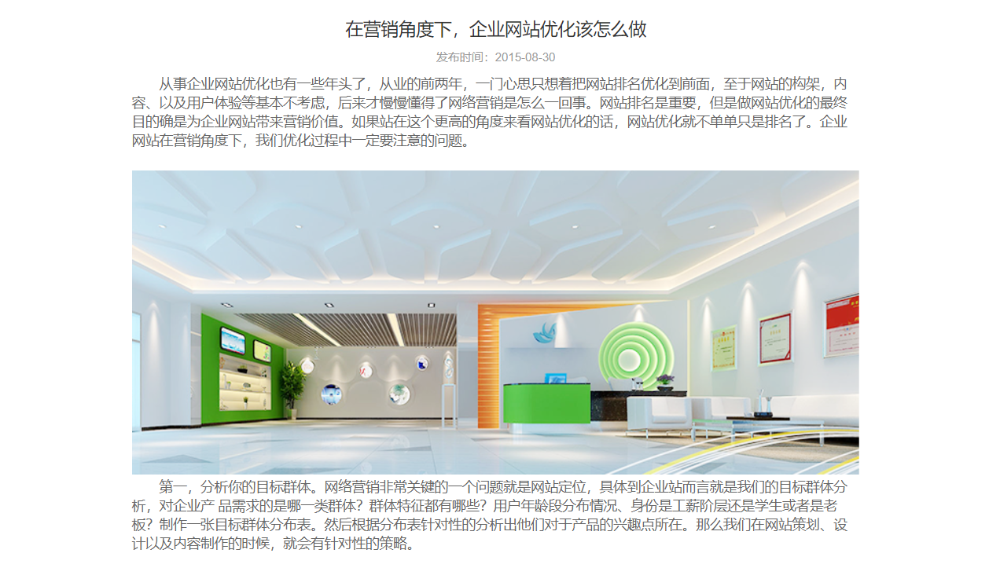

## 选择题

1.  以下哪种方式可以把css代码写在css文件中？

```css
A) 行间样式，也叫行内式

B) 内部样式，也叫嵌入式

C) 外部样式，也叫外链式
```


2.  以下HTML代码中，哪个是正确引用外部样式的方法？

```css
A) <style src="style.css">

B) <link rel="stylesheet" href="style.css">

C) <h1 style="style.css"></h1>
```

3.  以下哪个HTML标签可以用于编写内部样式？

```css
A) <style>
B) <script>
C) <link>
```

4.  以下给h1标签添加css样式，语法正确的是？

```css
A) <h1 style="color; black; ">标题</h1>
B) <h1 style="h1{ color: black }">标题</h1>
C) <h1 style="color: black;">标题</h1>
D) 
   <style>
   #h1{color: black;}
   </style>
   <h1>标题</h1>
```

5.  以下css属性用于控制文本的字体大小的是？

```css
A) font-weight
B) size
C) font-size
D) text-size
```

6.  以下css中，可以让h1元素去除粗体的正确语法是？

```css
A) <h1 style="font-size: 12px;">
B) <h1 style="weight: normal;">
C) h1{font-weight: normal;}
D) h1{font-size: 12px;}
```

7.  去除a标签默认下划线的语法是？

```css
A) a { text-decoration: none; }
B) a { text-decoration: normal; }
C) a { text-underline: none; }
D) a { text-underline: 0; }
```

8.  css如何改变p元素的字体族？

```css
A) p{ font: "宋体"; }
B) p{ font-family: "宋体"; }
C) p{ family: "宋体" }
D) p{ font-family="宋体"; }
```


## 操作题

1.  基于新闻列表.html实现下图新闻列表效果，鼠标悬放在新闻标题时，背景灰色并字体加粗。


2.  基于导航菜单.html，使用css完成以下图中效果。

    


3.  基于文章详情.html，实现以下效果。

    