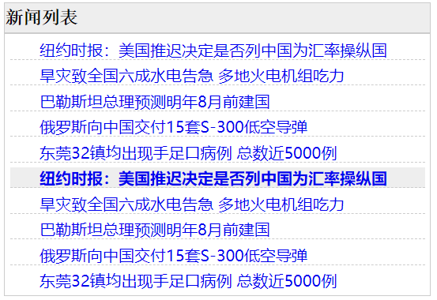
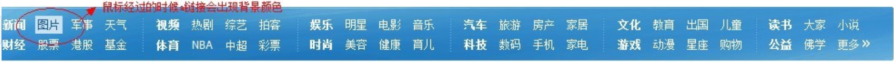
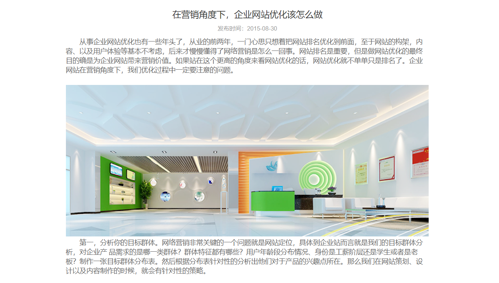

## 选择题

1.  以下哪种方式可以把css代码写在css文件中？( C )

```css
A) 行间样式，也叫行内式 style属性

B) 内部样式，也叫嵌入式  style标签

C) 外部样式，也叫外链式 link+css文件
```


2.  以下HTML代码中，哪个是正确引用外部样式的方法？（ B ）

```css
A) <style src="style.css">

B) <link rel="stylesheet" href="style.css">

C) <h1 style="style.css"></h1>
```

3.  以下哪个HTML标签可以用于编写内部样式？（ A ）

```css
A) <style>
B) <script>
C) <link>
```

4.  以下给h1标签添加css样式，语法正确的是？（ C ）

```css
A) <h1 style="color; black; ">标题</h1>          错误：属性与值之间必须使用英文冒号关联
B) <h1 style="h1{ color: black }">标题</h1>    错误：style属性中的css代码属于行间样式，不能使用选择符
C) <h1 style="color: black;">标题</h1>
D)                                                                        错误：#h1 表示是id选择符，而我们HTML代码中是没有id="h1"这一项的元素
   <style>
   #h1{color: black;}
   </style>
   <h1>标题</h1>
```

5.  以下css属性用于控制文本的字体大小的是？（ C ）

```css
A) font-weight    字符加粗
B) size                 不存在的属性
C) font-size         字体大小
D) text-size         不存在的属性
```

6.  以下css中，可以让h1元素去除粗体的正确语法是？（ C ）

```css
A) <h1 style="font-size: 12px;">      行间样式，设置h1元素的字体大小
B) <h1 style="weight: normal;">      行间样式，weight是不存在的属性
C) h1{font-weight: normal;}              内部样式，设置h1元素的字体粗细为普通，也就是去除加粗
D) h1{font-size: 12px;}                      内部样式，设置h1元素的字体大小
```

7. 去除a标签默认下划线的语法是？（ A ）

   text-decoration: none(去除线条)，underline(添加下划线)，line-thougth(添加贯穿线)， overline(添加上边线)

```css
A) a { text-decoration: none; }       text-decoration: none 表示去除文本的修饰线，所以自然包括了下划线。
B) a { text-decoration: normal; }
C) a { text-underline: none; }
D) a { text-underline: 0; }
```

8.  css如何改变p元素的字体族？(  B  )

```css
A) p{ font: "宋体"; }       font是所有字体属性的简写，font使用过程中，不能设置单一的属性值，至少有 字体带下/行高  字体家族
B) p{ font-family: "宋体"; }    
C) p{ family: "宋体" }    family是不存在的属性
D) p{ font-family="宋体"; }     语法有误，属性与属性值之间必须使用英文冒号关联，此时使用了等号所以错误
```


## 操作题

1.  基于新闻列表.html实现下图新闻列表效果，鼠标悬放在新闻标题时，背景灰色并字体加粗。



```html
<!DOCTYPE>
<html>
<head>
    <meta charset="utf-8"/>
    <title>新闻列表</title>
    <style>
    body, h3, ul{
        margin: 0;
        padding: 0;
    }
    ul{
        list-style: none;
    }
    a{
        text-decoration: none;
    }

    .news{
        width: 680px;
        margin: 0 auto;
        border: 1px solid #ddd;
    }
    .news h3{
        height: 50px;
        line-height: 50px;
        font-weight: normal;
        border-bottom: 1px solid #ddd;
        margin-left: 5px;
    }
    .news li{
        text-indent: 2.5rem;
        line-height: 40px;
        height: 40px;
        border-bottom: 1px dashed #ddd;
        margin: 0 10px;
    }
    .news li a{
        display: block;
    }
    .news li:hover{
        background: #eee;
    }
    .news li:hover a{
        font-weight: bold;
    }
    </style>
</head>
<body>
  <div class="news">
    <h3>新闻列表</h3>
    <ul>
        <li><a href="#">纽约时报：美国推迟决定是否列中国为汇率操纵国</a></li>
        <li><a href="#">旱灾致全国六成水电告急 多地火电机组吃力</a></li>
        <li><a href="#">巴勒斯坦总理预测明年8月前建国</a></li>
        <li><a href="#">俄罗斯向中国交付15套S-300低空导弹</a></li>
        <li><a href="#">东莞32镇均出现手足口病例 总数近5000例</a></li>
        <li><a href="#">纽约时报：美国推迟决定是否列中国为汇率操纵国</a></li>
        <li><a href="#">旱灾致全国六成水电告急 多地火电机组吃力</a></li>
        <li><a href="#">巴勒斯坦总理预测明年8月前建国</a></li>
        <li><a href="#">俄罗斯向中国交付15套S-300低空导弹</a></li>
        <li class="li1"><a href="#">东莞32镇均出现手足口病例 总数近5000例</a></li>
    </ul>

  </div>
</body>
</html>
```


2.  基于导航菜单.html，使用css完成以下图中效果。

    

```html
<!DOCTYPE>
<html>
<head>
	<meta charset="utf-8" /><!--设置页面编码-->
	<meta name="keywords" content="" /><!--设置关键字-->
	<meta name="description" content="" /><!--描述内容必须十分精简，能够准确描述网站的信息，一般是比较突出的信息--><!--设置描述-->
	<title>我的网站</title>
	<style>
	a{
		text-decoration: none;
	}
	.nav{
		width: 1400px;
		margin: 0 auto;
		/*background: #257dbd;*/
		background: linear-gradient(to bottom, #75bae0 0%, #2574b5 100%);
	}
	.nav .nav-inner:after{
		display: block;
		content: "";
		clear: both;
	}
	.nav .nav-item{
		float: left;
		padding: 0 20px;
		border-right: 1px dotted #fff;
	}
	.nav .nav-item a{
		float: left;
		width: 44px;
		height: 32px;
		line-height: 32px;
		text-align: center;
		color: #fff;
		margin: 0 3px;

	}
	.nav .nav-item a:hover{
		color: #43708a;
		background: #fff;
	}
	.nav .nav-item a:nth-child(1){
		font-weight: bold;
	}
	.nav .nav-last{
		border: 0;
	}
	.nav .nav-first{
		padding-left: 0;
	}
	</style>
</head>

<body>
	<div class="nav">
		<div class="nav-inner">
			<!--第一行导航菜单-->
			<div class="nav-item nav-first">
				<a href="#" target="_blank">视频</a>
				<a href="#" target="_blank">视频</a>
				<a href="#" target="_blank">视频</a>
				<a href="#" target="_blank">视频</a>
			</div>
			<div class="nav-item">
				<a href="#" target="_blank">视频</a>
				<a href="#" target="_blank">视频</a>
				<a href="#" target="_blank">视频</a>
				<a href="#" target="_blank">视频</a>
			</div>
			<div class="nav-item">
				<a href="#" target="_blank">视频</a>
				<a href="#" target="_blank">视频</a>
				<a href="#" target="_blank">视频</a>
				<a href="#" target="_blank">视频</a>
			</div>
			<div class="nav-item">
				<a href="#" target="_blank">视频</a>
				<a href="#" target="_blank">视频</a>
				<a href="#" target="_blank">视频</a>
				<a href="#" target="_blank">视频</a>
			</div>
			<div class="nav-item">
				<a href="#" target="_blank">视频</a>
				<a href="#" target="_blank">视频</a>
				<a href="#" target="_blank">视频</a>
				<a href="#" target="_blank">视频</a>
			</div>
			<div class="nav-item nav-last">
				<a href="#" target="_blank">视频</a>
				<a href="#" target="_blank">视频</a>
				<a href="#" target="_blank">视频</a>
			</div>
			<!--第二行导航菜单-->
			<div class="nav-item nav-first">
				<a href="#" target="_blank">视频</a>
				<a href="#" target="_blank">视频</a>
				<a href="#" target="_blank">视频</a>
				<a href="#" target="_blank">视频</a>
			</div>
			<div class="nav-item">
				<a href="#" target="_blank">视频</a>
				<a href="#" target="_blank">视频</a>
				<a href="#" target="_blank">视频</a>
				<a href="#" target="_blank">视频</a>
			</div>
			<div class="nav-item">
				<a href="#" target="_blank">视频</a>
				<a href="#" target="_blank">视频</a>
				<a href="#" target="_blank">视频</a>
				<a href="#" target="_blank">视频</a>
			</div>
			<div class="nav-item">
				<a href="#" target="_blank">视频</a>
				<a href="#" target="_blank">视频</a>
				<a href="#" target="_blank">视频</a>
				<a href="#" target="_blank">视频</a>
			</div>
			<div class="nav-item">
				<a href="#" target="_blank">视频</a>
				<a href="#" target="_blank">视频</a>
				<a href="#" target="_blank">视频</a>
				<a href="#" target="_blank">视频</a>
			</div>
			<div  class="nav-item  nav-last">
				<a href="#" target="_blank">视频</a>
				<a href="#" target="_blank">视频</a>
				<a href="#" target="_blank">更多 &#187;</a>
			</div>
		</div>
	</div>
</body>
</html>

```


3.  基于文章详情.html，实现以下效果。

    