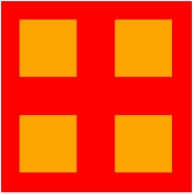
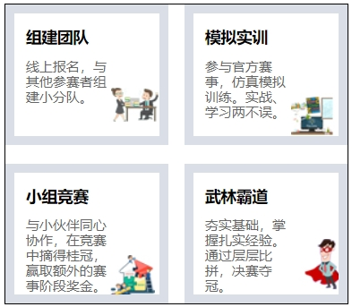
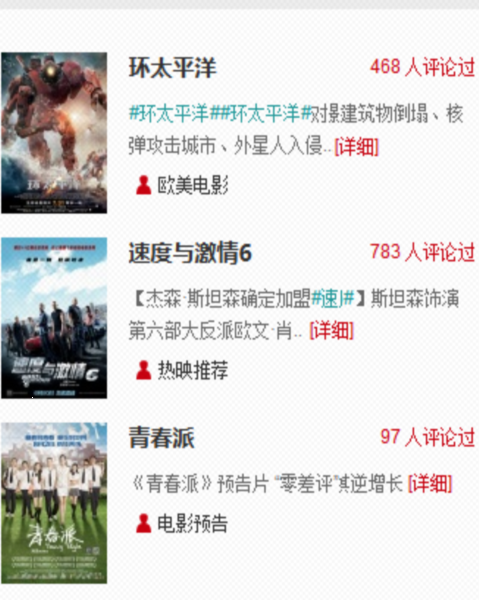

完成作业目录下的6道作业。

1. 新建一个页面1.html ，使用div配合css样式让页面显示效果如下：

 

2. 新建一个2.html页面，完成以下图片展示的效果,注意字体大小颜色和元素的宽高背景。使用列表标签配合css实现

 

3. 新建3.html,使用表单元素和div完成页面效果.注意整个页面要居中.

 

4. 新建4.html,使用div+css完成以下效果.



5. 参考课堂上使用红色边框划分网页板块的方式, 网页拆板作业目录下的几张图使用截图工具进行拆板划分.不需要写css代码.

6. 完成小说页面中，换背景颜色、换字体颜色、换字体大小、双击滚屏效果、返回顶部效果。

7. 可选作业，使用for循环以下图案效果：

```
----*
---***
--*****
-*******
*********
-*******
--*****
---***
----*
```

