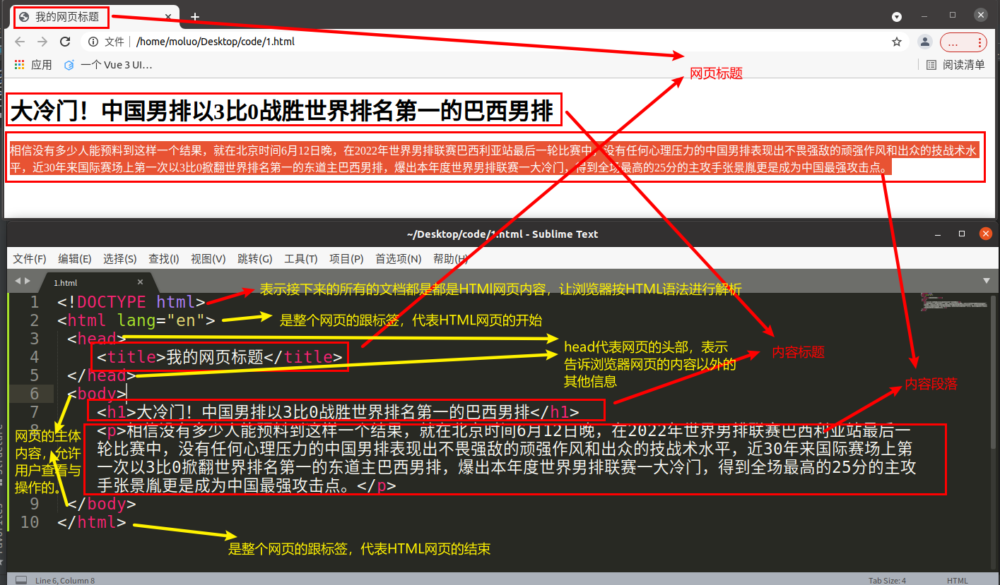
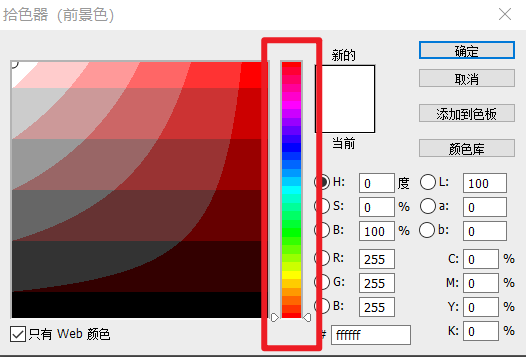
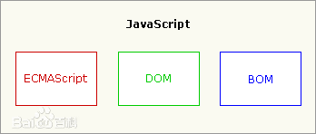
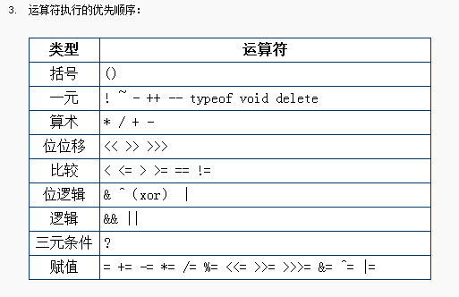
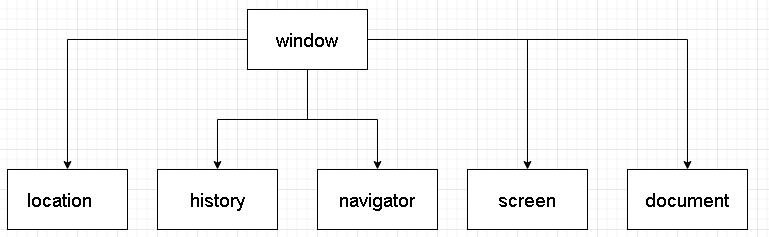
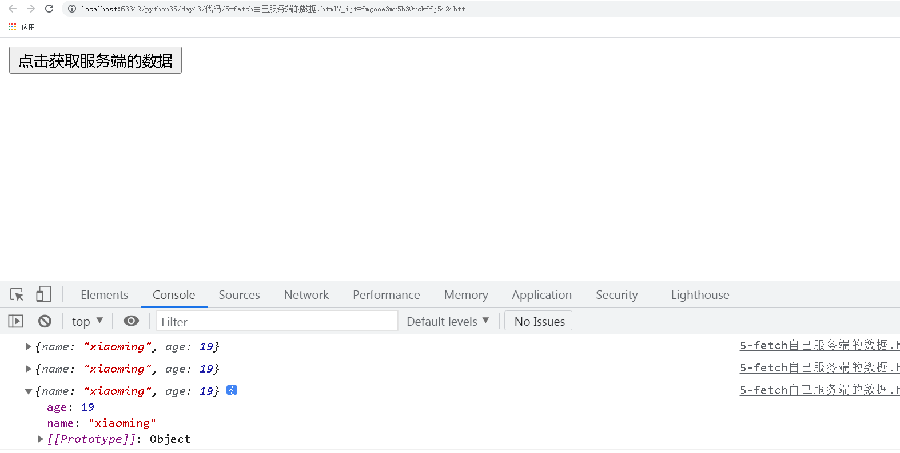

软件架构体系：

C/S: client/Server  客户端/服务端

QQ, 酷狗, 爱奇艺, 王者荣耀等3D游戏


B/S: browser/Server 浏览器/服务端

百度/淘宝/京东/网页版的爱奇艺/基于web前端技术实现的一些手机APP[例如：百度地图、喜马拉雅、消消乐、斗地主]


web前端技术是基于浏览器实现客户端的一套综合技术，包括了HTML、CSS、javascript等。

UI客户端技术是基于UI模块实现客户端的一种UI模块+打包模块，包括了pygame、pyqt5、Tkinter、wxPython、PyGUI等 结合pyinstaller。

发展历史

Linux--> 90年 --> GUNLinux

美苏冷战（2极争霸-> 1超多强）--> 美国 --> 阿帕网（Unix的母公司、IBM）->冷战结束 -> 博纳斯·李主导设计出了互联网

 -> 把网络技术推广进行民用 -> 博纳斯·李（互联网之父） -> 通过计算机网络来推广计算机技术（SGML[仅仅显示文字的格式，不支持图片，视频、音频]->HTML[支持文字、图片、视频、音频]） --> 普通人怎么看得懂HTML代码？ -> 设计出了世界上第一款开源的浏览器以及浏览器内核引擎 -> 网景(现在已经没有了) -> 世界上第一款的商用浏览器（占据世界95%份额）-> 导航者浏览器 -> 微软 --> IE浏览器(2.0, 3.0) --> 进入第一次互联网大战 -> 以微软（IE） 与 网景（导航者）分2大阵营 --> 最开始以插件多少优劣抢夺市场。布兰登·艾克基于java部分语法设计出livescript插件(后改名为javascript，实际上与java没有半毛钱关系)，让导航者浏览器一下打垮了IE浏览器。 但是微软并不想放弃，后面也实现了一个jscript的插件，但是模仿是很难超越，所以微软开始让windows系统免费捆绑IE浏览器（著名的IE6.0），并卸载导航者浏览器卸载。后面网景就失去了浏览器的市场，随着网景公司的浏览器市场流失，网景直接把微软告上了法庭，由此衍生了世界上第一款反垄断商业法律，经过了十几年后，网景倒闭了，微软基于IE6.0彻底拿下来世界上最多的浏览器份额赢得了第一次互联网大战，但是官司失败了，赔了100亿美元。网景的原高管--> Mobila -> 基于导航者浏览器开发出了一款新的浏览器（火狐浏览器）-> 进入了第二次互联网大战（IE阵营对抗 现代浏览器阵营[谷歌浏览器、火狐浏览器、欧朋浏览器、苹果浏览器]），最终IE浏览器寿终正寝，微软放弃了IE浏览器，投向了现代浏览器阵营 -> 收购了美国的一个斯巴达浏览器（Edge），基于斯巴达浏览器结合IE浏览器重新在windows10版本进行发布，最后现代浏览器阵营赢得了第二次互联网大战。所以，目前世界上使用人数最多的浏览器就变成了谷歌浏览器（2/3）。目前是世界上所有的浏览器多达上百款，其中浏览器的内核引擎（关系到了HTML语法，CSS语法，Javascript语法）只有3款：IE浏览器内核（Trident）、火狐浏览器内核（Gecko）、谷歌浏览器内核（Webkit，后面升级为了Blink）。像苹果浏览器、欧朋浏览器，遨游浏览器，UC浏览器，360极速浏览器，QQ浏览器，搜狗浏览器等等都是基于谷歌内核设计出来了。


## w3c标准

w3c: 是一个公益基金组织，由互联网之父（博纳斯·李）牵头组织起来的。w3c（万维网联盟）专门去维护互联网相关技术的发展与规范的。

w3c标准为了实现互联网网页制作的统一规范，所以设计了三大标准：结构标准、外观标准与行为标准。

web开发技术栈一共有3门语言。分别是：

+ HTML：译作超文本标记语言，负责通过标签来表达网页的**内容页面结构**。

  开发者要遵循结构标准，就需要使用HTML来开发网页的内容与结构，需要遵循HTML语法。

+ CSS：译作层叠样式表标记语言，负责通过属性标记来表达网页的**外观效果**。

  开发者要遵循外观标准，就需要使用CSS来设计或修改网页的外观效果，需要遵循CSS语法。

+ javascript: 简称js，负责通过编程代码来表达网页的**行为特效**。

  开发者要遵循行为标准，就需要使用javascript来编写网页的动态特效以及数据交互能力，需要遵循javascript ECMA语法。


## HTML

`Hyper Text Markup Language` ，译作超文本标记语言，是一门标记语言，不是编程语言。所以它没有变量，也没有任何语句结构。

所谓的超文本，就是超越了文本范畴的文档格式，普通文本只能显示文字，而超文本可以显示各种的媒体资源，例如：html网页，doc文档，xls文档等等。

同时，HTML发展至今，一共经历6个版本：HTML1.0，HTML2.0，HTML3.0，HTML4.0，XHTML1.0（过渡版本），HTML5.0（现行）。

> HTML在4.0版本（1999）时，W3C组织与浏览器厂商发生过一次分歧，W3C组织认为HTML作为标记语言，本身的语法不够严谨（就是乱写HTML代码也不会报错），所以发布了新的一门语法更加严谨的标记语言-XML，但是这门语言比HTML更加的复杂和难以使用，所以浏览器厂商要使用XML替代HTML，实际上需要耗费大量成本的，而且在当时全球有上百万的网站使用的都是HTML，所以如果直接从HTML转变到XML，很多公司是无法接受。因此，在2000年时W3C推出了HTML转换成XML的过渡版本，就是XHTML1.0版本。这个版本既有HTML的语法，也兼顾了XML的部分语法，但是在XHTML2.0版本推出的时候，浏览器厂商与W3C闹翻了，浏览器厂商不跟W3C玩了，而是自己组织了一个新的HTML标准团队-WHATWG，发展HTML5.0版本。在随后几年（2004）年，正式推出了HTML5.0试验版本，随后在2014年W3C迷途知返，重新与浏览器厂商的团队合并，在2014年重新发布了HTML5.0版本，同时也宣告了XML替代HTML计划失败，最终XML就慢慢变成了软件的配置文档，数据转换格式的结构，类似json的作用。
>
> python3在出来的时候，实际上也会很多不愿意使用新版本，很多人停留在python2，因为python的开发离不开各种第三方模块，而如果升级到了python3，意味着很多的项目都需要把原来的语法改成python3，因为python2存在的时间跨度太大的历史原因，很多python2的模块已经没有人维护，项目要升级，必须模块也要升级，导致很多人不愿意去升级项目到python3，后续就推出了一个过渡版本python2.7，这个版本既兼容了python2的语法，也兼容了python3的语法。

html的代码必须编写到.html文档中。以`.html`或者`.htm`结尾的文件中。

> `.htm`的出现是基于计算机发展的历史遗留问题，早期计算机的存储能力不强，所以针对文件名的命名存在了`8.3规范`：要求文件名必须在8个字符以内，文件后缀必须是3个字符以内。因为.html是4个字符，所以不符合`8.3规范`，因此改成了.htm，类似的情况，还有图片格式里面jpeg，在早期是jpg格式的。

因为HTML网页属于浏览器端代码，所以**不存在操作系统兼容问题**，因此一套HTML代码可以任何操作系统下的浏览器下正常运行。

### HTML网页基本结构

`1-html-第一个网页.html` ，代码：

```html
<!DOCTYPE html>
<html lang="en">
 <head>
 	<title>我的网页标题</title>
 </head>
 <body>
 	<h1>大冷门！中国男排以3比0战胜世界排名第一的巴西男排</h1>
 	<p>相信没有多少人能预料到这样一个结果，就在北京时间6月12日晚，在2022年世界男排联赛巴西利亚站最后一轮比赛中，没有任何心理压力的中国男排表现出不畏强敌的顽强作风和出众的技战术水平，近30年来国际赛场上第一次以3比0掀翻世界排名第一的东道主巴西男排，爆出本年度世界男排联赛一大冷门，得到全场最高的25分的主攻手张景胤更是成为中国最强攻击点。</p>
 </body>
</html>
```



代码说明：

| 标签名                     | 类型   | 描述                                                         |
| -------------------------- | ------ | ------------------------------------------------------------ |
| `<!DOCTYPE html>`          | 单标签 | 告诉浏览器接下来所有的内容是HTML代码， 需要使用HTML解析器来识别。 |
| `<html></html>`            | 双标签 | 告诉浏览器，这对html标签里面的内容就是网页内容。             |
| `<head></head>`            | 双标签 | 告诉浏览器，这是html网页的头部信息，例如：网页标题，编码类型，网页关键字等.... |
| `<body></body>`            | 双标签 | 告诉浏览器，这是html网页的正文内容。                         |
| `<title></title>`          | 双标签 | 属于head的子标签，告诉浏览器，这是html网页的网页标题。       |
| `<meta charset="UTF-8" />` | 单标签 | 告诉浏览器，这是一个utf-8编码的网页。                        |

### 语法

HTML中的语法有2种：标签、注释。

注释，不会被用户所看到，但是可以在浏览器中，通过鼠标右键->查看网页源代码，让开发人员查看。

```html
<!DOCTYPE html>
<html lang="en">
<head>
    <meta charset="UTF-8">
    <title>Title</title>
</head>
<body>
    <!-- HTML的注释 -->
    <!-- h1表示大标题，一般 一个网页中只会出现1次，往往用于展示网站的标题，或者网络的logo -->
    <h1>h1标题</h1>
    <!-- p标签代表的就是一个文本段落，每一个段落就使用1个p标签，一篇文章可以有多个段落-->
    <p>内容段落</p>
</body>
</html>
```


### 标签

标签[Tag]，表示HTML网页内容的一个最基本的组织单元，类似语文里面的标点符号，标签的作用就是告诉浏览器当前标签中的内容是有什么作用，要以什么格式进行展示的。

标签从书写结构上分2种：

+ 单标签，格式：`<标签名>`  或者 `<标签名 />`。
+ 双标签。格式：`<标签名>标签内容</标签名>`。

标签从组织结构上分2种：内容标签和结构标签。

+ 内容标签：主要包含和展示内容的，部分标签可以包含其他的内容标签。
+ 结构标签：主要用于包含其他标签，一般结构标签内部不会直接包含网页内容[文本、图片、视频、音频等]。

#### 单标签

只有1个标签名的标签闭合的就是单标签。书写格式：

```html
    <标签名>
    <标签名 />
    <标签名 属性名="属性值"/>  
```

常见的单标签

| 标签名        | 描述                                                         |
| ------------- | ------------------------------------------------------------ |
| **`<meta>`**  | 元信息标签                                                   |
| **`<link>`**  | css外观样式的外链引入标签，类似python中的import，可以导入css代码到html文档中 |
| ``       | 图片标签                                                     |
| **`<input>`** | 输入框标签                                                   |
| **`<br />`**  | 换行标签，浏览器默认是不识别HTML源码文件中的换行与空格的，所以需要使用br标签告诉浏览器在什么位置需要换行。 |
| **`<hr>`**    | 分割线标签，代表分割内容的一条横线，代表前面的内容已经结束了，横线下方的内容与上方内容没有关联。 |

#### 双标签

成对标签名出现，有开始标签与结束标签的，就是双标签。书写格式：

```html
<标签名></标签名>
<标签名 属性名="属性值" 属性名></标签名>
```

常见的双标签

| 标签名                | 描述                                             |
| --------------------- | ------------------------------------------------ |
| **`<h1></h1>`**       | 网页的一级标题                                   |
| **`<h2></h2>`**       | 网页的二级标题                                   |
| ...                   |                                                  |
| **`<h6></h6>`**       | 网页的六级标题                                   |
| `<p></p>`             | 网页的段落                                       |
| **`<a></a>`**         | 网页超链接                                       |
| **`<div></div>`**     | 块级结构标签                                     |
| **`<span></span>`**   | 行级结构标签                                     |
| **`<form></form>`**   | 表单标签，表示网页的一个提供给用户输入数据的表单 |
| **`<ul></ul>`**       | 无序列表结构标签，表示网页的一个内容列表         |
| **`<li></li>`**       | 列表项目标签                                     |
| **`<table></table>`** | 表格标签，表示网页的一个表格                     |


### 常见标签使用

#### 标题和段落

```html
<!DOCTYPE html>
<html lang="en">
<head>
    <meta charset="UTF-8">
    <title>Title</title>
</head>
<body>
    <!-- HTML中的标签是HTML语法提供的，所以每一个标签都是固定标签名 -->
    <h1>h1标题:常用于网站的logo，网站标题</h1>
    <h2>h2标题:常用于网站的板块标题、栏目标题</h2>
    <h3>h3标题:常用于网站的板块标题、栏目标题</h3>
    <h4>h4标题:常用于网站的附加板块标题，或者文章的标题</h4>
    <h5>h5标题:更小级别的标题，基本用不到</h5>
    <h6>h6标题:更小级别的标题，基本用不到</h6>
    <p>p->段落：Hyper Text Markup Language</p>
</body>
</html>
```


#### 标签的属性

标签的作用就是用于展示内容，但是内容有时候并非文本，而且文本的展示需要附加一些额外效果时，就需要使用标签的属性来声明。不管是什么标签，都有属性[Attribute]。标签的属性有两种：

+ 普通属性：

  属性与属性值使用 = 号关联 ，属性值使用单引号或双引号圈住，建议使用双引号。

+ 布尔属性：

  只有属性名，没有属性值。当标签里面写上这个属性名，则其值就是True，标签没有属性名，则为False

```html
<!DOCTYPE html>
<html lang="en"> <!-- lang 就是HTML标签的属性，代表当前网页的默认语言language：en表示 english -->
<head>
    <meta charset="UTF-8"> <!-- charset，是meta元信息标签的属性，表示当前网页的编码是utf-8 -->
    <title>Title_python学习网页</title>
</head>
<body>
    <!-- 双标签的属性 -->
    <!--
    align：文本的水平对齐方式：left左[默认值],center中,right右
    title：表示当前标签的补充提示，当用户把鼠标放在当前标签上方则自动title属性的值
    -->
    <h1 align="left" title="提示文本">h1标题:常用于网站的logo，网站标题</h1>
    <h2 align="center" title="用于提示而已">h2标题:常用于网站的板块标题</h2>
    <h3 align="right">h3标题:常用于网站的板块标题</h3>
    <h4>h4标题</h4>
    <h5>h5标题</h5>
    <h6>h6标题</h6>
    <p align="center" title="用于提示而已">p->段落：Hyper Text Markup Language</p>

    <!-- 单标签的属性：单标签是没有内容的，所以需要依赖于属性来展示对应的内容 -->
     <!-- src就是用于展示图片的内容 -->
    <input type="number">   <!-- 输入框标签[数值输入框]，number表示只允许当前输入框中只能输入数值 -->
    <input type="password"> <!-- 输入框标签[密码输入框]，password表示当前输入任何内容都是密码，所以不会展示出来  -->
    <input type="text">     <!-- 输入框标签[单行文本输入框]，text表示只允许用于输入一行内容内容，不能回车换行 -->
    <input type="datetime-local"> <!-- 时间输入框，只需要用户输入时间日期 -->
</body>
</html>
```

#### 换行、分割与超链接

```html
<!DOCTYPE html>
<html lang="en"> <!-- lang 就是HTML标签的属性，代表当前网页的默认语言language：en表示 english -->
<head>
    <meta charset="UTF-8"> <!-- charset，是meta元信息标签的属性，表示当前网页的编码是utf-8 -->
    <title>Title_python学习网页</title>
</head>
<body>
    <h1>将进酒</h1>
    <a href="https://baike.baidu.com/item/将进酒">李白</a>
    <p>君不见黄河之水天上来，奔流到海不复回。<br>
    君不见高堂明镜悲白发，朝如青丝暮成雪。<br><br>
    人生得意须尽欢，莫使金樽空对月。<br>
    天生我材必有用，千金散尽还复来。<br>
    烹羊宰牛且为乐，会须一饮三百杯。<br>
    岑夫子，丹丘生，将进酒，杯莫停。<br>
    与君歌一曲，请君为我倾耳听。<br><br>
    钟鼓馔玉不足贵，但愿长醉不愿醒。<br>
    古来圣贤皆寂寞，惟有饮者留其名。<br>
    陈王昔时宴平乐，斗酒十千恣欢谑。<br>
    主人何为言少钱，径须沽取对君酌。<br><br>
    五花马、千金裘，呼儿将出换美酒，与尔同销万古愁。</p>
    <hr>
    <h2>译文</h2>
    <p>你难道没有看见吗？那黄河之水犹如从天上倾泻而来，波涛翻滚直奔大海从来不会再往回流。<br>
    你难道没有看见，在高堂上面对明镜，深沉悲叹那一头白发？早晨还是黑发到了傍晚却变得如雪一般。<br>
    人生得意之时就要尽情的享受欢乐，不要让金杯无酒空对皎洁的明月。<br>
    上天造就了我的才干就必然是有用处的，千两黄金花完了也能够再次获得。<br>
    且把烹煮羔羊和宰牛当成一件快乐的事情，如果需要也应当痛快地喝三百杯。<br>
    岑勋，元丹丘，快点喝酒，不要停下来。<br>
    我给你们唱一首歌，请你们为我倾耳细听。<br>
    山珍海味的豪华生活算不上什么珍贵，只希望能醉生梦死而不愿清醒。<br>
    自古以来圣贤都是被世人冷落的，只有会喝酒的人才能够留传美名。<br>
    陈王曹植当年设宴平乐观，喝着名贵的酒纵情地欢乐。<br>
    你为何说我的钱不多？只管把这些钱用来买酒一起喝。<br>
    名贵的五花良马，昂贵的千金皮衣，叫侍儿拿去统统换美酒，让我们一起来消除这无尽的长愁！
    </p>
</body>
</html>
```

超链接有2种常用用法：页面跳转、下载文件。

```html
<!DOCTYPE html>
<html lang="en">
<head>
    <meta charset="UTF-8">
    <title>Title</title>
</head>
<body>
    <!--页面跳转: 如果href的值是网络地址，可以跳转到跳转到指定的网页-->
    <a href="http://www.baidu.com">跳转到百度</a>
    <!--页面跳转: 如果href的值是本地地址，则可以跳转到本地的内部网页 -->
    <a href="11-超链接页面.html">跳转到本地页面</a>
    <!-- 下载资源：当href的值是一个浏览器无法直接展示的内容格式时，浏览器会自动下载当前路径对应的内容 -->
    <a href="./html.chm">点击下载手册</a>
    <!-- 下载资源：当href的值是一个浏览器可以直接识别并展示的内容格式时，用户可以鼠标右键，对当前href的数值的内容进行另存为下载 -->
    <a href="./goods.png">点击下载图片[鼠标右键,另存为]</a>
</body>
</html>
```

> 实际上页面跳转也是属于下载文件。因为用户能在浏览器里面看到的所有内容，实际上都是经过浏览器下载到本地，用户才能看到的。我们可以通过 F12 -> 打开开发者工具 -> network（网络）


#### 列表标签

列表是一种结构标签，可以让网页的内容形成列表格式。


或


列表标签在HTML中提供提供了4种：

1. 无序列表（UnorderList，ul）

   就是没有序号的，内容不分先后的列表。

2. 有序列表（OrderList，ol）

3. 定义列表（DefineList，dl）

4. 菜单列表（Menu）

除了定义列表结构特殊以外，其他的3种列表都有列表项目（List Item, li）。

```html
<!DOCTYPE html>
<html lang="en">
<head>
    <meta charset="UTF-8">
    <title>Title</title>
</head>
<body>
    <!--
    无序列表, unordered list，简写: ul
    列表的单项  list item 简写：li
    -->
    <ul type="circle">
        <li>列表的第一项</li>
        <li>列表的第二项</li>
        <li>列表的第三项</li>
    </ul>

    <!--
    有序列表, ordered list，简写：ol
    列表的单项  list item   li
    -->
    <ol>
        <li>列表的第一项</li>
        <li>列表的第二项</li>
        <li>列表的第三项</li>
    </ol>

    <!--
    和任何一个双标签一样，标签内部可以嵌套的标签来使用。
    -->
    <ul>
        <li>
            <p>第一章：开端</p>
            <ul>
                <li>第一节：下山</li>
                <li>第二节：命案</li>
                <li>第三节：奇遇</li>
                <li></li>
                <li></li>
            </ul>
        </li>
    </ul>

    <dl>
       <dt>赵本山</dt>
       <dd>春晚常驻选手，国内一线大品牌</dd>
       <dd>乡村爱情故事，二人转，小品</dd>
       <dt>小明</dt>
       <dd>国内所有小朋友的同学，每次都从教室里面滚出去的哪一个。</dd>
    </dl>

    <!-- 菜单列表是HTML版本中新增的列表标签，实际上就是ul标签（无序列表） -->
    <menu>
        <li>首页</li>
        <li>商品分类</li>
        <li>购物狂欢节</li>
        <li>会员中心</li>
    </menu>
</body>
</html>
```

几种列表标签中最常用的只有**`ul`**，当然也有新版本的menu标签。其他的2种标签（ol与dl），基本不使用。


#### 表单标签

是HTML中最终的标签之一，主要是提供了输入框或按钮等标签提供给用户进行交互输入数据。将来表单可以提交到指定服务端程序中进行数据处理。

##### form标签

| 属性          | 描述                                                         |
| ------------- | ------------------------------------------------------------ |
| **`action`**  | 设置当前表单的表单数据处理应用程序的url地址，默认值是当前url地址。 |
| **`method`**  | 设置当前表单的HTTP提供方式，默认是get。<br/>      get，以**查询字符串**的格式，把表单数据附加在url地址栏上提交数据<br/>      post，以**数据包**格式，把表单数据附在HTTP网络请求体中提交数据 |
| **`enctype`** | 设置当前表单提交的数据格式，默认值是application/x-www-form-urlencoded。<br/>      application/x-www-form-urlencoded：以普通表达数据格式提交<br/>      **`multipart/form-data`**：以多种数据格式提交<br/>      text/plain：以纯文本数据格式提交 |


##### 表单项标签

| 类型                         | 用法                                                         | 描述                                                         |
| ---------------------------- | ------------------------------------------------------------ | ------------------------------------------------------------ |
| **`单行文本框`**             | **`<input type="text" name="" value="" placeholder="">`**    | name：设置输入框的值的变量名称，用于服务端接受数据。<br>value：设置输入框的默认值。<br>placeholder：设置输入框的提示内容。 |
| **`密码框`**                 | **`<input type="password" name="" value="" placeholder="">`** | 只允许输入单行密码，属性描述同上                             |
| 单行文本框（数值框）         | **`<input type="number" name="" value="" placeholder="">`**  | 只允许输入数值内容，属性描述同上。<br>就版本浏览器中不支持时会被默认为text单行文本框。 |
| 单行文本框（日期输入框）     | **`<input type="date" name="">`**                            | 只允许输入日期格式内容，属性描述同上。<br/>低版本浏览器中不支持时会被默认为text单行文本框。 |
| 单行文本框（时间输入框）     | **`<input type="time" name="">`**                            | 只允许输入时间格式内容，属性描述同上。<br/>低版本浏览器中不支持时会被默认为text单行文本框。 |
| 单行文本框（日期时间输入框） | **`<input type="datetime-local" name="">`**                  | 只允许输入日期时间格式内容，属性描述同上。<br/>低版本浏览器中不支持时，会被默认为text单行文本框。 |
| **`文件上传框`**             | **`<input type="file" multiple name="">`**                   | multiple：布尔属性，允许一次性上传多个文件。<br>其他属性描述同上。 |
| **`单选框`**                 | **`<input type="radio" name="" value="">`**                  | 用于提供一组多个选择让用户选一个选项的按钮组。<br>多个单选框必须name值相同才能为一组。<br>同一组单选框中的value值必填，而且值要唯一。 |
| **`多选框`**                 | **`<input type="checkbox" name="fav" value="1">`**           | 用于提供一组多个选择让用户选多个选项的按钮组。<br>多个多选框必须name值相同才能为一组。<br>同一组多选框中的value值必填，而且值要唯一。 |
| **`下拉列表框`**             | **`<select name="">`**<br>    **`<option value="选项1值">选项1</option>`**<br>    **`<option value="选项2值">选项2</option>`**<br>    **`<option value="...">...</option>`**<br>    **`<option value="选项n值">选项n</option>`**<br>**`</select>`** | 属性描述同上。                                               |
| **`多行文本框/文本域`**      | **`<textarea name="" cols="" rows=""></textarea>`**          | cols：设置多行文本框默认列数[宽度]<br>rows：设置多行文本框默认行数[高度]<br>注意：多行文本框标签中的任意内容都会被原样记录。 |
| **`提交按钮`**               | `<input type="submit" value="提交">`                         | value：表示当前按钮的提示文本。<br>用于提交表单数据到action属性对应的地址中。 |
| 普通按钮                     | `<input type="button" value="">`                             | 属性描述同上，主要用于配合js完成网页特效。                   |
| **`普通按钮`**               | **`<button></button>`**                                      | 普通按钮，中间可以显示图片或文本。<br>主要用于配合js完成网页特效。 |
| 重置按钮                     | `<input type="reset" value="重置">`                          | 点击以后，会把当前表单中用户输入的所有内容进行还原到页面刚刷新状态。 |
| 隐藏域输入框                 | `<input type="hidden" name="" value="">`                     | 隐藏域输入框的作用是附带一些默认数据提交给服务端，但是不希望用户看到。 |

表单项的常用属性

| 属性名         | 描述                                                         |
| -------------- | ------------------------------------------------------------ |
| **`name`**     | 表示当前表单项的值的变量名，用于提供服务端获取本次提交的数据项。 |
| **`value`**    | 表示当前表单项的值，如果值在代码中提前设置了，则为默认值     |
| **`type`**     | 表示input框的类型                                            |
| **`disabled`** | 布尔属性，设置当前输入框是否被禁用                           |
| maxlength      | 设置当前输入框[textarea，input]中最大输入内容的长度。        |
| **`multiple`** | 设置允许文件上传框选择上传多个文件                           |

代码：

```html
<!DOCTYPE html>
<html lang="en">
<head>
    <meta charset="UTF-8">
    <title>Title</title>
</head>
<body>
    <form action="http://httpbin.org/post" method="post" enctype="multipart/form-data">
        <input type="hidden" name="hide" value="1.0">
        <label>账号：
        <input type="text" name="username" value="root" disabled placeholder="请输入账号">
        </label><br>
        <label>密码：
        <input type="password" name="password" value="" maxlength="16" placeholder="请输入密码">
        </label><br>
        <label>年龄：
            <input type="number" name="age" value="" placeholder="请输入年龄">
        </label><br>
        <label>出生年月
            <input type="date" name="born">
        </label>
        <br>
        <label>时间：
            <input type="time" name="time">
        </label>
        <br>
        <label>本地日期时间：
            <input type="datetime-local" name="datetime">
        </label>
        <br>
        头像[单文件]：<input type="file" name="avatar"><br>
        头像[多文件]：<input type="file" multiple name="imgs[]">
        <br>
        性别：
            <label><input type="radio" name="sex" value="1"> 男</label>
            <label><input type="radio" name="sex" value="2"> 女</label>
        <br>
        爱好：
            <label><input type="checkbox" name="fav" value="1">篮球</label>
            <label><input type="checkbox" name="fav" value="2">足球</label>
            <label><input type="checkbox" name="fav" value="3">排球</label>
            <label><input type="checkbox" name="fav" value="4">水球</label>
            <label><input type="checkbox" name="fav" value="5">气球</label>
        <br>
        城市：
        <select name="city">
            <option value="1">北京</option>
            <option value="2">天津</option>
            <option value="3">唐山</option>
            <option value="4">廊坊</option>
            <option value="5">上海</option>
            <option value="6">其他</option>
        </select>
        <br>
        个性签名：<br>
        <textarea name="description" cols="30" rows="10"></textarea>
        <br>
        <input type="submit" value="提交表单">
        <input type="button" value="普通按钮">
        <button></button>
        <input type="reset" value="重置表单数据">
    </form>
</body>
</html>
```


#### 表格标签

表格系列标签主要是可以数据以表格的格式展示出来。但是现在table表格已经很少使用了，而是改成div+css实现更漂亮的表格。

| 标签                  | 描述                                                         |
| --------------------- | ------------------------------------------------------------ |
| **`<table></table>`** | 表示网页的一个表格，内部一般直接嵌套的是tr标签。             |
| **`<tr></tr>`**       | 表示表格的一行，内部直接嵌套的只能是td或者th标签。           |
| **`<td></td>`**       | 表示表格的一个单元格，也可以是一列，可以包含其他标签或内容。 |
| **`<th></th>`**       | 表示表格的表头的一个单元格，可以包含其他标签或内容。         |

##### 基本使用

```html
<!DOCTYPE html>
<html lang="en">
<head>
    <meta charset="UTF-8">
    <title>Title</title>
</head>
<body>
    <!--1行1列的表格-->
    <table border="1"> <!-- border 表示设置表格边框的宽度，不推荐使用bother，以后会学到css，可以设置更好看的边框 -->
        <tr>
            <td>1行1列</td>
        </tr>
    </table>
    <hr>
    <!--1行2列的表格-->
    <table border="1">
        <tr>
            <td>1行1列</td>
            <td>1行2列</td>
        </tr>
    </table>
    <hr>
    <!--2行1列的表格-->
    <table border="1">
        <tr>
            <td>1行1列</td>
        </tr>
        <tr>
            <td>2行1列</td>
        </tr>
    </table>
    <hr>
    <!--2行2列的表格-->
    <table border="1">
        <tr>
            <td>1行1列</td>
            <td>1行2列</td>
        </tr>
        <tr>
            <td>2行1列</td>
            <td>2行2列</td>
        </tr>
    </table>
    <hr>
    <!-- 有表头的表格 -->
    <table border="1" width="600">
        <tr>
            <th>ID</th>
            <th>姓名</th>
            <th>年龄</th>
        </tr>
        <tr>
            <td>3</td>
            <td>小明</td>
            <td>17</td>
        </tr>
        <tr>
            <td>5</td>
            <td>小黑</td>
            <td>16</td>
        </tr>
    </table>

</body>
</html>
```

##### 合并单元格

```html
<!DOCTYPE html>
<html lang="en">
<head>
    <meta charset="UTF-8">
    <title>Title</title>
</head>
<body>
    <table width="800" border="1">
        <tr>
            <!-- colspan 表示当前单元格[td,th]占据2列 -->
            <th colspan="2">form标签属性说明</th>
        </tr>
        <!-- tr>th*2 -->
        <tr>
            <th>属性</th>
            <th>描述</th>
        </tr>
        <tr>
            <td>action</td>
            <td>设置当前表单的表单数据处理应用程序的url地址，默认值是当前url地址。</td>
        </tr>
        <!-- tr>td*2 -->
        <tr>
            <!--设置当前单元格，占据3行的空间  -->
            <td rowspan="3">method</td>
            <td>设置当前表单的HTTP提供方式，默认是get。</td>
        </tr>
        <tr>
            <td>get，以<b>查询字符串</b>的格式，把表单数据附加在url地址栏上提交数据</td>
        </tr>
        <tr>
            <td>post，以<b>数据包</b>格式，把表单数据附在HTTP网络请求体中提交数据</td>
        </tr>
        <tr>
            <td rowspan="4">enctype</td>
            <td>设置当前表单提交的数据格式</td>
        </tr>
        <tr>
            <td>application/x-www-form-urlencoded：默认值，以普通表达数据格式提交</td>
        </tr>
        <tr>
            <td><b>multipart/form-data</b>：以多种数据格式提交</td>
        </tr>
        <tr>
            <td>text/plain：以纯文本数据格式提交</td>
        </tr>
    </table>
</body>
</html>
```

##### 表格嵌套

```html
<!DOCTYPE html>
<html lang="en">
<head>
    <meta charset="UTF-8">
    <title>Title</title>
</head>
<body>
    <table width="1680" align="center">
        <tr>
            <td>
                <table align="center" width="1024">
                    <tr>
                        <td><a href="">奥运首页</a></td>
                        <td><a href="">中国军团</a></td>
                        <td><a href="">赛程赛果</a></td>
                        <td><a href="">奖牌榜</a></td>
                        <td><a href="">诸强</a></td>
                    </tr>
                </table>
            </td>
        </tr>
        <tr>
            <td>
                <table width="100%" border="1">
                    <tr>
                        <td width="300">
                            <table>
                                <tr>
                                    <td>全部赛程</td>
                                    <td width="20%">更多 > </td>
                                </tr>
                                <tr>
                                    <td colspan="2">
                                        <ul>
                                            <li>中国对日本</li>
                                            <li>韩国对日本</li>
                                            <li>朝鲜对日本</li>
                                            <li>俄罗斯对日本</li>
                                        </ul>
                                    </td>
                                </tr>
                            </table>
                        </td>
                        <td>
                            
                        </td>
                        <td width="450">右</td>
                    </tr>
                </table>
            </td>
        </tr>
    </table>
</body>
</html>
```

早期的很多网页为了排版方便都是采用table布局（table标签来控制页面内容的排版），但是这种方式现在已经没有人使用了。而是改城了div标签+css样式来进行排版，这种方式更加容易入门，更加容易维护代码，更加美观好看。


#### 媒体标签

之前说过所谓的超文本，就是超出文本范畴的文档，所以我们在网页编写过程中，经常也需要在网页中展示或播放一些媒体资源，例如：图片，音频，视频。

| 标签                                                         | 常见格式                                                     | 描述 |
| ------------------------------------------------------------ | ------------------------------------------------------------ | ---- |
| **``**                                    | **`png`**，**`jpg/jpeg`**，**`gif`**(动态图片格式)，**`svg`**，**`webp`**，**`tiff`** | 图片 |
| **`<audio controls autoplay>`**<br>**`<source src="">`**<br>**`</audio>`** | **`mp3`**，**`mpeg`**，**`ogg`**，wma，**`aac`**，ogv        | 音频 |
| **`<video width="" controls autoplay src=""></video>`**      | **`mp4`**，**`mpeg`**，**`ogg`**，ogv，**`mov`**，flv，      | 视频 |

##### 图片

```html
<!DOCTYPE html>
<html lang="en">
<head>
    <meta charset="UTF-8">
    <title>Title</title>
</head>
<body>
  <!-- src: source的简写，表示当前图片的资源路径，HTML中可以展示网络连接中的图片资源，也可以本地资源。
       alt：补充说明，当图片的路径不正确或者图片无法正确显示的时候，浏览器就会展示alt中的文本信息
   -->
  本地图片 <br>
  <br>
  网络图片 <br>
  
  <br>
  图片的格式或者文件名本身不重要，最重要的路径指向的内容是不是真正的图片 <br>
  <img src="data:image/jpeg;base64,/9j/4AAQSkZJRgABAQEASABIAAD/2wBDAA0JCgsKCA0LCgsODg0PEyAVExISEyccHhcgLikxMC4pLSwzOko+MzZGNywtQFdBRkxOUlNSMj5aYVpQYEpRUk//2wBDAQ4ODhMREyYVFSZPNS01T09PT09PT09PT09PT09PT09PT09PT09PT09PT09PT09PT09PT09PT09PT09PT09PT0//wAARCAEsASwDASIAAhEBAxEB/8QAGwAAAQUBAQAAAAAAAAAAAAAABAABAgMFBgf/xAA4EAEAAQMDAwIEBAUEAgIDAAABAgADEQQhMRJBUQVhE3GBkQYUIqEyscHR4RVCUvAjkkOCFoPx/8QAGQEAAwEBAQAAAAAAAAAAAAAAAAECAwQF/8QAIREBAQEBAAIDAQEBAQEAAAAAAAERAiExAxJBE1EiFGH/2gAMAwEAAhEDEQA/AOV2pLjiq+rFLqEqrGsppqZ3oe7ckDirbjtQ8zO9Y9Tyr2jG5LP+KujcWhsYal1Ac7VnYcElxqZc480E3A70i8Zxml9aqNKN3HGKsjerLL5nK1Yag80vrTakb1Wxv4+dZRqDzUjUnkoyhsGpxUzVb1jGpPNSNSeSjyGyao9qmao9qxTUHmpmoMc70DGwao9qmao23KxTUHk+9SNQeSjRjaNUe1TNUVil88/vUi+eaNDaNSe1SNSeaxS/71Iv+9GnjbNSeSnNSeSsUv8AvtTl98/vRpNs1BnkpzUnkrE+O45/enNQ+aNDa/MHml+ZPJWL+YfNJ1D5p6G1+ZPJS/NHtWJ+Zc80vzKd6NDbdQPeoTvGOSsf80vel+afNAaTeHvVU7pigHU1F1GaQGt4GnL5nkrNlfB5qp1Qd6JQ2PzAdyl+aPNYktYBzVTrd+aqUkHYqPVUnc96gmN67KwhMjfNVyYZpTFNmqJqd6y6i4U5G+KqZbbZqMlc71DPvUSK1Jc8U8N5fRf2poAuHl4aNsaKd23K5EQiI484otk9nJaCHbelnFKUWLhN6WKB5PndaQ0wZaWE+dGHqRJ80/U+ahSoyDU+t8u3vT/El2Wq3OKRnFGQat+JL/k/enLsjiTVQ0qWQ15fmf7qkaifmqBpzOKVkOCTU3DvmpGqmGc0KPzp84pfWKwV+bmU5rZ+M0JlxTLt3z2pfWEN/PPj96f/AFB8P3rPWlmn9Ynw0D1DfGGpGvKy8+9LNP6wa1DXRe+Kf89HHNZOaXVR9C1rmsg9/wB6f83DPNY/V9qXV4aPoexr/mo+aX5mD3rI6ny0up8tH0LY1m/F7lVTuD3/AHrOJJ3fvS63y0fQbBM5iO9VMjNVdT5pZ96c5Gxrhkpk2qcTHenSuqueB5mCh7p3M0ZI5oe6b8VnVwImFqCVdI5qpMVnVntHVcDy4rpfw5auF6Qw67aYRNkrn9HFnqYByteieiWLOl0Nv4xhd6w+brPDTiawvVvw9uz0wttzhDc8Vy92zOzcYTiiOMV6/ppaeR0wBHbCiNA+s/hnSep2W5pwt3sODHLS47s8U+pNeVRMyKXejdb6ff0GslZ1EGMjOMntQWPvW8sqMJ/bNLJmlj33pe9AKlmnxmnIrjmjQanpyKU/Qm9LYqGMeacwcU/SlIi0tOEY5zSfanxtSRxRqsRztTLTo0yfegrDGFx96iuV7HipYxFe7tUHxVRNLNMtKmpotLNIyuCpxtzlFkD0nLiibXp9+dskRQTKuwHlo2QstBvNN3qc4sZJnYcZqFMqVKlSoGlSpZpqC0+aWaZd6VBa3IVPG3FQg1b2WuhnFUzGaFuhRc+Ghru+azrSBZmM1U5Grpm+KqRzkPpWVq41fQNKajViRRgivauzncZz6Q/SbGO1Yn4YtkNLcvMcSdita3F6lM5rg+bvesdXx8+NaNiEIBMMSHdDFalm5Jj1QOp7g/vWPYuMDfeLyeKOs3GLmDke5zU8dH1yj+IPSLfrOh2gGoiLCWN32a8p1Omuaa8wuxYophPDivabF8QJnO4+9cz+OPQPzViPqGlBbf8AHEORea6eO2HUx5s804bD2aunYlG5KKYR4q+GmXBjg3rW9yROBY21xtRMNOpnFG2NIobftWhY0SmMVj18n+KnLINKrxVhpXHFbkNCpxxVxodjaovdXOXMz0qGxVJYR45rqbvp6nH7UOenK8OPlRO7BjA+A77U0rCYMV0P+nOOP2pPpqv8NH9KeOcbKHHNQlZTtXRT9OR449qpdCjlNjfinPlsLGFctpgxwb/OqJRStu7pXdxvUdJ6Nf12oLdmCmd3GxWnPyT9KxjWrU70yNuKr4rpPSvwlqtQF3UQYW+QeWur9J9B0XpdsWJcvd1M4a07uoIQxueAN6XXy76E4c5L8P27VuI2cxNwxtnzQPrmnlZ0QIg7kQ2x5fPsV0l3UylMVXxHNUfiXTx1HoZcwCchWUu32qzI8uuLKbu+1Qqy8/rQABwBVdds9Oa+ypUuaVMjUzT5pqCKlSpUybltKtOKotuCrhErW0pEZtD3DNEPPNVTDCVl1caSBugko9+Hw1KxGMrnw7ojnAnJ/enRjuOKJ0VxlegTiSROTdPn5rC3wuR1ensws6C1CGExlasht3xVcpQIQAQwYw1Iug7jXn93a7OfEFQuMUR4oi1KLhi4R2M7UESEGpRkjkcntSmw/bYs33GLhk8n860dNcjIbU8MUxh4SsXTXkPfx3rRtShcBEJHc2rfisu45n8Sfh0sX2/Yh/45udjhrLt6BJ8V6R0w1GnbV0EfNY9/0wt3XBtV9bmxnJPVc/Y0Ptz7UfZ0QYcftWpb0gHFFQ04HFZ5avxGZDRnjmrDSHitMsgcU5a9qr60bGY6Me1R/Ix8Favw8dqZiG+KMLWb+SiHFRdHHHFaSHimQ8UYesieiHO1CXtEA4K32JjKVW2hyyACpw9c7D0id+ZtiGcL2K17FrT6SyW7IBEwptn5tPf1Bj4doCJy+aGZ5xlwHtStk9HJohvrLpgLtzwVUxmqymB86gXFyRKeMJLly/Spt1UmITg52MFX6i3DU+j6myi/pzt58UwGNz7tX2Isrd2KfpYJgafFul3PDyvWaeNq7IIuz5oGXOxit/1TSJfuAb5ds8Vi3bTF359q7+Otjl6ilpqdKatGdKmzSpdqaaTSpUqCbERO1WjtTkKkRccUr2uRHGaZj/KrcJSY5Gs+rrSQOxJbYq7TWwuxTPJs05D2ojSgXAlxmsrfCp7bswYR6uQN/wC/96UJ9CElHwmRqVwG3EHG3OapgSiozMeHc/xXFfddU9DoXYoAD9KIhmX8AZ9kz9qCtfAVesXHEnOPtzV8NVZtxz8QPHRHFVIL/wDBZYk467aPkMVdAlCQqJ5Nn/NAmsty4u3VfMypmoFwrvwtV4ifNbumu7dK7nD5KNlEuWs7KcVztq7ImI99nPJW1p7mwLvgzWnHX5WXXOeYdhjtU4mTiosjMorvUhxgGnLNL8SxvUiJj3qpkilSHbdxVSwsSIcnYqE4ZNqmqFVsjYzStgkqpjgfNQwtXDnJUJyjAf3pWRW1VIIxzNwFZ2r1bcGMEjHsHNR1+rWaeHYHtWe3Fdg37tZddfkacz9q1ZOcceaWNt0D51X1Y2UX57VCVxdkyVmsQMTh2q6CyTK/IoKMVRjk912q+GTmWE+dEAplE26MPvV2ikNyQjuNBF6Q4ZD86N0KSvDn7VfHsuvTlvV9Ol+5iOBWuZ1dhFyYr0b1TREiTjC+1cf6jpyMnMVfeumXK5q5aZhSoUVqodMnbBQztXTzdjLqZTZpqdpqpJUqXmlQl0xAe1IjubUT0VBjjiua1vIrYYOKiR3ogiMaixxKhUVkMpRmltxZgm2arhAcY58NH6S1mRkefFL8H6IvgQj7d6CZMZbu3zrR1Ns6QHG1Z1+ICLvXF1M6rq59JCII5fd3KuhH4o/riTxkXG/s/wB6y5TuQeqC7c4on83O30ylpvixTKjhqpLStEli8SBjiWcp2flWroNK3DCYTCm/FU6WVu/YLtlcBlin6oe1a2huGQUZHCcI9z69qvMvlNq21o+i4x2YuU+TR9qHSiu4B86ondIonarIXeoMO9VMiLtWNsLjNeXOKfOFfaqpXOqD3Sq/iqA7Lhc0Wz8KQTy5zzUtslVWnMjfark2flVQr4QuS2xnGWqWWcA96V0erLx4qmEhj1L3clRb5VJ4XxkgvihtTJZSN8OMbURBBPFK7bjcFezseafuDcrn9XDM0BwG7QM7iSTg7Fb92wSznZUV9isDWwkalDPTztWVjSU5cCJvlfFW27hk2B8JQpGEgFlkOTgqcG3bwRvK55TNEh60rPw1PiQTPc4aIbFuUUhPJ2F4rNsXEf0zivgyP2dmii7BySJwljubf4qpILqu5anbl5K0vS7b8QU2xloS3cJOC4yDs8lavpwKtPmTZie74EamwTgmO1cp6voTKkf2rs5YRKyfUbRKLkrasZ5eaa/SAr0tYt2HSpiu19UsBmuT1sCM3DWnx9ecR1AVL6UnmlW7KmpUqVMncTtsXiqpRK079gxxQdy24a443DG2zUU3p55i5phzhpymutRym1aejiiYdqA0wKVr2IhDNLq5FSbUdQ5EcccpWHqpMbqSg4zyKVt3kkJQUrPU4UPDmuXfOt/wLZ0ty7FxCbFNnGT9t/2oiPpt6FuM4mcPAiJ8ner7ENTp5E7NzOORaPseqTXov2wQxkMVpMTdD2Izi5jHouhth5+Y1bK62bhegIL+uAcPkptTdtycpmPaRslCN1I56ycMYXufM/rStgka0tXmAiImRO5V+l1HVgJZUcb1haeb1Stq9DuP/F80boicZkHkn58cn9amXyGv8Zymco4+nOat6eoiucm+Kqhbh1Ljdw4O/wD0om2jIV+9XImrrQAJ9KvFyjVdqOQ3zhxVpEcvfmtZPDO3ypuGYPt3oKY247Gy5xR9wQccYqiURRe+dqjqKlUF3Nsffeq56hNhflTziBIDA9is3UzY3Mb5Df2qLbFSSjy5GWy8Zy0NO3ZN8KuxtutByvsc857HmqW/OUpA52wq8e1TKrFHqriTG3MMcRJBt55rGdRO1cws15xgStu/ajcRQZYyGxmhZaGRluThGSbGTirmBC1q2VvNyBjsJRdi+ri3NAx+mW4UI2FxC1iWOUqUY/BkDM6vA5xU3VRv6SxK65dsdzCfetrTWi1HBzWP6PJXGcjW/gYmK1+OSzWXdu4S0Jq49UGiXaqrwMWqqY4/1a1zXG+oxxJrv/VbWRa4r1W1hWnxcpdRhtNTy2ai11xz0mlSpfWmT1C9jGCgbsc581oXzNCMc5ri10Yy70XLUIW3O3ejr9vZ81C1bcDRL5GJ6aGErUgdMNjtQtiBko4Ag0u74acwJeXKUDdWLsZ8UddFWqJWsm5tXL+tQ1rUXCQOOdnJRXU3I7hn5n96Hu2o/Koxnj9KZTvT0YtWcVHOHu8VVBlG4op3pyQIxmxfJ/irAhc56eo7hh+3FLdAmzCFxkx2Qch/M/tRUJdNuM1/VFBXv4fttQWmJ2rhMeoDk7fPxV8kCSfwvPt/3k+VVEtGGtx0qmP4U9xz/KrdNcXXNpcx5N9uf/7XP3b8rZMyo4lt5HD+yNa1i4tsuG8jO/fHiqlv6VdDplY4cbtX8PPNZmhuvQ5zkdtvFHxmSeM1vzdjKzKV2axkHjFBymd02cb/AH/rVt2ZGTF8UJqbjEUM4c8VPV1Ui9IsV23OfHis7UwHqXbff+1W2dR8SZHsAp7tR1ASUdwc1nbsXIy520ypgdjy/wBqHjFXKYDOCjrpKa5OOfFDziZwIexUKDRtrcZzVku2O3ir4aeCGSc/m7Uo245Fy/tmj9PjO3NVKVA39KytsISnBeyOFoe36RcjluTJSXLh3x8q3rmtt2o4uA+dtqEdRauS64gPjGKqyYJaN9MtFmEYhh75rbiBE+VY+ikyTfetbD0lafHmM+/aE+dqquv6Kskb1GZmKe1OlHP+prhxXGeqoLvXcep2sxXHauI9Xt4ZeaXHsdOcn/E4qFTly/OoNds9OelSpUsU0vU7pmqujZohjlpuivP114CuW8nFQjbwYxRsoVEt78UtGI2oYq92jShHBxSuGIu1Lq7FSKEFVqubjPapSUPehrk1cFYVoquudxqh3cPPmrZwZOOKUIGd8DSwFbtkgFB80VZ07gXGTnLyVCECPKhnZSjbduaGEXtk/wCtXIFNq0xuLCZvwGcjzj+dFulJHxIuFEQNk/7vVctLcjcFk78bbfftV0FiozReSWz/AJ+f3zVzxPKaytVaLZ+rOznfxhH9k+1HaGb/AKeuEXO6+DmgPUSXxJJMRNx70bp7kXSRE3YJ9ylpY0dNcbcE5xkyNaNm4g78bjnjDWXpg6Jj7n7VdCU/hoO++flVy5Cs0ZcuMrr0Yef8fyqrW2+rTI5y4xh7ZoTQTkTxOWcqHyztR+uUjbRwI5+hRLs0ZlAaS1MuKnv83/G1ETEkxRynZojREZx6gd3OXmpXY4mrsdsUZ40b5wDO0McY2O3mg7tlMqIeDvWyW+ox04PeoXbDJ3TB2Kmy1WsUinbDV1uGTGcntRFzTo7efFPatYd1+1KSjUrehhccpl93aoX9FKLlYh4CjrQxDmiYRjcEkDmtZJZibcoL0y1iY9q2enaqbFiFuT0mKIeMVrxzkZdXaonHfioJtV06gm1FnkSsn1CJ0O1cV6zaFdq7r1AOlPauP9St5k4qfVP3HG3dOklCofl3PFbc9Nl4qP5YXitJ8tnhP0jF+A+Kf8u+K2fy2/FL8r7Uf2o+kdybtOhipBikFcmujEGOe1IgeKs2pwoGKyOCq7o44onG1UXTZKdGALjgdqDZHXiir5haCmA52zWN9qEEohuU0pQIrgoU+JLGPsNT+DOZu9uKPI1XPVkHGJuPCVTqfXL1q0/DGBxjOVouGiAlckcGQd65z1OS6pAyRjkP610fFzLcrPu2TTXPWfUFZt5jlyCtW6T8RaiEwvybkfdrDnNlJVaSmDDv324rtvxc2Zjl/tZXeaXUW9dZJwc45Gi4rFA4NjNcj+HdW2tZG2v6Z7Ya6yTnCc9s1wfLx9Ljr46+01q2EbZn71O2oi8q5KF0c824nn+9EyMRkeN/3qZfB2KSRauOcmER7Jtmi9RqbdyxGKuQ3DvQF6K3g7BQnqGo/KaSVybwbZeWibuQXGj/AKvZ0cElOMANsuMFC/8A5Z6cTScpKPIDl+9ee6/XXtTeZyk4XY9qhpNR+XuFxtwuCJiZk3K6+fgueaw6+aS5HrXp3rWi1bi3dc+HFaF27bHB34ryXTXYkiemmxmbocPs12ugvat0kbpNuW8D7n3rLufXwvmzry6JiSNhp4WwMoUHpNfG4AmHvR0JkvnUTKqo3JETAb+AqOnuvUkkPap3UIrkD22oGM4l0x57VXqlPMbdvfDV3JQmmnmJs0UO21b83wx68VBMtMm1TajLYp4NZmuMxa5rW2cydq6nVgjWFqrYrWPdyteZ4YbY34qPwDxWk2t+Kb4Rnio1WM74B4pfAPFaHwtuKf4RRoxqhSxUsUqhZqfFLFPigGeKqud6vxtVdw2aAzb8cuaBuxzsmfatK8YzQkwzuVNgUWoACP0aKjDLnpfnUAB22q6A43/nShrQGGN8Nch67p5WdSzD9KMV8Hauujg74obX6OGrtohnGNzmtPj7+t1PU2Y86uQYyw1EFcBmug1fod+EkgZj2Ez9sVRD0XVSdokffFd0+bmz2478N0FolhrLOOSRmu6HMDHOM5rmrfpRpJkrj1SEd+M10lg6rMcOTBlrl+fudWY6Pi5snkXo1A3ef2rVt2y7DGN0wtZenFkB5y10Wk03RDpRcZX/AL3rPjm1p1cgB0+6puqI/PH9K5H8a3G3C3ZHGXKV6FO0klAROK4X8V6G5rL/AMS2ZIjFHmteZOepazttlxw1+OJDjAhiqsvG+CteGhZwbV8+HMdl2H69qpl6fG1cI3L0HPEYPUv2zXXPknpy347um9MinVccgce7XqX4ZsdHpxG4ZGIJjviuO9C9Fuam5blO2wtRRIvK9l/tXfW2Gk08LQuAxv3a5++pa6OObJiu56cFxlbHC52KXwrltyvyE4oyzdjPw+cVDUuygFZ/We4rb6oGd1jtMz86a0wZZ6aovTWfZav0VuVy4ZNqnduK9RraSKxFNqLziq4R6Yh7U+a6JMmMLdp12qE3apLVVyW1O0SeQmpcjWVfBXzWjqJc1nXXK1z93y35ngMx3pdJ4qxKjioWgxHtS6TxUsUsHtQQulTeKf6UjPT96iU9APUZmzUs+1RXZ2oAK+c7tBScNaF82azruy0qRZPrTkg4d6pVHb+dIZ8kX6DU2HomFx22D3xV8ZEs5xvQJJHfJ9KItXN+aDEfCzuce9RlaccfapxkPc+rmpNzbA5pyjGZqtL1RXCyBcHaifStFNhD4mcY3DkKuEV3TPKUVptRGNyMBydjNXJKTRhpP/GFuJIzvjvWpatSMdWyBw+1V2GEYIP6fFHQRMLubV1ccyMO+qE1MV06xcJuOOKy4aGOqsjMznPJ781t3EBDfyVTprULEWEADKh7vNLriWlOrI5XU+inxGDbHfxzUbHoNu1LrdPPJvjG1dmyggsBx2xVU7ttEVi+EqL8cn6c+S38YEbfTEj0loMYDmkweozLG/K81frZRynRGYmMq0BAtkj9OH2VrO+Gk8xraZMHD5cVfOUSKuMYrMtXoQ2EHxxRLdhKDl7VUszE2eVN25blNCB86L0MMHVjmgbdrruZzkzWraCMAKfM26OvWLmWDeokheahKXvTDWms8WrVV12qTLaqZuaLTk8hL6tBTHO1H3DPah5R3axvmtZ4CMXNRTFEsM9qj8OpxWh0abD/ANKIYB2qPTRg1PNOYqA04j3pBOnphPNLJ5oBykmSlk81Ffeg1F2IjWdfAVRfrWpPc52+VAagAXP1xSsAJknAh5Nv3qDI73HPs011wvDVSuf4T6lTSXFwNm4vzqyFyIn6jP1oTc/2wxUoyB3LX2pDWjC4Yyo/JqDfmSxgx4zzVNq4bAwfYjUphJzgi45CgxRdJRyD752oR10beoAMo75qy0JtnrO7nloL1LTSH41nk5qp7OZ+uj03rK2wl0uDu4rV03q0EBTG24159pdVKVpZgSHDjhot11y0RLceuUnbLsVc76lxpfj5s16DHVWrib4y4DPeiWX6ROQ8ZrnfSNLdvRhqNVIjLH6YHB71ttzDggKHGcZrfnq2bXJ3zJchXbsJOESX86AvXbcJKkv/AGa0J9EzeQPOEzisrWy+GvQE/OB/vU96OcUXb7Jfhi+3TmhpF1P4H7YqFzWTio2wPCYqBrs//HD6Z/vWVutJ4XwhcN2ODsrRNsyYZxDuNC29XNdrcD7v9aMtXpu6nywU5hWirMYRMkirmeO5Q5eTlM/IpN1eQfpVyyJsXdavNTGh4yy8FWksBvTlTYmy96hJyVCU8VBu0WnIeW9VyCoyulVN0zUVUWdOaZjVfxTzSbx5pGdjS6SofFM80/xTzTwA25jvUS/h5oG5q4nKlVfmiRkclLBrVNQeaf8AMHmsd1HvTOp96WHrYdQeai6g81kOpwc1B1Xhowa156gw5cULdvDn+tZ7qs96rlqsjj70qNX3bgdwqnrHjL7tC3NQLyq+KVq6yefoVNl9jRKo7v0pEk7beVxTG5tt71BMOV/vSlC+FzfnPyP6tEkxBX6NZrcRwbVbbvEe+9GCUaXInt7FNK+YxhQ5zVJIQfsVCbPGx3oVKG1RGKzgdI9veitD0RmTuOU4OcUJes3JmZbg7FXWIXLeDkNqvxivtcx0+m9SmARnHHubNaH54nAjKfS+29cta6jJue1G2poxVwnDnmnOqzsldBb1EOjOJL2V2oLVau6TVthHyRyfXGEoR1YnTkHGEf8AHP8AM96gXZ5UnLbkH9QefEj96q21PpcapkL8Ikd23NcfTn9qlFs3e+HxKBL+WEqkuQkjchGWeJwelfpw/KpSciwS4HZ2kfWlh6JhaiGY24TPNuTn7NWErYYzOL4d/wC1Z5fiuFYSO0tn796tjqbhguBI9/6NMhfUrsj8mpwXjf60NDpuOYKPh/vRdqMgBPvRDWw23qTICoux3KpnJ3qvUT7Tnc5qmVxzVcptVqtTaqROVxqpk0lWoI1OjDs2mZe9RR8UyO+1GjD9TT9dQw0sPijRjmNTc1rEJaK5bXbLDBTaUuRAnz3M10F/1bSaiHRO3JPGaHL3psgzbmOOzXRcrGbGTduooNUTvpjCZ+dbsJelxzguGfJTTj6XcmKyMO36SlkPax+rMM5M/Oq43WTjL963W16ZIwXMZ8xKpNHoDPRfjv5KV5glZVyXSC96l0koDxR93Q2bgEdRb++KjLQTY4hdtL2/UDUWf4qVmfDFQz96ssxBx4+1XXNFf04zmEjuxkP7FCF/M9ooHkqbLTlaI7VXKmJ/pN6jOe2zWOXVmmgZKGlNHI1Kc3OM0POWXBW3PP8AqLRdvVog+d2jLN+NxcptWMy6dzn+tIvyiGHvTvx76E7x0UmCJk23acYRirisCetlHKuyVTP1WQBl+dE+Lq+hfkk9ujdVCJkcmag60lFB2d/lXNR9RkrFXCc+Kg66ccxX5YrSfDUX5Y6aGq+Ih1fqOHNFWtQTCKpI3A2fme/t3rkNNrZEzK81rxv9USWd3fmp64vN8nO9bZqMrF6epM44jP5eH/vNQnqViyiqHO+JQrMNSXIpccmd05H/AJH8kqUbspTIScXo/wAMs7S9n59mpzD3WkavqAvBcg8SNk+dFWpIDB64PI9qx7blZBhNpRa0dGsUYLjuPaptONnS2yWEyHhrWsWtg/as/RMZAhh744rYsG1XxB1cD37WIu1Zt3ItbeoAi5rF1OCT3qu5g58qFzzSx9qZTzmnHFY60JiUukp802dqNBIVFiU6lNnNLQZiU3SeKlSxRocB/pKcatPp/mmfS7hxrD7P96GdXMMi4qP5qS4y12/9ubORT6dfONYfvS/Iao41kf8A2aFdRIU6nb3pOpkYOpz33p/9FkFfk9ccaqL/APdpvy3qJxqIv/7KG/MzwpJ27ZpGrnj+J+9H/X+Fk/0T8L1Q/wDlP/cpH+rR4kv/ANhof83P/k0vzk/NHn/Dyf6JbvqwZYqHsNVy1Oukhd/SLvkCqZaub3qiV6Undac533C3P1uQunwzc4pSumOaw+qWNlPrTZudlx86z/hN9tP6X/GtO4K7lVMwVyVnLcfNRSbgw1U+KT9Te7/g+dwwGT33quV+A5zn5UH0y96f4b4qpxIn7W/iy/qOrY4odVqbbTLioI1pJJ6ZdW32Q4an1CA9uGq8VIjJdhfpT8JmnHpchWjptUfD6V4oSOnvzCJBTO1Hab0m9IyiZKy7vOea14l3wnDUBcJG/k8ncowkSig5YmYvmPj6VXD0a8GRc0Tb9LvxYpLeL3rC3n8raSrbFz4mJj+s2l7nmtbTYAkOB/as/T+nTt3M9X6Xt7NHWdNcjgZOGsri5re0MjAHOK2rEgib1zOkJWneS1p2tUxAzV82QWWtHVTCDhrEvqyaLu6jqMZoST1LU93VczFSNLfxU8ZOKWMVmpD50qklJKMCKbvtTU/JTI+aMBlpZpJ5aWDxRgY5+GNDcts8SIx2el2qJ+GdA2y4EwMY75rbMgBgfapm0k33535zV/06/wBL6c/4wr/4c016XWAHSCRMBjv86Cn+FYdf6bknffLv866qGYiBs8mdn5lNagxJAoSNw70T5ep+i8c38cdd/CeoEbctny0Pf/C2stgxRXneu5lH9BAXBuGeKZywLeViOw45qp83UTfi5rgZfhvXxMsTDxjvUH8Pa4MyhjPHfNehTiqCAm21NdPiozBTBkPFP/0dD+PLz6XoGtObae+OSo/6NqIoMJZfavRLqXOkTMQwbG1QlAlYIdJk4U3+vmj/ANHRfx5eeOguRlhi/WrdToXTSjBcrEkhyKZx9q7t0ennZGcBuZXONvtVF30zSSC50Jec5y7PvR/a/p/zk9OF+BLlE7lJtGdq7Z9H01yBOUp9Q7x7J86jP0m3eIwnjpHbAGM8m3bYo/sPo4wsuM470vgcicV2Fr0K2txZ4IDkcGceKUvRbdwSL0xBVDFH9i+jkCyJjFOaWL2rqo/h+1OUiM55DO2MvyKsj6Hp7duNwZTFwi7Uf1v4Po5GOkiOQzV8NInEX7V18vR7NuYQhkTIvNSfT7ZaZBhHCPapvy2ifHHKQGKAOTtij7Fy5gCLj5VtHp0DEmAvO5ye1Wmkh1BCAOOKi21U5wBYlNMo/aiiPA1YWpk2AYTtipRt3DAihy0e1YbBtgc1IFUDcqyNqXTkFT6UpRnLDEx5DbFAxGKoKcc0/VI3HZ4M0pW5xxMMjs57VEhP4axMg5zzSC3rc7745pm5gU3zxVZCTLA4HbOakWp9bbw9T7lG08OXJCih4qTcMbvFR6GVtBMw7HOXtS6SUeoRTk4aAkyHGHdpLnzUFIhMMi4y9qeQweo3i7CcfamDkjikyMviozERMI7ZDikxRBXKc84+dBJKb5WmE8tMmMdSme7/ADquUo52mUAUxE7UgA9ynKb/AHUlEmy0hQDFP/anxtQDY23pgxvjNSKZaWAzv5+VLBimkuCn7UA2Nu1Pjbbmk0vNGAxs4xUyMWDlc9tqjHmnXdphEi7lJE7fWpK4aXelgQDnzSyqD32qX+6maASsZZEUMCUy5imNvc71IMlN3aYIyoimOKTnKBgeacpHagEyyEXLE4McUkGIYcnd7fKk8UxQDzkqLjJwY2qBKZcJqGODHPzqyXJ86i8tMHZHV1GwvAbU85MpZ2xzgqPemHeloSLk2w25AucjShJtyzAQTcXPzqJy0w7tMjuIomcrvl2f7UmSzZnbOMO+ffzTv8L86i7UjKMm3cEx04MnmlCbbv8AXgRzk4qLz9qd4+tMYdYkpdMTpeBch71GFyUYMEEd3Lj5VB5pS2NvFIjxnKMhw5iuAdvanuSZLKJiTnqc7P0qE+D6UjemEyX6AI7gZXGz7e1Vtoy9EXHyqR3+dNmlgf/Z" alt="">
  即便文件没有扩展名后缀，一点也不影响网页展示图片，只要内容是图片就可以了。<br>
  
</body>
</html>
```

##### 图片的类型

> 图片一般分2种类型：
>
> 矢量图：一种以线、面作为基本画面组织单位的图片。矢量图在放大缩小的时候，不会失真。常见的矢量图格式：cdr，svg格式。
>
> 位图：一种以像素(pixel)作为基本画面组织单位的图片。位图在放大缩小的时候，会失真，出现锯齿状边沿或出现马赛克。常见的位图格式：png，jpg/jpeg，gif(动态图片格式)，webp，tiff
>
> 浏览器默认支持部分矢量和所有的位图的。像素，就是组成位图的最小画面组织单位，一个像素只能存储一种颜色。
>
> 位图按是否支持图层分2种。
>
> ​       支持图层：psd（photoshop designer），png，cdr，gif。 除了gif以外，其他几种常用于UI工作人员进行设计原稿的制作。
>
> ​       不支持图层：jpg/jpeg，webp，tiff。一般用于在浏览器中展示的。
>
> 位图按是否支持动画效果也分2种：
>
> ​       动画图片：gif
>
> ​       其他图片都是不支持动画
>
> 位图按是否支持透明效果（alpha颜色通道），也分2种：
>
> ​      支持透明效果：png、gif、tiff，网页的背景一般经常会使用透明图片作为背景，特别是背景是非矩形。
>
> ​      不支持透明效果：jpeg/jpg，webp

##### 音频

```html
<!DOCTYPE html>
<html lang="en">
<head>
    <meta charset="UTF-8">
    <title>Title</title>
</head>
<body>
    <audio controls>
        <source src="assets/bg3.mp3">
    </audio>
    <hr>
    <audio controls>
        <source src="assets/horse.ogv">
    </audio>

</body>
</html>
```


##### 视频

默认提供的视频标签仅仅是基于浏览器提供的视频内容的播放效果以及画中画效果，但是如果要实现视频播放过程中的多倍播放，封面图片，广告图片，弹幕，实际上都要通过js特效来实现的。

```html
<!DOCTYPE html>
<html lang="en">
<head>
    <meta charset="UTF-8">
    <title>Title</title>
</head>
<body>
    <video width="600px" controls autoplay src="assets/movie.ogv"></video>
    <hr>
    <video width="600px" controls autoplay src="assets/1.mp4"></video>
</body>
</html>
```


#### 实体字符

在HTML网页中，因为标签本身占用了一些特殊符号，而且HTML代码中是不识别的空格的，所以如果我们要在网页中展示一些特殊符号或者空格，就需要使用实体字符（Character entities）。

| 实体符号 | 实体编码   |
| -------- | ---------- |
| <        | `&lt;`     |
| >        | `&gt;`     |
| 空格     | `&nbsp;`   |
| &        | `&amp;`    |
| "        | `&quot;`   |
| ×        | `&times;`  |
| ÷        | `&divide;` |
| ©        | `&copy;`   |
| ®        | `&reg;`    |

更多的实体字符：https://www.w3school.com.cn/charsets/ref_html_8859.asp


## CSS

层叠样式表（`Cascading Style Sheets`），与HTML一样，也是一种标记语言，其作用就是给HTML页面标签添加各种样式，**定义网页的显示效果**，将网页**内容和显示样式进行分离**，提高了显示功能。简单一句话就是，CSS的代码可以告诉浏览器怎么美化HTML标签的内容。

### 入门使用

css代码可以写在html标签中作为标签的属性值存在，也可以写在html网页中，作为附加代码存在，也可以写在单独的css文档中，通过html的link标签引入使用。

#### 行间样式/行内样式

css代码可以作为在**每一个标签的style属性中**作为值使用。语法格式：

```html
<标签名  style="样式属性: 属性效果值; 样式属性: 属性效果值;....">
```

代码：

```html
<!DOCTYPE html>
<html lang="en">
<head>
    <meta charset="UTF-8">
    <title>Title</title>
</head>
<body>
    <h4 style="background-color: red; color: lightblue;">黄鹤楼送孟浩然之广陵</h4>
    <p style="background-color: red; color: yellow;">
      故人西辞黄鹤楼，<br>
      烟花三月下扬州。
    </p>
    <p style="background-color: deeppink; color: yellow;">
      孤帆远影碧空尽，<br>
      唯见长江天际流。
    </p>
</body>
</html>
```


#### 内部样式

css可以作为在网页中的附加代码写在**style标签内部**存在。代码语法格式：

```html
<style>
选择符1 {
    样式属性: 属性效果值; 
    样式属性: 属性效果值;
    ....
}
    
选择符2 {
    样式属性: 属性效果值; 
    样式属性: 属性效果值;
    ....
}
    
....
</style>
```

代码：

```html
<!DOCTYPE html>
<html lang="en">
<head>
    <meta charset="UTF-8">
    <title>内部样式，达到了结构与表现分离初步的效果</title>
    <style>
    h4, p {background-color: red;}
    h4 {color: lightblue;}
    p {color: yellow;}
    .p2 {background-color: deeppink;}
    </style>
</head>
<body>
    <h4>黄鹤楼送孟浩然之广陵</h4>
    <p>
      故人西辞黄鹤楼，<br>
      烟花三月下扬州。
    </p>
    <p class="p2">
      孤帆远影碧空尽，<br>
      唯见长江天际流。
    </p>
</body>
</html>
```


#### 外部样式

css还可以作为单独的css格式文件存在，通过html的link标签引入到网页中。

common.css，代码：

```css
h4, p {background-color: red;}
h4 {color: violet;}
p {color: yellow;}
.p2 {background-color: deeppink;}
```

3.html，代码：

```html
<!DOCTYPE html>
<html lang="en">
<head>
    <meta charset="UTF-8">
    <title>外部样式，彻底实现结构与表现的分离</title>
    <link rel="stylesheet" href="common.css">
</head>
<body>
    <h4>黄鹤楼送孟浩然之广陵</h4>
    <p>
      故人西辞黄鹤楼，<br>
      烟花三月下扬州。
    </p>
    <p class="p2">
      孤帆远影碧空尽，<br>
      唯见长江天际流。
    </p>
</body>
</html>
```

3.1.html，代码： 

```html
<!DOCTYPE html>
<html lang="en">
<head>
    <meta charset="UTF-8">
    <title>外部样式，彻底实现结构与表现的分离</title>
    <link rel="stylesheet" href="common.css">
</head>
<body>
    <h4>赠汪伦</h4>
    <p>
      李白乘舟将欲行，<br>
      忽闻岸上踏歌声。
    </p>
    <p class="p2">
      桃花潭水深千尺，<br>
      不及汪伦送我情。
    </p>
</body>
</html>
```

>  开发中，针对css提供的三种引入使用方式，我们一般最常用的是外部样式，其次到内部样式。而行间样式在css使用过程中基本上是禁止使用的。而在后续的js特效编写中，行间样式是最常用的。所以css的三种引入使用方式，我们都要掌握并熟练使用。


### 基本语法

作为一门标记语言，css的语法也是比较简单的，主要由三部分构成：选择符，样式属性和属性值。

css中的语法虽然简单，但是太多内容了，所以要学会css，就需要多背多写，掌握使用规律，懂得借助浏览器与css手册。

> 注意，在前端领域中，有些人会觉得css负责外观样式这块，很容易存在重复代码的情况，因此就有人就基于服务端编程语言，实现了一些扩展了css语法的编译工具，例如：less，sass等。可以让开发者在安装less，sass以后，可以在css中实现函数、变量或循环判断等操作。当然即便使用了less或者sass等编译工具，里面编写的大部分代码还是属于css原生代码，而且最终浏览器识别的只会是css代码。

注意：在css中，HTML文档的标签，也叫元素。

| 结构       | 描述                                                         |
| ---------- | ------------------------------------------------------------ |
| 选择符     | 用于查找一个或多个HTML标签(元素)                             |
| 样式属性   | 设置HTML元素的外观效果类型，例如：长度、字体颜色、背景、边框等等 |
| 样式属性值 | 设置HTML元素的外观效果的具体描述参数。例如：5px，红色等等。  |

语法格式：

```css
选择符 {
    样式属性: 样式属性值;
    样式属性: 样式属性值;
    样式属性: 样式属性值, 样式属性值, 样式属性值;
}
```

> 在前面一节中，我们所学习的三种CSS引入使用方式的内部样式或者外部样式中，使用的就是css的完整语法：
> p，#p2，h4就是选择符，表示告诉浏览器，html网页中所有的p，#p2，h4等元素全部添加指定样式。
> background-color，表示告诉浏览器，要设置指定元素的外观效果类型是：背景颜色。
> color，表示告诉浏览器，要设置指定元素的外观效果类型是：文本字体颜色。

#### 选择符

选择符（selector），主要是为了按照规定的查找规则，告诉浏览器，我们要给哪些元素需要添加外观效果。

##### 元素选择符

通过选择符直接查找到HTML元素，添加样式。

| 选择符       | 描述                                                         |
| ------------ | ------------------------------------------------------------ |
| **`*`**      | 通配选择符，表示所有的html元素。                             |
| **`tag`**    | 类型选择符，也叫元素选择符或标签名选择符，表示通过指定元素的标签名作为选择符，给他们添加样式 |
| **`.class`** | 类选择符，表示通过给元素添加class属性值对元素进行分类，给指定分类的元素添加样式。 |
| **`#id`**    | ID选择符，表示通过给元素添加id属性值，给唯一的id属性值的单个元素添加样式 |

代码：

```html
<!DOCTYPE html>
<html lang="en">
<head>
    <meta charset="UTF-8">
    <title>Title</title>
    <style>
    /* css的注释只有一种 */
    /* *，通配选择符，表示任意的HTML元素 */
    * {
        background-color: aqua;  /* 背景颜色：湖绿色; */
    }
    /* 直接使用标签名作为选择符，就是类型选择符，指定网页中的某一类型的元素 */
    a {
        color: blue; /* 字体颜色：红色; */
        text-decoration: none; /* 文本-线条装饰：无; */
    }

    /* id选择符，#号后面这个指定元素的id值，表示给某一个元素设置css样式 */
    #baidu{
        font-size: 32px; /* 字体-大小：32像素; */
        font-family: sans-serif; /* 字体-家族：无衬线字体 */
    }

    /* 类选择符，通过class属性指定某些HTML元素归纳为同一类，可以通过类选择符，直接指定类的元素添加样式 */
    .first{
        font-size: 32px; /* 字体-大小：32px */
        text-decoration: underline; /* 文本-线条装饰：下划线; */
    }
    .second{
        background-color: gray; /* 背景-颜色：灰色; */
        color: white; /* 字体颜色：白色; */
    }
    .third{
        border: 5px solid red; /* 边框：边框宽度(1px) 边框类型(实线) 边框颜色(红色) */
    }
    </style>
</head>
<body>
    <!-- 元素的属性是唯一的，所以同一个元素中，不能出现多个一样的属性名，如果有多个同名属性，浏览器只会识别第一个属性 -->
    <h1 class="first" class="second">一个标题</h1>
    <!-- 一个元素可以同时属于1或多个不同的分类,类名之间使用空格隔开 -->
    <p class="first third">一个段落</p>
    <p class="second">一个段落</p>
    <a class="second" href="https://www.taobao.com">淘宝</a><br><br>
    <a class="second third" href="https://www.tmall.com">天猫</a><br><br>
    <!-- 一个元素的id属性值不能有多个-->
    <a id="baidu" class="third" href="https://www.baidu.com">BaiDu</a><br><br>
    <!-- 不同的HTML元素中可以声明同一个id属性值，但是不推荐并且强烈反对！因为在将来的js编写特效时会可能出现错误 -->
    <a id="baidu" href="https://www.baidu.com">BaiDu</a><br>
</body>
</html>
```


##### 关系选择符

HTML中，元素与元素之间存在的两个关系：


关系选择符主要通过元素与元素之间的嵌套关系（父子关系，祖先后代关系）和并列关系（兄弟关系，同辈关系）来查找元素。

| 选择符                   | 描述                                                         |
| ------------------------ | ------------------------------------------------------------ |
| **`选择符1, 选择符2{}`** | 群组选择符，表示同时给多个不同的选择符对应的元素添加外观效果，也叫并集选择符。 |
| **`选择符A  选择符B{}`** | 包含选择符，表示给指定的（祖先）选择符A下的（后代）选择符B对应的元素添加外观效果，也叫后代选择符。 |
| **`选择符A>选择符B{}`**  | 子选择符，表示给指定的（父辈）选择符A下一层的（子）选择符B对应的元素添加外观效果，也叫子选择符。 |
| 选择符A+选择符B {}       | 相邻选择符，表示给跟着选择符A的**下一个**（同辈）选择符B对应的元素添加外观效果。 |
| 选择符A~选择符B {}       | 兄弟选择符，表示给与选择符A**拥有同一个父辈的所有选择符B**对应的元素添加外观效果，也叫同辈选择符。 |

代码:

```html
<!DOCTYPE html>
<html lang="en">
<head>
    <meta charset="UTF-8">
    <title>Title</title>
    <style>
    /* 群组选择符，同时设置多个选择符对应的元素，添加样式 */
    h1, p, b, a{
        color: red;
    }
    /* 群组选择符里面的各个选择符成员，可以是任意的选择符，不限于类型选择符 */
    .p1, .p2, .a1{
        background-color: yellow;
    }
    /* 包含选择符，可以指定某些被指定选择符所包含的元素指定样式 */
    ul li a{
        color: blue;
    }
    /* 包含选择符中的祖先或后代选择符，不仅可以是上面类型选择符，也可以其他的任意选择符 */
    .list2 li a{
        text-decoration: line-through;/* 文本-修饰线条：贯穿线; */
    }
    /* 子选择符，用于给指定选择符下的子选择符对应的元素添加样式 */
    li>a{
        border: 3px double blue; /* 边框样式：边框宽度[3px] 边框类型[双实线] 边框颜色[蓝色]; */
    }

    /* 多种选择符可以相互搭配使用 */
    ul p>a{
        background-color: orange;
    }
    /* 相邻选择符，设置紧跟着指定选择符的下一个元素，并且该元素符合+号后面的选择符规则时，可以给当前元素加上外观效果 */
    .p1+p{
        text-shadow: -5px -5px 2px black; /* 文本阴影效果：水平阴影偏移量[正右负左] 垂直阴影偏移量[正下负上] 模糊效果 阴影颜色 */
    }
    /* 兄弟选择符，设置指定元素后面的所有兄弟选择符，实际上是找弟弟 */
    .li-1~.li-2{
        text-shadow: -2px -2px 2px red;
    }
    </style>
</head>
<body>
    <h1>标题</h1>
    <p class="p1">第1段内容</p>
    <b>加粗文本内容</b>
    <p>第1段内容p1后面的第一个p标签</p>
    <h1>标题</h1>
    <p class="p1">第2段内容</p>
    <p class="p2">第3段内容</p>
    <p>第4段内容</p>
    <p><a href="">第5段内容 p下面的a标签</a></p>
    <p><a class="a1" href="">第6段内容 p下面的a标签</a></p>
    <ul class="list">
        <li><a href="">第1个li-----------------</a></li>
        <li class="li-1"><a class="a1" href="">第2个li,  ul li a</a></li>
        <li class="li-2"><a class="a1" href="">第3-1个li</a></li>
        <li class="li-3"><a class="a1" href="">第3-2个li</a></li>
        <li class="li-2"><a class="a1" href="">第3-3个li</a></li>
        <li>
            <ul>
                <li><p>1</p></li>
                <li><a href="">a2</a></li>
                <li>3</li>
            </ul>
        </li>
    </ul>
    <ul class="list2">
        <li><a href="">.list2 a</a></li>
        <li>
            <p>
                <a href="">.list2 p a</a>
                <a href="">.list2 p a</a>
            </p>
        </li>
    </ul>
</body>
</html>
```


##### 属性选择符

| 选择符                   | 描述                                                        |
| ------------------------ | ----------------------------------------------------------- |
| **`选择符[attr="val"]`** | 给拥有属性名attr并且属性值为val的指定选择符添加外观效果     |
| 选择符[attr]             | 给拥有属性名attr的指定选择符添加外观效果                    |
| 选择符[attr^="val"]      | 给拥有属性名attr并且属性值以val开头的指定选择符添加外观效果 |
| 选择符[attr*="val"]      | 给拥有属性名attr并且属性值包含val的指定选择符添加外观效果   |

代码:

```html
<!DOCTYPE html>
<html lang="en">
<head>
    <meta charset="UTF-8">
    <title>Title</title>
    <style>
    input[type="text"]{
        border: 1px solid  red;
        outline-color: red; /* 输入框的焦点外边线-颜色：红色 */
    }
    input[disabled]{
        border: 0; /* 去除边框 */
    }
    input[value*='登录']{
        cursor: pointer;
    }
    </style>
</head>
<body>
    <form action="">
        <input type="text" value="1.0" disabled><br>
        账号: <input type="text"><br>
        密码: <input type="password"><br>
        <input type="button" value="登录">
        <input type="button" value="重新登录">
    </form>
</body>
</html>
```


##### 伪类选择符

伪类选择符，是根据元素的位置状态或使用状态（交互状态）来查找某一类元素。

| 选择符                    | 描述                                                         |
| ------------------------- | ------------------------------------------------------------ |
| 选择符:link               | 设置超链接在未被访问前的样式。                               |
| 选择符:visited            | 设置超链接在其链接地址已被访问过时的样式。                   |
| **`选择符:hover`**        | 设置元素在其鼠标悬停时的样式。                               |
| 选择符:active             | 设置元素在被用户激活（在鼠标点击与释放之间发生的事件）时的样式。 |
| 选择符:focus              | 设置元素在成为输入焦点时的样式（用于表单输入框，或者具有contenteditable属性的元素）。 |
| **`选择符:first-child`**  | 匹配父元素的第一个子选择符。                                 |
| 选择符:last-child         | 匹配父元素的最后一个子选择符。                               |
| **`选择符:nth-child(n)`** | 匹配父元素的第n个子选择符。                                  |
| 选择符:checked            | 匹配处于选中状态的选择符。(用于input type为radio与checkbox时) |
| 选择符:disabled           | 匹配用户界面上处于禁用状态的选择符。（常用于表单项）         |

代码：

```html
<!DOCTYPE html>
<html lang="en">
<head>
    <meta charset="UTF-8">
    <title>Title</title>
    <style>
    /* 当鼠标悬停在指定选择符上方时，设置外观效果 */
    ul li:hover{
        background-color: red;
        list-style: circle; /* 列表项类型：圆圈效果; 如果值为none，则去除项目符号 */
    }
    /* 当鼠标对指定选择符的元素按下没松开时，设置外观效果 */
    ul li:active{
        color: white;
    }
    /* 当指定选择符对应的元素获取输入焦点时，设置外观效果 */
    h1:focus, input:focus{
        color: red;
    }
    a{
        text-decoration: none;
    }
    /* 设置超链接的未访问时的外观样式，决定元素是否处于未访问状态的条件，是浏览器内是否有存在当前超链的访问历史记录 */
    a:link{
        color: red;
    }
    /* 设置超链接的已访问时的外观样式，决定元素是否处于已访问状态的条件，是浏览器内是否有存在当前超链的访问历史记录 */
    a:visited{
        color: blue;
    }
    /* 当选择符对应的元素属于父元素的第一个子元素时，设置样式 */
    .data1 li:first-child{
        border: 1px solid red;
    }
    .data1 li:last-child{
        border: 1px solid red;
    }
    /* 当选择符对应的元素属于父元素的第n个子元素时，设置样式，css中元素的排列序号从1开始 */
    .data1 li:nth-child(2){
        background-color: red;
    }
    /* 当选择符对应的元素属于父元素的第偶数个子元素时，设置样式，css中元素的排列序号从1开始 */
    .data2 li:nth-child(2n){
        background-color: red;
    }
    /* 当选择符对应的元素属于父元素的第奇数个子元素时，设置样式，css中元素的排列序号从1开始 */
    .data3 li:nth-child(2n-1){
        background-color: red;
    }

    /* 当选择符对应的元素属于父元素的指定倍数个子元素时，设置样式，css中元素的排列序号从1开始 */
    .data4 li:nth-child(3n){
        background-color: red;
    }
    .data4 li:nth-child(3n-1){
        background-color: yellow;
    }
    .data4 li:nth-child(3n-2){
        background-color: green;
    }

    /* 当选择符对应的元素处于被选择状态时，设置外观效果 */
    input:checked ~ span:after {
        content: "我被选中了"
    }
    /* 当选择符对应的元素处于被禁用状态时，设置外观效果 */
    input:disabled{
        color: red;
    }
    </style>
</head>
<body>
    <!-- 当HTML元素具有布尔属性，contenteditable 表示当前元素是一个可编辑元素 -->
    <h1 contenteditable>标题</h1>
    <input type="text" placeholder="请输入一段文本内容。">
    <ul class="data1">
        <li>1</li>
        <li>2</li>
        <li>2</li>
        <li>2</li>
        <li>2</li>
        <li>3</li>
    </ul>
    <p>
        <a href="https://www.taobao.com">淘宝</a><br>
        <a href="https://www.tmall.com">天猫</a><br>
    </p>
    <hr>
    <ul class="data2">
        <li>1</li>
        <li>2</li>
        <li>2</li>
        <li>2</li>
        <li>2</li>
        <li>3</li>
    </ul>
    <hr>
    <ul class="data3">
        <li>1</li>
        <li>2</li>
        <li>2</li>
        <li>2</li>
        <li>2</li>
        <li>3</li>
    </ul>
    <hr>
    <ul class="data4">
        <li>1</li>
        <li>2</li>
        <li>2</li>
        <li>2</li>
        <li>2</li>
        <li>3</li>
    </ul>
    <p>
        <label>
            <input type="radio" name="lve"> 男
            <span></span>
        </label>
        <label>
            <input type="radio" name="lve"> 女
            <span></span>
        </label>
    </p>

    <p><input type="text" value="此处不能修改" disabled></p>
</body>
</html>
```


##### 伪对象选择符

所谓的伪对象选择符，也叫伪元素选择符，表示选择或设置外观的仅仅是元素内容的一部分。

| 选择符              |                                                            |
| ------------------- | ---------------------------------------------------------- |
| **`选择符::after`** | 在指定选择符的末尾追加样式或内容。                         |
| 选择符::before      | 在指定选择符的前面插入样式或内容。                         |
| 选择符::placeholder | 设置指定选择符对应的表单输入框中的提示文本的外观样式。     |
| 选择符::selection   | 设置指定选择符对应的元素的内容处于被鼠标划选时的外观效果。 |

代码：

```html
<!DOCTYPE html>
<html lang="en">
<head>
    <meta charset="UTF-8">
    <title>Title</title>
    <style>
    /*给指定选择符被鼠标划选的部分内容，设置外观样式*/
    p::selection{
        color: yellow;
        background-color: black;
    }
    /* 给指定输入框元素的提示帮助信息设置外观样式 */
    input[type="text"]::placeholder{
        font-size: 12px; /* 字体-大小：12px，注意，谷歌浏览器中，默认最小字体只能是12px。 */
        color: red;
        text-align: center; /* 文本-水平对齐方式: 居中[center]、居左[left,默认值], 居右[right], 两端对齐[justify]*/
    }
    .news::before{
        content: "[";
    }
    .news::after{
        content: "]"
    }

    .money::before{
        content: "$";
    }
    .content::after{
        content: ".....";
        color: red;
    }
    </style>
</head>
<body>
    <p class="news">风吹麦浪起，扑面穗生香。金色的麦田里，收割机在麦浪中来回忙碌，一颗颗饱满的麦粒从收割机仓门倾泻而下，源源不断地被送上运粮车，颗粒归仓。</p>
    <input type="text" placeholder="请输入账号！"><br>
    <span class="money">100</span>
    <p class="content">一个基本的文章内容</p>
</body>
</html>
```


#### css样式的优先级

css在使用过程中，因为很多的选择符有具有批量查找的特点，所以很容易出现样式污染的问题。样式污染出现的原因是因为css代码编写过程中，因为引入方式、书写先后顺序以及选择符的优先级等问题导致的。注意：样式污染并非不好，而是要可控！

##### 引入方式的优先级

针对css中的代码，使用不同的引入方式，会存在不同的优先级问题。三种引入方式中，行内样式的权重是最高的，比另外两种都要高。内部样式与外部样式权重是一样的，所以只要css不是行内样式，不管是外部还是内部样式的使用过程中，写在后面的css代码，会覆盖前面的写的css代码。其中，如果在样式属性值后面加上!important，则表示无视权重，优先使用当前属性值作为最终的展示效果。

```html
<!DOCTYPE html>
<html lang="en">
<head>
    <meta charset="UTF-8">
    <title>Title</title>
    <link rel="stylesheet" href="9.1.css">
    <style>
    .p1, .p2{
        color: red;
    }
    .p3{
        color: blue!important; /* 让css无视权重，使用当前属性值作为最终展示效果。 */
    }
    </style>
    <link rel="stylesheet" href="9.2.css">
</head>
<body>
    <p class="p1">第1个p标签</p>
    <p class="p3" style="color: orange;">第2个p标签</p>
    <p class="p2">第3个p标签</p>
    <p class="p3" style="color: orange;">第4个p标签</p>
</body>
</html>
```

9.1.css，代码：

```css
.p1 {color: yellow;}
```

9.2.css，代码：

```css
.p2 {color: yellow;}
```

> 在css使用过程中，浏览器本身对于HTML元素的外观实际上是预设了一些默认样式的。这些样式存在了user agent stylesheet。所以实际上，user agent stylesheet提供的样式才是权重最低的。所以也是因为浏览器本身对于不同的HTML元素内部预设一些默认外观效果，所以w3c又针对这种情况，又提供了2个纯净标签，是几乎没有任何内置样式的：div、span。其中，div标签代表网页的一个板块，自带换行效果。span标签代码的是文本的一部分内容，所以不会自动换行，也没有任何外观样式。div+span+css往往用于网页的排版布局。

##### 选择符的优先级

当css代码采用外部样式或者内部样式时，针对同一个元素使用不同的选择符，也会存在优先级的比较，容易导致样式污染的问题。


代码：

```html
<!DOCTYPE html>
<html lang="en">
<head>
    <meta charset="UTF-8">
    <title>Title</title>
    <style>
    /* 通配选择符的优先级比类型选择符的要低 */
    *{
        text-decoration: none;
        color:red;
    }
    p{
        color: blue;
    }
    /*
    子选择符与包含选择符 比 类型选择符的优先级要高。
    子选择符与包含选择符的优先级一样的，嵌套层级一样时，谁写在后面，就优先显示谁
    如果嵌套不一样，则嵌套层级越多的，优先级越高。
     */
    b {
        background-color: red;
        color: white;
    }

    body>p>b{
        background-color: green;
        color: red;
    }
    p b {
        background-color: blueviolet;
        color: pink;
    }

    /* 类选择符的优先级比包含选择符或子选择符的优先级要高 */
    .p3{
        background-color: yellow;
    }

    body p {
        background-color: blue;
    }

    /* 属性选择符与类选择符的优先级是一样的。 */
    [type=text]{
        border: 1px solid blue;
    }
    .input{
        border: 1px solid red;
    }

    /* 所有的选择符中，ID选择符的优先级最高！ */
    </style>
</head>
<body>
    <a href="">超链接</a>
    <p class="p1"><b>第1个p标签</b></p>
    <p class="p3"><b>第2个p标签</b></p>
    <p class="p2">第3个p标签</p>
    <p class="p3">第4个p标签</p>

    <input class="input" type="text" value="请输入昵称"><br><br>
    <input class="input" type="text" value="请输入账号"><br>

</body>
</html>
```

> 通配选择符 < 类型选择符  < 子选择符 | 包含选择符 < 类选择符 | 属性选择符 | 伪类选择符 < 多种选择符组合使用情况 < ID选择符 < 行内样式 < !important 


#### 样式属性

##### 颜色

###### 颜色的表示

css中针对颜色表达支持三种写法：单词表示法、十六进制表示法和RGB函数表示法。

**单词表示法**

通过英文单词来表达颜色。但是因为计算机中支持的颜色普遍在1677万种颜色左右。

```css
red;  /* 红色 */
yellow;  /* 黄色 */
blue;  /* 蓝色 */
green;  /* 绿色 */
```

**十六进制表示法**

采用十六进制数值来表达一个颜色。通常格式：**`#RRGGBB`**。计算机中所有的颜色都是由屏幕发光来呈现出来的。所以一切的颜色都是基于光的三原色（红、绿、蓝）。每种颜色的发光程度从不亮到最亮之间分成了256个级别，使用十六进制来表达则是00~FF之间，如果使用十进制来表达则是0~255。

```css
#ffffff         /* 白色，红绿蓝三种颜色都发光而且是最亮*/
#000000    /* 黑色，红绿蓝三种颜色都不发光 */
#ff0000     /* 红色，只有红色发光，其他不发光 */
#00ff00     /* 绿色 */
#0000ff     /* 蓝色 */
#ffff00      /* 黄色 */
#ff00ff      /* 紫色 */
#00ffff      /* 青色  */
/* 当 三种光的原色发光程序一样时，如果不是白色与黑色，则属于灰色。*/
#333333   /* 灰色 */
#666666   /* 灰色 */
#999999   /* 灰色 */
#fafafa      /* 灰色 */
#aaaaaa    /* 灰色 */
```



> 在前端开发中，针对计算机中支持的1677万中颜色，虽然都能实现，但是因为不同的计算机的屏幕的材质不一样。所以有时候会存在同一种颜色在不同电脑屏幕下展示效果不一样。由此衍生了一种web安全颜色（也就是上图photoshop中的web颜色）。web安全颜色是指代从1677万中颜色中抽取出来的部分能保证在所有屏幕，所有浏览器下显示一致的颜色。

十六进制表达法支持简写。

```css
#aaaaaa   ---> #aaa
#aabbcc   ---> #abc


#ffffff         /* 白色*/    #fff;
#000000    /* 黑色*/    #000;
#ff0000     /* 红色 */    #f00;
#00ff00     /* 绿色 */    #0f0;
#0000ff     /* 蓝色 */    #00f;
#ffff00      /* 黄色 */     #ff0;
#ff00ff      /* 紫色 */     #f0f;
#00ffff      /* 青色  */    #0ff;
/* 当 三种光的原色发光程序一样时，如果不是白色与黑色，则属于灰色。*/
#333333   /* 灰色 */    #333;
#666666   /* 灰色 */    #666;
#999999   /* 灰色 */    #999;
#fafafa      /* 灰色 */    /* 不能简写 */
#aaaaaa    /* 灰色 */    #aaa;
```

代码：

```html
<!DOCTYPE html>
<html lang="en">
<head>
    <meta charset="UTF-8">
    <title>Title</title>
    <style>
    p{
        /*color: #ffffff;*/
        /*color: #ff0000;*/
        /*color: #00ff00;*/
        /*color: #0000ff;*/
        /*color: #ffff00;  !*红色+绿色=黄色*!*/
        /*color: #ff00ff;  !*红色+蓝色=紫色*!*/
        color: #00ffff;  /*绿色+蓝色=锭青色*/
    }
    </style>
</head>
<body>
    <p>风吹麦浪起，扑面穗生香。金色的麦田里，收割机在麦浪中来回忙碌，一颗颗饱满的麦粒从收割机仓门倾泻而下，源源不断地被送上运粮车，颗粒归仓。</p>
</body>
</html>
```


**RGB函数表示法**

RGB代表的就是光的三原色。

```css
/* 设置不透明颜色 */
rgb(红色, 绿色, 蓝色);
/* 设置透明颜色 */
rgba(红色, 绿色, 蓝色, 透明度);
```

代码：

```html
<!DOCTYPE html>
<html lang="en">
<head>
    <meta charset="UTF-8">
    <title>Title</title>
    <style>
    p{
        color: rgb(255,255,255); /*白色 */
        color: rgb(0,0,0); /* 黑色 */
        color: rgb(255,0,0); /* 红色 */
        color: rgb(255,255,0); /* 黄色 */
        color: rgb(0,255,0); /* 绿色 */
        color: rgb(0,255,255); /* 青色 */
        color: rgb(0,0,255); /* 蓝色 */
        color: rgb(255,0,255); /* 紫色 */
    }
    </style>
</head>
<body>
    <p>风吹麦浪起，扑面穗生香。金色的麦田里，收割机在麦浪中来回忙碌，一颗颗饱满的麦粒从收割机仓门倾泻而下，源源不断地被送上运粮车，颗粒归仓。</p>
</body>
</html>
```

###### 颜色属性

| 属性名        | 描述                                                    |
| ------------- | ------------------------------------------------------- |
| **`color`**   | 文本内容的颜色                                          |
| **`opacity`** | 元素以及内容和子元素的透明度，取值范围：0~1之间的数值。 |

```html
<!DOCTYPE html>
<html lang="en">
<head>
    <meta charset="UTF-8">
    <title>Title</title>
    <style>
    p{
        /*background-color: black;*/
        /*opacity: 0.5;*/
        background-color: rgba(0,0,0,0.5); /* 仅仅是设置背景透明，不会影响到内容的透明度 */
        color: rgba(255,255,255,0.5);
    }
    </style>
</head>
<body>
    <p>风吹麦浪起，扑面穗生香。金色的麦田里，收割机在麦浪中来回忙碌，一颗颗饱满的麦粒从收割机仓门倾泻而下，源源不断地被送上运粮车，颗粒归仓。</p>
</body>
</html>
```


##### 字体

| 属性名            | 描述                                                         |
| ----------------- | ------------------------------------------------------------ |
| **`font-style`**  | 设置字体是否倾斜<br>normal：默认值，正常<br>italic：倾斜。   |
| **`font-family`** | 设置字体的字体家族【经常和自定义字体@font-face配合使用】     |
| **`font-size`**   | 设置字体的大小 ，支持css中所有的常见尺寸单位，如：rem,%,px   |
| **`font-weight`** | 设置字体的粗细                                               |
| font              | 上面所有字体属性的集体简写方式，常见格式：<br>**`font: 字体倾斜 字体粗细 字体大小/字体行高 字体家族;`**<br>**`font: 字体粗细 字体大小/字体行高 字体家族;`**<br>**`font: 字体大小/字体行高 字体家族;`** |

```html
<!DOCTYPE html>
<html lang="en">
<head>
    <meta charset="UTF-8">
    <title>Title</title>
    <style>
    @font-face {
        font-family: '迷你简卡通';
        url('迷你简卡通_downcc.TTF') format('truetype');
    }

    .p1{
        font-style: normal; /* 设置字体不要清晰 */
    }
    .p2{
        font-family: '迷你简卡通'; /* 系统内置的无衬线字体，只适用于英文 */
    }
    .p3{
        font-size: 16px;  /* 谷歌浏览器中默认字体大小为：16像素; */
    }
    .p3{
        font-weight: bold; /* 设置字体加粗 */
    }
    h1,h2,h3,h4,h5,h6{
        font-weight: normal; /* 去除加粗效果 */
    }
    
    .p4{
        /*font: italic bold 22px/44px "Arial";*/
        /*font: bold 22px/44px "Arial";*/
        font: 22px/22px "Arial"; /* 不能继续简写了 */
    }
    </style>
</head>
<body>
    <i class="p1">hello，你好</i>
    <div >hello，你好</div>
    <div class="p2">hello，你好</div>
    <div class="p3">hello，你好</div>
    <h1>标题标签默认加粗，我们需要去除加粗效果</h1>
    <div class="p4">hello，你好</div>
</body>
</html>
```


##### 文本

| 属性名                | 描述                                                         |
| --------------------- | ------------------------------------------------------------ |
| word-break            | 单词换行。取值如下：<br/>**`word-break: break-all;`**，表示保持整行内容结束以后换行。<br/>**`word-break: break-word;`**，表示保持以单词整体进行换行。默认值。 |
| **`text-align`**      | 行内元素或元素内部的文本内容的水平对齐方式。                 |
| text-align-last       | 元素末行内容的水平对齐方式。                                 |
| word-spacing          | 元素内容中单词与单词之间的距离【单词间距】。                 |
| letter-spacing        | 元素内容中字符与字符之间的距离【字符间距】。                 |
| **`text-indent`**     | 元素内容中首行内容的缩进。                                   |
| **`vertical-align`**  | 行内元素或行内块级元素的垂直对齐方式。                       |
| **`line-height`**     | 元素内容的行高，支持所有的常见尺寸单位与font-size的倍数      |
| **`text-decoration`** | 元素的下划线修饰符                                           |
| **`text-shadow`**     | 元素的文本内容的阴影或模糊效果。取值如下：<br>none，无阴影。<br>参数1： 第1个长度值用来设置对象的**阴影水平偏移值**。可以为负值。<br/>参数2： 第2个长度值用来设置对象的**阴影垂直偏移值**。可以为负值。<br/>参数3： 如果提供了第3个长度值则用来设置对象的**阴影模糊值**。不允许负值。<br/>参数4： 设置对象的**阴影颜色**。 |

```html
<!DOCTYPE html>
<html lang="en">
<head>
    <meta charset="UTF-8">
    <title>Title</title>
    <style>
    div.box1{
        width: 400px;
        height: 200px;
        background-color: red;
        word-break: break-all;
    }
    div.box2{
        text-align: center;
    }
    div.box3{
        text-align: center;
    }
    div.box4{
        text-align-last: center;
    }
    div.box5{
        word-spacing: 100px;
    }
    .box6{
        letter-spacing: 5px;
    }
    .box7{
        text-indent: 2rem;
    }
    .box8 img{
        vertical-align: top;
    }
    input{
        height: 42px;
        vertical-align: top;
    }
    .box10{
        line-height: 2rem;
    }
    .box11, a, del{
        /*text-decoration: underline; !*下划线 *!*/
        /*text-decoration: line-through; !*贯穿线，也叫删除线 *!*/
        /*text-decoration: overline; !*盖帽线，也叫上边线 *!*/
        text-decoration: none; /*没有装饰线 */
    }
    .box12{
        font-size: 36px;
        text-shadow: 2px 2px 5px red;
        /*text-shadow: 2px 2px 5px red, 5px 5px 5px yellow, 7px 7px 5px blue;*/
    }
    </style>
</head>
<body>
<!--    <div class="box1">Flask-SocketIO gives Flask applications access to low latency bi-directional communications between the clients and the server. The client-side application can use any of the SocketIO client libraries in Javascript, Python, C++, Java and Swift, or any other compatible client to establish a permanent connection to the server.</div>-->
<!--    <div class="box2">Flask-SocketIO</div>-->
<!--    <div class="box3"><a href="">百度</a></div>-->
<!--    <div class="box3"></div>-->
<!--    <div class="box3"><p>这一段很长的内容！！！</p></div>-->
<!--    <div class="box4">Flask-SocketIO gives Flask applications access to low latency bi-directional communications between the clients and the server. The client-side application can use any of the SocketIO client libraries in Javascript, Python, C++, Java and Swift, or any other compatible client to establish a permanent connection to the server.</div>-->
<!--    <div class="box5">hello world</div>-->
<!--    <div class="box6">hello world</div>-->
<!--    <div class="box7">国家统计局15日发布数据显示，5月份我国经济逐步克服疫情不利影响，<br>生产需求逐步恢复，就业物价总体稳定，主要指标边际</div>-->
<!--    <div class="box8">一张图片：</div>-->
    <div class="box9">账号：<input type="text" name="" placeholder="账号"></div>
    <div class="box10">国家统计局15日发布数据显示，5月份我国经济逐步克服疫情不利影响，<br>生产需求逐步恢复，就业物价总体稳定，主要指标边际</div>
    <div class="box11">国家统计局15日发布数据显示，5月份我国经济逐步克服疫情不利影响，<br>生产需求逐步恢复，就业物价总体稳定，主要指标边际</div>
    <div class="box11"><a href="">百度</a><div>
    <del>删除内容</del>
    <div class="box12">text-shadow</div>

</body>
</html>
```


##### 尺寸

块级元素默认宽度是100%;

| 属性名           | 描述                                 |
| ---------------- | ------------------------------------ |
| **`width`**      | 元素的宽度[行内元素是没有宽度高度的] |
| **`min-width`**  | 元素的最小宽度                       |
| **`max-width`**  | 元素的最大宽度                       |
| **`height`**     | 元素的高度[行内元素是没有宽度高度的] |
| **`min-height`** | 元素的最小高度                       |
| max-height       | 元素的最大高度                       |

```html
<!DOCTYPE html>
<html lang="en">
<head>
    <meta charset="UTF-8">
    <title>Title</title>
    <style>
    .box1{
        width: 100px;
        height: 100px;
        background-color: red;
        /*transition: background-color .5s ease-in .1s,*/
        /*border-radius .5s ease-in .1s,*/
        /*width .5s ease-in .1s,*/
        /*height .5s ease-in .1s;*/
        transition: all .5s ease-in .1s;
    }
    .box1:hover{
        width: 200px;
        height: 200px;
        border-radius: 100%; /* 圆角效果 */
        background-color: blue;
    }
    .box2{
        background-color: red;
        width: 100%;
        max-width: 1200px; /* 元素的最大宽度 */
        min-width: 640px; /* 元素的最小宽度 */
        min-height: 200px; /* 元素的最小高度 */
    }
    </style>
</head>
<body>
    <div class="box1"></div>
    <div class="box2">
        啊哈哈哈 <br>
        啊哈哈哈 <br>
        啊哈哈哈 <br>
        啊哈哈哈 <br>
        啊哈哈哈 <br>
        啊哈哈哈 <br>
        啊哈哈哈 <br>
        啊哈哈哈 <br>
        啊哈哈哈 <br>
        啊哈哈哈 <br>
        啊哈哈哈 <br>
        啊哈哈哈 <br>

    </div>
</body>
</html>
```


###### 常见的尺寸单位

| 单位      | 描述                                                         |
| --------- | ------------------------------------------------------------ |
| **`px`**  | 绝对长度单位。像素（Pixels）。                               |
| em        | 相对长度单位。相对于当前元素内文本的字体尺寸。               |
| **`rem`** | 相对长度单位。相对于根元素(即html元素)font-size计算值的倍数  |
| **`vw`**  | 相对长度单位。相对于视口的宽度，默认情况下CSS的视口被均分为100单位的vw |
| **`vh`**  | 相对长度单位。相对于视口的高度。视口被均分为100单位的vh      |
| **`%`**   | 相对长度单位。相对于父级元素的宽度或高度进行设置。其中在部分元素中高度使用使用100%是没有效果的。 |

```html
<!DOCTYPE html>
<html lang="en">
<head>
    <meta charset="UTF-8">
    <title>Title</title>
    <style>
        body{
            margin:0;
        }
    html{
        font-size: 20px;
    }
    div{
        font-size: 16px;
        background-color: red;
    }
    .box1{
        width: 16px;
        height: 16px;
        line-height: 16px;
    }
    .box2{
        width: 1em; /* 1个字符的尺寸 */
        height: 1em;
        line-height: 16px;
    }
    .box3{
        width: 1rem; /* 相对于根元素(即html元素)font-size计算值的倍数 */
        height: 1rem;
        line-height: 16px;
    }
    .box4{
        width: 100vw; /* 把视口纵向切割成左右100分， 1vw就是1份；*/
        height: 100vh; /* 把视口横向切割成上下100分，1vh就是1份；*/
    }
    </style>
</head>
<body>
<!--    <div class="box1">中</div>-->
<!--    <div class="box2">中</div>-->
<!--    <div class="box3">中</div>-->
    <div class="box4">中</div>
</body>
</html>
```


##### 边距（补白）

元素的边距（margin，也叫补白或填充padding），分外边距（外补白）与内边距（内补白）。其中外边距是指元素与其他元素之间的空隙，而内边距是指元素与内容或者元素与子元素之间空隙。

关于内边距与外边距的说明：


在浏览器中，F12调试工具里面elements选项中，提供了一个盒子模型给开发者查看当前元素的外边距、边框、内边距、元素的宽高的模型，这个模型就是**盒模型（box model）**。基于盒模型，**我们可以分析出一个元素具体在网页中的实际占据空间是多少**，可以让开发者可以轻松的进行网页排版与布局。


| 属性名               | 描述                                                         |
| -------------------- | ------------------------------------------------------------ |
| **`margin-top`**     | 设置元素的上外边距                                           |
| **`margin-right`**   | 设置元素的右外边距                                           |
| **`margin-bottom`**  | 设置元素的下外边距                                           |
| **`margin-left`**    | 设置元素的左外边距                                           |
| **`margin`**         | 上面所有外边距属性的集体简写方式。有4种简写方式：<br>1个属性值。例如：**`margin: 20px;`**表示同时设置元素的4个方向的外边距对为20px<br>2个属性值。例如：**`margin: 20px 40px;`**表示设置元素的外边距，上下为20px，左右为40px<br>3个属性值。例如：**`margin: 20px 40px 50px;`**表示设置元素的外边距，上20px，左右40px, 下50px<br>4个属性值。例如：**`margin: 10px 20px 30px 40px;`**表示上10px，右20px，下30px，左40px;【顺时针排列】 |
| **`padding-top`**    | 设置元素的上内边距（也叫补白或填充）                         |
| **`padding-right`**  | 设置元素的右内边距                                           |
| **`padding-bottom`** | 设置元素的下内边距                                           |
| **`padding-left`**   | 设置元素的左内边距                                           |
| **`padding`**        | 上面所有内边距属性的集体简写方式。有4种简写方式：<br/>1个属性值。例如：**`padding: 20px;`**表示设置元素的4个方向的内边距对为20px<br/>2个属性值。例如：**`padding: 20px 40px;`**表示设置元素的内边距，上下为20px，左右为40px<br/>3个属性值。例如：**`padding: 20px 40px 50px;`**表示设置元素的内边距，上20px，左右40px, 下50px<br/>4个属性值。例如：**`padding: 10px 20px 30px 40px;`**表示上10px，右20px，下30px，左40px;【顺时针排列】 |

基本使用

```html
<!DOCTYPE html>
<html lang="en">
<head>
    <meta charset="UTF-8">
    <title>Title</title>
    <style>
    .box1{
        max-width: 1600px;
        background-color: red;
        margin: 0 auto;
    }
    .box2{
        height: 250px;
        background-color: red;
        /*margin-top: 100px;*/
        /*margin-right: 150px;*/
        /*margin-bottom: 250px;*/
        /*margin-left: 150px;*/
        /*margin: 100px 150px 250px 150px; !* 上面的简写 上 右 下 左 顺时针方向  *!*/
        /*margin: 100px 150px 250px; !* 上面的简写 上 左右 下*!*/
        /*margin: 150px 150px; !* 上面的简写 上下 左右 *!*/
        margin: 150px; /* 上面的简写 四个方向 */
    }
    .box3{
        width: 150px;
        height: 50px;
        background-color: yellow;
        /*padding-top: 50px;*/
        /*padding-right: 50px;*/
        /*padding-bottom: 20px;*/
        /*padding-left: 50px;*/
        /*padding: 50px 50px 20px 50px; !* 上面的简写：上 右 下 左 顺时针方向 *!*/
        /*padding: 50px 50px 20px; !* 上面的简写 上 左右 下 *!*/
        /*padding: 50px 50px; !* 上面的简写 上下 左右 *!*/
        padding: 50px; /* 上面的简写 四个方向 */
    }
    </style>
</head>
<body>
    <div class="box1">
        内容居中
    </div>
    <div class="box2">
        外边距设置
        <div class="box3">
            内边距设置
        </div>
    </div>
    <p>一个普通p标签</p>
</body>
</html>
```

边距的作用：

```html
<!DOCTYPE html>
<html lang="en">
<head>
    <meta charset="UTF-8">
    <title>Title</title>
    <link rel="stylesheet" href="normalize.css">
    <style>
    .box1{
        width: 400px;
        height: 200px;
        background-color: red;
        text-align: center;
    }
    .box2{
        width: 150px;
        height: 50px;
        background-color: yellow;
        margin: 0 auto; /* 设置让子块级元素在父块级元素的内部横向居中 */
    }
    </style>
</head>
<body>
1. 初始化样式，针对列表，h1，p等等HTML元素，在默认情况下存在一些不必要的内外边距，工作中一般会处理掉<br>
<p>p1</p>
<h1>h1</h1>
<ul>
    <li>li-1</li>
    <li>li-2</li>
</ul>
2. 让子块级元素在父块级元素内部居中，子元素如果是一个块级元素，那么子元素会占据父级元素的100宽度，所以子元素设置宽度<br>
<div class="box1">
    <div class="box2">hello</div>
</div>
3. 布局效果 <br>
<hr>
<style>
.today-news{
    width: 440px;
    margin: 50px;
}
.today-news .block-title{
    font-size: 30px;
    color: #0066cc;
    border-bottom: 1px solid #ccccff;
    height: 61px;
}
.today-news .block-title span{
    border-bottom: 5px solid #0066cc;
    padding-bottom: 15px;
}
.today-news .block-title .first-news a{
    color: #333;
    text-decoration: none;
}
.today-news .news-list li{
    line-height: 32px;
}
.today-news .first-news {
    padding: 13px 0 5px;
    font-weight: bold;
}
.today-news a:hover {
    color: #0c82ff;
}
.today-news li .site{
    color: #253e6d;
    font-weight: bold;
}
.today-news li .line{
    padding: 0 5px;
    color: #e9e9e9;
}
</style>
<div class="today-news">
    <h3 class="block-title"><span>今日话题</span></h3>
    <ul class="news-list">
        <li class="first-news"><a href="">国家统计局：5月份国民经济运行呈现恢复势头</a></li>
        <li><a class="site" href="">海外网</a><span class="line">|</span><a class="title" href="">落实“双碳”行动，共建美丽家园</a></li>
        <li><a class="site"  href="">新华网</a><span class="line">|</span><a class="title" href="">这笔钱，你也可能领到！全国总工会最新通知</a></li>
        <li><a class="site"  href="">中国青年网</a><span class="line">|</span><a class="title" href="">过度防疫被通报：疫情防控不松懈不加码</a></li>
        <li><a class="site"  href="">半月谈网</a><span class="line">|</span><a class="title" href="">身在基层却脱离基层，部分干部为何疏离百姓家门</a></li>
        <li><a class="site"  href="">澎湃新闻</a><span class="line">|</span><a class="title" href="">全国铁路6月20日起实行新运行图</a></li>
        <li><a class="site"  href="">中国新闻周刊</a><span class="line">|</span><a class="title" href="">黑土地告急！事关14亿人的饭碗</a></li>
    </ul>
</div>
</body>
</html>
```


##### 边框

| 属性名                           | 描述                                                         |
| -------------------------------- | ------------------------------------------------------------ |
| border-top-style                 | 设置元素的上边框类型。常见值如下：<br/>none： 无边框。<br/>dotted： 点状轮廓。<br/>dashed： 虚线轮廓。<br/>solid： 实线轮廓 |
| border-right-style               | 设置元素的右边框类型。常见值同上。                           |
| border-bottom-style              | 设置元素的下边框类型。常见值同上。                           |
| border-left-style                | 设置元素的左边框类型。常见值同上。                           |
| border-style                     | 上面所有边框类型属性的集体简写方式。有4种简写方式，参考margin简写方式。 |
| border-top-color                 | 设置元素的上边框颜色。                                       |
| border-right-color               | 设置元素的右边框颜色。                                       |
| border-bottom-color              | 设置元素的下边框颜色。                                       |
| border-left-color                | 设置元素的左边框颜色。                                       |
| border-color                     | 上面所有边框颜色属性的集体简写方式。有4种简写方式，参考margin简写方式。 |
| border-top-width                 | 设置元素的上边框宽度。                                       |
| border-right-width               | 设置元素的右边框宽度。                                       |
| border-bottom-width              | 设置元素的下边框宽度。                                       |
| border-left-width                | 设置元素的左边框宽度。                                       |
| border-width                     | 上面所有边框宽度属性的集体简写方式。有4种简写方式，参考margin简写方式。 |
| **`border-top`**                 | 上边框颜色、类型、宽度的集体简写方式。                       |
| **`border-right`**               | 右边框颜色、类型、宽度的集体简写方式。                       |
| **`border-bottom`**              | 下边框颜色、类型、宽度的集体简写方式。                       |
| **`border-left`**                | 左边框颜色、类型、宽度的集体简写方式。                       |
| **`border`**                     | 是四个方向的边框颜色、类型、宽度的集体简写方式。             |
| **`border-top-left-radius`**     | 设置元素的左上角圆角效果。值格式有2种：<br>正圆圆角，例如：**`border-top-left-radius: 直径长度;`**<br>椭圆圆角，例如：**`border-top-left-radius: 水平方向直径 垂直方向直径;`** |
| **`border-top-right-radius`**    | 设置元素的右上角圆角效果。值格式同上。                       |
| **`border-bottom-right-radius`** | 设置元素的右下角圆角效果。值格式同上。                       |
| **`border-bottom-left-radius`**  | 设置元素的左下角圆角效果。值格式同上。                       |
| **`border-radius`**              | 上面所有元素圆角属性的集体简写方式。有4种简写方式，参考margin简写方式。值格式同上。<br>与上面的区别是椭圆圆角的参数以：**`水平方向直径/垂直方向直径`**格式设置。 |
| **`box-shadow`**                 | 设置元素的阴影效果。设置方式与**`text-shadow`**类似。取值如下：<br>none： 无阴影<br/>参数1：定义元素的阴影**水平偏移值**。正值，阴影在右边；负值，则阴影在左边 <br/>参数2：定义元素的阴影**垂直偏移值**。正值，阴影在下方；负值，则阴影在上方 <br/>参数3：定义元素的阴影**模糊值半径**。该值越大阴影边缘越模糊，若为0则阴影不模糊。不允许负值 <br/>参数4：定义元素的阴影**外延值**。正值，阴影将向四面扩展；负值，则阴影向里收缩 <br/>参数5：定义元素阴影的**颜色**。如果该值未定义，阴影颜色将默认取当前最近的文本颜色 <br/>参数6：inset： 定义元素的阴影类型为**内阴影**。该值为空时，则元素的阴影类型为外阴影 |

边框的基本使用

```html
<!doctype html>
<html lang="en">
<head>
    <meta charset="UTF-8">
    <title>Document</title>
    <style>
    h1, button{
        width: 200px;
    }
    .box1{
        /* 边框属性 */
        /*分别设置4个方向的边框类型*/
        /*border-top-style: dotted;*/
        /*border-right-style: dashed;*/
        /*border-bottom-style: double;*/
        /*border-left-style: solid;*/

        /*设置上 右 下 左 的边框类型[简写]*/
        /*border-style: dotted dashed double solid;*/
        /*设置 上 左右 下的边框类型*/
        /*border-style: dotted solid double;*/

        /*设置上下 左右的边框类型*/
        /*border-style: double solid;*/

        /*同时设置4个方向的边框类型*/
        border-style: solid;


    }
    .box2{
        /*border-top-style: none;*/
        /*border-right-style: none;*/
        /*border-bottom-style: none;*/
        /*border-left-style: none;*/
        border-style: none;
    }
    .box3{
        border-style: solid;

        /*分别设置4个方向的边框颜色*/
        /*border-top-color: red;*/
        /*border-right-color: blue;*/
        /*border-bottom-color: pink;*/
        /*border-left-color: cyan;*/

        /*简写边框颜色属性*/
        /*!*一次性分别设置4个方向的边框颜色*!*/
        /*border-color: red blue pink cyan;*/
        /*!*设置 上 左右 下的边框颜色*!*/
        /*border-color: red blue pink;*/
        /*!*设置 上下 左右 的边框颜色*!*/
        /*border-color: red blue;*/
        /* 一次性同时设置4个方向的边框颜色 */
        border-color: red;
    }

    .box4{
        border-style: solid;
        border-color: red;
        /*分别设置4个方向的边框宽度*/
        /*border-top-width: 2px;*/
        /*border-right-width: 10px;*/
        /*border-bottom-width: 10px;*/
        /*border-left-width: 10px;*/

        /*!*简写，一次性分别设置4个方向的边框宽度*!*/
        /*border-width: 1px 10px 10px 10px;*/
        /*!*一次性设置上 左右 下 的边框宽度*!*/
        /*border-width: 1px 15px 10px;*/
        /*!*一次性设置 上下 左右的边框宽度*!*/
        /*border-width: 1px 10px;*/
        /*!*一次性同时设置4个方向的边框宽度*!*/
        border-width: 2px;
    }
    .box5{
        /*border-style: solid;*/
        /*border-color: red;*/
        /*border-width: 2px;*/

        /*按方向简写边框宽度，边框类型，边框颜色*/
        /*border-top: 2px double red;*/
        /*border-right: 2px double blue;*/
        /*border-bottom: 5px solid blue;*/
        /*border-left: 5px solid red;*/

        border: 2px solid red;
    }
    </style>
</head>
<body>
<!--    <h1 class="box1">标题</h1>-->
<!--    <button class="box2">按钮</button>-->
<!--    <h1 class="box3">标题</h1>-->
<!--    <h1 class="box4">标题</h1>-->
    <h1 class="box5">标题</h1>
</body>
</html>
```


边框的实际使用

```html
<!DOCTYPE html>
<html lang="en">
<head>
    <meta charset="UTF-8">
    <title>Title</title>
    <style>
    .search-btn{
        width: 546px;
        margin: 0 auto;
    }
    .search-btn:after{
        content: "";
        display: block;
        clear: both;
        overflow: hidden;
    }
    .search-btn input[type="text"]{
        width: 423px;
        height: 26px;
        padding: 2px 44px 2px 17px; /* 上右下左 */
        border: 2px solid #e2231a;  /* 边框宽度  边框类型 边框颜色 */
        outline: none;
        float: left;
    }
    .search-btn input[type="text"]::placeholder{
        font-size: 12px;
    }
    .search-btn .btn{
        width: 58px;
        height: 34px;
        line-height: 34px;
        background-color: #e1251b;
        outline: none;
        border: none;
        float: left;
    }
    .search-btn .btn img{
        width: 20px;
        height: 20px;
        vertical-align: sub;
    }
    </style>
</head>
<body>
  <div class="search-btn">

      <input type="text" name="" id="" placeholder="家电168热销"><button class="btn"></button>
  </div>
</body>
</html>
```

元素基于边框实现图标效果

```html
<!doctype html>
<html lang="en">
<head>
    <meta charset="UTF-8">
    <title>Document</title>
    <style>
    .box1{
        width: 0;
        height: 0;
        border: 26px solid transparent;
        border-top: 26px solid red;
    }
    .box2{
        width: 0;
        height: 0;
        border: 26px solid transparent;
        border-right: 26px solid red;
    }
    .box3{
        width: 0;
        height: 0;
        border: 26px solid transparent;
        border-bottom: 26px solid red;
    }
    .box4{
        width: 0;
        height: 0;
        border: 26px solid transparent;
        border-left: 26px solid red;
    }
    .box5{
        width: 0;
        height: 0;
        border: 26px solid transparent;
        border-left: 26px solid red;
        border-right: 26px solid red;
    }
    .box6{
        width: 0;
        height: 0;
        border: 26px solid transparent;
        border-color: red yellow;
    }
    </style>
</head>
<body>
    <div class="box1"></div>
    <div class="box2"></div>
    <div class="box3"></div>
    <div class="box4"></div>
    <div class="box5"></div>
    <div class="box6"></div>
</body>
</html>
```

圆角的使用

```html
<!doctype html>
<html lang="en">
<head>
    <meta charset="UTF-8">
    <title>Document</title>
    <style>
    .box1{
        width: 50px;
        height: 50px;
        background-color: red;

        /* 单独设置4个方向的圆角 */
        border-top-left-radius: 5px;
        border-top-right-radius: 5px;
        border-bottom-right-radius: 5px;
        border-bottom-left-radius: 5px;

        /*简写，设置4个方向的圆角*/
        /*border-radius: 10px 10px 10px 10px;*/
        /*设置上 左右 下*/
        border-radius: 10px 20px 10px;
        /*设置 上下 左右*/
        border-radius: 20px 10px;
        /*同时设置4个方向的圆角*/
        border-radius: 50px;
    }
    .box2{
        width: 200px;
        height: 40px;
        background-color: gray;
        border-radius: 20px;
    }
    .box3{
        width: 200px;
        height: 40px;
        background-color: black;
        border-top-left-radius: 50px;
        border-top-right-radius: 10px;
        border-bottom-right-radius: 50px;
        border-bottom-left-radius: 10px;
    }
    .box4{
        /* 椭圆圆角 */
        width: 200px;
        height: 40px;
        background-color: orangered;
        border-top-left-radius: 20px 10px;
        border-top-right-radius: 20px 10px;
        border-bottom-right-radius: 20px 10px;
        border-bottom-left-radius: 20px 10px;
    }
    .box5{
        /* 椭圆圆角 */
        width: 200px;
        height: 40px;
        background-color: orangered;
        border-radius: 50px/25px;
    }
    </style>
</head>
<body>
    <div class="box1"></div>
    <div class="box2"></div>
    <div class="box3"></div>
    <div class="box4"></div>
    <div class="box5"></div>
    <div class="box6"></div>
</body>
</html>
```

元素的阴影

```html
<!doctype html>
<html lang="en">
<head>
    <meta charset="UTF-8">
    <title>Document</title>
    <style>
    body{
        background-color: #f5f5f5;
    }
    .box1{
        height: 300px;
        width: 234px;
        background-color: white;
        transition: all .2s linear;  /* 过渡样式的设置：从正常状态，切换到伪类状态的过渡效果。 参数1：设置要过渡的样式，all表示所有样式，参数2：完成过渡的持续时间。参数3：完成整个动画的运动轨迹 */
    }
    .box1:hover{
        box-shadow: 0 15px 30px rgba(0,0,0,0.1);
        transform: translate3d(0,-2px,0);
    }
    </style>
</head>
<body>
    <div class="box1">

    </div>
</body>
</html>
```


##### 背景

| 属性名                    | 描述                                                         |
| ------------------------- | ------------------------------------------------------------ |
| **`background-color`**    | 设置元素的背景颜色。                                         |
| **`background-image`**    | 设置元素的背景图片。背景图片与背景颜色同时设置时，则图片覆盖颜色。写法如下：<br>**`background-image: url("图片路径");`** |
| **`background-repeat`**   | 设置元素的背景图片平铺效果。如果没有设置图片，则该属性不起作用。取值如下：<br>repeat-x：横向平铺<br>repeat-y：纵向平铺<br>repeat：在横向和纵向平铺<br>no-repeat：不平铺<br>round：缩放平铺<br>space：松散平铺 |
| **`background-size`**     | 设置元素的背景图片的尺寸大小。值有2种设置方式：<br>1个属性值，表示同时设置背景图片的宽度与高度。<br/>2个属性值，表示单独设置背景图片的宽度与高度。 |
| **`background-position`** | 设置元素的背景图片的定位效果，以元素左上角为为坐标原点(0,0)进行偏移设置。格式如下：<br>**`background-position: x轴偏移量  y轴偏移量;`** |
| background-attachment     | 定义元素滚动时背景图片相对于谁固定。取值如下：<br>fixed： 相对于视口固定。 <br/>scroll：相对于元素固定，当元素内容滚动时背景图片不会跟着滚动，但会随元素的祖先元素滚动。 <br/>local： 相对于元素内容固定，当元素随元素滚动时背景图片也会跟着滚动。 |
| **`background`**          | 上面所有元素背景属性的集体简写方式。书写格式如下：<br>**`background: 背景颜色 背景图片  平铺方式 x轴偏移 y轴偏移;`**  顺序可以打乱 |

背景定位(黄色矩形为元素，白色为背景图片)


```html
<!DOCTYPE html>
<html lang="en">
<head>
    <meta charset="UTF-8">
    <title>Title</title>
    <style>
    .page{
        width: 100%;
        max-width: 1600px;
        margin: 0 auto;
        height: 500px;

        /*background-color: red;  !* 背景图片被覆盖背景颜色 *!*/
        /*background-image: url("assets/images/3f7f689039c6c5b5cbfb6a4c4cae5079.jpeg");  !*可以是网络路径，也可以是本地路径*!*/
        /*background-repeat: no-repeat; !* 不平铺 *!*/
        /*background-repeat: repeat-y;  !* 垂直平铺，延Y轴平铺 *!*/
        /*background-repeat: repeat-x;  !* 横向平铺，延X轴平铺 *!*/
        /*background-repeat: repeat;  !* 全部平铺，默认值 *!*/

        /*background-size: 100% 100%;  !* 设置背景图片的大小 宽度 高度 *!*/
        /*background-size: 100%;  !* 如果是单独一个参数时，则表示只设置宽度，高度按比例缩放 *!*/
        /*background-size: auto 100%;  !* 表示单独指定高度，宽度按比例缩放 *!*/

        /*背景图片定位：以元素右上角作为原点(0,0)*/
        /*background-position: 100px 100px;*/


        /*background-attachment: fixed;   !*元素的背景图片，相对于窗口固定，元素滚动时，背景图片不会跟着滚动*!*/
        /*background-attachment: scroll;   !*相对于元素固定，当元素内容滚动时背景图片不会跟着滚动*!*/
        /*background-attachment: local;    !*相对于元素固定，当元素内容滚动时背景图片也会跟着滚动*!*/
        /*overflow: scroll; !* 溢出内容的处理方式：scroll表示当内容超出元素本身的高度与高度时，出现滚动条 *!*/

        background: red url("assets/images/3f7f689039c6c5b5cbfb6a4c4cae5079.jpeg") no-repeat 200px 100px;
    }
    </style>
</head>
<body style="height: 3000px;">
    <div class="page">
        hello world;<br>
        hello world;<br>
        hello world;<br>
        hello world;<br>
        hello world;<br>
        hello world;<br>
        hello world;<br>
        hello world;<br>
        hello world;<br>
        hello world;<br>
        hello world;<br>
        hello world;<br>
        hello world;<br>
        hello world;<br>
        hello world;<br>
        hello world;<br>
        hello world;<br>
        hello world;<br>
        hello world;<br>
        hello world;<br>
        hello world;<br>
        hello world;<br>
        hello world;<br>
        hello world;<br>
        hello world;<br>
        hello world;<br>
        hello world;<br>
        hello world;<br>
        hello world;<br>
        hello world;<br>
        hello world;<br>
        hello world;<br>
        hello world;<br>
        hello world;<br>
        hello world;<br>
        hello world;<br>
        hello world;<br>
        hello world;<br>
        hello world;<br>
        hello world;<br>
        hello world;<br>
        hello world;<br>
        hello world;<br>
    </div>
</body>
</html>
```

##### 界面

| 属性   | 描述                                                         |
| ------ | ------------------------------------------------------------ |
| ouline | 外边线                                                       |
| cursor | 鼠标光标在网页中外观形状，常用值：pointer                    |
| resize | 是否允许用户缩放，调节元素尺寸大小<br>none： 不允许用户调整元素大小。 <br/>both： 用户可以调节元素的宽度和高度。 <br/>horizontal： 用户可以调节元素的宽度 <br/>vertical： 用户可以调节元素的高度 |

```html
<!DOCTYPE html>
<html lang="en">
<head>
    <meta charset="UTF-8">
    <title>Title</title>
    <style>
    .box{
        width: 200px;
        height: 200px;
        background: red;
        cursor: pointer; /* 爪子 */
    }
    input[type="text"]{
        /*outline: 1px solid red;*/
        outline: none;
    }
    textarea[name="desc"]{
        width: 200px;
        height: 80px;
        resize: none; /* 禁止 */
    }
    </style>
</head>
<body>
<!--    <div class="box"></div>-->
<!--<input type="text"><br>-->
<textarea name="desc" id=""></textarea>
</body>
</html>
```


### 网页布局

所谓的布局就是依靠css布局让html元素，可以按照UI设计师提供的设计稿进行HTML网页的内容排版并实现页面的布局效果。

布局的学习关键就是：1. 布局方式，2. 盒模型，3. css样式。

css中提供了4种布局方式：分别是流式布局（默认方式），浮动布局，定位布局，弹性布局（伸缩盒）。

#### 布局属性

##### 表格相关

纯粹的表格布局，现在已经不再被大规模应用于网页布局了，而是采用了div+css模拟表格实现了更加灵活的表格，或更加美观的表格效果。但是，在旧的项目中或者是一些基于快速实现的后台工作人员使用的admin站点，还是会存在表格布局的写法，或者在开源的UI框架中也会存在部分的表格布局。所以，现在的表格标签，仅仅是用于展示页面中的一些数据会比较常见。

| 属性                  | 描述                 |
| --------------------- | -------------------- |
| **`border-collapse`** | 合并边框             |
| border-spacing        | 设置单元格之间的间距 |

```html
<!DOCTYPE html>
<html lang="en">
<head>
    <meta charset="UTF-8">
    <title>Title</title>
    <style>
    table, tr,th, td{
        margin: 0;
        padding: 0;
    }

    table{
        width: 400px;
        /*border-spacing: 2px;  !* 设置单元格之间的间距 *!*/
        border-collapse: collapse; /* 合并边框 */
    }
    tr th{
        background-color: rgba(255,0,0,0.2);
        border-bottom: 1px solid red;
    }
    tr td {
        text-align: center;
        border-bottom: 1px solid rgba(0, 0, 0, 0.3);
    }
    </style>
</head>
<body>
    <table>
        <tr>
            <th>ID </th>
            <th>Title</th>
            <th>Price</th>
        </tr>
        <tr>
            <td>1</td>
            <td>浪潮之巅</td>
            <td>99.60</td>
        </tr>
        <tr>
            <td>2</td>
            <td>人月神话</td>
            <td>85.50</td>
        </tr>
        <tr>
            <td>3</td>
            <td>代码之髓</td>
            <td>35.50</td>
        </tr>
        <tr>
            <td>4</td>
            <td>编程珠玑</td>
            <td>25.50</td>
        </tr>
    </table>
</body>
</html>
```


##### 列表相关

| 属性             | 描述             |
| ---------------- | ---------------- |
| **`list-style`** | 列表项目符号类型 |

```html
<!DOCTYPE html>
<html lang="en">
<head>
    <meta charset="UTF-8">
    <title>Title</title>
    <style>
    a{
        color: #333;
        text-decoration: none;
    }
    a:hover {
        color: #0c82ff;
    }
    ul{
        padding: 0;
        margin: 0;
        list-style: none; /* 去除列表项目符号，改用普通图片或者元素背景来实现项目符号。 */
    }
    .contest {
        width: 440px;
        margin: 0 auto;
    }
    .contest li {
        height: 36px;
        line-height: 36px;
        padding-left: 2rem;
        background: url("assets/images/sprites-0.png") no-repeat 0 -489px; /* 项目符号 */
    }
    </style>
</head>
<body>
    <div class="contest">
        <ul>
            <li><a href="">26年世界杯举办城市：美国11座 墨西哥3加拿大2</a></li>
            <li><a href="">9大交易签约动态：哈登将执行选项 湖人追比尔搭档詹眉</a></li>
            <li><a href="">门将罕见两失误送礼！长春亚泰0-4惨负山东泰山</a></li>
            <li><a href="">心态崩了！亚泰门将一场两次低级失误 将球送进自家球门</a></li>
            <li><a href="">英超新赛季8月6日开赛 水晶宫vs阿森纳打响揭幕战</a></li>
        </ul>
    </div>
</body>
</html>
```


###### 精灵图

所谓的精灵图（sprites）就是为了减少客户端请求服务端的次数而把项目中所有的图片全部绘制来一张图上的优化技术，这张图就是精灵图或者雪碧图。精灵图一般会采用png等支持透明格式的图片。


##### 元素显示模式

| 属性          | 描述                                                         |
| ------------- | ------------------------------------------------------------ |
| **`display`** | 设置元素的显示模式<br>inline             设置当前元素为行内元素<br/>block             设置当前元素为块级元素<br/>inline-block  设置当前元素为行内块级元素<br/>none             设置当前元素为隐藏元素 |

```html
<!DOCTYPE html>
<html lang="en">
<head>
    <meta charset="UTF-8">
    <title>Title</title>
</head>
<body>
    行内元素[inline]：<br>
    特点：<br>
    1. 同一个行内元素，可以一行多个，直到当前一行满行就会换行到第二行显示 <br>
    2. 行内元素默认是没有宽度与高度的，是依靠内容来支撑的。<br>
    3. 行内元素是没有完整的边距的，只存在左右边距，没有上下边距。[边距就是元素与元素或元素与内容之间的空隙] <br>
    <a href="" style="margin-top: 40px;">a元素</a>
    <a href="">a元素</a>
    <a href="">a元素</a>
    <span>span元素</span>
    <span>span元素</span>
    <span>span元素</span>
    <b>字体加粗</b>
    <b>字体加粗</b>
    <i>字体倾斜</i>
    <i>字体倾斜</i>

    <hr>
    行内块级元素[inline-block]：<br>
    也叫行级块状元素，特点：<br>
    1. 同一个行内块级元素，可以一行多个，直到当前一行满行就会换行到第二行显示 <br>
    2. 行内块级元素默认是没有宽度与高度的，是依靠内容来支撑，但是可以通过css样式属性设置宽度与高度<br>
    3. 行内块级元素是完整的边距的 <br>
    <style>
    img, input, button{
        width: 100px;
        height: 100px;
        margin-top: 40px; /* 上外边距：40px; */
        margin-left: 40px; /* 上外边距：40px; */
    }
    </style>
    
    <input type="text">
    <input type="text">
    <input type="text">
    <button>按钮</button>
    <button>按钮</button>
    <button>按钮</button>

    <hr>
    块级元素[block]：<br>
    特点：<br>
    1. 同一个块级元素，只能一行一个，自带换行<br>
    2. 块级元素默认是没有高度的，是依靠内容来支撑，宽度默认占据父级元素的100%宽度。可以通过css样式属性设置宽度与高度<br>
    3. 块级元素是完整的边距的 <br>
    <style>
    p{
        margin-top: 40px;
        background-color: red;
        width: 200px;
    }
    .box1{
        width: 200px;
        height: 200px;
        background-color: yellow;
    }
    .box2{
        height: 150px;
        background-color: red;
    }
    </style>
    <p>p标签</p>
    <p>p标签</p>
    <div class="box1">
        <div class="box2"></div>
    </div>
    <div>div标签</div>
    <h1 style="margin-bottom: 40px;">h1</h1>
    <h1>h1</h1>

    <hr>
    隐藏元素[none]：<br>
    特点：<br>
    1. 用户不可见，隐藏的内容不会占用网页空间，也就是没有宽高。<br>
    <input type="hidden" name="id" value="1">
    除了上面这个，还有 head，title，mate等元素。<br>
    <hr>
    在后面的css学习中，我们会学习到1个display属性，这个属性可以改变元素的显示模式。<br>
    <style>
    .box3{
        width: 200px;
        height: 200px;
        background-color: red;
        /*display: inline-block;   !* 设置当前元素为行内块级元素 *!*/
        /*display: block;  !* 设置当前元素为块级元素 *!*/
        display: none;  /* 设置当前元素为隐藏元素 */
    }
    .box4{
        width: 100px;
        height: 100px;
        background-color: cornflowerblue;
        display: inline;  /* 设置当前元素为行内元素 */
    }
    </style>
    <a class="box3" href="">a标签</a>
    <a class="box3" href="">a标签</a>
    <div class="box4">div标签</div>
    <div class="box4">div标签</div>
</body>
</html>
```

流式布局：HTML网页根据编写的源码中的元素排序在浏览器中从上往下，从左往右逐个呈现。这种布局方式也叫文档流。

```html
<!DOCTYPE html>
<html>
<head>
    <meta charset="UTF-8">
    <title></title>
    <style>
    body, h1, p{
        margin: 0;
        padding: 0;
    }
    .article{
        width: 1160px;
        margin: 0 auto;
    }
    .article .title{
        margin-top: 15px;
        color: #333333;
        text-align: center;
        font-size: 22px;
        line-height: 40px;
    }
    .article .created_time{
        font-size: 14px;
        color: #999999;
        line-height: 32px;
        text-align: center;
    }
    .article content{
        font-size: 17px;
        line-height: 24px;
        color: #666;
    }
    .article content p{
        text-indent: 2rem;
    }
    .article content img{
        width: 100%;
        max-width: 100%;
        margin-top: 26px;
    }
    </style>
</head>
<body>
    <!-- HTML5.0以后新增的语义化标签：menu，article, content, section等等
         https://www.bilibili.com/read/cv16747716
     -->
    <article class="article">
        <h1 class="title">在营销角度下，企业网站优化该怎么做</h1>
        <p class="created_time">发布时间：2015-08-30</p>
        <content>
            <p>从事企业网站优化也有一些年头了，从业的前两年，一门心思只想着把网站排名优化到前面，至于网站的构架，内容、以及用户体验等基本不考虑，后来才慢慢懂得了网络营销是怎么一回事。网站排名是重要，但是做网站优化的最终目的确是为企业网站带来营销价值。如果站在这个更高的角度来看网站优化的话，网站优化就不单单只是排名了。企业网站在营销角度下，我们优化过程中一定要注意的问题。</p>
            
            <p>第一，分析你的目标群体。网络营销非常关键的一个问题就是网站定位，具体到企业站而言就是我们的目标群体分析，对企业产 品需求的是哪一类群体？群体特征都有哪些？用户年龄段分布情况、身份是工薪阶层还是学生或者是老板？制作一张目标群体分布表。然后根据分布表针对性的分析出他们对于产品的兴趣点所在。那么我们在网站策划、设计以及内容制作的时候，就会有针对性的策略。</p>
        </content>
    </article>
</body>
</html>
```

css中除了流式布局以外，另外三种布局方式，实际上都会打破文档流的格式。所谓的打破文档流，就是指代HTML网页中呈现的元素的顺序并不一定与HTML源代码中编写元素的先后顺序对应。

##### 元素浮动相关

让元素脱离文档流，在浮面上进行排版。

| 属性           | 描述                                                         |
| -------------- | ------------------------------------------------------------ |
| **`float`**    | left          设置当前元素基于浮面进行靠左浮动 <br/>right         设置当前元素基于浮面进行靠右浮动<br/>none          设置当前元素不进行浮动，默认值。 |
| **`clear`**    | left          清除左边浮动带来的影响<br/>right        清除左边浮动带来的影响<br/>**`both`**        清除两边浮动带来的影响 |
| **`overflow`** | 溢出内容处理<br>**`hidden`**       溢出隐藏<br/>auto          默认不显示滚动条，当内容溢出时，自动显示滚动条<br/>scoll          不管是否内容是否溢出当前元素范围，都固定显示滚动条 |

> 浮动元素的浮面，在默认情况下，如果当前浮动元素的前一个兄弟元素处于文档流，则前一个兄弟元素的下边线则作为当前浮动元素的浮面。如果当前浮动元素前面没有任何一个兄弟元素，则当前浮动元素的浮面为父级元素的上边线。同时，元素在被设置为浮动元素以后，当前元素会被转换成行内块级元素在浮面或靠左，或靠右排列，排列的过程那种会无视源码中的换行与空格。

```html
<!DOCTYPE html>
<html lang="en">
<head>
    <meta charset="UTF-8">
    <title>Title</title>
    <style>
    .box1, .box2, .box3, .box4, .box5, .box6{
        width: 400px;
        height: 200px;
        background: orange;
    }
    .son1, .son2, .son3, .son4, .son5, .son6{
        width: 80px;
        height: 80px;
    }
    .son1{background: gray;}
    .son2{background: blue;}
    .son3{background: red;}
    .son4{background: yellow;}
    .son5{background: purple;}
    .son6{background: pink;}
    </style>
</head>
<body>
    <p>box1：正常情况下，网页中2个表示网页一个板块的块级元素是不能在同一行中显示的。</p>
    <div class="box1">
        <div class="son1">son1</div>
        <div class="son2">son2</div>
    </div>
    <hr>
    <p>box2：元素使用了浮动，就相当于让元素移动到了2楼（此时的元素属于浮动元素，没有使用浮动的元素就是处于1楼的文档流元素）。<br>
        各个浮动元素会自动遵循排列先后循序。<br>
        如果存在一个浮动元素，另一个文档流元素在同一个父级元素下，则可能出现浮动元素覆盖文档流元素的情况。<br>
        被覆盖的文档流元素中如果存在文本内容，则会被溢出</p>
    <style>
    .box2 .son1{float: right;}
    .box2 .son2{float: right;}
    .box2 .son3{float: right;}
    .box2 .son4{float: right;}
    .box2 .son5{float: right;}
    /*.box2 .son6{float: right;}*/
    </style>
    <div class="box2">
        <div class="son1">son1</div>
        <div class="son2">son2</div>
        <div class="son3">son3</div>
        <div class="son4">son4</div>
        <div class="son5">son5</div>
        <div class="son6">son6</div>
    </div>

    <hr>
    <p>box3：如果多个浮动元素，集体往左浮动，那么所有的浮动元素，从左往右排列，直到满行，重新在第二行从左往右排列</p>
    <style>
    .box3 .son1, .box3 .son2, .box3 .son3{float: left;}
    </style>
    <div class="box3">
        <div class="son1">son1</div>
        <div class="son2">son2</div>
        <div class="son3">son3</div>
    </div>

    <hr>
    <p>box4：如果多个浮动元素，集体往右浮动，那么所有的浮动元素，从右往左排列，直到满行，重新在第二行从右往左排列</p>
    <style>
    .box4 .son1, .box4 .son2, .box4 .son3{float: right;}
    </style>
    <div class="box4">
        <div class="son1">son1</div>
        <div class="son2">son2</div>
        <div class="son3">son3</div>
    </div>

    <hr>
    <p>box5：如果多个浮动元素，如果占满了一行，后续的元素会被挤到第二行根据自己的浮动方向从新排列。</p>
    <style>
    .box5 .son1{float: left;}
    .box5 .son2{float: left;}
    .box5 .son3{float: right;}
    .box5 .son4{float: right;}
    .box5 .son5{float: right;}
    .box5 .son6{float: left;}
    </style>
    <div class="box5">
        <div class="son1">son1</div>
        <div class="son2">son2</div>
        <div class="son3">son3</div>
        <div class="son4">son4</div>
        <div class="son5">son5</div>
        <div class="son6">son6</div>
    </div>

   <hr>
    <p>box6：浮动元素排列过程中，如果存在前面的元素是文档流元素，则后续的浮动元素，会在文档流元素的下方排列。</p>
    <style>
    .box6 .son1{float: left;}
    .box6 .son2{float: left;}
    .box6 .son4{float: left;}
    .box6 .son5{float: right;}
    </style>
    <div class="box6">
        <div class="son1">son1</div>
        <div class="son2">son2</div>
        <div class="son3">son3</div>
        <div class="son4">son4</div>
        <div class="son5">son5</div>
    </div>

   <hr>
    <p>box7：如果子元素全部浮动，而父级元素没有设置高度，则会因为子元素浮动而导致父级元素失去高度。<br>
    因为父级元素没有进行浮动，因此还属于文档流元素，因为父级元素在没有高度时需要依靠子元素的内容来支撑高度的。<br>
    而子元素被浮动了，与父级元素不在同一层，会导致父级元素无法依靠子元素来进行内容支撑。<br>
    此时如要让父元素恢复原有的高度有3种解决方案：<br>
        1. 让父元素也浮动起来，这样的话，父子元素都在同一层了，父元素的高度自然恢复<br>
        2. 让父元素在末尾追加一个伪对象元素，让这个伪元素使用clear清除浮动给父元素带来的影响，让伪对象元素处于文档流元素中，父元素的高度也会自然恢复。
    </p>
    <style>
    .box7{width: 400px; background: orange;}
    .box7 .son1{float: left;}
    .box7 .son2{float: left;}
    .box7 .son3{float: left;}
    /* 第一种解决方案 */
    /*.box7{ float:left; }*/

    /*第二种解决方案*/
    /*.son7::after{*/
    /*    content: ""; */
    /*    display: block; */
    /*    clear: both;  !* 清除浮动给父父元素带来的影响 *!*/
    /*}*/

    /*第三种解决方案*/
    .box7{
        overflow: hidden;
        /* 溢出文本内容的处理方式，使用这句属性，也可以清除掉浮动元素给当前元素带来的影响。
        overflow本身的作用是处理溢出元素范围的文本的隐藏方式，所以浏览器会调用css重新计算当前元素实际需要占据的空间
        是多少，这样的话，css会重新计算浮动的子元素的实际占据空间，并提供给当前元素，所以当前元素会恢复原有计算高度。
        */
    }
    </style>
    <div class="box7">
        <div class="son1">son1</div>
        <div class="son2">son2</div>
        <div class="son3">son3</div>
    </div>
    <div style="height:400px;width:600px;">结束的DIV</div>
</body>
</html>
```

###### 溢出内容的处理方式

```html
<!DOCTYPE html>
<html lang="en">
<head>
    <meta charset="UTF-8">
    <title>Title</title>
    <style>
    .box{
        width: 100px;
        height: 100px;
        background: red;
        /*overflow: hidden;*/
        /*overflow: scroll;*/
        overflow: auto;
    }
    </style>
</head>
<body>
    <div class="box">
        hello world<br>
        hello world<br>
        hello world<br>
        hello world<br>
        hello world<br>
        hello world<br>
        hello world<br>
    </div>
</body>
</html>
```

###### 浮动布局效果 - 图文排版效果

```html
<!DOCTYPE html>
<html lang="en">
<head>
    <meta charset="UTF-8">
    <title>Title</title>
    <style>
    article{
        width: 400px;
    }
    article .img1{
        width: 200px;
        float: left;
        margin-right: 10px;
    }
    </style>
</head>
<body>
    <article>
        <p>从事企业网站优化也有一些年头了，从业的前两年，一门心思只想着把网站排名优化到前面，至于网站的构架，内容、以及用户体验等基本不考虑，后来才慢慢懂得了网络营销是怎么一回事。网站排名是重要，但是做网站优化的最终目的确是为企业网站带来营销价值。如果站在这个更高的角度来看网站优化的话，网站优化就不单单只是排名了。企业网站在营销角度下，我们优化过程中一定要注意的问题。</p>
    </article>
</body>
</html>
```

###### 浮动布局效果-板块并排效果


```html
<!DOCTYPE html>
<html lang="en">
<head>
    <meta charset="UTF-8">
    <title>Title</title>
    <style>
    body, ul, li, a, menu{
        margin: 0;
        padding: 0;
    }
    menu, ul{list-style: none}
    a{
        text-decoration: none;
    }
    header{
        height: 40px;
        background: #333;
    }
    .header-top{
        width: 1226px;
        margin: 0 auto;
    }
    .header-top::after{
        content: "";
        display: block;
        clear: both;
    }
    .header-top menu{
        float: left;
    }
    .sectionbar{
        float: right;
    }
    .header-top menu li {
        float: left;
    }
    .header-top li a{
        color: #b0b0b0;
        line-height: 40px;
        display: block;
        font-size: 12px;
    }
    .header-top li a:hover{
        color: #fff;
    }
    .header-top .sep{
        margin: 0 8px;
        color: #424242;
        line-height: 40px;
        font-size: 12px;
    }
    .sectionbar li{
        float: left;
    }
    .sectionbar a{
        padding: 0 5px;
        text-align: center;
    }
    .sectionbar .sep{
        margin: 0;
    }
    .sectionbar .cart{
        width: 120px;
    }
    .download-app{
        position: relative;
    }
    .download-app .img-box{
        position: absolute;
        display: none;
    }
    .download-app:hover .img-box{
        display: block;
    }
    </style>
</head>
<body>
    <header>
        <div class="header-top">
            <menu>
                <li><a href="">小米商城</a></li>
                <li class="sep">|</li>
                <li><a href="">MIUI</a></li>
                <li class="sep">|</li>
                <li><a href="">IoT</a></li>
                <li class="sep">|</li>
                <li><a href="">云服务</a></li>
                <li class="sep">|</li>
                <li><a href="">天星数科</a></li>
                <li class="sep">|</li>
                <li><a href="">有品</a></li>
                <li class="sep">|</li>
                <li><a href="">小爱开放平台</a></li>
                <li class="sep">|</li>
                <li><a href="">企业团购</a></li>
                <li class="sep">|</li>
                <li><a href="">资质证照</a></li>
                <li class="sep">|</li>
                <li><a href="">协议规则</a></li>
                <li class="sep">|</li>
                <li class="download-app">
                    <a href="">下载app</a>
                    <div class="img-box"></div>
                </li>
                <li class="sep">|</li>
                <li><a href="">Select Location</a></li>
            </menu>
            <ul class="sectionbar">
                <li><a href="">登录</a></li>
                <li class="sep">|</li>
                <li><a href="">注册</a></li>
                <li class="sep">|</li>
                <li><a href="">消息通知</a></li>
                <li class="sep">|</li>
                <li class="cart"><a href="">购物车</a></li>
            </ul>
        </div>
    </header>
</body>
</html>
```


##### 元素定位相关

元素定位与元素的背景定位类似，都是通过平面直角坐标系来设置元素的x轴与y轴位置。但是不一样的是，背景仅相对于当前元素做定位，而元素可以相对于其本身原有位置做相对对应，也可以相对于父级元素或body元素做绝对定位，或可以相对于当前窗口做固定定位。

| 属性           | 描述                                                         |
| -------------- | ------------------------------------------------------------ |
| **`position`** | 设置元素指定类型的定义元素<br>static    默认值，不进行定位处理<br/>**`relative`**  相对定位，设置当前元素**基于当前元素自身所在位置的4个边线**进行定位处理<br/>**`absolute`**  绝对定位，设置当前元素**基于父级定位元素**进行定位处理<br>注意：如果当前元素的父元素没有设置定位，则往外需要更外层的父级定位元素进行定位，最终直到body元素，就参考body进行定位了<br>**`fixed`**     固定定位，设置当前元素**基于浏览器窗口的4个边线**进行定位处理<br>默认情况下，只要元素设置了定位(绝对和固定)，都会脱离文档流，被浏览器排版到浮面上，其中相对定位因为需要基于自身原来位置进行定位，所以相对定位的元素原有的占位空间不会被回收，其他的类型的定位都会被回收位置。 |
| **`top`**      | 设置元素当前距离参考目标的上边距离                           |
| **`bottom`**   | 设置元素当前距离参考目标的下边距离                           |
| **`left`**     | 设置元素当前距离参考目标的左边距离                           |
| **`right`**    | 设置元素当前距离参考目标的右边距离                           |
| **`z-index`**  | 设置定位元素的深度（调整元素的层叠效果），相当于在原有的平面直角坐标系转换成立体坐标系中的Z轴。z-index值越大，层级越高，离用户越近。 |

> 注意：一般情况下，设置了top就不要设置bottom，设置了left以后就不要设置right,除非特殊用途。

###### 相对定位


```html
<!DOCTYPE html>
<html lang="en">
<head>
    <meta charset="UTF-8">
    <title>Title</title>
    <style>
    div{
        width: 150px;
        height: 150px;
        background: red;
    }
    .box2{
        background: yellow;
    }
    .box1{
        position: relative;
        left: 50px;
    }
    </style>
</head>
<body>
    <div class="box1"></div>
    <div class="box2"></div>
</body>
</html>
```

效果如下：


###### 绝对定位


```html
<!DOCTYPE html>
<html lang="en">
<head>
    <meta charset="UTF-8">
    <title>Title</title>
    <style>
    div{
        width: 150px;
        height: 150px;
        background: red;
    }
    .parent{
        width: 400px;
        height: 300px;
    }
    .box1{
        width: 120px;
        height: 120px;
        background: orange;
    }
    .box2{
        background: blue;
    }
    .parent0{
        position: relative; /* 父级元素设置为相对定位，但是不设置坐标 */
        /*overflow: hidden;  !* 子元素虽然作为了绝对定位元素，但是从HTML的标签结构上（DOM树）上，还是属于父级元素的内容，因此超出部分会被隐藏。 *!*/
    }
    .parent0 .box1{
        position: absolute; /* 子元素设置为绝对定位，此时元素就会脱离文档流，不再占用原来的文档流空间 */
        right: -20px;
        bottom: -20px;
    }
    .parent1 .box1{
        background: orange;
        position: absolute;
        bottom: 0;
        left: 0;
    }
    </style>
</head>
<body>
<!--    <h3>当子元素设置为绝对定位，而父元素设置为相对定位时，子元素相对于父元素的4个边线做定位。</h3>-->
<!--    <div class="parent parent0">-->
<!--        <div class="box1"></div>-->
<!--        <div class="box2"></div>-->
<!--    </div>-->

<!--    <h3>当子元素设置为绝对定位，而父元素没有设置定位时，会继续照到设置了定位元素的祖辈元素，如果所有的祖辈元素都没有设置为定位，则当前子元素相对于body元素的4个边线做定位</h3>-->
<!--    <div class="parent parent1" style="position: relative">-->
<!--        <div style="width: 200px;height: 200px;background: greenyellow;">-->
<!--            <div class="box1"></div>-->
<!--            <div class="box2"></div>-->
<!--        </div>-->
<!--    </div>-->

<!--    <h3>父子皆为绝对定位元素时，子元素相对于父元素做定位，而父元素则相对于它的父级定位元素做定位，如果找不到，则父元素相对于body做定位。</h3>-->
<!--    <div class="parent parent2">-->
<!--        <div style="width: 300px;height: 300px;background: greenyellow; position: absolute; bottom: 0; right: 0;">-->
<!--            <div class="box1" style="position: absolute; top: 20px; right: 20px;"></div>-->
<!--            <div class="box2"></div>-->
<!--        </div>-->
<!--    </div>-->

    <h3>子元素相对于父元素做绝对定位，并实现居中效果。</h3>
    <div style="width: 400px;height: 400px; position:relative;">
            <div style="width: 100px;height: 100px; background: orange; position: absolute; left: 0; right: 0; margin: auto">采用定位+边距，左右居中</div>
            <div style="width: 100px;height: 100px; background: yellow; position: absolute; top: 0; bottom: 0; margin: auto">采用定位+边距，上下居中</div>
            <div style="width: 100px;height: 100px; background: yellow; position: absolute; top: 0; right: 0; bottom: 0; left: 0; margin: auto;">绝对居中</div>
    </div>
</body>
</html>
```

###### 固定定位

```html
<!DOCTYPE html>
<html lang="en">
<head>
    <meta charset="UTF-8">
    <title>Title</title>
    <style>
    div{
        width: 150px;
        height: 150px;
        background: red;
    }
    .parent{
        width: 400px;
        height: 300px;
    }
    .box1{
        width: 120px;
        height: 120px;
        background: orange;
    }
    .parent .box1{
        position: fixed; /* 设置当前元素相对于窗口进行定位显示，不会因为滚动条而滚动 */
        right: 0;
    }
    </style>
</head>
<body style="height: 10000px;">
    <div class="parent">
        <div class="box1"></div>
    </div>
</body>
</html>
```

针对几种定位属性的使用，只有绝对定位时才会考虑父级元素是否设置为定位。同时，相对定位经常与绝对定位一起使用，而固定定位则单独用于固定头部，固定弹窗，固定右侧楼层，客服信息等等场景中。

###### 元素的深度

z-index用于设置定位元素的层叠深度，数值越大，越靠前，数值大的会覆盖数值小的定位元素，父元素设置z-index是无法覆盖子元素的，而且当z-index的数值为负值时，元素无法被用户点击或者交互的。


```html
<!DOCTYPE html>
<html lang="en">
<head>
    <meta charset="UTF-8">
    <title>Title</title>
    <style>
    div{
        width: 100px;
        height: 100px;
    }
    .box1{
        width: 200px;
        height: 200px;
        background: red;
        position: relative;
    }
    .son1{
        background: pink;
        position: absolute;
        top: 0;
        left: 50px;
        z-index: 1;
    }
    .son2{
        background: blue;
        position: absolute;
        top: 50px;
        left: 50px;
        z-index: 2;
    }
    .son3{
        background: yellow;
        position: absolute;
        top: 75px;
        left: 75px;
        z-index: 9;
    }
    .box1{
        position: relative;
        z-index: -1;
    }
    .box1:hover{
        background: purple;
    }
    </style>
</head>
<body>
    <div class="box1">
        <div class="son1">div1</div>
        <div class="son2">div2</div>
        <div class="son3">div3</div>
    </div>
</body>
</html>
```


#### 弹性布局

随着技术的发展，那么在当前市场上，安装浏览器的客户端越来越多，设备也越来越多，所以CSS提供的布局，不仅应用于PC端，还可以应用于移动端设备，例如：watch、ipad，mobile等，甚至包括机器人界面、智能屏、智能电视机、3D广告屏幕等等。也因此前端开发越来越需要一套代码就可以应用任何一种不同的屏幕下的样式。

弹性布局，也叫Flex布局（Flexible Box），这种布局方式是把HTML网页中每一个元素都看成1个能够进行自由伸缩的盒模型（Flex盒模型，弹性盒模型）。任何一个html元素都可以指定为Flex盒模型。

```css
.box{
   display: flex;  /* flex盒模型有2种，块级元素可以设置为flex盒模型，行内元素也可以通过 display: inline-flex; 设置为行级flex盒模型 */
}
```

> 注意，当元素设为 Flex 布局元素以后，当前flex盒模型元素的子元素的`float`、`clear`和`vertical-align`属性将失效，因为flex布局本身也提供了替代的属性。

##### 基本概念

采用 Flex 布局的元素，称为 Flex 容器（flex container），简称"容器"。它的所有子元素自动成为容器成员，称为 Flex 项目（flex item），简称"项目"。


容器默认存在两根轴：水平的主轴（main axis，也叫横轴或X轴）和垂直的交叉轴（cross axis，也叫纵轴或Y轴）。主轴的开始位置（与边框的交叉点）叫做`main start`，结束位置叫做`main end`；交叉轴的开始位置叫做`cross start`，结束位置叫做`cross end`。

项目默认沿主轴排列。单个项目占据的主轴空间叫做`main size`，占据的交叉轴空间叫做`cross size`。


##### Flex容器的属性

提供了6个属性可以设置在flex容器上。

| 属性            | 描述                                                         |
| --------------- | ------------------------------------------------------------ |
| flex-direction  | 决定主轴的方向（即项目的排列方向）                           |
| flex-wrap       | 默认情况下，项目都排在一条线（又称"轴线"）上。`flex-wrap`属性定义，如果一条轴线排不下，如何换行。 |
| flex-flow       | `flex-flow`属性是`flex-direction`属性和`flex-wrap`属性的简写形式，默认值为`row nowrap`。 |
| justify-content | 定义flex项目在主轴（x轴）上的对齐方式。                      |
| align-items     | 定义flex项目在交叉轴（y轴）上如何对齐。                      |
| align-content   | 定义多根轴线的对齐方式。如果项目只有一根轴线，该属性不起作用。 |

###### flex-direction

`flex-direction`属性决定主轴的方向（即项目的排列方向）。

| 属性值         | 描述         |
| -------------- | ------------ |
| row            | 按行正向排列 |
| row-reverse    | 按行翻转排列 |
| column         | 按列正向排列 |
| column-reverse | 按列翻转排列 |

```html
<!DOCTYPE html>
<html lang="en">
<head>
    <meta charset="UTF-8">
    <title>Title</title>
    <style>
    ul{display: flex;list-style: none;}
    li{width: 100px;height: 40px;margin: 5px;background: red;color: white;}
    .box1{flex-direction: row;}
    .box2{flex-direction: row-reverse;}
    .box3{flex-direction: column;}
    .box4{flex-direction: column-reverse;}
    </style>
</head>
<body>
    <ul class="box1">
      <li>1</li>
      <li>2</li>
      <li>3</li>
    </ul>

    <ul class="box2">
      <li>1</li>
      <li>2</li>
      <li>3</li>
    </ul>

    <ul class="box3">
      <li>1</li>
      <li>2</li>
      <li>3</li>
    </ul>

    <ul class="box4">
      <li>1</li>
      <li>2</li>
      <li>3</li>
    </ul>
</body>
</html>
```


###### flex-wrap属性

默认情况下，项目都排在一条线（又称"轴线"）上。`flex-wrap`属性定义，如果一条轴线排不下，如何换行。

| 属性值       | 描述                                                 |
| ------------ | ---------------------------------------------------- |
| nowrap       | 默认值，不换行，压缩flex项目的宽度，让所有保持一行。 |
| wrap         | 换行，不压缩flex项目的宽度，第一行在上方。           |
| wrap-reverse | 换行，不压缩flex项目的宽度，第一行在下方。           |

```html
<!DOCTYPE html>
<html lang="en">
<head>
    <meta charset="UTF-8">
    <title>Title</title>
    <style>
    ul{display: flex;list-style: none;padding: 0; margin: 0; max-width: 360px;}
    li{width: 150px; height: 42px; line-height:42px; text-align: center; margin: 5px; background: red; color: white;}
    .box1{flex-direction: row; flex-wrap: nowrap;}
    .box2{flex-direction: row; flex-wrap: wrap; }
    .box3{flex-direction: row; flex-wrap: wrap-reverse; }
    </style>
</head>
<body>
    <ul class="box1">
      <li>1. 首页</li>
      <li>2. 商品</li>
      <li>3. 商品</li>
      <li>4. 用户</li>
    </ul>
    <hr>
    <ul class="box2">
      <li>1. 首页</li>
      <li>2. 商品</li>
      <li>3. 用户</li>
    </ul>
    <hr>
    <ul class="box3">
      <li>1. 首页</li>
      <li>2. 商品</li>
      <li>3. 用户</li>
    </ul>
</body>
</html>
```


###### flex-flow

`flex-flow`属性是`flex-direction`属性和`flex-wrap`属性的简写形式，默认值为`row nowrap`。

```css
.box {
    flex-flow: <flex-direction> || <flex-wrap>;
}
```

```html
<!DOCTYPE html>
<html lang="en">
<head>
    <meta charset="UTF-8">
    <title>Title</title>
    <style>
    ul{display: flex;list-style: none;padding: 0; margin: 0; max-width: 360px;}
    li{width: 150px; height: 42px; line-height:42px; text-align: center; margin: 5px; background: red; color: white;}
    .box1{flex-flow: row nowrap;}
    .box2{flex-flow: row wrap; }
    .box3{flex-flow: row wrap-reverse; }
    </style>
</head>
<body>
    <ul class="box1">
      <li>1. 首页</li>
      <li>2. 商品</li>
      <li>3. 商品</li>
      <li>4. 用户</li>
    </ul>
    <hr>
    <ul class="box2">
      <li>1. 首页</li>
      <li>2. 商品</li>
      <li>3. 用户</li>
    </ul>
    <hr>
    <ul class="box3">
      <li>1. 首页</li>
      <li>2. 商品</li>
      <li>3. 用户</li>
    </ul>
</body>
</html>
```


###### justify-content属性

`justify-content`属性定义了flex项目在主轴（x轴）上的对齐方式。

| 属性值              | 描述                                                         |
| ------------------- | ------------------------------------------------------------ |
| **`flex-start`**    | 在主轴（x轴）上以起点对齐（左对齐）                          |
| **`flex-end`**      | 在主轴（x轴）上以终点对齐（右对齐）                          |
| **`center`**        | 在主轴（x轴）上以中点对齐（居中对齐）                        |
| **`space-between`** | 在主轴（x轴）上以两边对齐（两边对齐），平均分割元素之间的空隙，不保留最左与最右的空隙 |
| space-around        | 在主轴（x轴）上以两边对齐（两边对齐），平均分割元素之间的空隙，保留最左与最右的空隙 |

```html
<!DOCTYPE html>
<html lang="en">
<head>
    <meta charset="UTF-8">
    <title>Title</title>
    <style>
    ul{display: flex;list-style: none;padding: 0; margin: 0; max-width: 640px; background: gray;}
    li{width: 100px; height: 42px; line-height:42px; text-align: center; margin: 5px; background: red; color: white;}
    .box1{justify-content: flex-start;}
    .box2{justify-content: flex-end;}
    .box3{justify-content: center;}
    .box4{justify-content: space-between;}
    .box5{justify-content: space-around;}
    </style>
</head>
<body>
    <ul class="box1"><li>1. 首页</li><li>2. 商品</li><li>3. 用户</li></ul>
    <hr>
    <ul class="box2"><li>1. 首页</li><li>2. 商品</li><li>3. 用户</li></ul>
    <hr>
    <ul class="box3"><li>1. 首页</li><li>2. 商品</li><li>3. 用户</li></ul>
    <hr>
    <ul class="box4"><li>1. 首页</li><li>2. 商品</li><li>3. 用户</li></ul>
    <hr>
    <ul class="box5"><li>1. 首页</li><li>2. 商品</li><li>3. 用户</li></ul>
</body>
</html>
```


###### align-items属性

`align-items`属性定义flex项目在交叉轴（y轴）上如何垂直对齐。

| 属性值     | 描述                         |
| ---------- | ---------------------------- |
| flex-start | 居上对齐                     |
| flex-end   | 居下对齐                     |
| center     | 垂直居中对齐                 |
| baseline   | 基于文本底线对齐             |
| stretch    | 基于flex容器的上下边拉伸对齐 |

```html
<!DOCTYPE html>
<html lang="en">
<head>
    <meta charset="UTF-8">
    <title>Title</title>
    <style>
    ul{display: flex;list-style: none;padding: 0; margin: 0; max-width: 640px; height: 100px; background: gray;}
    li{width: 100px; min-height: 42px; line-height: 42px; text-align: center; margin: 5px; background: red; color: white;}
    .box1{align-items: flex-start;}
    .box2{align-items: flex-end;}
    .box3{align-items: center;}
    .box4{align-items: baseline}
    .box5{align-items: stretch}
    </style>
</head>
<body>
    <ul class="box1"><li>1. 首页</li><li>2. 商品</li><li>3. 用户</li></ul>
    <hr>
    <ul class="box2"><li>1. 首页</li><li>2. 商品</li><li>3. 用户</li></ul>
    <hr>
    <ul class="box3"><li>1. 首页</li><li>2. 商品</li><li>3. 用户</li></ul>
    <hr>
    <ul class="box4">
        <li>1. 页首页<br>首页页首页</li>
        <li>2. 商品商品商</li>
        <li style="line-height: 42px;height: 100px;">3. 用户</li>
    </ul>
    <hr>
    <ul class="box5" style="height: 150px;"><li>1. 首页</li><li>2. 商品</li><li>3. 用户</li></ul>
</body>
</html>
```


###### align-content属性

`align-content`属性定义了多根轴线的对齐方式。如果项目只有一根轴线，该属性不起作用。

| 属性值        | 描述                                               |
| ------------- | -------------------------------------------------- |
| flex-start    | 多行居上排列                                       |
| flex-end      | 多行居下排列                                       |
| center        | 多行居中排列                                       |
| space-between | 多行平均行间空隙排列，不保留首行上方与末行下方空隙 |
| space-around  | 多行平均行间空隙排列，保留首行上方与末行下方空隙   |
| stretch       |                                                    |

```html
<!DOCTYPE html>
<html lang="en">
<head>
    <meta charset="UTF-8">
    <title>Title</title>
    <style>
    ul{display: flex; float: left; flex-wrap: wrap; list-style: none;padding: 0; margin: 0; margin-left: 50px; margin-bottom: 50px; max-width: 360px; height: 200px; background: gray;}
    li{width: 100px; min-height: 42px; line-height: 42px; text-align: center; margin: 5px; background: red; color: white;}
    .box1{align-content: flex-start;}
    .box2{align-content: flex-end;}
    .box3{align-content: center;}
    .box4{align-content: space-between}
    .box5{align-content: space-around}
    .box6{align-content: stretch}
    </style>
</head>
<body>
    <ul class="box1">
        <li>1. 首页</li>
        <li>2. 搜索</li>
        <li>3. 活动</li>
        <li>4. 订单</li>
        <li>5. 用户</li>
    </ul>
    <ul class="box2">
        <li>1. 首页</li>
        <li>2. 搜索</li>
        <li>3. 活动</li>
        <li>4. 订单</li>
        <li>5. 用户</li>
    </ul>
    <ul class="box3">
        <li>1. 首页</li>
        <li>2. 搜索</li>
        <li>3. 活动</li>
        <li>4. 订单</li>
        <li>5. 用户</li>
    </ul>
    <ul class="box4">
        <li>1. 首页</li>
        <li>2. 搜索</li>
        <li>3. 活动</li>
        <li>3. 活动</li>
        <li>3. 活动</li>
        <li>4. 订单</li>
        <li>5. 用户</li>
    </ul>
    <ul class="box5">
        <li>1. 首页</li>
        <li>2. 搜索</li>
        <li>3. 活动</li>
        <li>4. 订单</li>
        <li>5. 用户</li>
    </ul>
    <ul class="box6">
        <li>1. 首页</li>
        <li>2. 搜索</li>
        <li>3. 活动</li>
        <li>4. 订单</li>
        <li>5. 用户</li>
    </ul>
</body>
</html>
```


##### flex项目的属性

以下6个属性设置在项目上。

| 属性             | 描述                                                         |
| ---------------- | ------------------------------------------------------------ |
| **`order`**      | 定义flex项目的排列顺序。数值越小，排列越靠前，默认为0。      |
| flex-grow        | 定义flex项目的放大比例，默认为`0`，即如果存在剩余空间，也不放大。 |
| flex-shrink      | 定义flex项目的缩小比例，默认为1，即如果空间不足，该项目将缩小。 |
| flex-basis       | 定义在分配多余空间之前，flex项目占据的主轴空间（main size）。<br>浏览器根据这个属性，计算主轴是否有多余空间。它的默认值为`auto`，即flex项目的本来大小。 |
| **`flex`**       | `flex`属性是`flex-grow`, `flex-shrink` 和 `flex-basis`的简写，默认值为`0 1 auto`。后两个属性可选。 |
| **`align-self`** | `align-self`属性允许单个flex项目有与其他flex项目不一样的对齐方式，可覆盖`align-items`属性。<br>默认值为`auto`，表示继承父元素的`align-items`属性，如果没有父元素，则等同于`stretch`。 |

###### order属性

`order`属性定义项目的排列顺序。数值越小，排列越靠前，默认为0。

```html
<!DOCTYPE html>
<html lang="en">
<head>
    <meta charset="UTF-8">
    <title>Title</title>
    <style>
    ul{display: flex; float: left; flex-wrap: wrap; list-style: none;padding: 0; margin: 0; margin-left: 50px; margin-bottom: 50px; max-width: 360px; height: 200px; background: gray;}
    li{width: 100px; min-height: 42px; line-height: 42px; text-align: center; margin: 5px; background: red; color: white;}
    .box1{align-content: flex-start;}
    .box1 li:nth-child(1){order: 2;}
    .box1 li:nth-child(2){order: 1;}
    .box1 li:nth-child(3){order: 5;}
    .box1 li:nth-child(4){order: 3;}
    .box1 li:nth-child(5){order: 4;}
    </style>
</head>
<body>
    <ul class="box1">
        <li>1. 首页</li>
        <li>2. 搜索</li>
        <li>3. 活动</li>
        <li>4. 订单</li>
        <li>5. 用户</li>
    </ul>
</body>
</html>
```


###### flex-grow属性

`flex-grow`属性定义项目的放大比例，默认为`0`，即如果存在剩余空间，也不放大。

如果所有项目的`flex-grow`属性都为1，则它们将等分剩余空间（如果有的话）。如果一个项目的`flex-grow`属性为2，其他项目都为1，则前者占据的剩余空间将比其他项多一倍。

```html
<!DOCTYPE html>
<html lang="en">
<head>
    <meta charset="UTF-8">
    <title>Title</title>
    <style>
    ul{display: flex; float: left; flex-wrap: wrap; list-style: none;padding: 0; margin: 0; margin-left: 50px; margin-bottom: 50px; width: 640px; height: 200px; background: gray;}
    li{width: 50px; min-height: 42px; line-height: 42px; text-align: center; margin: 5px; background: red; color: white;}
    .box1{align-content: flex-start;}
    .box1 li:nth-child(1){flex-grow: 1;}
    .box1 li:nth-child(2){flex-grow: 2;}
    .box1 li:nth-child(3){flex-grow: 1;}
    </style>
</head>
<body>
    <ul class="box1">
        <li>1. 首页</li>
        <li>2. 搜索</li>
        <li>3. 活动</li>
    </ul>
</body>
</html>
```


###### flex-shrink属性

`flex-shrink`属性定义了项目的缩小比例，默认为1，即如果空间不足，该项目将缩小。负值对该属性无效。

如果所有项目的`flex-shrink`属性都为1，当空间不足时，都将等比例缩小。如果一个项目的`flex-shrink`属性为0，其他项目都为1，则空间不足时，前者不缩小。

```html
<!DOCTYPE html>
<html lang="en">
<head>
    <meta charset="UTF-8">
    <title>Title</title>
    <style>
    ul{display: flex; float: left; list-style: none; padding: 0; margin: 0; margin-left: 50px; margin-bottom: 50px; width: 640px; height: 200px; background: gray;}
    li{width: 150px; min-height: 42px; line-height: 42px; text-align: center; margin: 5px; background: red; color: white;}
    .box1{align-content: flex-start;}
    .box1 li:nth-child(1){flex-shrink: 1;}
    .box1 li:nth-child(2){flex-shrink: 0;}
    .box1 li:nth-child(3){flex-shrink: 2;}
    </style>
</head>
<body>
    <ul class="box1">
        <li>1. 首页</li>
        <li>2. 搜索</li>
        <li>3. 活动</li>
        <li>3. 活动</li>
        <li>3. 活动</li>
        <li>3. 活动</li>
    </ul>
</body>
</html>
```


###### flex-basis属性

`flex-basis`属性定义了在分配多余空间之前，项目占据的主轴空间（main size）。浏览器根据这个属性，计算主轴是否有多余空间。它的默认值为`auto`，即项目的本来大小。

它可以设为跟`width`或`height`属性一样的值（比如350px），则项目将占据固定空间。

```html
<!DOCTYPE html>
<html lang="en">
<head>
    <meta charset="UTF-8">
    <title>Title</title>
    <style>
    ul{display: flex; float: left; list-style: none; padding: 0; margin: 0; margin-left: 50px; margin-bottom: 50px; width: 360px; height: 200px; background: gray;}
    li{width: 150px; min-height: 42px; line-height: 42px; text-align: center; margin: 5px; background: red; color: white;}
    .box1{align-content: flex-start;}
    .box1 li:nth-child(1){flex-basis: 100px;}
    .box1 li:nth-child(2){flex-basis: 100px;}
    .box1 li:nth-child(3){flex-basis: 100px;}
    .box1 li:nth-child(4){flex-basis: 100px;}
    .box1 li:nth-child(5){flex-basis: 100px;}
    </style>
</head>
<body>
    <ul class="box1">
        <li>1. 首页</li>
        <li>2. 搜索</li>
        <li>3. 活动</li>
        <li>4. 订单</li>
        <li>5. 用户</li>
    </ul>
</body>
</html>
```


###### flex属性

`flex`属性是`flex-grow`, `flex-shrink` 和 `flex-basis`的简写，默认值为`0 1 auto`。后两个属性可选。

该属性有两个快捷值：`auto` (`1 1 auto`) 和 none (`0 0 auto`)。

建议优先使用这个属性，而不是单独写三个分离的属性，因为浏览器会推算相关值。

```html
<!DOCTYPE html>
<html lang="en">
<head>
    <meta charset="UTF-8">
    <title>Title</title>
    <style>
    ul{display: flex; float: left; list-style: none; padding: 0; margin: 0; margin-left: 50px; margin-bottom: 50px; width: 640px; height: 200px; background: gray;}
    li{width: 150px; min-height: 42px; line-height: 42px; text-align: center; margin: 5px; background: red; color: white;}
    .box1{align-content: flex-start;}
    .box1 li:nth-child(1){flex: 1;}
    .box1 li:nth-child(2){flex: 1;}
    .box1 li:nth-child(3){flex: 1;}
    .box1 li:nth-child(4){flex: 1;}
    .box1 li:nth-child(5){flex: 2;}
    </style>
</head>
<body>
    <ul class="box1">
        <li>1. 首页</li>
        <li>2. 搜索</li>
        <li>3. 活动</li>
        <li>4. 订单</li>
        <li>5. 用户</li>
    </ul>
</body>
</html>
```


###### align-self属性

`align-self`属性允许单个项目有与其他项目不一样的对齐方式，可覆盖`align-items`属性。默认值为`auto`，表示继承父元素的`align-items`属性，如果没有父元素，则等同于`stretch`。该属性可能取6个值，除了auto，其他都与align-items属性完全一致。

| 属性值     | 描述                                                         |
| ---------- | ------------------------------------------------------------ |
| auto       | 默认值，表示当前flex项目集成父元素flex容器中的align-items的属性值 |
| flex-start | 居上对齐                                                     |
| flex-end   | 居下对齐                                                     |
| center     | 垂直居中对齐                                                 |
| baseline   | 基于首行文本的底线对齐                                       |
| stretch    | 垂直拉伸元素的高度与父元素flex容器一致。                     |

```html
<!DOCTYPE html>
<html lang="en">
<head>
    <meta charset="UTF-8">
    <title>Title</title>
    <style>
    ul{display: flex;list-style: none;padding: 0; margin: 0; max-width: 640px; height: 100px; background: gray;}
    li{width: 100px; min-height: 42px; line-height: 42px; text-align: center; margin: 5px; background: red; color: white;}
    .box1{align-items: flex-start;}
    .box2{align-items: flex-end;}
    .box3{align-items: center;}
    .box4{align-items: baseline}
    .box5{align-items: stretch}
    .box1 li:nth-child(2){align-self: flex-end;}
    .box2 li:nth-child(2){align-self: stretch;}
    .box3 li:nth-child(2){align-self: flex-start;}
    .box3 li:nth-child(3){align-self: flex-end;}
    .box4 li:nth-child(2){align-self: stretch;}
    .box5 li:nth-child(2){align-self: center;}
    </style>
</head>
<body>
    <ul class="box1"><li>1. 首页</li><li>2. 商品</li><li>3. 用户</li></ul>
    <hr>
    <ul class="box2"><li>1. 首页</li><li>2. 商品</li><li>3. 用户</li></ul>
    <hr>
    <ul class="box3"><li>1. 首页</li><li>2. 商品</li><li>3. 用户</li></ul>
    <hr>
    <ul class="box4">
        <li>1. 页首页<br>首页页首页</li>
        <li>2. 商品商品商</li>
        <li style="line-height: 42px;height: 100px;">3. 用户</li>
    </ul>
    <hr>
    <ul class="box5" style="height: 150px;"><li>1. 首页</li><li>2. 商品</li><li>3. 用户</li></ul>
</body>
</html>
```


## JavaScript

简称“js”，是web前端开发的核心技术之一，w3c标准的行为标准，主要完成网页与用户之间的交互行为。

简单来说就是，就是用来做特效的，大部分网站里面会动的，用户操作网页以后会产生交互行为的都是js代码完成的。常见的有多级导航，轮播图，广告，弹窗。。。。。

1995年，由布兰登·艾奇（Brendan Eich）在网景导航者浏览器上作为插件发布，最初命名为Mocha，后来改名为LiveScript，因为推广问题，最终命名为JavaScript，其出现的原因是，网景公司希望能让java代码能在导航者浏览器里面执行，可java的解析器比浏览器还要大，所以才出现javascript，因为布兰登·艾奇（Brendan Eich）本身并不喜欢面向对象语言，因此javascript和java本身并没有多大关系，只是名字相似，方便推广而已。javascript在发展过程中，因为浏览器世界大战的原因，JavaScript的标准并未确定，同期有网景的JavaScript，微软的JScript和CEnvi的ScriptEase三足鼎立，后来在1996年11月，提交给了ECMA（欧洲计算机制造商协会）来制定标准化。也因此完整的JavaScript实际上包含了三部分组成：**`ECMAScript（基础语法）`**、**`BOM（浏览器对象模型）`**与**`DOM（文档对象模型）`**组成。其中ECMAScript从最初的1.0版本，经历了2.0，3.0，3.1（后改名5.0），6.0（2015发布，所以6.0版本也叫ECMA2015），ECMAScript 2016，ECMAScript 2017，ECMAScript 2018，ECMAScript 2019，ECMAScript 2020，ECMAScript 2021，ECMAScript 202.... 

虽然版本众多，但实际上在学习过程中，所以的js语法代码全部都是基于5.0版本与6.0版本的，随后按年发布的都是小版本，小功能更新而已。




### 定义

javascript是一门基于对象的弱类型脚本语言，同时也是以函数式优先的解释型编程语言。

因为执行环境的需要，变量值会自动发生类型改变的语言，是弱类型语言。python、java、go就属于强类型语言，像php，javascript等就属于弱类型语言。弱类型语言因为这个功能，带来了一定的语法灵活性，但是也丧失了代码的安全性，所以很多人会吐槽弱类型是不能用于开发大型企业级别应用。

编程语言一般分编译型和解释性：

+ 编译型：

  运行程序之前必须对源代码进行编译，编译过程中进行语法检测，编译以后，产生一个二进制执行文件，实际运行的是二进制执行文件。每次修改源代码，都需要编译一次，重新生成新的二进制执行文件。

  例如：C/C++，java，go，rust，C#，.net等语言。    

  

+ 解释性：

  运行程序时，解析器直接对于源码进行2遍执行，第一遍进行词法检测，第二遍进行程序执行。不管是哪一遍都不会产生多余的二进制执行文件。

  例如：python，php，javascript

所谓的脚本语言，实际上指代的就是可以作为一个脚本或一个插件保存并运行在其他语言的源码中的编程语言。

所谓的函数式优先，实际上是因为javascript本质上并非面向对象的编程语言，内部针对面向对象的实现并非类似java或者C++那样的实现方式，而是通过函数对象基于原型链的方式来实现了面向对象的。所以函数在js中就是对象，也是一等公民。


### 使用

javascript的解释器内置到了浏览器内核，所以javascript是交给浏览器运行的，所以仅存在浏览器兼容问题，不存在操作系统问题。当然，因为javascript发展到了今天，几乎占据了浏览器前端市场的100%份额，所以浏览器兼容问题也并不多了。

javascript在网页中引入使用类似css，也有3种引入方式：

#### 外部javascript

代码编写在独立的js文件中，然后在html网页中通过script标签的src属性来引入js文件，执行文件中的js代码。类似python的import操作。

1.js，代码：

```javascript
alert(100)
```

1.html，代码：

```html
<!DOCTYPE html>
<html lang="en">
<head>
    <meta charset="UTF-8">
    <title>Title</title>
    <script src="1.js"></script>
</head>
<body>

</body>
</html>
```


#### 内部javascript

3.html，代码：

```html
<!DOCTYPE html>
<html lang="en">
<head>
    <meta charset="UTF-8">
    <title>Title</title>
    <script src="1.js"></script> <!-- 当需要单独引入外部js代码，则必须和内部js代码使用独立的script标签！！！ -->
    <script>
    /*
      多行注释
     */
    // 单行注释
    // 此处编写的js代码就是内部js代码，写在script标签中才能被识别为js代码，否则浏览器不识别，
    // 同时，内部js的script绝对不能出现src属性，否则会被浏览器忽略内部js代码
    alert(200)
    </script>
</head>
<body>

<h1 id="h1">h1的内容</h1>

<script>
    // 一个HTML网页中，可以引入0到多个外部js文件，引入的位置，一般要么在head标签，一般要么在body结束标签位置钱
    alert(h1.innerHTML)
    // js默认是单线程运行的
    // 所以，当代码遇到阻塞时，会导致后面的代码无法继续执行，而是进入等待状态
</script>
</body>
</html>
```


#### 行间javascript

在css学习时，三种引入方式，行间css代码是不能使用的，但是js中三种引入方式都是非常重要的！！！

```html
<!DOCTYPE html>
<html lang="en">
<head>
    <meta charset="UTF-8">
    <title>Title</title>
</head>
<body>
    <!-- 行间js的代码是写在元素的指定属性值中的，on表示当，click表示鼠标点击，因此onclick表示当用户鼠标点击当前元素时
    onclick是一个通用属性，一般在js中叫事件（Event），只要用户看到的内容元素，都有onclick的属性。
     onclick对应的值就是js代码，而且必须符合js的语法。
     -->
    <h1 onclick="alert(200); alert(300)">点我呀</h1>
    <a id="link" href="javascript:alert(link.innerHTML);">点我吧</a>
</body>
</html>
```


### ECMAscript

ECMA: 欧洲计算机制造商协会的简称。 js目前的语法标准就是由ECMA牵头组织进行发布的。

针对javascript的基本学习：

1. 手册（当然已经比较旧了）
2. mozilla的mdn文档官网：https://developer.mozilla.org/zh-CN/docs/Web/JavaScript

#### 基本语法

##### 注释

javascript中有2种注释写法。注释在程序中时经常见到的，主要写给程序员查看。

一般良好的程序，往往一个源码文件中有1/4或者1/3内容就是注释。

```javascript
// 单行注释

/*
  多行注释
  多行注释
 */
```


##### 变量

variable，变量就是一个容器，用来代表数据在程序内部执行的。

javascript代码不需要缩进，但是为了维护时查看方便，建议还是进行缩进编写。

##### 变量的声明

```js
// 声明变量的基本语法：
var 变量名 = 值;     // 定义全局变量，全局范围可用
let 变量名 = 值;      // 定于局部变量，尽在当前作用域下可用
const 变量名 = 值;  // 定义常量，一旦定义以后，值不能改变。

```


```html
<!DOCTYPE html>
<html lang="en">
<head>
    <meta charset="UTF-8">
    <title>Title</title>
</head>
<body>
    <script>
        // 变量的声明，变量如果首次出现，强烈建议使用var或者let关键字作为变量声明的前缀语句
        var num = 200;
        alert(num);
        let age = 17;
        alert(age);

        // 变量声明完成以后，后续的变量使用就不需要var或let关键字
        num = 300;  // 修改变量的值，如果当前变量是首次出现，则表示赋值
        alert(num);
        age = age + 1; // 变量的叠加
        alert(age);

        // 一旦定义以后，值不可变的变量，叫常量[constant variable]
        const URL = "http://www.baidu.com"
        alert(URL)

        // 错误的操作：重新给一个常量进行赋值。
        // URL = "http://www.tmall.com"
        // alert(URL)

        // var 与 let 的区别
        {
            let i =20;
            console.log(i);
        }
        // let的作用域级别是语句级别，var的作用域级别是函数级别，所以基于let本身的特点，在工作中使用最多的就是let。建议少用var，除非声明全局变量。
        console.log("i最终的值是", i);
    </script>
</body>
</html>
```


变量的值可以修改，使用 = 即可进行值的替换。注意：常量是不能二次赋值的。

```html
<!DOCTYPE html>
<html lang="en">
<head>
    <meta charset="UTF-8">
    <title>Title</title>
</head>
<body>
    <script>
    // 关于变量的修改
    var num = 100
    num = 200
    console.log(num)

    let num2 = 200
    num2 = 400
    console.log(num2)

    const num3 = 300
    num3 = 400
    console.log(num3)
    // 除了const声明的常量以外，所有的变量都可以进行值的修改操作
    </script>
</body>
</html>
```

变量的值可以删除

```html
<!DOCTYPE html>
<html lang="en">
<head>
    <meta charset="UTF-8">
    <title>Title</title>
</head>
<body>
    <script>
        // 变量的声明，变量如果首次出现，强烈建议使用var或者let关键字作为变量声明的前缀语句
        var num = 200;
        console.log(num);
        // 要删除一个变量，只能通过把这个变量值改成undefined
        num = undefined;
        console.log(num);
        // 当然，js也有垃圾回收机制，所以页面中所有js代码执行完成以后，变量等信息也会被系统回收。
    </script>
</body>
</html>
```


###### 变量名命名规范

```javascript
1. 变量名不能是js中的保留字和关键字。
     关键字：编程语言中，用来进行语法相关的关键词，例如：function, delete, var, let, if..else, class ..., 
     保留字：编程语言中，将来有可能用作关键字的词语，例如：goto....to...def...pass..
2. 变量名区分大小写，对大小写敏感。
     声明的变量在使用时，针对大小写字母是区分的。
     a 和 A 是不同的。
3. 变量名只能由字母，数字和美元符$以及下划线_组成，不能以数字开头。
     var a-b = 100;   // 报错，a-b不是合法变量名
```

[关键字与保留字](https://developer.mozilla.org/zh-CN/docs/Web/JavaScript/Reference/Lexical_grammar#关键字)


##### 数据类型

javascript中变量的值有不同的作用或者功能。按不同的功能，值也可以区分不同的类型。

| 类型      | 名称   | 描述                                                         |
| --------- | ------ | ------------------------------------------------------------ |
| Number    | 数值型 | 整数，浮点数。。。。                                         |
| String    | 字符串 | 文本，一般使用"双引号"，'单引号'或者`反引号`圈起来的都是文本。 |
| Boolean   | 布尔值 | 用于逻辑判断结果，值只有`true`和`false`，注意：首字母不能大写！！ |
| Array     | 数组   | 类似python的列表，但是在js中数组属于对象的其中一种。         |
| Object    | 对象   | 类似python的字典，但是在js中万物皆为对象。                   |
| null      | 空     | 类似python的None，表示什么都没有。                           |
| undefined | 未定义 | 变量在未定义时直接使用，则值就是Undefined                    |

javascript中提供了一个关键字typeof，可以让我们查看变量值的类型

> typeof 这是一个关键字，但是用法类似函数，有返回值，返回值就是数据的类型。只能用于查看布尔型，字符串和数值类型，像数组、对象是无法查看的。

###### Number类型

```html
<!DOCTYPE html>
<html lang="en">
<head>
    <meta charset="UTF-8">
    <title>Title</title>
</head>
<body>
<script>
var num1 = 100; //
var num2 = 1.33;
var num3 = 0;
var num4 = -1.33;
var num5 = 1.3e10;
var num6 = 133_200_100;
console.log( typeof num1 ); // number
console.log( typeof num2 ); // number
console.log( typeof num3 ); // number
console.log( typeof num4 ); // number
console.log( typeof num5 ); // number
console.log( typeof num6 ); // number

// 数值类型支持算数运算
console.log(num1+100); // 加法运算
console.log(num1-100); // 减法运算
console.log(num1*100); // 乘法运算
console.log(num1/100); // 除法运算
console.log(num1%3);   // 取模，求余运算
console.log(num1**3);  // 幂运算

</script>
</body>
</html>
```


###### String类型

```html
<!DOCTYPE html>
<html lang="en">
<head>
    <meta charset="UTF-8">
    <title>Title</title>
</head>
<body>
<script>
// 字符串在js中有2种，分别是单行字符串（普通字符串）与多行字符串（文本字符串、模板字符串）。
// 其中，单行字符串可以使用单引号或双引号圈起来就是单行字符串。
// 使用反引号圈起来的，就是多行字符串。

// 单引号声明字符串
var str1 = 'hello world';
console.log(typeof str1); // string

// 双引号单行字符串
var str2 = "hello world";
console.log(typeof str2); // string


// 多行文本字符串
var str3 = `hello world`;
console.log(typeof str3); // string

// 字符串的使用注意事项.
// 1. 单行字符串，内容是不能换行的。所有的换行通过转义字符\r\n来完成.
var str4 = "hello\r\nworld";
console.log(str4);


// var str5 = "hello
// world";   // 这里报错，单行字符串内部不能内容换行，必须保证引号开始与结束在同一行出现

// 2. 多行文本字符串中编写变量会被js识别转换成值
var str5 = 'world'
var str6 = `hello ${str5}`; //hello world  写在多行文本字符串中的 ${变量名}会被js进行识别并转换成变量的值
console.log(str6);

// 3. 单行字符串中编写变量是不会被js识别的。
var str7 = "world"
var str8 = "hello ${str7}"
console.log(str8); // hello ${str7}

</script>
</body>
</html>
```


###### Boolean类型

```html
<!DOCTYPE html>
<html lang="en">
<head>
    <meta charset="UTF-8">
    <title>Title</title>
</head>
<body>
<script>
// 表示逻辑运算或者比较以后产生的结果。只有2个值。
// true，表示真，正确，成立.
// false，表示假，错误，不成立。
var ret1 = true;
console.log( ret1, typeof ret1);  // true "boolean"

var ret2 = false;
console.log( ret2, typeof ret2);  // false, "boolean"

// 布尔值是一个关键字，也叫字面量，不能加上引号，否则会被当成字符串！！
var ret3 = 'true';
console.log( ret3, typeof ret3 ); // true string

// 与python不同，布尔值不能首字母大写，必须全部小写！
// 而且python3中的布尔值实际上就是数值类型，但是js中布尔类型就是独立的数据类型，
// 当然因为js是属于弱类型语言，可以布尔值转换成整型而已。

var ret4 = 1 > 2;
console.log(ret4, typeof ret4); // false "boolean"

var ret5 = 1 < 2;
console.log(ret5, typeof ret5); // true "boolean"


</script>
</body>
</html>
```


###### Array类型

```html
<!DOCTYPE html>
<html lang="en">
<head>
    <meta charset="UTF-8">
    <title>Title</title>
</head>
<body>
<script>
// 数组代表的是一组数据，这组数据可以有0或多个。数组中的数据也叫成员，
// 类似python里面的列表，数组里面有多个成员。每个成员的值可以是任意类型。

// js的数组有2种声明方式：
// 1. 字面量声明方式
// 格式：var 变量名 = ["成员1",成员2....]

// 0个成员的空数组
var arr0 = []
console.log(arr0, typeof arr0); // [] "object"
// 注意：js中无法通过typeof辨认区别数组与对象的区别，因为数组就是一种对象。

// 数组可以有多个成员
var arr1 = ["苹果","香蕉","梨子","水牛"]
console.log( arr1, Array.isArray(arr1) );  // ["苹果", "香蕉", "梨子", "水牛"] true
// 通过Array数组类的isArray方法可以用于判断指定变量是否是数组，true表示是数组，false表示不是数组


// 2. 通过Array函数，创建数组
var arr2 = Array(); // Array本身就是一个用于创建对象的函数，虽然叫类，但实际上内部就是函数，也可以不使用new关键字
console.log(arr2, Array.isArray(arr2)); // [] true

// 有成员的数组
var arr3 = Array("苹果","香蕉","梨子","水牛"); // 函数中的参数中传递数组的成员
console.log( arr3, Array.isArray(arr3) ); // ["苹果", "香蕉", "梨子", "水牛"] true


// 3. 通过new Array来创建，创建数组对象
// 空数组
var arr4 = new Array(); // new 表示创建，新建
console.log(arr4, Array.isArray(arr4)); // [] true

// 有成员的数组
var arr5 = Array("苹果","香蕉","梨子","水牛"); // 函数中的参数中传递数组的成员
console.log( arr5, Array.isArray(arr5) ); // ["苹果", "香蕉", "梨子", "水牛"] true


// 创建指定成员数量的数组
var arr6 = new Array(3); // 此处的3并非成员，而是表示创建有3个成员的数组，默认三个成员都是null的
console.log( arr6, Array.isArray(arr6) ); // [empty × 3] true


// js中的数组的使用，类似python的列表，也可以通过下标来获取指定位置的成员。
// 下标都是从0开始，逐一递增，但是js中的数组不支持切片或者负数下标
var arr7 = ["苹果","香蕉","梨子","水牛"]
console.log(arr7[0]); // 获取第1个成员的值
console.log(arr7[1]); // 获取第2个成员的值


// js的数组同时也可以通过下标来修改对应位置的成员的值。
arr7[0] = "小苹果";
console.log(arr7);
arr7[3] = "大水牛";
console.log(arr7); // ["小苹果", "香蕉", "梨子", "大水牛"]

// js中如果设置-1，实际上并不代表原来的数组的最后一个成员，而是表示新增了一个下标为-1的成员
arr7[-1] = "hello"
console.log(arr7);

// js中的数组是对象，所有数组中的下标实际上就是属性，下标对应的成员值就是属性值
arr7["money"] = 200
console.log(arr7) // ["小苹果", "香蕉", "梨子", "大水牛", -1: "hello", money: 200]

// 获取数组的成员个数，也就是数组的长度，当然，仅仅只是计算下标的成员数量，像负数下标，或字符串格式的下标，会被认为是非数组成员，而是对象的属性。
console.log(arr7.length)

// 所以，建议使用js中的数组时，尽量不要添加负数下标或者字符串下标的成员进来，会影响长度计算。
arr8 = ["小苹果", "香蕉", "梨子", "大水牛"]
console.log(arr8);

// 基于数组的长度，我们就可以随时获取数组的最后一个成员了。
console.log(arr8[arr8.length-1])  // 大水牛

// 数组的成员也可以新增或追加
// 通过指定新的下标来新增数组成员
arr9 = ["苹果"]
arr9[1] = "香蕉"
arr9[2] = "葡萄"
arr9[5] = "梨子" // 注意：尽量不要跳数字下标添加数组成员，否则跳过的数字下标会被认为空成员记录到数组，影响数组的长度计算。
console.log(arr9)  // ["苹果", "香蕉", "葡萄", empty × 2, "梨子"]

// 建议追加数组成员
arr10 = ["苹果"]
arr10[arr10.length] = "香蕉"
arr10[arr10.length] = "哈密瓜"
console.log(arr10)

// 通过数组提供的push方法来追加数组成员
arr11 = ["苹果"]
arr11.push("香蕉")
arr11.push("梨子", "水牛")
console.log(arr11) // ["苹果", "香蕉", "梨子", "水牛"]

// 通过数组提供的unshift方法在数组的左边插入成员
arr12 = ["苹果"]
arr12.unshift("香蕉")
arr12.unshift("梨子", "水牛")
console.log(arr12)  // ["梨子", "水牛", "香蕉", "苹果"]

// 删除成员[不要使用delte删除，不干净，会影响计算数组长度]
arr13 = ["A", "B", "C", "D"]
delete arr13[1]
console.log(arr13)

// 使用数组提供的方法删除成员
arr14 = ["A", "B", "C", "D"]
arr14.shift() // 删除左边第一个成员
arr14.shift() // 删除左边第一个成员
console.log(arr14)  // ["C", "D"]

// 删除数组的最后一个成员
arr15 = ["A", "B", "C", "D"]
arr15.pop()
console.log(arr15)  // ["A", "B", "C"]

// 删除数组的指定下标的指定数量成员
arr16 = ["A", "B", "C", "D"]
arr16.splice(2,1)  // 从下标为2开始删除1个成员，当然splice是一个高级函数，提供了数组的删除操作以后，还有新增，替换等功能
console.log(arr16)

// 嵌套数组，js中的数组与python一样，可以嵌套多层
arr17 = [
    [1,2,3],
    [4,5,6],
    [7,8,9]
]
console.log(arr17)
console.log(arr17[1])    // 访问第一个成员
console.log(arr17[1][2]) // 访问第一个成员数组的第二个成员

</script>
</body>
</html>
```


###### Object类型

```
表示的是一个事物或者有一个概念相关的数据.对象内部有对应事物或者概念的特征[属性]和行为[方法]
对象的方法/动作，就是函数。
对象的特征/属性，就是变量。
```

```html
<!DOCTYPE html>
<html lang="en">
<head>
    <meta charset="UTF-8">
    <title>Title</title>
</head>
<body>
<script>
// 与python不一样，js的对象不需要不依赖于类的创建，也就是说可以直接创建对象，也可以使用类创建对象。
// 常用的声明对象的方式有4种。
// 1. 通过花括号字面量来声明
// 空对象，没有任何属性或方法的对象
var obj0 = {}
console.log(obj0);

// 有属性，但没有方法的对象
money = 100
var obj1 = {
    name: "晓明",
    age: 30,
    sex: true,
    money, // money: money, 当对象的属性值是一个变量，并且变量与属性名一样，则可以简写
    lve: ["苹果","香蕉","雪梨","水牛"], // 对象的属性成员可以是任意类型，也可以是数组或其他对象
    gf: {
        name: "小白",
        age: 28,
        sex: false,
    },
}

console.log(obj1);


// 有属性，有方法的对象
var obj2 = {
    name: "晓明",
    age: 30,
    sex: true,
    lve:["苹果","香蕉","雪梨","水牛"],
    say(){ // 对象的方法，js中声明函数类似与python，但是def换成function
        return "hello world";
    },
    walk(){ // 对象的方法的简写方式，walk: function(){ 的简写
        return "我在走路！！"
    }
}

console.log(obj2);


// 2. 通过Object来创建对象
var obj3 = Object();  // 空对象
// 对象可以追加属性或方法的
obj3.name = "小白";
obj3.age = 28;
obj3.sex=false;
obj3.say = function(){
    return "hello world";
}
obj3.walk = ()=>{  // function() { 的 简写方式，但是与普通的函数声明有细微区别，后面学到函数的时候我们再讲
    return "我在走路！！"
}
console.log(obj3);


// 2.1 通过new Object来创建对象
var obj4 = new Object();  // 空对象
// 对象可以追加属性或方法的
obj4.name = "小黑";
obj4.age = 16;
obj4.sex=true;
obj4.say = function(){
    return "hello world";
}
obj4.walk = ()=>{  // function() { 的 简写方式，但是与普通的函数声明有细微区别，后面学到函数的时候我们再讲
    return "我在走路！！"
}
console.log(obj4);

// 3. 通过构造函数来创建
function Humen(name, age, sex){ // 类似以前在python里面的__init__方法。
    this.name=name;  // this，一个代表当前对象的伪变量，类似python的self
    this.age=age;
    this.sex=sex;
    this.say=function(){
        return "hello world";
    }
}

var obj5 = new Humen("小红",27,false);
console.log(obj5);


// 4. 先有类，后有对象
class Person{  // Humen类名，相当于上面的函数名
    constructor(name, age, sex) { // constructor，构造函数，相当于python的__init__方法
        // js对象的初始化属性操作全部写在这里
        this.name = name;
        this.age = age;
        this.sex = sex;
    }
    say(){ // js中的对象方法
        return "hello world";
    }
    walk(){
        return "我在走路";
    }
    desc(){
        // 当前对象调用自身的方法或属性，直接使用this调用即可
        return `我叫${this.name}，我今年${this.age}岁。`
    }
}

// 基于类创建对象
obj6 = new Person("小兰", 18, false)
console.log(obj6)

// 对象的属性调用
console.log(obj6.name)
// 对象的方法调用
console.log(obj6.desc())
// 对象的属性可以更改
obj6.name = "李小兰"
console.log(obj6.desc())

</script>
</body>
</html>
```


###### undefined类型

```html
<!DOCTYPE html>
<html lang="en">
<head>
    <meta charset="UTF-8">
    <title>Title</title>
</head>
<body>
<script>
    // undefined表示未定义，在js中，变量为undefined的情况有2种：
    // 1. 声明了一个变量，但是没有给变量进行赋值
    var num;
    console.log(num, typeof num); // undefined "undefined"
    // 2. 对一个变量的值，明确定义为undefined
    var data = undefined;
    console.log(data, typeof data); // undefined "undefined"  这种情况往往用于删除var或let关键字声明的变量

    // 3. 特殊情况，当如果一个变量出现时没有使用var或let关键字进行声明时，
    // 此时如果通过delete关键字删除变量，则变量就会被删除掉。同时该变量的类型就会变成undefined
    age = 16;
    console.log(age, typeof age); // 16 "number"
    delete age;
    console.log(typeof age); // undefined
    // console.log(age); // 此处报错，被delete删除的age，不能直接被使用了。

    // 补充，delete是js用于提供给开发者删除属性或者成员的关键字
    // delete可以删除对应的属性或者数组的成员
    data = [1,2,3,4]
    delete data[2]
    console.log(data) // [1, 2, empty, 4] 被删除的成员为空
    console.log(data[2], typeof data[2]);  // undefined "undefined"

    // js中的对象与json格式类似，但是与json不一样的时，json的属性必须是字符串，而js中的属性可以是任意类型的数据
    var obj = {"name":"小明", "age": 16, 1:2}
    console.log( obj, typeof obj)
    console.log(obj[1]); // 当如果对象中存在字符串以外的属性，则获取当前属性可以通过中括号来提取，操作类似python的字典

    delete obj.name
    console.log(obj.name, typeof obj.name); // undefined "undefined"
    // 换句话说，就是访问一个不存在的数组成员或者对象的属性时，值为undefined
    console.log(obj.sex, typeof obj.sex); // undefined "undefined"

    // 为什么delete不能删除var或者let声明的变量，但是可以删除不使用var或let声明的变量呢？
    // money = 200; // 实际上，这个根本就不是在声明一个变量，而是声明了一个对象的属性
    this.money = 200;   // 上一句代码相当于当前这句代码
    console.log(money); // 200

    // 那么，这个this代表的对象是谁呢？
    console.log(this);
    // Window对象。叫浏览器窗口对象，
    // 实际上我们在打开HTML网页时，由浏览器引擎会自动创建浏览器窗口页，那么管理这个窗口页的对象，就是window对象
    console.log(window); // window是一个超全局对象，我们所编写的js代码实际上就是写给window的。
    // 因此，我们声明的变量，实际上就是给window添加了一个属性
    
</script>
</body>
</html>
```


###### null类型

空，相当于python的None，就是什么都没有。

```html
<!DOCTYPE html>
<html lang="en">
<head>
    <meta charset="UTF-8">
    <title>Title</title>
</head>
<body>
<script>
    // 表示，什么都没有。
    // 类似python里面的None
    // 在js中，除了明确给一个变量赋值给null，才有null存在，用于变量的初始化
    var v1 = null;
    console.log(v1);  // null
    console.log(typeof v1) // object，typeof也无法查看null类型
</script>
</body>
</html>
```


##### 类型转换

javascript是弱类型的编程语言，所以本身不仅提供了数据类型的转换，甚至在数据使用运算符的时候，javascript的解释器也会出现默认隐式转换数据类型的情况。

###### 字符串

1. 字符串转换成布尔值，除了空字符串("")被转为`false`，其他的任何字符串，只有有内容，都是`true`。
2. 字符串转换成数值，除了纯数值符号组成的字符串，其他的字符串无法转换成数值

```html
<!DOCTYPE html>
<html lang="en">
<head>
    <meta charset="UTF-8">
    <title>Title</title>
</head>
<body>
<input id="btn" type="text" value="10">

<script>
    // console.log(btn, typeof btn); // input#btn元素对象 "object"
    // console.log(btn.value, typeof btn.value); // 10 string
    //
    // // 字符串转换成布尔值
    // var str1 = ""  // 空字符串
    // console.log( Boolean(str1) ); // false
    // var str2 = "0"
    // console.log( Boolean(str2) ); // true
    // var str3 = " "
    // console.log( Boolean(str3) ); // true
    // var str4 = "true"
    // console.log( Boolean(str4) ); // true
    // var str5 = "false"
    // console.log( int(str5) ); // true
    // // 总结：除了空字符串，其他都转换成true

    // 字符串转换成数值
    var num1 = "100"
    var num1_new = Number(num1)
    console.log( num1_new, typeof num1_new ); // 100 "number"

    var num2 = "3.14"
    var num2_new = Number(num2)
    console.log( num2_new, typeof num2_new ); // 3.14 "number"

    var num3 = "3.5公斤"
    var num3_new = Number(num3);
    console.log( num3_new, typeof num3_new );  // NaN "number"
    // NaN是一个特殊的数值，是在js中进行数值计算当结果有误时出现的非数字结果
    // NaN，全称：Not a Number，表示计算结果是非数值
    // NaN的特点:
    // 1. 这个关键字也是数值类型  typeof(NaN)  // "number"
    // 2. NaN无法进行比较和计算，否则结果都是false或者NaN

    // 可以转换
    console.log( Number("-.5"), Number(".5"), Number("+0.5"), Number("1.5e3") );  // -0.5 0.5 0.5 1500
    // 不可以转换
    console.log( Number("..5"), Number("100_200_300"), Number("++2") );  // 不可以转换

    // 总结：除了数值组成的字符串，其他的字符串无法转换成数值.

    // 字符串转换成数组
    var str1 = "hello"
    console.log( Array(str1) ); // 自动变成数组的一个成员，相当于 [str1]
    console.log([str1])
</script>
</body>
</html>
```


###### 数值

1. 数值转字符串，任意的数值都可以转换成字符串
2. 数值转布尔值，除了0和0.0和NaN，其他都是true
3. 数值之间的转换，可以通过Number把纯数值组成的字符串转换成数值类型，可以通过parseInt或parseFloat把以数值开头的字符串转换成数值，但是非数值开头的字符串，无法转换成数值类型。同时，字符串格式千分位数字，parseInt或parseFloat也不识别。

```html
<!DOCTYPE html>
<html lang="en">
<head>
    <meta charset="UTF-8">
    <title>Title</title>
</head>
<body>


<script>
    // 数值转换成字符串
    var num1 = 100;
    var num2 = 3.14;
    var num3 = 0;
    console.log( String(num1) ); // 100
    console.log( String(num2) ); // 3.14
    console.log( String(num3) ); // 0

    // 总结：任意的数值都可以转换成字符串

    // // 数值转换成布尔值
    // var num4 = 1;
    // var num5 = 2;
    // var num6 = -1;
    // var num7 = 0;
    // var num8 = 0.0;
    // var num9 = NaN;
    // console.log( Boolean(num4) ); // true
    // console.log( Boolean(num5) ); // true
    // console.log( Boolean(num6) ); // true
    // console.log( Boolean(num7) ); // false
    // console.log( Boolean(num8) ); // false
    // console.log( Boolean(num9) ); // false

    // 总结：除了0和0.0和NaN，都是true


    // 数值之间的转换
    // parseInt(数值)    // 把数值转换成整数格式
    // parseFloat(数值)  // 把数值转换成小数格式

    var num10 = 3.14;
    var num11 = '3.14';
    var num12 = '3.14块';
    var num13 = '3.3.5';
    var num14 = '共3斤';
    var num15 = '100_200_300';

    // 小数转化成整数
    console.log( parseInt(num10) )  // 3

    // 纯数字的字符串转化成整数或浮点数
    console.log( parseInt(num11), parseFloat(num11) ) // 3   3.14

    // 以数值开头的字符串，例如："+3斤", "-3.0斤"
    console.log( parseInt(num12), parseFloat(num12) ) // 3   3.14
    console.log( parseInt(num13), parseFloat(num13) ) // 3   3.3
    console.log( Number(num12), Number(num13) ) // NaN NaN，Number函数只能转换纯数值组成的字符串

    // 非数字开头的字符串，parseInt或parseFloat也无能为力
    // 针对字符串格式的千分位数值，parseInt或parseFloat也不认识
    console.log( parseInt(num14), parseFloat(num15) ) // NaN 100
    
</script>
</body>
</html>
```


###### 布尔值

```html
<!DOCTYPE html>
<html lang="en">
<head>
    <meta charset="UTF-8">
    <title>Title</title>
</head>
<body>


<script>
    // 布尔值转换字符串
    var v1 = true;
    var v2 = false;
    console.log( String(v1) ); // 'true'
    console.log( String(v2) ); // 'false'

    // 布尔值转换成数值类型
    console.log( Number(true) );  // 1
    console.log( Number(false) ); // 0
</script>
</body>
</html>
```


###### 隐式转换

```html
<!DOCTYPE html>
<html lang="en">
<head>
    <meta charset="UTF-8">
    <title>Title</title>
</head>
<body>


<script>
    // 隐式转换：就是弱类型语言的变量数据类型会因为当前运行环境的需要，而自动发生类型转换。
    // 因为+号的语法规则就是2个数值相加，或者2个字符串拼接。
    console.log(10 + true);    // 先把true装换成数值类型的1，所以10+1 = 11
    console.log("10" + true);    // 先把true转换成字符串类型的"true"，所以"10"+ "true" = "10true"
    // 因为-号的语法规则是2个数值相减
    console.log("10" - true); // 10，想把"10"被转换成10，接着把false转成0 ，最终的10-0 = 10
    console.log("10" - "3");  // 7， 想把"10"被转换成10，接着把"3"转成3，最终的10-3 = 7
</script>
</body>
</html>
```


##### 运算符

###### 算术运算符

| 运算符 | 描述        |
| ------ | ----------- |
| +      | 加法        |
| -      | 减法        |
| *      | 乘法        |
| /      | 除法        |
| %      | 取模/求余数 |
| **     | 幂运算      |

```html
<!DOCTYPE html>
<html lang="en">
<head>
    <meta charset="UTF-8">
    <title>Title</title>
    <style>
    input{
        width: 40px;
    }
    </style>
</head>
<body>
    <input type="text" name="num1" value="0">
    <select name="oprator">
        <option value="+">+</option>
        <option value="-">-</option>
        <option value="*">*</option>
        <option value="/">/</option>
        <option value="%">%</option>
        <option value="**">**</option>
    </select>
    <input type="text" name="num2" value="0">
    =
    <input type="text" name="result" value="0">
    <button id="calc">计算</button>
<script>
    // 先获取id=calc的元素
    // document.querySelector("css选择符")
    var calc = document.querySelector('#calc');
    var num1 = document.querySelector('input[name="num1"]');
    var num2 = document.querySelector('input[name="num2"]');
    var oprator = document.querySelector('select[name="oprator"]');
    var result = document.querySelector('input[name="result"]');
    // 绑定点击效果
    calc.onclick = function(){
        console.log("开始计算", `${num1.value}${oprator.value}${num2.value}=`);
        if(oprator.value === "+"){
            // 加法运算
            result.value = parseFloat(num1.value) + parseFloat(num2.value);
        }else if(oprator.value === "-"){
            // 减法运算
            result.value = num1.value - num2.value;
        }else if(oprator.value === "*"){
            // 乘法运算
            result.value = num1.value * num2.value;
        }else if(oprator.value === "/"){
            // 除法运算
            result.value = num1.value / num2.value;
        }else if(oprator.value === "%"){
            // 取模运算
            result.value = num1.value % num2.value;
        }else if(oprator.value === "**"){
            // 幂运算
            result.value = num1.value ** num2.value;
        }

    }
</script>
</body>
</html>
```


###### 赋值运算符

| 运算符   | 描述                                                         | 例子：                               |
| -------- | ------------------------------------------------------------ | ------------------------------------ |
| **`=`**  | 把右边的数据赋值给左边的变量                                 | a = 29;                              |
| **`+=`** | 在变量原有数据的基础上，加上/拼接右边的值，赋值给左边的变量  | a +=1; 相当于 a=a+1                  |
| **`-=`** | 在变量原有数值的基础上，减去右边的值，赋值给左边的变量       | a -=1; 相当于 a=a-1                  |
| **`*=`** | 在变量原有数值的基础上，乘以右边的值，赋值给左边的变量       | `a *=2`; 相当于 `a=a*2`              |
| **`/=`** | 在变量原有数值的基础上，除以右边的值，赋值给左边的变量       | a /= 3; 相当于 a=a/3;                |
| **`%=`** | 在变量原有数值的基础上，除以右边的值，取余数，赋值给左边的变量 | a %= 3; 相当于 a=a%3;                |
| `**=`    | 在变量原有数值的基础上，对右边的值进行幂运算，赋值给左边的变量 | `a **= 3`; 相当于 `a=a**3`;          |
| **`++`** | 在变量原有数值的基础上，+1，赋值给左边的变量                 | ++使用的对象必须是变量，不能是字面量 |
| **`--`** | 在变量原有数值的基础上，-1，赋值给左边的变量                 | --使用的对象必须是变量，不能是字面量 |

```html
<!DOCTYPE html>
<html lang="en">
<head>
    <meta charset="UTF-8">
    <title>Title</title>
</head>
<body>

<script>
    /*
    = 把右边的数据赋值给左边的变量
    */
    // var age = 17;
    // console.log(age);
    // age =18;
    // console.log(age);


    /*
    += 在变量原有数据的基础上，加上/拼接右边的值，赋值给左边的变量
    */
    // var num1 = 10;
    // num1 += 2;
    // // num1 = num1 + 2;  // 表达式遇到=号时，会先运行=号右边的代码
    // console.log(num1)

    /*
    自增运算符
    ++ 在变量原有数值的基础上，+1，赋值给当前变量
    */
    var num2 = 10;
    console.log(++num2); // 11，++写在变量左边，前自增，先进行变量+1，然后运行当前一句代码

    var num3 = 10;
    console.log(num3++); // 10，++写在变量右边，后自增，先运行当前一句代码，运行完以后，才进行变量+1
    console.log(num3);   // 11

    /*
    自减运算符
    -- 在变量原有数值的基础上，-1，赋值给当前变量
    */
    var num4 = 10;
    console.log(--num4); // 9，--写在变量左边，前自减，先进行变量-1，然后运行当前一句代码

    var num5 = 10;
    console.log(num5--); // 10，--写在变量右边，后自减，先运行当前一句代码，运行完以后，才进行变量-1
    console.log(num5);   // 9
    
    
    // 以下代码会报错！！
    // console.log(++3);
    
</script>
</body>
</html>
```


###### 比较运算符

比较运算的最终结果都是布尔值。

| 运算符    | 描述                                                       |
| --------- | ---------------------------------------------------------- |
| ==        | 判断左右两边数据的值是否相等，类型不一样也没关系           |
| **`===`** | 判断左右两边数据的值是否相等并类型是否同时也一致，也叫全等 |
| **`>`**   | 判断左边的值是否大于右边的值                               |
| **`>=`**  | 判断左边的值是否大于等于右边的值                           |
| **`<`**   | 判断左边的值是否小于等于右边的值                           |
| **`<=`**  | 判断左边的值是否小于等于右边的值                           |
| **`!=`**  | 判断左右两边的值是否不相等                                 |
| **`!==`** | 判断左右两边的值是否不相等或者类型不一样，不全等           |

```html
<!DOCTYPE html>
<html lang="en">
<head>
    <meta charset="UTF-8">
    <title>Title</title>
</head>
<body>

<script>
    /**
     * == 判断两边的变量的值是否相等，不判断数据类型
     */
    var num1 = 1;
    var num2 = 2;
    var num3 = true;
    var num4 = "1"
    var num5 = 0;
    var num6 = "0"
    console.log(num1 == num2); // false
    console.log(num3 == num1); // true
    console.log(num4 == num1); // true
    console.log(num5 == num6); // true
    console.log(num5 == false); // true
    // 很神奇，num6转换成布尔值，是true，而num6与true直接判断，结果不等
    console.log(num6 == true); // false
    console.log(Boolean(num6)); // true
    console.log("" == false); // true
    console.log("" == undefined); // false
    console.log(false == undefined); // false

    /**
     * === 判断两边的值是否相等并且数据类型是否一样。
     */
    console.log("10" == 10); // true
    console.log("10" === 10); // false

    /**
     * !== 不全等，只要两边的值不同或者类型不一样则返回true
     */
    console.log("10" != 10); // false
    console.log("10" !== 10); // true
</script>
</body>
</html>
```


###### 逻辑运算符

主要完成多个条件的组合判断。

| 运算符 | 描述                                                |
| ------ | --------------------------------------------------- |
| &&     | and，且，并且  左边为假，拿左边，左边为真，拿右边。 |
| \|\|   | or，或，或者  左边为真拿左边，左边为假拿右边。      |
| !      | not ，非，取反  非真既假，非假既真                  |

```html
<!DOCTYPE html>
<html lang="en">
<head>
    <meta charset="UTF-8">
    <title>Title</title>
</head>
<body>

<script>
    /**
     * 真且真，返回真 [不管任何内容，都是返回后面的，短路现象]
     * 真且假，返回假 [不管任何内容，都是返回后面的，短路现象]
     * 假且真，返回假 [不管后面是任何内容，直接不执行，返回左边条件结果]
     * 真或假，返回真 [不管后面是任何内容，直接不执行，返回左边条件结果]
     * 假或真，返回真 [不管任何内容，都是返回后面的，短路现象]
     * 假或假，返回假 [不管任何内容，都是返回后面的，短路现象]
     * 非真即假，非假即真
     */


    console.log( true && true )      // true
    console.log( 1 == 1 && 2 == 2 )  // true
    console.log( 1 && 2 )            // 2
    console.log( true && false )  // false
    console.log( true && 2 )      // 2
    console.log( 1 && 0 )         // 0

    console.log( true || false )  // true
    console.log( 1 || 0 )         // 1
    console.log( false || false ) // false
    console.log(  0 || '结果' )       // '结果'

    console.log( !true )          // false
    console.log( !100 )           // false
    console.log( !false )         // true
    console.log( !'' )            // true


    // 语句短路了，根据判断status的布尔值，判断是否要计算赋值
    var age = 17
    var status = ""; // 此处除了""可以当成false使用，其他的false，0，null,undefined都不能被当成false使用，隐式转换带来的不好影响
    var ret1 = status || (age=3);
    console.log(ret1, `age=${age}`);
</script>
</body>
</html>
```

###### 三元运算符

| 运算符          | 描述                                                         |
| --------------- | ------------------------------------------------------------ |
| 条件?true:false | 根据条件的结果判断，条件结果为true，则返回冒号左边的结果，否则返回冒号右边的结果 |

```html
<!DOCTYPE html>
<html lang="en">
<head>
    <meta charset="UTF-8">
    <title>Title</title>
</head>
<body>

<script>
    /**
     * 条件?true:false
     */
    var age = 21;
    var ret = age >= 18?"成年人":"未成年人";
    console.log(ret);


    /**
     // python中的三元表达式
     age = 18
     ret = "成年人" if age >= 18 else "未成年人"
     print(ret)
     */
</script>
</body>
</html>
```

###### 运算符的优先级

通过小括号提升表达式的优先级。




##### 流程控制

###### 语句块

```javascript
{
   // 语句块，会作为一个整体来执行。
}
```

###### 判断语句/分支语句

**if语句**

```javascript
// if中的条件的运算结果只会是布尔值

if(条件){
   // 条件结果为true执行这里的代码
}

if(条件){
    // 条件结果为true执行这里的代码
}else{
    // 条件结果为false执行这里的代码
}

if(条件1){
    // 条件1结果为true执行这里的代码
}else if(条件2){
    // 条件2结果为true执行这里的代码
....
}else if(条件n){
    // .....
}else{
    // 上面所有条件结果都不为true执行这里的代码
}
```

代码：

```javascript
<!DOCTYPE html>
<html lang="en">
<head>
    <meta charset="UTF-8">
    <title>Title</title>
</head>
<body>
    <input type="text" name="age"><button id="btn">判断年龄</button>
    <script>
    document.querySelector("#btn").onclick = function(){
        let age = parseInt(document.querySelector('[name="age"]').value)
        /**
         * 单个条件分支
         */
        // if(age<18){
        //     console.log("未成年");
        // }
        // /**
        //  * 单个条件2个分支
        //  */
        // if(age<18){
        //     console.log("未成年");
        // }else{
        //     console.log("成年")
        // }
        /**
         * 多条件分支
         */
        if(age<18){
            console.log("未成年");
        }else if(age<30){
            console.log("青少年");
        }else if(age<60){
            console.log("中青年");
        }else{
            console.log("老年");
        }
    }
    </script>
</body>
</html>
```

**switch语句**

```
switch(条件){
  with 选项1:
       ....
       break;
  with 选项2:
       ....
       break;
  ....
  with 选项n:
       .....
  default:
       ....
}
```

代码：

```html
<!DOCTYPE html>
<html lang="en">
<head>
    <meta charset="UTF-8">
    <title>Title</title>
</head>
<body>
    <script>
    // // 获取操作系统的当前时间对象
    // var date = new Date();
    // console.log(date, typeof date);
    // // 获取一个指定时间的对象
    // date = new Date("1989-02-17 12:30:00");
    // console.log(date);
    // // 获取时间
    // console.log(date.toISOString());
    // // 获取年份
    // console.log(date.getFullYear());
    // // 获取月份
    // console.log(date.getMonth()+1);
    // // 获取本月的日期
    // console.log(date.getDate());
    // // 获取当前小时
    // console.log(date.getHours());
    // // 获取当前分钟
    // console.log(date.getMinutes());
    // // 获取当前秒
    // console.log(date.getSeconds());
    // // 获取数值时间戳[从1970年1月1日 00:00:00至今的总毫秒数]
    // console.log(date.getTime());
    // console.log(date.getTime()/1000); // 秒时间戳

    // 根据今天周几判断显示网页的主题颜色
    var date = new Date();
    var week = date.getSeconds() % 7
    // var week = date.getDate()
    console.log( week ); // 获取今天是周几（周日是0，周一时1，周六是6）
    switch (week) {
        case 0:
            console.log("周日哦");
            break; // 跳出当前swtich语句
        case 1:
            console.log("周一");
            break;
        case 2:
            console.log("周二");
            break;
        case 3:
            console.log("周三");
            break;
        case 4:
            console.log("周四");
            break;
        case 5:
            console.log("周五");
            break;
        default:
            console.log("周六！！！")
    }
    colorTheme = ["red", "orange", "yellow", "green", "#00ffff", "blue", "#ff00ff"]
    document.body.style.backgroundColor = colorTheme[week];
    // background-color 改成 backgroundColor，因为js中-号有特殊用途
    </script>
</body>
</html>
```

> switch 语句在python3.10版本中新增了进来，以前的版本是没有的。
>
> ```python
> flag = False
> match (100, 200):
>     case (100, 300):  # Mismatch: 200 != 300
>         print('Case 1')
>     case (100, 200) if flag:  # Successful match, but guard fails
>         print('Case 2')
>     case (100, y):  # Matches and binds y to 200
>         print(f'Case 3, y: {y}')
>     case _:  # Pattern not attempted
>         print('Case 4, I match anything!')
> 
> # Case 3, y: 200
> ```

###### 循环语句/遍历语句

**while循环**

```javascript
while(条件){
    // 条件每次为true，则执行花括号代码.
}
```

代码：

```html
<!DOCTYPE html>
<html lang="en">
<head>
    <meta charset="UTF-8">
    <title>Title</title>
</head>
<body>
    <ul>
        <li>1</li>
        <li>2</li>
        <li>3</li>
        <li>4</li>
        <li>5</li>
        <li>6</li>
        <li>7</li>
    </ul>
    <script>
    /**
     * while基本使用
     */
    // 输出1-10之间的整数
    // var num = 1;
    // while (num<=10){
    //     // console.log(num);
    //     // // num+=1;
    //     // num++;
    //     console.log(num++);
    // }

    // // 输出1-10之间的偶数
    // var num = 1;
    // while (num<=10){
    //     if(num%2===0){
    //         console.log(num);
    //     }
    //     num++;
    // }

    // // 输出10-0之间的偶数
    // var num = 10;
    // while (num>=0){
    //     if(num%2===0){
    //         console.log(num);
    //     }
    //     num--;
    // }

    // // 循环统计
    // // 输入1-100之间的整数和
    // var sum = 0;
    // var num = 1;
    // while (num<=100){
    //     sum+=num++;
    // }
    // console.log(sum); // 5050

    // 循环输出数组的成员
    // var data = ["A", "B", "C", "D"]
    // var key = 0;
    // while (key < data.length){
    //     console.log(data[key++])
    // }

    // 循环js中获取的元素列表
    // document.querySelector(css选择符);  // 获取一个HTML元素对象
    // document.querySelectorAll()  // 获取多个HTML元素对象

    var li_list = document.querySelectorAll("ul li");
    var key = 0;
    // js中推荐变量的命名风格时小驼峰写法
    var colorList = ["red", "orange", "yellow", "green", "#00ffff", "blue", "#ff00ff"]
    while (key < li_list.length){  // 小括号不管写的是什么，最终都会转成布尔值来进行判断。
        // 获取表单元素以外的双标签元素的内容(innerHTML)
        console.log(li_list[key].innerHTML);
        // 修改双标签元素的内容
        li_list[key].innerHTML = `第${key}个元素`
        // 修改元素的css行内样式
        li_list[key].style.backgroundColor = colorList[key];
        // 避免死循环，让key自增，慢慢让while条件变得不成立
        key++;
    }

    </script>
</body>
</html>
```

**do...while循环**

```javascript
do{
    // 不管任何情况先执行一遍花括号代码，
    // 然后当条件每次为true，则继续执行花括号代码
}while(条件);
```

代码：

```html
<!DOCTYPE html>
<html lang="en">
<head>
    <meta charset="UTF-8">
    <title>Title</title>
</head>
<body>
    <script>
        // do...while 也是循环语句，与while不一样的时，while先判断条件，后执行代码块，而do...while先执行代码块，后判断条件
        // do...while 可以保证循环中的代码块会至少执行一遍，实际工作中很少使用。
        // num = 10;
        // while (num<10){ // 先判断条件，后执行花括号中的代码块
        //     console.log(num);
        // }

        num = 10;
        do{ // 先执行代码块，
            console.log(num++);
        }while (num<10); // 后判断条件

    </script>
</body>
</html>
```

while与do...while的区别 

> while循环是先判断循环条件，后执行代码块。do...while循环是执行代码块，后判断循环条件，所以do...while至少会执行一遍代码，所以容易出现死循环的情况，因此开发中很少使用。

**for循环**

```
// for循环，代替while语句
for(初始化循环; 循环条件; 步进器){
    // 结果为true，执行这里的代码
}

// for遍历，遍历数组成员的下标，或对象的属性
for(var 下标 in 数据){
    // 遍历数据过程中，执行这里的代码
}

// for遍历，遍历数组成员的值，或对象的属性值
for(var 成员值 of 数据){
    // 遍历数据过程中，执行这里的代码。
}
```

代码：

```html
<!DOCTYPE html>
<html lang="en">
<head>
    <meta charset="UTF-8">
    <title>Title</title>
</head>
<body>
    <script>
    // 输出1-10之间的整数

    // var num = 1; // 1. 初始化值
    // while(num<=10){ // 2. 判断条件
    //     console.log(num); // 3. 条件为true时，执行代码块内容
    //     num++;  // 4. 步进器，循环每一步的递增值，目的是让循环条件慢慢变得不成立
    // }

    /**
     for(1. 初始值; 2. 判断条件; 4. 步进器){
        // 3. 代码块
     }
     */
    // for(let num = 1; num<=10; num++){
    //     console.log(num);
    // }

    // for循环还可以在初始化值，判断条件或步进器都可以设置多段语句，采用英文逗号隔开
    // for(let x = 1, y=10; x*3<=y; x++,y+=2){
    //     console.log(`x=${x}, y=${y}`);
    // }

    // for还可以嵌套使用，当然while循环也可以
    // // 九九乘法表
    // var content;
    // for(let x=1; x<=9; x++){
    //     content = "";
    //     for(let y=1;y<=x;y++){
    //         content += `${x}*${y}=${x*y} `
    //     }
    //     console.log(content);
    // }

    /**
     * for 遍历数组，获取下标
     */
    // var colorList = ["red", "orange", "yellow", "green", "#00ffff", "blue", "#ff00ff"];
    // for(let item in colorList){
    //     // item代表的是遍历过程中数组成员的下标
    //     console.log(item, colorList[item])
    // }

    /**
     * for遍历数组，获取值
     */
    colorList = ["red", "orange", "yellow", "green", "#00ffff", "blue", "#ff00ff"];
    for(let item of colorList){
        // item代表的是遍历过程中数组成员的值
        console.log(item)
    }

    </script>
</body>
</html>
```

如果单纯要遍历数组中的数值下标成员，可以采用forEach来完成。

```html
<!DOCTYPE html>
<html lang="en">
<head>
    <meta charset="UTF-8">
    <title>Title</title>
</head>
<body>
    <ul>
        <li>1</li>
        <li>2</li>
        <li>3</li>
        <li>4</li>
        <li>5</li>
        <li>6</li>
        <li>7</li>
    </ul>
    <script>
    var li_list = document.querySelectorAll("ul li");
    var colorList = ["red", "orange", "yellow", "green", "#00ffff", "blue", "#ff00ff"]
    // 由数组提供的一个专门遍历数组成员或数组下标的方法
    li_list.forEach(function(item, key){
        console.log(key, item);
        item.style.backgroundColor = colorList[key];
    })
    </script>
</body>
</html>
```

练习：使用while或者for循环实现以下图案效果。

```bash
// 1. 
*
**
***
****

// 2. 
****
***
**
*

// 3. 
*
***
*****
*******
```

代码：

```html
<!DOCTYPE html>
<html lang="en">
<head>
    <meta charset="UTF-8">
    <title>Title</title>
</head>
<body>
    <script>
//         /**
// *
// **
// ***
// ****
//          */
// for (let row=1, content; row<=4; row++){
//     content = "";
//     for (let star=1;star<=row;star++){
//         content+="*";
//     }
//     console.log(content);
// }

// /**
//
// ****
// ***
// **
// *
//
//  */
// for (var row=4,content; row>=1; row--){
//     content = "";
//     for (let star=1;star<=row;star++){
//         content+="*";
//     }
//     console.log(content);
// }


/**

*
***
*****
*******

 */
// for(var row=1,content; row<=4; row++){
//     content = "";
//     for(var star=1;star<=row*2-1;star++){
//         content+="*";
//     }
//     console.log(content);
// }

// document.write("*")
// document.write("*")
// document.write("*")

    </script>
</body>
</html>
```


###### 中断语句

```
continue 在循环中停止继续执行本轮代码，跳到下一轮循环中。

break 在循环中停止当前循环的代码，跳出循环。
```

```html
<!DOCTYPE html>
<html lang="en">
<head>
    <meta charset="UTF-8">
    <title>Title</title>
</head>
<body>
    <script>
    // 输出1,2,4,5,7,9,10,11,12,13
    for(let i=1;i<=13;i++){
        // if(i===3 ||i === 6 || i===8) continue; // 跳过本轮的循环，进入下一轮循环
        if(i===3 ||i === 6 || i===8) break; // 跳出当前语句
        console.log(i);
    }
    
    </script>
</body>
</html>
```


##### 异常处理

###### 异常捕获

文档：https://developer.mozilla.org/zh-CN/docs/Web/JavaScript/Reference/Statements/try...catch

js中提供了三种异常处理的写法：

1. `try...catch`
2. `try...finally`
3. `try...catch...finally`

```javascript
try{
   // 尝试执行的代码
}catch(e){
   // 异常处理,e 表示异常对象，或者异常结果
}
finally{
   // 不管try语句块代码是否执行成功，都会执行finally中的代码
}
```

代码：

```html
<!DOCTYPE html>
<html lang="en">
<head>
    <meta charset="UTF-8">
    <title>Title</title>
</head>
<body>
    <script>
    // var num = 2;
    // 当js中使用了一个未定义的变量，进行代码执行或者作为函数的参数就会报错。
    try {
        console.log(num);
    }catch (e) {
        // name表示本次出现的异常类型，message表示异常的提示信息
        console.log(e.name, e.message);
    }finally {
        console.log("try代码块的执行是否出现异常，都会执行finally操作")
    }
    
    </script>
</body>
</html>
```


###### 抛出异常

文档：https://developer.mozilla.org/zh-CN/docs/Web/JavaScript/Reference/Statements/throw

```javascript
throw 异常表达式;
```

代码：

```html
<!DOCTYPE html>
<html lang="en">
<head>
    <meta charset="UTF-8">
    <title>Title</title>
</head>
<body>
    <script>
    // 抛出异常信息
    // var age = 12;
    // if(age <18){
    //     throw "对不起，您未成年，不能进入网吧！";
    // }

    // 自定义异常
    var person = {"name": "小明", "age": 17}
    function UserError(name){
        this.name = "UserException";
        this.message = `对不起，${name}，您未成年，不能进入网吧！`;
    }
    if(person.age <18){
        throw new UserError(person.name);
    }
    </script>
</body>
</html>
```


##### 函数

javascript 被称为披着面向对象的皮的函数式编程语言，是函数优先的编程语言，所以本质上js中的一切都是基于函数构建出来，所以函数本身也是对象，也是一等公民。

function，是类似变量一样的容器，代表了一段具有指定功能的代码段。


###### 函数使用的目的

一般情况，函数出现的目的为了提升代码的复用性和扩展性。

```html
<!DOCTYPE html>
<html lang="en">
<head>
    <meta charset="UTF-8">
    <title>Title</title>
</head>
<body>
    <script>
    // for(var row=1,content; row<=4; row++){
    //     content = "";
    //     for(var star=1;star<=row*2-1;star++){
    //         content+="*";
    //     }
    //     console.log(content);
    // }
    //
    // for(var row=1,content; row<=4; row++){
    //     content = "";
    //     for(var star=1;star<=row*2-1;star++){
    //         content+="*";
    //     }
    //     console.log(content);
    // }
    //
    // for(var row=1,content; row<=4; row++){
    //     content = "";
    //     for(var star=1;star<=row*2-1;star++){
    //         content+="*";
    //     }
    //     console.log(content);
    // }

    //js中的普通函数声明写法
    // function 函数名(形参列表){
    //     函数体
    //     return 返回结果
    // }

    // js中的函数调用，被定义以后不调用是不会自动执行的。
    // 函数名(实参列表);

    function printStar() {
      for(var row=1,content; row<=4; row++) {
        content = "";
        for(var star=1;star<=row*2-1;star++) {
          content+="*";
        }
        console.log(content);
      }
    }

    printStar();
    printStar();
    printStar();

    </script>
</body>
</html>
```


###### 函数的声明

```
函数声明格式有3种：
// 1. 普通函数
function 函数名(形参1,形参2,形参3,....){
    // 函数代表的代码段
}

// 2. 匿名函数
var 函数名 = function(形参1,形参2,形参3,....){
    // 函数代表的代码段
}

// 3. 箭头函数[新版本的js里面出现的新型语法，是匿名函数的新写法]
var 函数名 = (形参1,形参2,形参3,....)=>{
    // 函数代表的代码段
}
```

代码：

```html
<!DOCTYPE html>
<html lang="en">
<head>
    <meta charset="UTF-8">
    <title>Title</title>
</head>
<body>
    <script>
        /**
         * 普通函数
         */
        // func(); // 普通函数可以先调用，后声明
        // function func(){
        //     console.log("普通函数执行了")
        // }

        /**
         * 匿名函数
         */
        func = function(){
            console.log("匿名函数执行了");
        }
        func(); // 匿名函数必须先赋值，后调用

        /**
         * 箭头函数[是匿名函数的新型写法，所以必须先赋值，后调用]
         */
        func = ()=>{
            console.log("箭头函数执行了")
        }
        func();

    </script>
</body>
</html>
```

###### 立即执行的匿名函数

也叫匿名函数自执行。

```html
<!DOCTYPE html>
<html lang="en">
<head>
    <meta charset="UTF-8">
    <title>Title</title>
</head>
<body>
    <script>
        // 匿名函数自执行
        (function(name){
            var num = 20; // 在函数中通过关键字var/let声明的变量，只能在当前函数中使用，无法被外界调用
            console.log("匿名函数执行了。", `name=${name}`)
        })("小明");

        // 箭头函数自执行
        ((name)=>{
            console.log("匿名函数执行了。", `name=${name}`)
            console.log(num); // 此处报错
        })("小红");
    </script>
</body>
</html>
```


###### 函数的基本使用

```javascript
// 在函数的使用中，如果希望函数中的功能变得更加强大，实用性和灵活性更强，可以给函数添加参数。通过参数，可以在函数调用时，来修改函数的使用情况。
function func1(num1,num2){
    // console.log(num1+num2);
    return num1+num2; // return 是函数内部想要往外部传递数据的关键字，这个关键字可以传递一个数据到外界
    // 在return执行了以后，函数就结束了，所以不要在return后面写任何代码，没有作用。
}
// func1(1,2);
// 实参，就是实际在函数中使用的数据，形参就是形式上的参数，代表了实参在函数内部执行。我们可以理解为：在函数调用时，实参赋值给形参。
var ret = func1(100,50);
console.log(ret);
```


###### 内建函数

build-in function，js内部提供的，我们可以直接调用的。

| 函数                          | 描述                                                         |
| ----------------------------- | ------------------------------------------------------------ |
| **`parseInt()`**              | 把数据转换成数值类型中的整数                                 |
| **`parseFloat()`**            | 把数据转换成数值类型的浮点数                                 |
| **`isNaN()`**                 | 判断一个数据是否是非数字NaN                                  |
| alert(message)                | 弹出一个警告框，message是提示内容                            |
| confirm(message)              | 弹出一个确认框                                               |
| prompt(message)               | 弹出一个输入确认框                                           |
| **`setInterval(func, ms)`**   | 定时器[多次]，定时执行指定代码段，func是一个匿名函数，ms表示定时间隔，单位：毫秒 |
| **`clearInterval()`**         | 删除指定的定时器                                             |
| **`setTimeout(func, ms)`**    | 定时器[一次]，定时执行指定代码段                             |
| **`clearTimeout()`**          | 删除指定的定时器                                             |
| **`eval()`**                  | 内置语法解析器，把符合js语法规则的字符串当成代码执行，非常危险的函数。 |
| encodeURI()                   | 对url地址中的内容进行编码处理，但不支持特殊符号的**编码**    |
| decodeURI()                   | 对url地址中的内容进行解码处理，但不支持特殊符号的**解码**    |
| **`encodeURIComponent()`**    | 功能同上，但不具有上述缺点。                                 |
| **`decodeURIComponent()`**    | 功能同上，但不具有上述缺点。                                 |
| close()                       | 关闭浏览器窗口，相当于window.close()，如果指定其他窗口对象的close方法，则关闭指定窗口。 |
| open(url, target, windowname) | 新建一个浏览器窗口，返回值是新页面的window对象               |
| btoa()                        | 使用base64编码对数据进行编码处理，把字符串内容编码成base64字符。 |
| atob()                        | 使用base64编码对数据进行解码处理，把base64字符解码成字符串内容。 |

###### 模态框

基于浏览器提供的弹窗效果难看，而且样式单一并且功能不全，所以很多前端开发人员都会采用HTML+CSS+JS的方式重新实现自己的一套弹窗效果，这就是模态框。

```html
<!DOCTYPE html>
<html lang="en">
<head>
    <meta charset="UTF-8">
    <title>Title</title>
    <style>
    p{margin: 0; padding: 0;}
    .messagebox{
        width:100%;
        height: 100%;
        position: fixed;
        top: 0;
        right: 0;
        bottom: 0;
        left: 0;
        margin: auto;
        background: rgba(0, 0, 0,.3);
        display: none;
    }
    .messagebox .warp{
        width: 600px;
        height: 350px;
        background: #fff;
        position: absolute; /* 子元素相对于父定位元素做绝对定位 */
        top: 0;
        right: 0;
        bottom: 0;
        left: 0;
        margin: auto;
        border-radius: 10px;
        box-shadow: 0 15px 30px 0 rgb(0,0,0);
    }
    .messagebox .btn{
        width: 120px;
        height: 42px;
        line-height: 42px;
        text-align: center;
        color: #fff;
        font-size: 16px;
        background: #337ecc;
        border: none;
        outline: none;
        border-radius: 4px;
        cursor: pointer;
        transition: all .3s linear;
    }
    .messagebox .btn:hover{
        background: #409eff;
    }
    .messagebox .close{
        width: 25px;
        height: 25px;
        display: block;
        position: absolute;
        top: 15px;
        right: 15px;
        cursor: pointer;
    }
    .messagebox .close svg{
        max-width: 100%;
        max-height: 100%;
        transition: all .3s linear;
    }
    .messagebox .close:hover svg{
        color: #409eff;
    }
    .messagebox .title{
        height: 42px;
        line-height: 42px;
        font-size: 24px;
        margin-top: 15px;
        padding-left: 15px;
        color: #333;
        border-bottom: 1px solid rgba(0, 0, 0, .3);
    }
    .messagebox .message{
        margin: 15px;
        max-height: 180px;
        overflow: auto;
    }
    .messagebox .footer{
        position: absolute;
        right: 25px;
        bottom: 25px;
    }
    </style>
</head>
<body>
    <button class="login-btn">登录</button>
    <div class="messagebox">
        <div class="warp">
            <span class="close">
                <svg viewBox="0 0 1024 1024" xmlns="http://www.w3.org/2000/svg">
                    <path fill="currentColor" d="M764.288 214.592 512 466.88 259.712 214.592a31.936 31.936 0 0 0-45.12 45.12L466.752 512 214.528 764.224a31.936 31.936 0 1 0 45.12 45.184L512 557.184l252.288 252.288a31.936 31.936 0 0 0 45.12-45.12L557.12 512.064l252.288-252.352a31.936 31.936 0 1 0-45.12-45.184z"></path>
                </svg>
            </span>
            <p class="title">弹窗标题</p>
            <div class="message">
                弹窗的内容弹窗的内容弹窗的内容弹窗的内容弹窗的内容弹
            </div>
            <div class="footer">
                <button class="btn confirm">确定</button>
                <button class="btn cancel">取消</button>
            </div>
        </div>
    </div>
    <script>
    var btn = document.querySelector(".login-btn");
    var confirmbtn = document.querySelector(".messagebox .confirm");
    var cancelbtn = document.querySelector(".messagebox .cancel");
    var closebtn = document.querySelector(".messagebox .close");
    var messagebox = document.querySelector(".messagebox")
    btn.onclick = function(){
        messagebox.style.display = "block";
    }
    confirmbtn.onclick = function(){
        alert("您点击了确定")
    }
    cancelbtn.onclick = function(){
        messagebox.style.display = "none";
    }
    closebtn.onclick = function(){
        messagebox.style.display = "none";
    }
    </script>
</body>
</html>
```

###### 定时器的基本使用

```html
<!DOCTYPE html>
<html lang="en">
<head>
    <meta charset="UTF-8">
    <title>Title</title>
</head>
<body>
    <button class="btn">停止刷新页面</button>
    <button class="btn start">开始刷新页面</button>
    <hr>
    <h1 class="h1">0</h1>
    <script>
        /**
         * setInterval(匿名函数，间隔时间) 定时多次，异步执行，不会产生阻塞
         * 返回值是序数，表示当前定时器是当前页面的第几个定时器，用于清除当前定时器
         */
        // setInterval(()=>{
        //     console.log(new Date().getTime());
        // }, 1000); // 1s = 1000ms

        /**
         * clearInterval(序数) 清除指定定时器
         */

        // var num = 1;
        // var timer = setInterval(()=>{
        //     console.log(num++);
        //     if(num>=5){
        //         // 如果不清除定时器，除非页面刷新，否则定时器是不会停止
        //         console.log(timer, typeof timer);
        //         clearInterval(timer);
        //     }
        // }, 1000);

        /**
         * setTimeout(匿名函数, 时间间隔) 定时一次，异步执行，不会产生阻塞
         * 返回值是序数，表示当前定时器是当前页面的第几个定时器，用于清除当前定时器
         */
        // setTimeout(()=>{
        //     // 倒计时3秒，页面跳转到地址url地址
        //     location.href="https://www.baidu.com"
        // }, 3000);

        /**
         * clearTimeout(序数) 清除指定定时器
         */
/*        function start_timer(){
            var t = setTimeout(()=>{
                location.reload() // F5，刷新当前页面
            }, 2000);
            var btn = document.querySelector(".btn");
            btn.onclick = ()=>{
                clearTimeout(t);
            }
            var start = document.querySelector(".start");
            start.onclick = ()=>{
                start_timer();
            }
        }

        start_timer();*/

        /**
         * 因为定时器是并发执行的，所以要尽量保证，同一个定时器在同一个页面中唯一。
         */
        // var h1 = document.querySelector(".h1");
        // var t2 = null;
        // h1.onclick = ()=>{
        //     clearInterval(t2); // 每次创建一个新的定时器之前，把旧的定时器移除。
        //     t2 = setInterval(()=>{
        //         h1.innerHTML= parseInt(h1.innerHTML) + 1;
        //     },1000);
        // }

        /**
         * 绝对时间间隔的定时器实现
         */
        // var num = 1;
        // setInterval(()=>{
        //     alert(num); // 阻塞代码并不会延迟定时器 setInterval 的计时功能。
        //     num++;
        // },2000);

        // 我们希望实现的效果时，阻塞的代码也能把定时器也停滞下来。
        // 改成setTimeout来实现定时多次，就可以解决这个问题

        var num = 1;
        function timer(){
            alert(num++);
            setTimeout(()=>{
                timer(); // 实现定时多次
            },2000);
        }
        timer();

    </script>
</body>
</html>
```


###### 定时器的实际应用

开发者，我们基于定时器结合js操作css样式或者html代码，就可以实现各种的酷炫的动态交互效果了。

```html
<!DOCTYPE html>
<html lang="en">
<head>
    <meta charset="UTF-8">
    <title>Title</title>
    <style>
    div{
        width: 150px;
        height: 150px;
        background: red;
    }
    .box2{
        position: absolute;
    }
    </style>
</head>
<body>
<!--    <div class="box1"></div>-->
<!--    <script>-->
<!--    document.querySelector(".box1").onclick = function(){-->
<!--        console.log(this); // 在方法中，可以通过this获取当前对象-->
<!--        var num = 0;-->
<!--        // 使用定时器集合css样式实现动画的核心就是让整个过程中涉及到的数值在定时器中进行计算-->
<!--        setInterval(()=>{-->
<!--            this.style.borderRadius = `${num++}px`;-->
<!--        }, 24);-->
<!--    }-->
<!--    </script>-->

<!--    <div class="box2"></div>-->
<!--    <script>-->
<!--    var box2 = document.querySelector(".box2")-->
<!--    box2.style.left = 0;-->
<!--    var num = 1;-->
<!--    var t;-->
<!--    box2.onclick = ()=>{-->
<!--        clearInterval(t);-->
<!--        t = setInterval(()=>{-->
<!--            num *= 1.1; // 实现先慢后块（ease-in）-->
<!--            console.log(num);-->
<!--            box2.style.left = `${num}px`;-->
<!--            if(num>=1200){-->
<!--                clearInterval(t);-->
<!--            }-->
<!--        }, 24);-->
<!--    }-->
<!--    </script>-->

        <div class="box3"></div>
        <script>
        var box3 = document.querySelector(".box3");
        box3.style.opacity = 1; // 设置不透明
        var t;
        box3.onclick = ()=>{
            clearInterval(t);
            t = setInterval(()=>{
                box3.style.opacity-=0.01;
                if(box3.style.opacity < 0){
                    box3.style.display = "none";
                    clearInterval(t);
                }
            },24);
        }
        </script>
        <div></div>
</body>
</html>
```

模态框添加动画效果

```html
<!DOCTYPE html>
<html lang="en">
<head>
    <meta charset="UTF-8">
    <title>Title</title>
    <style>
    p{margin: 0; padding: 0;}
    .messagebox{
        width:100%;
        height: 100%;
        position: fixed;
        top: 0;
        right: 0;
        bottom: 0;
        left: 0;
        margin: auto;
        background: rgba(0, 0, 0,.3);
        display: none;
    }
    .messagebox .warp{
        width: 600px;
        height: 350px;
        background: #fff;
        position: absolute; /* 子元素相对于父定位元素做绝对定位 */
        top: 0;
        right: 0;
        bottom: 0;
        left: 0;
        margin: auto;
        border-radius: 10px;
        box-shadow: 0 15px 30px 0 rgb(0,0,0);
        display: none;
    }
    .messagebox .btn{
        width: 120px;
        height: 42px;
        line-height: 42px;
        text-align: center;
        color: #fff;
        font-size: 16px;
        background: #337ecc;
        border: none;
        outline: none;
        border-radius: 4px;
        cursor: pointer;
        transition: all .3s linear;
    }
    .messagebox .btn:hover{
        background: #409eff;
    }
    .messagebox .close{
        width: 25px;
        height: 25px;
        display: block;
        position: absolute;
        top: 15px;
        right: 15px;
        cursor: pointer;
    }
    .messagebox .close svg{
        max-width: 100%;
        max-height: 100%;
        transition: all .3s linear;
    }
    .messagebox .close:hover svg{
        color: #409eff;
    }
    .messagebox .title{
        height: 42px;
        line-height: 42px;
        font-size: 24px;
        margin-top: 15px;
        padding-left: 15px;
        color: #333;
        border-bottom: 1px solid rgba(0, 0, 0, .3);
    }
    .messagebox .message{
        margin: 15px;
        max-height: 180px;
        overflow: auto;
    }
    .messagebox .footer{
        position: absolute;
        right: 25px;
        bottom: 25px;
    }
    </style>
</head>
<body>
    <button class="login-btn">登录</button>
    <div class="messagebox">
        <div class="warp">
            <span class="close">
                <svg viewBox="0 0 1024 1024" xmlns="http://www.w3.org/2000/svg">
                    <path fill="currentColor" d="M764.288 214.592 512 466.88 259.712 214.592a31.936 31.936 0 0 0-45.12 45.12L466.752 512 214.528 764.224a31.936 31.936 0 1 0 45.12 45.184L512 557.184l252.288 252.288a31.936 31.936 0 0 0 45.12-45.12L557.12 512.064l252.288-252.352a31.936 31.936 0 1 0-45.12-45.184z"></path>
                </svg>
            </span>
            <p class="title">弹窗标题</p>
            <div class="message">
                弹窗的内容弹窗的内容弹窗的内容弹窗的内容弹窗的内容弹
            </div>
            <div class="footer">
                <button class="btn confirm">确定</button>
                <button class="btn cancel">取消</button>
            </div>
        </div>
    </div>
    <script>
    var btn = document.querySelector(".login-btn");
    var confirmbtn = document.querySelector(".messagebox .confirm");
    var cancelbtn = document.querySelector(".messagebox .cancel");
    var closebtn = document.querySelector(".messagebox .close");
    var messagebox = document.querySelector(".messagebox");
    var warp = document.querySelector(".messagebox .warp");
    var bg_timer;
    confirmbtn.onclick = function(){
        alert("您点击了确定");
    }
    btn.onclick = show // 此处，只是赋值函数而已，真正要执行的函数的时候，是在用户点击时，所以show不能加上小括号
    cancelbtn.onclick = hide
    closebtn.onclick = hide

    function show(){
        // 显示窗口
        let opacity = 0;
        messagebox.style.opacity = opacity;
        messagebox.style.display = "block";
        // 定时器，显示背景
        clearInterval(bg_timer);
        bg_timer = setInterval(()=>{
            opacity+=0.1;
            messagebox.style.opacity = opacity;
            if(opacity>=1){
                clearInterval(bg_timer);
            }
        },24);
        warp.style.display = "block";
    }

    function hide(){
        // 隐藏窗口
        let opacity = 1;
        // 定时器，显示背景
        clearInterval(bg_timer);
        bg_timer = setInterval(()=>{
            opacity-=0.1;
            messagebox.style.opacity = opacity;
            if(opacity<=0){
                clearInterval(bg_timer);
                messagebox.style.display = "none";
                warp.style.display = "none";
            }
        },24);
    }

    </script>
</body>
</html>
```

###### eval内置解释器函数

```html
<!DOCTYPE html>
<html lang="en">
<head>
    <meta charset="UTF-8">
    <title>Title</title>
</head>
<body>
    <textarea name="code" cols="30" rows="10"></textarea>
    <br>
    <button>运行</button>
    <script>
    var code = document.querySelector('textarea[name="code"]')
    var btn  = document.querySelector('button')
    btn.onclick = ()=>{
        try {
            eval(code.value);
        }catch (e) {
            console.log(e.message);
        }
    }
    </script>
</body>
</html>
```

URL地址栏参数的编码处理

```html
<!DOCTYPE html>
<html lang="en">
<head>
    <meta charset="UTF-8">
    <title>Title</title>
</head>
<body>
    <script>
    // content = "内置函数+/"
    // // 编码
    // url_content = encodeURI(content)
    // console.log(url_content)
    // // 解码
    // result = decodeURI(url_content)
    // console.log(result)

    // 上面的encodeURI与decodeURI仅仅能对普通内容进行编码转换，但是不能对特殊符号进行内容转换。
    content = btoa("+=")
    url_content = encodeURIComponent(content)
    console.log(url_content)
    // 解码
    result = decodeURIComponent(url_content)
    console.log(result)
    </script>
</body>
</html>
```

###### 打开与关闭窗口

```html
<!DOCTYPE html>
<html lang="en">
<head>
    <meta charset="UTF-8">
    <title>Title</title>
</head>
<body>
    <button class="closecurrent">关闭当前页面</button>
    <br>
    <input type="text" name="baidu"><button class="search">搜索</button><button class="closepage">关闭页面</button>
    <script>
    var baidu = document.querySelector('input[name="baidu"]')
    var search = document.querySelector('.search')
    var closepage = document.querySelector('.closepage')
    var closecurrent = document.querySelector('.closecurrent')
    var w;
    search.onclick = ()=>{
        console.log(baidu.value);
        // 替换当前窗口url，访问对应页面
        // location.href=`https://www.baidu.com/s?wd=${baidu.value}`
        // 新建窗口再打开url地址
        w = open(`https://www.baidu.com/s?wd=${baidu.value}`, '_blank')
        // open(`https://www.baidu.com/s?wd=${baidu.value}`, '_self')
        // open(`https://www.baidu.com/s?wd=${baidu.value}`, '_top')
    }
    /**
     * open(url=URL地址，target=打开方式, windowname=窗口名称)
     * URL地址，新页面的地址
     * 打开方式，就是a标签的target属性值
     *   _self 在当前页面窗口中打开url地址
     *   _blank 在新建浏览器标签页中打开url地址
     *   _top   在顶级页面窗口中打开url地址
     * 窗口名称，就是新开浏览器窗口，绑定该窗口为指定名称，绑定后续所有的浏览器操作
     *
     * 返回值就是新页面的window对象
     */


    closepage.onclick = ()=>{
        // w就是上面open打开的浏览器页面的窗口对象，通过窗口对象就可以关闭指定窗口
        w.close()
    }

    closecurrent.onclick = ()=>{
        close(); // 相当于 window.close()，默认情况下window代表的就是当前页面窗口对象
    }

    </script>
</body>
</html>
```


###### base64编码处理函数

```html
<!doctype html>
<html lang="en">
<head>
    <meta charset="UTF-8">
    <title>Document</title>
</head>
<body>
    <script>
    // base64是一个网络数据传输的数据转码函数，主要目的是为了避免在网络数据传输过程中，二进制数据与多字节数据的丢失。
    // python中也有内置模块base64模块提供了 base64.b64encode()、base64.b64decode()
    data = '{"name": "xiaoming","age": 17}'
    content = btoa(data) // base64编码函数
    // console.log(content)  // "eyJuYW1lIjogInhpYW9taW5nIiwiYWdlIjogMTd9"

    // content = "eyJuYW1lIjogInhpYW9taW5nIiwiYWdlIjogMTd9"
    // data = atob(content)  // 解码函数
    // console.log(data) // {"name": "xiaoming","age": 17}
    // // base64不是加密，而是一种编码处理而已。

    </script>
</body>
</html>
```


##### 对象

js中，虽然是函数优先的编程语言，但是使用上也是基于对象的，所以在js中也存在万物皆为对象的情况。

###### 对象的创建

```html
<!DOCTYPE html>
<html lang="en">
<head>
    <meta charset="UTF-8">
    <title>Title</title>
</head>
<body>
<script>
    /**
     * 对象的创建
     */
    // 1. 通过字面量{}创建
    var xiaoming1 = {};   // 空对象
    var xiaoming2 = {     // 有属性有方法的对象
        age: 18,
        sex: true,
        desc(){
            console.log("js对象的方法");
            console.log(this.age, this.sex); // this表示当前对象
        }
    }
    console.log(xiaoming1);
    console.log(xiaoming2);
    // 对象的属性调用
    console.log(xiaoming2.age)
    // 对象的方法调用
    xiaoming2.desc()

    // 2. 通过系统对象Object来创建
    var xiaoming3 = new Object(); // 空对象
    var xiaoming4 = Object(); // 空对象
    // Object是javascript提供给开发者创建空对象使用的.
    // Object内部基本都是一些不对外开放的方法属性
    // Object是javascript内部的一切对象的基本对象[构造函数]
    console.log(xiaoming3);
    console.log(xiaoming4);

    // 3. 通过构造函数来创建对象
    function Humen(name="匿名对象",age=0){
        this.name = name;
        this.age  = age;
        this.say  = function(){
            console.log("我是Humen里面的代码");
        }
    }

    var xiaoming5 = new Humen("小明", 17);
    console.log(xiaoming5);


    //4. 通过类创建对象
    // 类名 后面必须跟着花括号，花括号内部就是类里面的代码
    // 原生js中的类只存在实例方法或实例属性，没有类属性或类方法
    class Person{
        // 构造函数，方法名必须叫constructor，等同于 python的类中的__init__方法
        constructor(name, age) {
            this.name = name;
            // 等同于python里面的 self.age = age
            this.age = age;
        }
        say(){
            // 对象的方法，将来在类被实例化的时候，可以让对象调用
            console.log(`我叫${this.name}，我今年${this.age}岁！`)
        }
    }

    var xiaoming6 = new Person("小明",18)
    xiaoming6.say();

</script>
</body>
</html>
```


###### 对象的基本使用

```html
<!DOCTYPE html>
<html lang="en">
<head>
    <meta charset="UTF-8">
    <title>Title</title>
</head>
<body>
<script>
    var xiaoming = {     // 有属性有方法的对象
        age: 18,
        sex: true,
        desc(){
            console.log("js对象");
        }
    }

    // 可以给对象追加新属性或新方法，也可以针对原有的属性值或方法进行修改
    xiaoming.name = "小明";

    // 给对象追加方法，在对象的外部，追加方法，不能使用箭头函数
    xiaoming.say = function(){
        console.log(`我叫${this.name},我今年${this.age}岁!`);
    }

    console.log(xiaoming);

    // 访问对象的属性
    console.log(xiaoming.name);
    console.log(xiaoming.age);
    // 访问对象的方法
    xiaoming.say();

</script>
</body>
</html>
```

###### this伪对象

默认情况下，在对象的方法中，this代表的就是当前对象，在函数或者函数外界，this代表的是当前页面的超全局对象。

```html
<!DOCTYPE html>
<html lang="en">
<head>
    <meta charset="UTF-8">
    <title>Title</title>
</head>
<body>
    <script>
        // 在函数外界，this就是window对象
        // console.log(this);
        // console.log(window);
        // console.log(this === window);

        // // 在对象的方法中，this代表的就是当前对象
        // class Humen{
        //     constructor(name, age) {
        //         this.name = name;
        //         this.age  = age;
        //     }
        //     say(){
        //         return `你好，我叫${this.name}!`
        //     }
        // }
        //
        // var xiaohong = new Humen("小红", 18);
        // console.log(xiaohong);
        // console.log( xiaohong.say() ); // // say是xiaohong的方法，所以this代表小红
        //
        // var xiaoming = new Humen("小明", 13);
        // console.log(xiaoming);
        // console.log( xiaoming.say() ); // // say是xiaoming的方法，所以this代表小明

        // 所以要看清楚，方法或函数在调用时，左边的变量是谁？

        var name = "window下的变量";

        function desc(){
            return this.name;
        }

        class Company{
            constructor(name) {
                this.name = name;
            }
        }

        var c = new Company("小明科技有限科技公司")
        c.desc = desc;
        console.log(c.desc()); // 小明科技有限科技公司

        class Person{
            constructor(name) {
                this.name = name;
            }
        }
        var p = new Person("张三丰");
        p.desc = desc;
        console.log( p.desc() );  // 张三丰
        console.log(p.desc === c.desc); // true


        // 请问这里会显示什么呢？
        console.log( desc() ); // desc调用时左边时没有任何的变量的，所以默认是window调用，因此在desc函数中，this代表的就是window对象


    </script>
</body>
</html>
```

###### 函数或方法与作用域的问题

```html
<!DOCTYPE html>
<html lang="en">
<head>
    <meta charset="UTF-8">
    <title>Title</title>
</head>
<body>
<script>
    // // js属于解释器语言，所以针对代码的运行实际上分了2个阶段：词法解析 与 代码执行。
    // // 普通函数与匿名函数除了在代码的运行阶段上分配空间的时间不一样以外，其他的操作都是一样的。
    // // 普通函数分配空间是在词法解析阶段分配的。
    // // 匿名函数分配空间是在代码执行阶段分配的。
    // function abc(){
    //     console.log("hello")
    // }
    // var func = abc  // 在js中实际上分2部执行的， 词法解析阶段先执行 var func; 代码执行阶段后执行 func = abc;
    // func();
    // abc();
    //
    //
    // // 箭头函数实际上并不是匿名函数的简写，而是一种特殊的匿名函数。
    // // 箭头函数分配空间也是在代码执行阶段分配的。
    // let fn = (a,b) => { // 箭头函数的参数列表，在只有一个形参的情况下， let fn = a => {}
    //     return a+b
    // }
    // console.log( fn(10,20) );
    //
    // // 简写效果：
    // let fn2 = (a,b) => a+b;  // 如果箭头函数的代码段中只有一行代码，可以省略return
    // console.log( fn2(10,20) );


    // // 三种函数实际上都可以作为函数的参数使用，在这种情况下，实际上就会存在一些细微的区别。
    // var arr1  = ['a', '1', '10', '102', 11,51,31,32,33,40, 'w', 'c']
    // // 1. 把普通函数作为参数传递
    // function fn(a,b){
    //     return a-b  // 正序
    //     // return b-a     // 倒序
    // }
    //
    // // 数组排序，按数字大小排序，忽略字母
    // arr1.sort(fn)
    // console.log(arr1);

    // // 2. 把普通匿名函数作为参数传递
    // var arr1  = ['a', '1', '10', '102', 11,51,31,32,33,40, 'w', 'c']
    // arr1.sort(function(a, b){
    //     // return a-b;
    //     return b-a;
    // })
    // console.log(arr1)


    // // 3. 把箭头函数作为参数传递
    // var arr1  = ['a', '1', '10', '102', 11,51,31,32,33,40, 'w', 'c']
    // arr1.sort((a, b)=>a-b); // 正序
    // // arr1.sort((a, b)=>b-a); // 倒序
    // console.log(arr1)


    /**
     * 箭头函数与匿名函数的区别
     */
    // // 案例1：
    // class Bloom{
    //     constructor(time) {
    //         this.time = time;
    //         this.t = null;
    //     }
    //     has_time(){
    //         // 倒计时功能
    //         if(this.time>0){
    //             clearInterval(this.t);
    //             // this.t = setInterval(function(){ // 匿名函数中，this代表的window，当前匿名函数实际上是被setInterval调用的，而setInterval实际上时window对象提供的，所以this代表的window对象
    //             this.t = setInterval(()=>{  // 箭头函数中，this.代表的是Bloom的实例对象，箭头函数会复刻父级作用域下的this
    //                 console.log(`this.time=${this.time}`, this);
    //                 this.time = this.time - 1;
    //                 if(this.time < 1){
    //                     console.log("爆炸！！！");
    //                 }
    //             }, 1000);
    //         }
    //     }
    // }
    //
    // var b = new Bloom(3600)
    // b.has_time()


    // // 案例2：
    // var xiaoming = {
    //     age: 18,
    //     name: "小明",
    // }
    //
    // // xiaoming.say = ()=>{ // 使用箭头函数，箭头函数会把父级作用域下的this复刻到函数内部，则this指向window对象      ===>   我叫,我今年undefined岁!
    // xiaoming.say = function(){ // 使用匿名函数，会把this指向调用当前方法的对象，则this当前对象   ===>   我叫小明,我今年18岁!
    //     console.log('this=',this);
    //     console.log(`我叫${this.name},我今年${this.age}岁!`);
    // }
    // console.log(xiaoming);
    // xiaoming.say();

    /**
     * 箭头函数与匿名函数在作用域上表现不同。
     * 匿名函数，会this指向到调用当前方法的对象，
     * 箭头函数，会把this指向到父级作用域上的this。
     */
    // js中的作用域分全局作用域与局部作用域。
    // 其中，函数外就属于全局作用域，而函数内就属于局部作用域。
    // 全局作用域下的变量，可以在任意位置上使用，叫全局变量，一旦定义以后，直到当前网页代码执行结束以后才会被浏览器回收。
    // 局部作用域下的变量，只能在当前函数中使用，叫局部变量，在函数运行时创建，函数运行结束以后被浏览器回收，下一次函数被调用，则会被再次创建。

    /**
     * 全局变量具有穿透性，可以直接在函数内部调用或修改值
     * @type {number}
     */
    // var num = 10; // 在函数外的变量可以直接使用到函数内部
    // function fn1(){
    //     console.log(num); // 10
    //     num = 20; // 对全局变量进行重新赋值
    //     function fn2(){
    //         console.log(num); // 20
    //     }
    //     fn2();
    // }
    // fn1();
    // console.log(num); // 20


    // var num = 10; // 在函数外的变量属于全局变量，但是当全局变量与局部变量一样时，函数内会优先使用局部变量
    // function fn1(){
    //     console.log(num); // undefined
    //     var num = 20; // 这句代码与上面的不一样的时，多了一个var关键字
    //     function fn2(){
    //         console.log(num); // 20
    //     }
    //     fn2();
    // }
    // fn1();
    // console.log(num); // 10


    // var num = 10; // 在函数外的变量属于全局变量，但是当全局变量与局部变量一样时，函数内会优先使用局部变量
    // function fn1(){
    //     console.log(num); // undefined
    //     // 这句代码与上面的不一样的是，var换成了let关键字，
    //     // let与var一样也是可以声明变量，但是不一样的是2点：
    //     //             1. let的作用域范围时花括号，var的作用域范围时函数
    //     //             2. 在局部作用域下，let关键字声明的变量，必须严格按照先声明后调用来执行的。
    //     let num = 20;
    //     function fn2(){
    //         console.log(num); // 20
    //     }
    //     fn2();
    // }
    // fn1();
    // console.log(num); // 10


</script>
</body>
</html>
```

###### 全局变量与局部变量的区别

```html
<!DOCTYPE html>
<html lang="en">
<head>
    <meta charset="UTF-8">
    <title>Title</title>
</head>
<body>
<script>
    /**
     * js中的变量查找，是从内往外按作用域逐层查找的: 当前作用域->父级作用域->顶级作用域
     * 查找过程中，如果找到则取值，停止查找流程。如果直到顶级作用域下还是没有对应的变量，则报错。
     * 注意：js中，函数名、类名、变量名都是变量，最终在内存中存储的方式都是函数。
     *
     *
     */
     // var num = 0;
     // // 全局作用域[顶级作用域]
     // function fn1(){ // fn1作用域
     //     console.log(num); // 查找到当前作用域下，已经存在了num，只是没有赋值，所以是undefined
     //     var num = 10;
     //     function fn2(){ // fn2作用域，fn1是fn2的父级作用域
     //         let num = 20;
     //         console.log(num);
     //     }
     //     fn2();
     // }
     // fn1();

    // 面试题，一套非常坑人的题目
    function fn1(){
        // console.log(num);  // 为什么31与32存在时，31行会报错呢？因为32中的num没有使用var或者let，所以在词法阶段，根本没有分配到空间，也没有创建对应的变量。
        // num = 2;
        function fn2(){
            num = 2; // 此处num首次出现却不使用var声明时，这该变量会默认作为window对象的属性存在，js中调用window的属性或方法，是不需要写上window的。
            console.log(num); // 2
        }
        fn2();
        console.log(num); // 2
    }
    fn1();
    console.log(num); // 2

</script>
</body>
</html>
```


#### 内置对象

build-in Object，也叫内建对象，由浏览器提供给开发者直接使用的。

文档地址：https://developer.mozilla.org/zh-CN/docs/Web/JavaScript/Reference/Global_Objects

##### Number

数值对象，在js中一切的数值类型数据,都附带Number对象的属性方法，可以直接使用Number而不需要单独创建对象。

| 方法             | 描述                                          |
| ---------------- | --------------------------------------------- |
| **`toFixed(n)`** | 保留n个小数位                                 |
| toLocaleString() | 千分位数字格式化，逗号分隔符格式              |
| toPrecision(n)   | 格式化数值的显示长度（n的取值范围在[1,21]）。 |

```html
<!doctype html>
<html lang="en">
<head>
    <meta charset="UTF-8">
    <title>Document</title>
</head>
<body>
<script>
    // var num = 20;
    // console.log(num, typeof num); // 20 "number"
    //
    // var price = 10/3;
    // var price2 = price.toFixed(2);
    // console.log(price2 ,typeof price2); // 3.33 string
    // // 注意：toFixed的返回值是一个字符串


    // var num1 = 1009999333.3333333333333
    // // 千分位格式化
    // console.log(num1.toLocaleString())  // 1,009,999,333.333

    // 格式化数值的显示长度
    var num =133.5;
    console.log(num.toPrecision(8)); // 133.50000
</script>
</body>
</html>
```


##### Math

数学对象, 是一个静态对象，所以直接使用Math对象即可，不需要使用new创建对象，所谓静态对象，可以理解为python中的单例对象。

| 方法/属性             | 描述                                                         |
| --------------------- | ------------------------------------------------------------ |
| **`Math.round(num)`** | 对数值num进行四舍五入取整。                                  |
| **`Math.ceil(num)`**  | 对数值num进行向上取整，也叫进一法取整。                      |
| **`Math.floor(num)`** | 对数值num进行向下取整，保留整数部分，去除小数部分，也叫地板取整或舍一法取整。 |
| Math.abs(num)         | 去数值num的绝对值                                            |
| Math.max(a,b,c,d...)  | 求最大值                                                     |
| Math.min(a,b,c,d...)  | 求最小值                                                     |
| **`Math.random()`**   | 获取范围在[0,1)内的随机数值。                                |
| Math.PI               | 圆周率                                                       |

```html
<!doctype html>
<html lang="en">
<head>
    <meta charset="UTF-8">
    <title>Document</title>
</head>
<body>
<script>
    // var num1 = -10
    // console.log(Math.abs(num1));     // 绝对值，非负数的绝对值是自身，负数的绝对值是去除-号后的数值

    // var num2 = 3.14
    // console.log(Math.round(num2)); // 3
    // console.log(Math.ceil(num2));  // 4
    // var num3 = 3.5
    // console.log(Math.round(num3)); // 4
    // console.log(Math.floor(num3)); // 3


    // // 参数可以有0~多个
    // console.log(Math.max(3,33,4));  // 最大值
    // console.log(Math.min(3,33,4));  // 最大值

    // console.log(Math.pow(3,3));     // 幂运算
    // console.log( 3 ** 3);           //上一句的简写

    /**
     * 生成随机数
     */
    // console.log( Math.random() );

    // 生成0~100之间的随机数
    // console.log(Math.random() * 100);

    // 生成0~100之间的随机整数
    // console.log(parseInt(Math.random() * 100));

    // // 生成一个指定范围的整数
    // function randint(min, max){
    //     return parseInt(Math.random() * (max+1-min)) + min;
    // }
    // console.log( randint(50,55) );
    
    console.log(Math.PI);           // 圆周率，3.141592653589793
</script>
</body>
</html>
```


##### Date

日期对象，获取**浏览器所在系统**的时间相关信息。

基本使用

```javascript
// 获取当前时间的时间日期对象
var d = new Date();

// 获取指定日期时间的时间日期对象
var d = new Date("2022-06-17 12:30:30");
```

| 方法/属性            | 描述                                                   |
| -------------------- | ------------------------------------------------------ |
| **`getFullYear()`**  | 从 Date 对象以四位数字返回年份。                       |
| **`getMonth()`**     | 从 Date 对象返回月份 (0 ~ 11)。                        |
| **`getDate()`**      | 从 Date 对象返回一个月中的某一天 (1 ~ 31)。            |
| **`getDay()`**       | 从 Date 对象返回一周中的某一天 (0 ~ 6)。周日为0        |
| **`getHours()`**     | 返回 Date 对象的小时 (0 ~ 23)。                        |
| **`getMinutes()`**   | 返回 Date 对象的分钟 (0 ~ 59)。                        |
| getMilliseconds()    | 返回 Date 对象的毫秒(0 ~ 999)。                        |
| **`getSeconds()`**   | 返回 Date 对象的秒数 (0 ~ 59)。                        |
| **`getTime()`**      | 返回 1970 年 1 月 1 日至今的毫秒数。                   |
| toDateString()       | 把 Date 对象的日期部分转换为字符串。                   |
| **`toJSON()`**       | 以 JSON 数据格式返回日期字符串。                       |
| toLocaleDateString() | 根据本地时间格式，把 Date 对象的日期部分转换为字符串。 |
| toLocaleTimeString() | 根据本地时间格式，把 Date 对象的时间部分转换为字符串。 |
| toLocaleString()     | 根据本地时间格式，把 Date 对象转换为字符串。           |
| toTimeString()       | 把 Date 对象的时间部分转换为字符串。                   |

```html
<!doctype html>
<html lang="en">
<head>
    <meta charset="UTF-8">
    <title>Document</title>
</head>
<body>
<script>
    var d = new Date();  // 获取当前客户端系统的当前时间

    // console.log(d,typeof d); // Thu Jun 23 2022 20:02:01 GMT+0800 (中国标准时间) "object"
    // // 直接打印日期时间对象，会默认执行对象的toString方法，这个方法类似python中的__str__方法或者__repr__方法。

    // // 直接基于隐式类型转换，获取毫秒时间戳
    // console.log(d - 0);
    // console.log(parseInt((d - 0)/1000)); // 获取秒时间戳

    // // 获取毫秒时间戳的方法
    // console.log(d.getTime());    // 获取时间戳[单位:毫秒,ms]
    // console.log(Date.now());    // 获取时间戳[单位:毫秒,ms]

    // // 获取年-月-日
    // console.log(d.getFullYear()); // 获取4位数字表单的年份
    // console.log(d.getMonth()+1); // 获取一年的第几个月
    // console.log(d.getDate());  // 一个月中的第几天
    // console.log(d.getDay());   // 一个星期中的第几天,星期几

    // // 补0函数
    // let fillzero = (num) => num<10?'0'+num:num;
    // // 格式化输出日期字符串
    // console.log(`${d.getFullYear()}-${fillzero(d.getMonth()+1)}-${fillzero(d.getDate())}`)

    // // 获取时分秒
    // console.log(d.getHours());
    // console.log(d.getMinutes());
    // console.log(d.getSeconds());
    // console.log(d.getMilliseconds()); // 毫秒,1000ms = 1s
    //
    // // 获取字符串格式的日期时间
    // let fillzero = (num) => num<10?'0'+num:num;
    // var t = `${d.getFullYear()}-${fillzero(d.getMonth()+1)}-${fillzero(d.getDate())} ${fillzero(d.getHours())}:${fillzero(d.getMinutes())}:${fillzero(d.getSeconds())}`
    // console.log(t);


    // // Date本身提供的其他格式化日期时间
    // console.log(d.toLocaleDateString());  // 2020/10/17
    // console.log(d.toLocaleTimeString());  // 上午11:38:13
    // console.log(d.toLocaleString());      // 2020/10/17 上午11:38:32
    console.log(d.toJSON());      // 2022-06-23T12:12:48.930Z
    // 快速格式化一个日期时间字符串
    let ret = d.toJSON().replaceAll(/[ZT]/g, " ")
    console.log(ret)


    // 计算2个时间的相差的毫米数
    var date1 = "2020-10-01 12:00:00";
    var date2 = "2020-10-11 12:00:00";
    timer1 = new Date(date1); // 此处是代表指定的一个时间对象,并非当前时间的对象
    timer2 = new Date(date2);
    console.log( timer2-timer1 );
    console.log( Math.abs(parseInt((timer2-timer1)/1000)) ); // 获取两个时间的秒差
</script>
</body>
</html>
```


##### String

| 方法                 | 描述                                                         |
| :------------------- | :----------------------------------------------------------- |
| **`concat()`**       | 拼接两个或更多字符串，并返回新的字符串。                     |
| **`fromCharCode()`** | 将 Unicode 编码转为字符，支持ASCII编码转换字符。             |
| **`indexOf()`**      | 返回某个指定的字符串值在字符串中首次出现的下标位置。         |
| lastIndexOf()        | 从后向前搜索字符串，并从起始位置（0）开始计算返回字符串最后出现的位置 |
| repeat()             | 复制字符串指定次数，并将它们连接在一起返回。                 |
| **`search()`**       | 查找与正则表达式相匹配的下标。                               |
| **`match()`**        | 查找找到一个或多个正则表达式的匹配。                         |
| **`replace()`**      | 在字符串中查找匹配的子串，并替换与正则表达式匹配的子串。     |
| **`replaceAll()`**   | 在字符串中查找匹配的子串，并替换与正则表达式匹配的所有子串。 |
| **`split()`**        | 把字符串分割为字符串数组，支持按正则表达式进行模糊分割       |
| **`startsWith()`**   | 查看字符串是否以指定的子字符串开头。                         |
| **`endsWith()`**     | 判断当前字符串是否是以指定的子字符串结尾的（区分大小写）。   |
| **`includes()`**     | 查找字符串中是否包含指定的子字符串。                         |
| **`slice()`**        | 提取字符串的片断，并在新的字符串中返回被提取的部分。         |
| **`substr()`**       | 从起始索引号提取字符串中指定数目的字符。                     |
| **`substring()`**    | 提取字符串中两个指定的索引号之间的字符。                     |
| **`toLowerCase()`**  | 把字符串转换为小写。                                         |
| **`toUpperCase()`**  | 把字符串转换为大写。                                         |
| **`trim()`**         | 去除字符串两边的空白。                                       |

```html
<!doctype html>
<html lang="en">
<head>
    <meta charset="UTF-8">
    <title>Document</title>
</head>
<body>
<script>
    // var str = "abcdef中文"
    // // 获取字符串长度
    // console.log(str.length); // 8 中文算1个长度
    //
    // // 获取字符串中的字符，可以通过下标操作，从0开始，不支持切片，也不支持负数下标
    // console.log(str[0]) // 获取第一个字符
    // console.log(str[str.length-1]) // 获取最后一个字符

    // js中的字符串与python一样，是字符类型，不支持修改部分字符的操作


    // console.log(str.includes("abc"));     // true, 判断指定的子串是否是属于当前字符串的一部分
    // console.log(str.endsWith("ef"));      // false, 判断结尾
    // console.log(str.startsWith("abc"));   // true, 判断开头

    // var str1 = "abcdef abce"
    // console.log(str1.indexOf("c"));  // 2    首次出现的位置下标
    // console.log(str1.lastIndexOf("c")); // 9 最后一次出现的位置下标

    // 转换编码[根据编码值获取字符]
    // console.log(String.fromCharCode(0x4e2d, 0x6587));
    // console.log(String.fromCharCode(65, 97));


    // repeat填充
    // console.log("abc".repeat(3)); // abcabcabc


    // // search查找指定字符首次出现的下标位置
    // console.log("hello".search("o"));
    //
    // // match匹配指定字符
    // console.log("13312345678".match(/1[3-9]\d{9}/))

    // // split 分割，把字符串分割成数组
    // console.log("湖南省-长沙市-xx区".split("-")) // ["湖南省", "长沙市", "xx区"]
    // console.log("我是中国人".split("")); // ["我", "是", "中", "国", "人"]
    //
    // // 替换一次
    // console.log("我是中国人".replace("我", "大家都")); // 大家都是中国人
    // console.log("hello python，hello, javascript".replace("hello", "你好")); // 你好 python，hello, javascript
    //
    // // 替换多次
    // console.log("hello python，hello, javascript".replaceAll("hello", "你好")); // 你好 python，你好, javascript


    // // slice(开始下标，结束下标) 切片操作，切取范围是 (开始下标, 结束下标]  左闭(包含)右开(不包含)
    // // slice 支持负数下标操作，所以slice与python中的切片几乎是一样的操作，但只支持2个参数
    // mobile = "13312345678";
    // console.log(mobile.slice(0, -3)); // 133
    //
    // // substr(开始下标，截取长度)
    // mobile = "13312345678";
    // console.log(mobile.substr(3, 4)); // 1234
    //
    // // substring(开始下标，结束下标)
    // mobile = "13312345678"
    // console.log(mobile.substring(3)); // 12345678, 从开始下标，一直截取到最后
    // console.log(mobile.substring(3, 7)); // 1234, 从开始下标，一直截取到指定下标

    // 字母转换大/小写
    // console.log("hello，小明".toUpperCase()); // HELLO，小明
    // console.log("HELLO，小明".toLowerCase()); // hello，小明

    // 清除字符窜两边的空格或空白字符
    var str3 = " hello "
    var res = str3.trim();
    console.log(res, res.length);
</script>
</body>
</html>
```


##### RegExp

正则对象, js中使用的正则和python里面的正则是同一套，常用于表单数据校验。

js中的正则，不是字符串格式，而是一个对象。格式：

```javascript
/正则模式/模式修正符
```

模式修正符，修饰符用于执行区分大小写和全局匹配

| 模式修正符 | 描述                                                     |
| :--------- | :------------------------------------------------------- |
| i          | 执行对大小写不敏感的匹配。                               |
| g          | 执行全局匹配（查找所有匹配而非在找到第一个匹配后停止）。 |
| m          | 执行多行匹配，让*号通配符可以匹配换行符。                |

正则对象提供的方法

| 方法       | 描述                                               |
| ---------- | -------------------------------------------------- |
| **`exec`** | 检索字符串中指定的值。返回找到的值，并确定其位置。 |
| **`test`** | 检索字符串中指定的值。返回 true 或 false。         |

字符串中支持正则表达式的方法

| 方法         | 描述                                                         |
| ------------ | ------------------------------------------------------------ |
| search()     | 查找与正则表达式相匹配的值。                                 |
| match()      | 查找找到一个或多个正则表达式的匹配。                         |
| replace()    | 在字符串中查找匹配的子串，并替换与正则表达式匹配的子串。     |
| replaceAll() | 在字符串中查找匹配的子串，并替换与正则表达式匹配的所有子串。 |
| split()      | 把字符串分割为字符串数组，支持按正则表达式进行模糊分割       |


```html
<!doctype html>
<html lang="en">
<head>
    <meta charset="UTF-8">
    <title>Document</title>
</head>
<body>
<div class="links">
    <a href="https://www.baidu.com">百度</a>
    <a href="https://www.tmall.com">天猫</a>
    <a href="https://www.jd.com">京东</a>
</div>
<script>
    // // 创建正则对象有2种方式：
    // // 1. 正则字面量创建[常用]
    // var reg = /1[3-9]\d{9}/


    // // 2. 基于RegExp构造函数创建
    // reg = new RegExp(/1[3-9]\d{9}/)
    // res = reg.test("13312345678")
    // console.log(res);

    // // 正则替换，捕获模式，模式的反向引用
    // mobile = "13312345678" // 133****5678
    // var ret = mobile.replace(/(1[3-9]\d)\d{4}(\d{4})/,"$1****$2");  // 捕获模式, 参数中的$1代表正则中的第一个小括号的内容,$2表示第二个小括号,这种用法叫反向引用.
    // console.log(ret); // 133****5678


    // // 正则分割
    // var str = "1323fdsd23545das53466";
    // ret = str.split(/\d+/);
    // console.log(ret); // ["", "fdsd", "das", ""]

    // 正则查找
    // var exp = /^1[3-9]\d{9}$/
    // console.log( exp.exec("13312345678") );

    // 正则匹配
    var links = document.querySelector(".links").innerHTML;
    console.log(links)

    // var exp = /<a href="(.*?)">(.*?)<\/a>/
    // console.log(links.search(exp)); // 获取首次匹配的下标
    // console.log(links.match(exp));  // 获取首次匹配的内容信息

    var exp1 = /<a href="(.*?)">(.*?)<\/a>/g
    console.log(links.match(exp1)); // 获取所有匹配的内容


</script>
</body>
</html>
```


###### 表单验证

```html
<!doctype html>
<html lang="en">
<head>
    <meta charset="UTF-8">
    <title>Document</title>
    <style>
    .row{
        height: 42px;
        border-bottom: 1px solid #aaa;
        margin-bottom: 10px;
    }
    .username-tips, .password-tips, .password2-tips, .mobile-tips, .email-tips{
        color: red;
        font-size: 12px;
    }
    </style>
</head>
<body>
<form action="http://httpbin.org/post" method="post">
    <div class="row">
        登录账号：<input type="text" name="username" placeholder="请输入3-16位之间的账号" value="root">
        <div class="username-tips"></div>
    </div>
    <div class="row">
        登录密码：<input type="password" name="password" placeholder="请输入6-16位之间的密码" value="123456">
        <div class="password-tips"></div>
    </div>
    <div class="row">
        确认密码：<input type="password" name="password2" placeholder="请再次输入登录密码" value="123456">
        <div class="password2-tips"></div>
    </div>
    <div class="row">
        手机号码：<input type="text" name="mobile" placeholder="请输入手机号码" value="13312345678">
        <div class="mobile-tips"></div>
    </div>
    <div class="raw">
        注册邮箱：<input type="email" name="email" placeholder="请输入邮箱地址">
        <div class="email-tips"></div>
    </div>
    <input type="submit" value="注册">
</form>
<script>
    // 在2种情况下，进行数据验证
    // 用户输入完以后验证
    var username = document.querySelector('input[name="username"]')
    var password = document.querySelector('input[name="password"]')
    var password2 = document.querySelector('input[name="password2"]')
    var mobile = document.querySelector('input[name="mobile"]')
    var email = document.querySelector('input[name="email"]')
    var submit = document.querySelector('input[type="submit"]');

    username.onfocus = function(){
        // 当输入光标进入当前输入框会触发onfocus事件，去除错误提示
        document.querySelector('.username-tips').innerHTML = "";
    }

    submit.onclick = function(){
        let uv = username.value
        let pv = password.value
        let pv2 = password2.value
        let mv = mobile.value
        let ev = email.value
        // 校验账号
        if(uv.length<3 || uv.length>16){
            document.querySelector('.username-tips').innerHTML = "请输入3-16位之间的账号!"
            return false;
        }

        // 校验密码
        if(pv.length<6 || pv.length > 16){
            document.querySelector('.password-tips').innerHTML = "请输入6-16位之间的密码!"
            return false;
        }

        // 校验确认密码
        if(pv!=pv2){
            document.querySelector('.password2-tips').innerHTML = "登录密码与确认密码必须一致！"
            return false;
        }

        // 验证手机号
        if(!/^1[3-9]\d{9}$/.test(mv)){
            document.querySelector('.mobile-tips').innerHTML = "手机号码格式有误！"
            return false;
        }

        // 验证邮箱格式
        // 1@qq.com
        // 123213@qq.com
        if(!/^\w+@\w+\.\w+$/.test(ev)){
            document.querySelector('.email-tips').innerHTML = "注册邮箱格式有误！"
            return false;
        }

    }

</script>
</body>
</html>
```


##### Array

数组对象，提供了所有关于数组类型数据的基本操作。

| 方法                  | 描述                                                         |
| :-------------------- | :----------------------------------------------------------- |
| **`concat()`**        | 合并数组，连接两个或更多的数组，并返回结果。                 |
| **`pop()`**           | 删除数组的最后一个元素并返回删除的元素。                     |
| **`push()`**          | 向数组的末尾添加一个或更多元素，并返回新的长度。             |
| **`shift()`**         | 删除并返回数组的第一个元素。                                 |
| **`unshift()`**       | 向数组的开头添加一个或更多元素，并返回新的长度。             |
| **`reverse()`**       | 反转数组的元素顺序。                                         |
| entries()             | 返回数组的可迭代对象。                                       |
| keys()                | 返回数组的可迭代对象，包含原始数组的键(key)。                |
| **`forEach()`**       | 数组每个元素都执行一次回调函数。                             |
| **`includes()`**      | 判断一个数组是否包含一个指定的值。                           |
| **`slice()`**         | 选取数组的一部分，并返回一个新数组。相当于python中的切片操作 |
| **`indexOf()`**       | 搜索数组中的元素，并返回它所在的位置。                       |
| lastIndexOf()         | 搜索数组中的元素，并返回它最后出现的位置。                   |
| **`Array.isArray()`** | 判断对象是否为数组。                                         |
| **`join()`**          | 把数组的所有元素放入一个字符串。与字符串的**`split`**方法对应。 |
| **`every()`**         | 检测数值元素的**每个元素是否都符合条件**。                   |
| some()                | 检测数组元素中**是否有至少一个元素符合指定条件**。           |
| **`filter()`**        | 检测数值元素，并返回符合条件所有元素的数组。                 |
| find()                | 返回符合传入测试（函数）条件的数组元素的值。filter的别名函数 |
| findIndex()           | 返回符合传入测试（函数）条件的数组元素的索引。               |
| **`map()`**           | 通过指定函数处理数组的每个元素，并返回处理后的数组。         |
| **`reduce()`**        | 将数组元素计算为一个值（从左到右）。                         |
| reduceRight()         | 将数组元素计算为一个值（从右到左）。                         |
| **`sort()`**          | 对数组的元素进行排序，也可以把排序函数作为参数进行排序。     |
| **`splice()`**        | 从数组中添加、删除、替换元素。                               |
| toString()            | 把数组转换为字符串，并返回结果。                             |

###### 基本操作函数

```html
<!DOCTYPE html>
<html lang="en">
<head>
    <meta charset="UTF-8">
    <title>Title</title>
</head>
<body>
<script>
    // var arr1 = ["苹果","香蕉","葡萄"];
    // console.log(arr1.length);

    // 遍历数组
    // for(let index in arr1){
    //     console.log(index, arr1[index]); // 遍历提取下标 与 值
    // }
    //
    // for(let value of arr1){
    //     console.log(value);
    // }

    // // 遍历数组[参数分别是值，下标，数组本身]
    // arr1.forEach((value, index, arr)=>{
    //     console.log(value, index, arr);
    // })

    // // 合并数组
    // arr1 = [1,2,3]
    // arr2 = [4,5,6]
    // arr3 = [7,8,9]
    // res = arr1.concat(arr2, arr3) // concat 中可以有1-多个参数....
    // console.log(res);

    // 后面追加,如果需要前面插入则是 数组.unshift
    // var arr1 = ["苹果","香蕉","葡萄"];
    // arr1.push("哈密瓜");
    // arr1.unshift("芒果");
    // console.log(arr1)

    // // 移除成员
    // var arr1 = ["苹果","香蕉","葡萄"];
    // arr1.pop() // 移除最后一个成员,如果是要移除第一个,则是shift
    // console.log(arr1);
    // console.log( arr1.indexOf("葡萄") ) // 查找数据在数组中的索引位置,找不到则放回-1

    // // 判断是否包含成员
    // var arr1 = ["苹果","香蕉","葡萄"];
    // console.log(arr1.includes("香蕉")); // true

    // // 反转数组
    // var arr1 = ["苹果","香蕉","葡萄"];
    // arr1.reverse()
    // console.log(arr1);

    // // 字符串反转?
    // var str1 = "hello world";
    // // 转换成数组,进行反转,再转回字符串
    // arr = str1.split("")
    // arr.reverse()
    // str1 = arr.join("")
    // console.log(str1);

    // // 可以定义一个辅助函数,转换用于反转字符串
    // function reverse(str){
    //     return str.split("").reverse().join("");
    // }
    //
    // str2 = reverse("abcdef")
    // console.log(str2);

    // var arr1 = ["苹果","香蕉","葡萄"];
    // // keys() 获取下标
    // for(let item of arr1.keys()){
    //     console.log(item);
    // }
    //
    // // 获取成员，类似python中的enumerate()
    // for(let item of arr1.entries()){
    //     console.log(item);
    // }

    // // 判断是否是数组
    // // 因为数组本身属于对象，所以无法通过typeof来查看类型
    // data = "1,2,3"
    // console.log( Array.isArray(data) ); // false
    //
    //
    // data = [1,2,3,4]
    // console.log(Array.isArray(data)); // true

    // slice(开始下标，结束下标) 切片操作
    data = [1,2,3,4]
    ret = data.slice(1)   //  相当于python中 data[1:]
    console.log(ret);  // [2, 3, 4]
    ret = data.slice(1,3) //  相当于python中 data[1:3]
    console.log(ret);  // [2, 3]

    ret = data.slice(-2)  // 相当于python中 data[-2:]
    console.log(ret);  // [3, 4]
</script>
</body>
</html>
```

###### 补充数组的基础方法

```html
<!DOCTYPE html>
<html lang="en">
<head>
    <meta charset="UTF-8">
    <title>Title</title>
</head>
<body>
<script>
    // 给js中的字符串的原型添加方法,让所有的字符串共享。
    String.prototype.reverse = function() {
        return this.split("").reverse().join("");
    }

    // js中所有的字符串都是String对象创建出来的，所以把方法挂在String.prototype上，那么js中所有的字符串都可以拥有该方法。
    console.log("hello".reverse());
    console.log("age".reverse());

    console.log(String);
    console.log(String.prototype);

    class Humen{
        constructor(name, age) {
            this.name = name;
            this.age = age;
        }
        desc(){
            return `我叫${this.name}, 今年${this.age}岁。`
        }
    }

    // 子类， extends表示继承父类，js中只能支持继承一个父类
    class Student extends Humen{
        constructor(name, age, classes, ) {
            super(name, age); // 调用父类的构造函数 constructor
            this.classes = classes;
        }
    }

    xm = new Student("小明", 17, "301班")
    xh = new Student("小黑", 16, "301班")
    console.log(xm, xh);
    console.log(xm.desc());

    // 相当于给Student的父类Humen动态添加方法
    Student.prototype.say = function(){
        return "请说中国话";
    }

    console.log(xm.say());
    console.log(xh.say());
</script>
</body>
</html>
```

###### 数组操作的高阶函数

```html
<!DOCTYPE html>
<html lang="en">
<head>
    <meta charset="UTF-8">
    <title>Title</title>
</head>
<body>
<script>
    // filter返回条件为True的结果组成的新数组
    // var arr2 = [100,78,67,50,30,77,61]
    // arr3 = arr2.filter(function(a){
    //     return a>60;
    // })
    // console.log(arr3);

    // // map 对数组成员进行批量操作
    // var arr2 = [100,78,67,50,30,77,61];
    // arr3 = arr2.map(function(a){
    //     return a.toFixed(2);
    // });
    // console.log(arr3);

    // // every 对数组的每个成员进行函数操作，判断是否每一个成员都满足判断条件
    // arr2 = [100,78,67,77,61]; // 全部成员都满足条件，则结果为true
    // // arr2 = [100,78,67,77,61, 50];  // 只要数组有一个成员不满足条件，则返回结果为false
    // arr3 = arr2.every((a)=>{
    //     return a > 60;
    // })
    // console.log(arr3);

    // // some 对数组的每个成员进行函数操作，判断是否有至少一个成员满足判断条件
    // // arr2 = [100,78,67,77,61]; // 全部成员都不满足条件，则结果为false
    // arr2 = [100,78,67,77,61, 50];  // 只要数组有一个成员满足条件，则返回结果为true
    // arr3 = arr2.some((a)=>{
    //     return a < 60;
    // })
    // console.log(arr3);

    // // find 查找符合条件的元素，实际上就是filter的别名函数
    // arr2 = [100,78,67,50,30,77,61]
    // arr3 = arr2.filter(function(a){
    //     return a>60;
    // })
    // console.log(arr3);

    // // reduce 累计计算（和、差、积、商）
    // arr2 = [1,2,3,4,5]
    // res  = arr2.reduce(function(a,b){
    //     return a+b
    // })
    // console.log(res);


    // // sort 默认ASCII码排序
    // arr2 = ['c','b',1,'a', 2, 22,'11', 5,'13',3,4]
    // console.log( arr2.sort() ) // [1, "11", "13", 2, 3, 4, 5, "a"]

    // // 实现按数值排序，只有数组中只存在数值类型，数字字符串，布尔值成员才能正常排序
    // arr2 = [1,2, 22,'11', 5,'13',3,4]
    // res  = arr2.sort(function(a,b){
    //     // return a - b; // 正序
    //     return b-a;      // 倒序
    // })
    // console.log( res );

    // // 按ascii码正序排序
    // arr2 = ["A", 1, "D", 13, 3, "C", "a", "ab", "ad", "ac"]
    // res  = arr2.sort()
    // // 数组反转就可以实现倒序了。
    // res.reverse()
    // console.log(res);

    // 高阶数组操作函数
    // splice(操作开始下标, 删除成员的数量, 插入的成员1, , 插入的成员2, , 插入的成员3...)
    // 返回值是被删除的成员数组

    // // 1. 删除指定下标开始的指定数量成员
    // arr2 = ["a", "b", "d", "c", "e"]
    // res = arr2.splice(1, 2);
    // console.log(arr2); // ["a", "c", "e"]
    // console.log(res);  // ["b", "d"]   被删除的成员

    // // 2. 在指定位置添加成员，可以添加0~多个成员
    // arr2 = ["a", "b", "d", "c", "e"]
    // arr2.splice(2, 0, "w", "m", "G");
    // console.log(arr2); // ["a", "b", "w", "m", "G", "d", "c", "e"]

    // 3. 替换指定位置成员
    arr2 = ["a", "b", "d", "c", "e"]
    arr2.splice(2, 1, "w")
    console.log(arr2); // ["a", "b", "w", "c", "e"]

</script>
</body>
</html>
```


###### 解包操作

数组解包

```html
<!DOCTYPE html>
<html lang="en">
<head>
    <meta charset="UTF-8">
    <title>Title</title>
</head>
<body>
<script>
    // // 解包，解构，全接收
    // var data = ["A1", "A2", "A3", "A4"];
    // var [str1, str2, str3, str4] = data; // 按位置赋值
    // console.log(str1, str2, str3, str4);  // A1 A2 A3 A4

    // js中目前不支持赋值组包，所以代码会报错
    // var data = "A1", "A2", "A3"


    // // 解包，顺序接收，可以只接收部分成员
    // var data = ["A1", "A2", "A3", "A4"];
    // var [str1, , str] = data;
    // console.log(str1, str); // A1 A3


    // // 解包，指定默认值，如果成员值为undefined则采用默认值，其他的都按位赋值，包括null
    // var data = ["A1", null, undefined, "A4"];
    // var [str1, str2 = "abc", str3 = "默认值"] = data;
    // console.log(str1, str2, str3); // A1 null 默认值


    // 解包，接收剩余数据
    var data = ["A1", "A2", "A3", "A4"];
    var [str1, str2, ...surplus] = data;
    console.log(surplus); // ["A3", "A4"]
    
</script>
</body>
</html>
```

对象解包

```html
<!DOCTYPE html>
<html lang="en">
<head>
    <meta charset="UTF-8">
    <title>Title</title>
</head>
<body>
<script>
    // // 解包对象，不需要按书序，而是按属性名赋值，不存在的属性，则为undefined
    // var xiaoming = { name: "小明", age: 18, sex: true, address: "北京市" };
    // var { name, address, age, mobile="1331234567", city} = xiaoming;
    // console.log(name, age, address, mobile, city); // 小明 18 北京市 1331234567 undefined

    // 解包对象，属性重命名，并指定默认值
    name = "html网页标题"
    var xiaoming = { name: "xiaoming", age: 18, sex: true, address: "北京" };
    var { name: myname, age: myage, mobile: mymobile="1331234567"} = xiaoming;
    console.log(myname, myage, mymobile); // xiaoming 18 undefined

    console.log(name);
</script>
</body>
</html>
```

解包在函数或方法中的应用

```html
<!DOCTYPE html>
<html lang="en">
<head>
    <meta charset="UTF-8">
    <title>Title</title>
</head>
<body>
<script>
    // // 对象解包
    // function fn1({ x, y }){ // 相当于{ x, y } = { x: 10, y: 20 }
    //   console.log(x+y);
    // }
    //
    // fn1({ x: 10, y: 5 });
    // fn1({ x: 10, y: 10 });


    // // 数组解包
    // function fn2([x, y, z]){  // 相当于 [x,y,z] = [10,20,30]
    //     console.log(x, y, z)
    // }
    // arr = [10,20,30]
    // fn2(arr); // 10 20 30


    // // 接收剩余参数
    // function fn3(x, y, ...kwargs){ // ... 后面跟着的是变量，随便命名
    //     console.log(x, y, kwargs)
    // }
    // fn3(10,20,30,40,50); // 10 20 [30, 40, 50]


    // 实参解包，在形参中接收剩余参数
    function fn4(x, y, ...surplus){
        console.log(x, y, surplus)
    }
    arr = [10,20,30,40,50]
    fn4(...arr); // 10 20 [30, 40, 50]
</script>
</body>
</html>
```


##### JSON

JSON是一个静态对象，所以直接调用即可，不需要使用new创建。

| 方法                      | 描述                                          |
| ------------------------- | --------------------------------------------- |
| **`JSON.stringify(obj)`** | 把obj对象转换成json格式字符串，会移除对象方法 |
| **`JSON.parse(str)`**     | 把符合json语法的字符串转换成js对象            |

```html
<!DOCTYPE html>
<html lang="en">
<head>
    <meta charset="UTF-8">
    <title>Title</title>
</head>
<body>
<script>
    // // 把对象转换成json字符串
    // var a = {name:"小名",age:18,};
    // console.log(a);
    // var t = JSON.stringify(a);
    // console.log( t ); // {"name":"小名","age":18}
    // console.log( typeof t ); // string

    // 把符合json语法的字符串转换成对象
    var str = '{"name":"小名","age":18}';
    console.log(str);
    data = JSON.parse(str);
    console.log(data);
</script>
</body>
</html>
```


##### Console

Console，控制台操作对象，主要用于在前端浏览器中进行代码打印调试的。注意：仅针对浏览器使用，如果后续在selenium，appium等地方，Console不太适用，自己改成日志调试更好。

| 方法                       | 描述                                                 |
| -------------------------- | ---------------------------------------------------- |
| **`console.log(value)`**   | 打印变量信息                                         |
| **`console.dir(element)`** | 打印HTML元素变量信息                                 |
| console.clear()            | 清空控制台调试打印信息                               |
| **`console.table()`**      | 以交互式表格方式打印数组、对象格式变量的数据         |
| console.count(message)     | 写在函数或方法内部，用于跟踪统计当前函数被调用的次数 |

```html
<!DOCTYPE html>
<html lang="en">
<head>
    <meta charset="UTF-8">
    <title>Title</title>
</head>
<body>
<script>
    // // 打印普通数据
    // console.log(100);
    // console.log("A", "C");
    // console.log(["A", "C"]);
    // // console.log适用于打印数据，而针对于HTML元素，一般默认会打印文档结构出来
    // // console.log(document.body);
    //
    // // 如果要打印HTML元素的属性信息，使用dir，与python中的dir函数类似。
    // console.dir(document.body);
    //
    // // 清除控制台的内容
    // console.clear();

    // // 以交互式表格格式打印数组、对象等数据
    // var data = [
    //     {id:1, name: '小明'},
    //     {id:2, name: '小白'},
    //     {id:3, name: '小黑'},
    // ]
    // console.table(data);


    // 跟踪统计代码被调用的次数
    function fn(){
        console.count("fn函数被调用次数");
        return "hello"
    }
    fn();
    fn();
    fn();
    fn();

</script>
</body>
</html>
```


#### 案例-todolist

基本页面

```html
<!DOCTYPE html>
<html lang="en">
<head>
    <meta charset="UTF-8">
    <title>Title</title>
    <style>
    body, ul, input{
        margin: 0;
        padding: 0;
    }
    ul{
        list-style: none;
    }
    .todolist{
        width: 600px;
        margin: 40px auto 0;
        background: #fff;
        box-shadow: 2px 2px 20px 0 rgba(0,0,0,.3);
    }
    .top{
        padding-top: 15px;
        margin: auto;
        width: 300px;
    }
    .top input[name="task"]{
        height: 22px;
        line-height: 22px;
        width: 204px;
        margin-right:1px;
        padding: 5px;
        font-size: 14px;
        border: 1px solid #aaa;
        outline: none;
        transition: all .5s linear;
    }
    .top input[name="task"]:hover{
        border: 1px solid #333;
    }
    .todolist button{
        height: 34px;
        line-height: 34px;
        font-size: 14px;
        border: none;
        outline: none;
        width: 80px;
        color: #333;
        background-color: #eee;
        cursor: pointer;
        transition: all .5s linear;
    }
    .todolist button:hover{
        background-color: #ccc;
    }
    .tasklist{
        width: 400px;
        margin: 20px auto;
        padding-bottom: 20px;
    }
    .tasklist li{
        font-size: 14px;
        height: 28px;
        line-height: 28px;
        margin-bottom: 4px;
        border-bottom: 1px solid #eee;
        color: #333;
        cursor: pointer;
        transition: all .5s linear;
    }
    .tasklist li:hover{
        border-bottom: 1px solid #aaa;
        background-color: #eee;
    }
    .tasklist li:after{
        display: block;
        content: "";
        clear: both;
    }
    .tasklist li .title{
        float: left;
    }
    .tasklist li button{
        float: right;
        height: 24px;
        line-height: 24px;
        width: 40px;
        margin: 0 5px;
        font-size: 12px;
    }
    </style>
</head>
<body>
    <div class="todolist">
        <div class="top">
            <input type="text" name="task" placeholder="请输入任务"><button class="btn">添加</button>
        </div>
        <ul class="tasklist">
            <li><span class="title">学习python</span><button>删除</button><button>↑</button><button>↓</button></li>
            <li><span class="title">学习python</span><button>删除</button><button>↑</button><button>↓</button></li>
            <li><span class="title">学习python</span><button>删除</button><button>↑</button><button>↓</button></li>
            <li><span class="title">学习python</span><button>删除</button><button>↑</button><button>↓</button></li>
        </ul>
    </div>
    <script>

    </script>
</body>
</html>
```

效果实现

```html
<!DOCTYPE html>
<html lang="en">
<head>
    <meta charset="UTF-8">
    <title>Title</title>
    <style>
    body, ul, input{
        margin: 0;
        padding: 0;
    }
    ul{
        list-style: none;
    }
    .todolist{
        width: 600px;
        margin: 40px auto 0;
        background: #fff;
        box-shadow: 2px 2px 20px 0 rgba(0,0,0,.3);
    }
    .top{
        padding-top: 15px;
        margin: auto;
        width: 300px;
    }
    .top input[name="task"]{
        height: 22px;
        line-height: 22px;
        width: 204px;
        margin-right:1px;
        padding: 5px;
        font-size: 14px;
        border: 1px solid #aaa;
        outline: none;
        transition: all .5s linear;
    }
    .top input[name="task"]:hover{
        border: 1px solid #333;
    }
    .todolist button{
        height: 34px;
        line-height: 34px;
        font-size: 14px;
        border: none;
        outline: none;
        width: 80px;
        color: #333;
        background-color: #eee;
        cursor: pointer;
        transition: all .5s linear;
    }
    .todolist button:hover{
        background-color: #ccc;
    }
    .tasklist{
        width: 400px;
        margin: 20px auto;
        padding-bottom: 20px;
    }
    .tasklist li{
        font-size: 14px;
        height: 28px;
        line-height: 28px;
        margin-bottom: 4px;
        border-bottom: 1px solid #eee;
        color: #333;
        cursor: pointer;
        transition: all .5s linear;
    }
    .tasklist li:hover{
        border-bottom: 1px solid #aaa;
        background-color: #eee;
    }
    .tasklist li:after{
        display: block;
        content: "";
        clear: both;
    }
    .tasklist li .title{
        float: left;
    }
    .tasklist li button{
        float: right;
        height: 24px;
        line-height: 24px;
        width: 40px;
        margin: 0 5px;
        font-size: 12px;
    }
    </style>
</head>
<body>
    <div class="todolist">
        <div class="top">
            <input type="text" name="task" placeholder="请输入任务"><button class="btn">添加</button>
        </div>
        <ul class="tasklist">

        </ul>
    </div>
    <script>
    var task = document.querySelector('input[name="task"]');
    var btn = document.querySelector('.btn');
    var taskList = document.querySelector('.tasklist');
    var taskData = [
        "学习python",
        "学习java",
        "学习javascript",
        "学习Golang",
        "学习Rust",
    ]

    function showData(taskList, taskData){
        // 让数组中所有成员经过循环添加到ul列表中
        let content = ""
        for(let item of taskData.entries()){
            content += `
            <li>
                <span class="title">${item[1]}</span>
                <button onclick="deleteTask(${item[0]})">删除</button>
                <button onclick="moveUp(${item[0]})">↑</button>
                <button onclick="moveDown(${item[0]})">↓</button>
            </li>`
        }
        taskList.innerHTML = content;
    }

    showData(taskList, taskData);

    btn.onclick = function(){
        // 把用户添加的任务追到成员到taskData数组中
        taskData.push(task.value);
        // 显示数据
        showData(taskList, taskData);
        // 清空掉输入框的内容
        task.value = "";
    }

    function deleteTask(index){
        // 删除计划
        console.log("要删除的数据的下标：", index);
        // 根据下标删除数据中对应的计划任务
        taskData.splice(index,1);
        // 显示数据
        showData(taskList, taskData);
    }

    function moveUp(index){
        /**
         * 把计划向上移动
         */
        // 如果任务就在最上面，则不需要移动
        if(index === 0){
            return false; // 阻止代码继续往下执行
        }
        // 先把当前任务从任务列表中删除
        let task = taskData.splice(index,1)[0];
        console.log(task);
        // 在任务列表中的下标前一个位置插入
        taskData.splice(index-1, 0, task);
        // 显示数据
        showData(taskList, taskData);
    }


    function moveDown(index){
        /**
         * 把计划向下移动
         */
        // 如果任务就在最上面，则不需要移动
        if(index === taskData.length-1){
            return false; // 阻止代码继续往下执行
        }
        // 先把当前任务从任务列表中删除
        let task = taskData.splice(index,1)[0];
        // 在任务列表中的下标前一个位置插入
        taskData.splice(index+1, 0, task);
        // 显示数据
        showData(taskList, taskData);
    }
    </script>
</body>
</html>
```


### BOM

BOM（Brower Object Model，浏览器对象模型），主要是浏览器中js解释器提供给开发者调用浏览器功能的对象或接口方法，因为旧版本浏览器厂商实现不一样，所以有可能存在同一段代码在不同旧浏览器下的结果不一致的兼容问题。当然现代浏览器几乎不存在兼容问题了。

实际上来说,BOM操作就是学习几个对象提供的属性和方法。

| 对象      | 描述                                                         |
| --------- | ------------------------------------------------------------ |
| window    | 是浏览器中代表了当前网页创建的超全局对象，是js操作浏览器中的最高顶级对象，一个浏览器下可以有多个window对象。 |
| location  | 地址栏对象                                                   |
| history   | 历史记录对象                                                 |
| navigator | 浏览器版本信息对象                                           |
| screen    | 屏幕对象[少用]                                               |
| document  | 文档对象[只有少部分是属于BOM操作的，大部分是属于DOM操作]     |



#### window

window是js提供的超全局对象，针对js提供给开发者使用的一切操作，都是属于window对象直接提供或间接提供的。包括我们前面学习的弹窗函数、定时器、内置函数与内置对象等等实际上都是window提供的子对象或函数。那么，同时，我们自己声明的变量或函数，实际上也有被window作为属性或方法来引用。

```html
<!DOCTYPE html>
<html lang="en">
<head>
    <meta charset="UTF-8">
    <title>Title</title>
    <link rel="stylesheet" href="1.css">
</head>
<body>
<script>
    // 在前面的学习中，所有的交互效果[弹窗函数，定时器，内置函数等等，实际上都是window提供的]
    console.log(window);

    // window 对象，顶级对象，是整个浏览器中提供给开发者操作DOM的最高级别的对象
    // 在全局作用域下，我们声明的变量事实上就是给window声明的属性
    // 在全局作用域下，我们声明的函数事实上就是给window声明的方法

    // 当然，我们如果要操作window对象的属性或方法，事实上是可以不写window的。
    // console.log(window)
    // console.log(this)  // 在全局作用域下打印this，也是当前对象
    // function close_page(){
    //     close()  // 是 window.close() 的简写
    // }
    //
    // var num = 20;
    // console.log(window.num) // 一般是省略掉window
    
    
    // // 在新版本浏览器提供的BOM操作，
    // // 实际上还提供了用于替代setInterval定时器的功能函数叫requestAnimationFrame与CancelAnimationFrame。
    // let timer = null
    // let time = parseInt((new Date() - 0) / 1000)
    // let start_time = time;
    // function func(){
    //     if(time == parseInt((new Date() - 0) / 1000)){
    //         console.log(time);
    //         time++;
    //     }
    //     cancelAnimationFrame(timer);
    //     if(start_time+10 >= parseInt((new Date() - 0) / 1000)){
    //         timer = requestAnimationFrame(func);
    //     }
    // }
    // func();


    // 通过元素对象本身的style只能获取行间样式
    console.log('背景颜色=',document.body.style.backgroundColor);
    // 想要获取当前元素通过内部样式或者外部样式的css属性值，是不能通过style属性来获取的，
    // 而是要通过getComputedStyle来获取浏览器中css样式表对象，来提取对应的内部或外部样式里面的值，
    // getComputedStyle 仅仅提供了获取样式值而已，不提供属性设置。
    console.log( getComputedStyle(document.body)["background-color"] );

    // 浏览器窗口显示内容区域的宽高度
    console.log(window.innerHeight);
    console.log(window.innerWidth);

    // 浏览器窗口的整体宽高度
    console.log(outerHeight);
    console.log(outerWidth);


</script>
</body>
</html>
```


#### location

地址栏管理对象

| 属性     | 描述                                                         |
| -------- | ------------------------------------------------------------ |
| href     | 当前页面的url地址完整内容                                    |
| protocol | 当前页面的url地址的协议名称，常见的协议：`http`，`https`，`file` ，`ftp`，`ws`，`wss`。 |
| host     | 当前页面的url地址的完整的服务器主机地址或者完整站点域名。格式：主机名+端口 |
| hostname | 当前页面的url地址的服务器主机名或者站点域名                  |
| port     | 当前页面的url地址的服务器端口                                |
| origin   | 当前页面的url地址的主机地址，格式：`协议+IP+端口`或者`协议+域名+端口` |
| pathname | 当前页面的url地址对应的服务端资源路径                        |
| search   | 当前页面的url地址的查询字符串，就是`?`号后面的内容           |

| 方法                 | 描述                                              |
| -------------------- | ------------------------------------------------- |
| location.assign(url) | 页面跳转，切换当前浏览器显示导航地址为指定url地址 |
| localtion.reload()   | 页面刷新，相当于手动F5                            |

```html
<!DOCTYPE html>
<html lang="en">
<head>
    <meta charset="UTF-8">
    <title>Title</title>
</head>
<body>
<script>
   // console.log(location)
   /**
     * url地址的固定格式：
     *    协议名称://IP或域名:端口/路径?查询字符串#锚点
     *    protocol://hostname:port/pathname?query_srting#hash

    * protocol 协议,web中常见的协议：http、https、ws、wss、file、ftp
     * 域名（域名一般需要到域名商处购买，按年购买）：
     *      顶级域名（一级域名）： baidu.com
     *      二级域名： www.baidu.com   music.baidu.com  tieba.baidu.com
     *      三级域名： python.tieba.baidu.com
     *      ....
     * 端口: 一般如果是协议本身的默认端口，可以不填。http协议的默认端口是80，https端口时443
     * 路径：表示当前访问的资源(文件/数据)在目标服务器中的具体地址
     * 查询字符串(query_string/query_params)，在js中也叫search,
     *      ?name=xiaoming&page=1&xxx=xxx&....
     * 锚点(hash)：指定的是当前显示的内容在网页中的位置
     */
    // // 获取地址栏上的信息
    // console.log(location.href)   // 获取完整地址信息
    // console.log(location.origin) // 获取服务器的地址信息
    // console.log(location.pathname) // 获取当前页面所在的路径地址
    // console.log(location.search)   // 获取当前页面的查询字符串

    // 操作地址栏
    setInterval(()=>{
        console.log("hello")
        location.reload()  // 相当于F5，重载当前页面，就是刷新当前页面
    },5000);

    // 页面跳转
    function jump_baidu(){
        location.assign("http://www.baidu.com")
        // location.href = "http://www.baidu.com"  // 新版本的js中不再建议使用，建议使用assign方法
    }

    jump_baidu();

</script>
</body>
</html>
```


#### history

历史操作对象

代码：

```html
<!DOCTYPE html>
<html lang="en">
<head>
    <meta charset="UTF-8">
    <title>Title</title>
</head>
<body>
<button onclick="goto1()">前进一个页面</button>
<button onclick="back1()">后退一个页面</button>
<script>
    console.log(history);
    // 浏览器历史中关于当前窗口操作的历史信息数量
    console.log(history.length);

    // 操作历史记录
    function goto1(){
        // history.go(1); // 控制浏览器的页面前进一个页面，这是在浏览器有前进的历史记录的情况下
        // go 在有足够数量的历史记录的情况下，可以设置其他的数量的跳转，不仅可以正数前进跳转，还可以负数后退跳转
        history.forward()
    }
    
    function back1(){
        // history.go(-1); // 控制浏览器的页面后退一个页面，这是在浏览器有后退的历史记录的情况下
        history.back()
    }
</script>
</body>
</html>
```

其他子对象或方法属性

代码:

```html
<!DOCTYPE html>
<html lang="en">
<head>
    <meta charset="UTF-8">
    <title>Title</title>
</head>
<body>
<script>
    // 浏览器的代理信息
    console.log(navigator.userAgent);

       // 屏幕对象
    console.log(screen)
    // 获取当前浏览器所在屏幕的分辨率(width x height)
    console.log(screen.width)
    console.log(screen.height)
</script>
</body>
</html>
```


#### 本地存储

本地存储是HTML5中由浏览器提供给我们开发者用于保存数据到浏览器中的2个对象。这2个对象的使用方式是一样的，但是存储时间的有效时间不一样。

注意：本地存储的数据都是按**域名/IP:端口**来分开存储的。所以不同域名下的内容互不干扰的，甚至同一个域名不同端口保存数据都是相互隔离的。与cookie类似，但是cookie是属于旧时代的前端技术，已经在web开发中逐步被淘汰了，所以本地存储实际上就是替代cookies保存客户端数据的一种方式。

| 对象                 | 描述                                                         |
| -------------------- | ------------------------------------------------------------ |
| **`localStorage`**   | 永久存储, 只要不是主动删除，则数据都会一直在浏览器中         |
| **`sessionStorage`** | 会话存储, 基于浏览器窗口保存数据，当用户关闭了浏览器页面以后，则数据会被删除掉，或新建窗口无法原窗口数据。 |

因为2个对象的操作方式都一模一样的，所以我们这里拿localStorage来举例

```html
<!DOCTYPE html>
<html lang="en">
<head>
    <meta charset="UTF-8">
    <title>Title</title>
    <style>
    *{
        margin: 0;
        padding: 0;
    }
    div{
        width: 200px;
        height:200px;
        background-color: red;
    }
    </style>
</head>
<body>
<div></div>
<script>
    // 添加数据到本地存储中
    localStorage.setItem("属性名","数据")
    localStorage.属性名="数据"

    localStorage.setItem("name","root")
    localStorage.status = 100

    // // 修改本地存储中的数据
    // // 本地存储中的属性名是唯一的，所以针对同一个属性名的值进行修改即可
    // localStorage.name="xiaoming"

    // 获取本地存储中的数据
    // localStorage.("变get量名")
    // localStorage.变量名
    var ret = localStorage.getItem("status")
    console.log(ret) // 文本格式数据，所以一般复杂的数据保存到本地存储中，都是经过JSON或者base编码处理的


    // // 删除本地存储中一个或全部数据
    // localStorage.removeItem("name")
    // // 清空当前域名在本地存储中的所有数据，慎用
    // localStorage.clear()

</script>
</body>
</html>
```

小练习：基于todolist功能，实现前端数据保存带本地存储中。

```html
<!DOCTYPE html>
<html lang="en">
<head>
    <meta charset="UTF-8">
    <title>Title</title>
    <style>
    body, ul, input{
        margin: 0;
        padding: 0;
    }
    ul{
        list-style: none;
    }
    .todolist{
        width: 600px;
        margin: 40px auto 0;
        background: #fff;
        box-shadow: 2px 2px 20px 0 rgba(0,0,0,.3);
    }
    .top{
        padding-top: 15px;
        margin: auto;
        width: 300px;
    }
    .top input[name="task"]{
        height: 22px;
        line-height: 22px;
        width: 204px;
        margin-right:1px;
        padding: 5px;
        font-size: 14px;
        border: 1px solid #aaa;
        outline: none;
        transition: all .5s linear;
    }
    .top input[name="task"]:hover{
        border: 1px solid #333;
    }
    .todolist button{
        height: 34px;
        line-height: 34px;
        font-size: 14px;
        border: none;
        outline: none;
        width: 80px;
        color: #333;
        background-color: #eee;
        cursor: pointer;
        transition: all .5s linear;
    }
    .todolist button:hover{
        background-color: #ccc;
    }
    .tasklist{
        width: 400px;
        margin: 20px auto;
        padding-bottom: 20px;
    }
    .tasklist li{
        font-size: 14px;
        height: 28px;
        line-height: 28px;
        margin-bottom: 4px;
        border-bottom: 1px solid #eee;
        color: #333;
        cursor: pointer;
        transition: all .5s linear;
    }
    .tasklist li:hover{
        border-bottom: 1px solid #aaa;
        background-color: #eee;
    }
    .tasklist li:after{
        display: block;
        content: "";
        clear: both;
    }
    .tasklist li .title{
        float: left;
    }
    .tasklist li button{
        float: right;
        height: 24px;
        line-height: 24px;
        width: 40px;
        margin: 0 5px;
        font-size: 12px;
    }
    </style>
</head>
<body>
    <div class="todolist">
        <div class="top">
            <input type="text" name="task" placeholder="请输入任务"><button class="btn">添加</button>
        </div>
        <ul class="tasklist">

        </ul>
    </div>
    <script>
    var task = document.querySelector('input[name="task"]');
    var btn = document.querySelector('.btn');
    var taskList = document.querySelector('.tasklist');

    var taskData = []
    // // 从永久存储中读取数据
    // if(localStorage.data){
    //     taskData = JSON.parse(localStorage.getItem("data"));
    // }

    // 从会话存储中读取数据
    if(sessionStorage.data){
        taskData = JSON.parse(sessionStorage.getItem("data"));
    }

    function showData(taskList, taskData){
        // 让数组中所有成员经过循环添加到ul列表中
        let content = ""
        for(let item of taskData.entries()){
            content += `
            <li>
                <span class="title">${item[1]}</span>
                <button onclick="deleteTask(${item[0]})">删除</button>
                <button onclick="moveUp(${item[0]})">↑</button>
                <button onclick="moveDown(${item[0]})">↓</button>
            </li>`
        }
        taskList.innerHTML = content;
        // // 保存数据到永久本地存储
        // localStorage.setItem("data", JSON.stringify(taskData))
        // 保存数据到会话本地存储
        sessionStorage.setItem("data", JSON.stringify(taskData))

    }

    showData(taskList, taskData);

    btn.onclick = function(){
        // 把用户添加的任务追到成员到taskData数组中
        taskData.push(task.value);
        // 显示数据
        showData(taskList, taskData);
        // 清空掉输入框的内容
        task.value = "";
    }

    function deleteTask(index){
        // 删除计划
        console.log("要删除的数据的下标：", index);
        // 根据下标删除数据中对应的计划任务
        taskData.splice(index,1);
        // 显示数据
        showData(taskList, taskData);
    }

    function moveUp(index){
        /**
         * 把计划向上移动
         */
        // 如果任务就在最上面，则不需要移动
        if(index === 0){
            return false; // 阻止代码继续往下执行
        }
        // 先把当前任务从任务列表中删除
        let task = taskData.splice(index,1)[0];
        console.log(task);
        // 在任务列表中的下标前一个位置插入
        taskData.splice(index-1, 0, task);
        // 显示数据
        showData(taskList, taskData);
    }


    function moveDown(index){
        /**
         * 把计划向下移动
         */
        // 如果任务就在最上面，则不需要移动
        if(index === taskData.length-1){
            return false; // 阻止代码继续往下执行
        }
        // 先把当前任务从任务列表中删除
        let task = taskData.splice(index,1)[0];
        // 在任务列表中的下标前一个位置插入
        taskData.splice(index+1, 0, task);
        // 显示数据
        showData(taskList, taskData);
    }
    </script>
</body>
</html>
```


### DOM

DOM（Document Object Model，译作文档对象模型），这部分内容主要是学习document对象提供给开发者操作html/xml文档的方法属性或子对象来完成动态特效的。当然这部分代码在不同浏览器下的效果几乎一样，除了IE。

1. 元素操作[元素的获取,元素的属性内容操作,元素的外观操作,元素本身操作]

2. 事件操作[表单事件,鼠标事件,窗口事件,键盘事件]

#### 元素操作

##### 元素的获取

###### 直接获取元素

document提供了以下方法可用于在HTML/XML文档中获取一个或多个元素。

| 方法                                                   | 描述                                                |
| ------------------------------------------------------ | --------------------------------------------------- |
| **`document.querySelector("css选择符");`**             | 通过css选择符来获取元素[单一元素]                   |
| **`document.getElementById("ID值")`**                  | 通过元素的id属性值获取元素[单一元素]                |
| **`document.getElementsByTagName("标签名")`**          | 通过元素的标签类型来获取元素[元素集合,也就是类数组] |
| **`document.getElementsByClassName("类名")`**          | 通过元素的class属性值来获取元素[元素集合]           |
| document.getElementsByName("name属性值")               | 通过 元素的name属性值来获取元素[元素集合]           |
| **`document.querySelectorAll("css选择符");`**          | 通过css选择符来获取元素[元素集合]                   |
| document.evaluate('xpath路径', document).iterateNext() | 通过xpath路径来获取元素或元素集合                   |
| document.documentElement                               | 直接获取HTML元素                                    |
| **`document.body`**                                    | 直接获取body元素                                    |
| document.head                                          | 直接获取head元素                                    |
| document.links                                         | 直接获取网页中所有的超链接[元素集合]                |
| ducument.images                                        | 直接获取网页中所有的图片元素[元素集合]              |
| ducument.forms                                         | 直接获取网页中所有的表单元素[元素集合]              |

```html
<!DOCTYPE html>
<html lang="en">
<head>
    <meta charset="UTF-8">
    <title>Title</title>
</head>
<body>
<div id="box">父元素
    <div id="son"> 子元素 </div>
</div>
<ul>
    <li><a href="">网站1</a></li>
    <li><a href="">网站2</a></li>
    <li><a href="">网站3</a></li>
</ul>
<p id="p1">一段长长的文本</p>
<p class="p2">第一段长长长长长长长长的文本</p>
<p class="p2 p3">第二段长长长长长长长长的文本</p>
<p class="p3 p4">第三段长长长长长长长长的文本</p>
<p class="p3 p2 p4">第四段长长长长长长长长的文本</p>


<form action="">
    账号：<input type="text" name="username" value="root"><br>
    密码：<input type="password" name="password" value="123"/><br>
    <input type="submit" value="登录">
</form>

<script>
    // DOM 元素获取,有2种写法获取元素，分别是直接获取元素与间接获取元素。这里我们先学习直接获取元素
    // 所谓的直接获取元素，只要指代的就是通过document对象提供的操作方法在整个网页文档中全局查找提取元素
    // 一般常用的用5种直接获取元素方式

    // // 1.1 document.getElementById("ID值")
    // //     通过元素的id属性值获取元素[单一元素]
    // var box = document.getElementById("box");
    // console.log(box.innerHTML);  // 获取元素的html内容，innnerHTML是属于元素对象的内部的内容（包括子元素的内容）,如果不是元素对象,根本没有这个属性
    // console.log(box.innerText);  // 获取元素的文本内容[没有HTML标签]
    //
    // var son = document.getElementById("son");
    // son.innerHTML = "子元素的新内容";   // 修改指定元素的内容
    //
    // var p1 = document.getElementById("p1")
    // p1.innerHTML = "短短的文本";

    // 1.2 document.getElementsByTagName("标签名")
    //      通过元素的标签类型来获取元素[元素集合,也就是类数组]

    // var p_collection = document.getElementsByTagName("p"); // 注意：s！！
    // // console.log(p_collection, p_collection.length);
    // // console.log(p_collection.innerHTML);     // 此处无法获取HTML数据,因为p_collection是一个数组,数组根本不可能有html内容
    // // console.log(p_collection[0].innerHTML); // 要获取的实际上是数组中的元素成员的内容
    // // 批量修改或读取元素的内容
    // for(let p of p_collection){
    //     console.log(p.innerHTML);
    //     p.innerHTML = "hello world";
    // }

    // // 1.3 document.getElementsByClassName("类名")
    // //     通过元素的class属性值来获取元素[元素集合]
    // // 根据一个class属性值获取元素集合
    // var data = document.getElementsByClassName("p2");
    // for(let item of data){
    //     console.log(item.innerHTML);
    // }
    // // 第一段长长长长长长长长的文本
    // // 第二段长长长长长长长长的文本
    // // 第四段长长长长长长长长的文本
    //
    // // 根据多个class属性值获取元素集合，多个class属性值之间使用空格隔开，顺序不重要。
    // var data = document.getElementsByClassName("p3 p4");   // 获取同时具备.p2和.p3的元素
    // for(let item of data){
    //     console.log(item.innerHTML);
    // }
    // // 第三段长长长长长长长长的文本
    // // 第四段长长长长长长长长的文本


    // // 1.4 document.getElementsByName("name属性值");
    // var u_list = document.getElementsByName("username")
    // var username = u_list[0]
    // console.log(username.value)

    // // 1.5 document.querySelector("css选择符");
    // //     通过css选择符来获取元素[单一元素]
    // var p1 = document.querySelector("#box #son"); // 根据包含选择符获取元素
    // console.log(p1);

    // // 1.6 document.querySelectorAll("css选择符");
    // //     通过css选择符来获取元素[元素集合]
    // var p_collection = document.querySelectorAll(".p3");
    // for(let p of p_collection){
    //     p.innerHTML = "querySelectorAll ===> hello world";
    // }

    // // 1.7 document.evaluate('xpath路径', document).iterateNext() 基于xpath路径获取
    // // 基于xpath获取指定ID元素
    // var ele = document.evaluate('//*[@id="son"]', document).iterateNext() // 获取xpath提取的第一个元素
    // // 基于xpath获取指定class元
    // var ele = document.evaluate('//*[@class="p2"]', document).iterateNext() // 获取xpath提取的第一个元素
    // console.log(ele);

    // // 1.8 直接获取HTML元素
    // // var ele = document.querySelector("html");
    // var ele = document.documentElement;
    // console.log(ele);

    // // 1.9 直接获取body元素
    // var ele = document.body;
    // console.log(ele);
    //
    // // 1.10 直接获取Hhead元素
    // var ele = document.head;
    // console.log(ele);

    // // 1.11 获取页面中所有的超链接
    // console.log(document.links);
    //
    // // 1.12 获取页面中所有的图片
    // console.log(document.images)

    // 1.13 获取页面中所有的图片
    console.log(document.forms)

</script>
</body>
</html>
```


###### 间接获取元素

基于元素本身与其他元素之前的嵌套（父子）、并列（兄弟）等关系，可以间接根据元素之间的关系来获取目标元素。


```html
<!DOCTYPE html>
<html lang="en">
<head>
    <meta charset="UTF-8">
    <title>Title</title>
</head>
<body>
    <p class="p1">
        <a href="" id="first-a">a标签</a>
    </p>
    <ul>
        <li><a href="">第1个li</a></li>
        <li><a id="link" href="">第2个li</a></li>
    </ul>

<script>
    /**
     * 假设，我们已经得到了p.p1下面的a标签。
     * 我们可以通过间接的关系，来获取到"第一个li"对应的a标签
     */
    // var a = document.querySelector("#first-a")
    // console.log(a)
    // // 获取当前元素的父级元素
    // var p1 = a.parentElement
    // console.log(p1)
    //
    // // 获取当前元素的父级元素的兄弟，也就是p1的兄弟元素ul
    // var ul = p1.nextElementSibling
    // console.log( ul )
    // // 同理，也可以通过ul获取它的上一个兄弟元素
    // console.log(ul.previousElementSibling)

    // // 获取ul所有的子元素
    // var lilist = ul.children
    // console.log(lilist)
    // var li_1 = lilist[0]
    // console.log( li_1)

    // // 获取第一个子元素
    // var first_ele = ul.firstElementChild
    // console.log(first_ele)
    //
    // // 获取最后一个子元素
    // var last_ele = ul.lastElementChild
    // console.log(last_ele)

    // // 获取li里面的a标签
    // console.log(last_ele.children)  // 数组，元素集合
    // console.log(last_ele.children[0]) // 元素对象

    /**
     * 假设，我们现在已经得到了第2个li标签里面的a标签内容了，要获取.p1下面的a标签
     */
    // var a = document.querySelector("#link")
    // var ul = a.parentElement.parentElement // a的父级元素的父级元素
    // console.log(ul)
    // // 获取当前元素的上一个兄弟元素
    // var p1 = ul.previousElementSibling
    // console.log(p1)
    // var alink = p1.children[0]
    // console.log(alink)

</script>
</body>
</html>
```


##### 元素的属性内容操作

> innerHTML 获取或修改元素的html内容
> innerText 获取元素的纯文本内容
> value     获取表单元素的值
> 标签的属性可以直接通过<mark>元素.属性名</mark>来获取属性值

代码:

```html
<!DOCTYPE html>
<html lang="en">
<head>
    <meta charset="UTF-8">
    <title>Title</title>
    <style>
    img{
        width: 50px;
        height: 50px;
    }
    </style>
</head>
<body>
    <p class="p1">
        <a href=""><span>a1标签</span></a>
        <a href="">a2标签</a>
    </p>
    账号：<input type="text" name="username"><br><br>
    密码：<input type="password" name="password"><br><br>
    城市：<select name="city">
            <option value="beijing">北京</option>
            <option value="shanghai">上海</option>
            <option value="tianjin">天津</option>
         </select><br><br>
    <button onclick="get_data()">按钮</button>
<script>
    // 获取一个元素
    var a = document.querySelector(".p1 a")
    // // 获取元素的内容
    // console.log(a.innerHTML) // 获取元素内部的HTML内容
    // console.log(a.outerHTML) // 获取包含当前元素的标签名在内的HTML内容
    // console.log(a.innerText) // 获取元素内部的纯文本内容，剔除HTML标签代码

    // // 修改元素的内容
    // a.innerHTML = "<span style='background-color: red'>helloworld</span>" // 把内容作为HTML内容展示
    // // a.innerText = "<span style='background-color: red'>helloworld</span>" // 把内存作为纯文本内容展示

    // // 清空元素的内容，直接赋值为空字符串
    // a.innerHTML = ""
    // a.innerText = ""

    // 注意: html中并非所有的元素都是使用内容来展示数据的，例如：表单元素就是通过value(值)来操作和控制数据的
    // 获取表单值
    var username = document.querySelector("input[name=username]");
    var password = document.querySelector("input[name=password]");
    var city     = document.querySelector("select[name=city]");

    function get_data(){
        console.log(`username=${username.value}, password=${password.value}, city=${city.value}`)
        // 下拉框的相关属性操作
        console.log(city.options.selectedIndex) // 勾选内容的下标
        console.log(city.options[city.options.selectedIndex].innerHTML) // 显示select被勾选的内容
    }

    // 获取图片的属性
    console.dir(document.images[0]);
    console.log(document.images[0].src); // HTML源码中的图片路径
    console.log(document.images[0].currentSrc); // HTML源码中的图片路径
    console.log(document.images[0].naturalHeight); // 图片原始高度[没有经过缩放前的]
    console.log(document.images[0].naturalWidth);  // 图片原始宽度[没有经过缩放前的]

    // 修改图片的属性
    document.images[0].src = "vim.png";

    // // 元素的通用位置、尺寸属性
    // console.log(document.images[0].offsetHeight);  // 图片显示高度[没有经过缩放前的]
    // console.log(document.images[0].offsetWidth);   // 图片显示宽度[没有经过缩放前的]
    // console.log(document.images[0].offsetLeft);    // 图片左上角距离页面左边的距离
    // console.log(document.images[0].offsetTop);     // 图片左上角距离页面顶边的距离
</script>
</body>
</html>
```


练习要求，实现图片切换效果：

> // 假如我们有一个图片列表,// img_list = ["1.png","2.png","3.png","4.png"] // 每隔2秒修改一次img标签的src属性,属性值为上面img_list的成员.图片自己想办法

手动切换图片效果，代码:

```html
<!DOCTYPE html>
<html lang="en">
<head>
    <meta charset="UTF-8">
    <title>Title</title>
</head>
<body>
    <button class="change">切换</button>
    <br>
    
    <script>
    // 最基本的图片切换
    var images_list = ["assets/images/banner-1.jpg", "assets/images/banner-2.jpg", "assets/images/banner-3.jpg"]
    var box = document.querySelector(".box")
    var change = document.querySelector(".change")
    var currentIndex = 0;
    box.src=images_list[currentIndex];

    function start(){
        currentIndex++;
        if(currentIndex>=images_list.length){
            currentIndex = 0;
        }
        box.src=images_list[currentIndex];
    }

    change.onclick = start;

    </script>
</body>
</html>
```

自动切换图片效果，代码：

```html
<!DOCTYPE html>
<html lang="en">
<head>
    <meta charset="UTF-8">
    <title>Title</title>
</head>
<body>
    <button class="start_change">开始切换</button>
    <button class="stop_change">停止切换</button>
    <br>
    
    <script>
    // 最基本的图片切换
    var images_list = ["assets/images/banner-1.jpg", "assets/images/banner-2.jpg", "assets/images/banner-3.jpg"]
    var box = document.querySelector(".box")
    var start_change = document.querySelector(".start_change")
    var stop_change = document.querySelector(".stop_change")
    var timer = null; // 定时器的序列号
    var currentIndex = 0;
    // 默认显示第一张
    box.src = images_list[currentIndex]

    start_change.onclick = function(){
        // 开始切换图片
        clearInterval(timer);
        timer = setInterval(()=>{
            currentIndex++
            if(currentIndex>=images_list.length){
                currentIndex = 0;
            }
            box.src=images_list[currentIndex]
        }, 1000);
    }
    stop_change.onclick = function(){
        clearInterval(timer);
    }
    </script>
</body>
</html>
```

###### 京东轮播图按钮效果实现

基本样式：

```html
<!DOCTYPE html>
<html lang="en">
<head>
    <meta charset="UTF-8">
    <title>Title</title>
    <style>
    .banner{
        width: 632px;
        height: 340px;
        position: relative;
    }
    .img-list{
        width: 100%;
        height: 100%;
        /*overflow: hidden;*/
    }
    .img-list .img:nth-child(n+2){ /* 除了第一个默认显示以外，后面的全部隐藏 */
        display: none;
    }
    .btn-list .btn-left{
        position: absolute;
        left: 0;
        top: 0;
        bottom: 0;
        margin: auto;
        width: 41px;
        height: 69px;
        background: url("assets/images/icon-slides.png") -84px 0;
        cursor: pointer;
    }
    .btn-list .btn-left:hover{
        background: url("assets/images/icon-slides.png") 0 0;
    }
    .btn-list .btn-right{
        position: absolute;
        right: 0;
        top: 0;
        bottom: 0;
        margin: auto;
        width: 41px;
        height: 69px;
        background: url("assets/images/icon-slides.png") -124px 0;
        cursor: pointer;
    }
    .btn-list .btn-right:hover{
        background: url("assets/images/icon-slides.png") -41px 0;
    }
    .btn-number{
        position: absolute;
        bottom: 5px;
        right: 5px;
    }
    .btn-number.num span{
        cursor: pointer;
        border: 1px solid cornflowerblue;
        display: inline-block;
        width: 24px;
        height: 24px;
        line-height: 24px;
        text-align: center;
        border-radius: 50px;
        margin: 4px;
    }
    .btn-number.num span:hover{
        background-color: cornflowerblue;
        color: #fff;
    }
    .btn-number span{
        cursor: pointer;
        border: 2px solid #999;
        background-color: #999;
        display: inline-block;
        width: 10px;
        height: 10px;
        line-height: 10px;
        text-indent: 2rem;
        overflow: hidden;
        text-align: center;
        border-radius: 50px;
        margin: 4px;
    }
    .btn-number span:hover{
        background-color: #ddd;
    }
    </style>
</head>
<body>
    <div class="banner">
        <div class="img-list">
            <div class="img">
                <a href=""></a>
            </div>
            <div class="img">
                <a href=""></a>
            </div>
            <div class="img">
                <a href=""></a>
            </div>
            <div class="img">
                <a href=""></a>
            </div>
        </div>
        <div class="btn-list">
            <div class="btn-left"></div>
            <div class="btn-right"></div>
            <div class="btn-number"></div>
        </div>
    </div>

    <script>
    // 轮播图切换图片效果
    var list = document.querySelector('.img-list')
    var bumBtn = document.querySelector('.btn-number')
    console.log(list.children.length)
    var HTML = ""
    for (let i = 0; i<list.children.length;i++){
        HTML+= `<span>${i+1}</span>`
    }
    bumBtn.innerHTML = HTML;
    </script>

</body>
</html>
```

效果实现：

```html
<!DOCTYPE html>
<html lang="en">
<head>
    <meta charset="UTF-8">
    <title>Title</title>
    <style>
    .banner{
        width: 632px;
        height: 340px;
        position: relative;
    }
    .img-list{
        width: 100%;
        height: 100%;
        /*overflow: hidden;*/
    }
    .img-list .img:nth-child(n+2){ /* 除了第一个默认显示以外，后面的全部隐藏 */
        display: none;
    }
    .btn-list .btn-left{
        position: absolute;
        left: 0;
        top: 0;
        bottom: 0;
        margin: auto;
        width: 41px;
        height: 69px;
        background: url("assets/images/icon-slides.png") -84px 0;
        cursor: pointer;
    }
    .btn-list .btn-left:hover{
        background: url("assets/images/icon-slides.png") 0 0;
    }
    .btn-list .btn-right{
        position: absolute;
        right: 0;
        top: 0;
        bottom: 0;
        margin: auto;
        width: 41px;
        height: 69px;
        background: url("assets/images/icon-slides.png") -124px 0;
        cursor: pointer;
    }
    .btn-list .btn-right:hover{
        background: url("assets/images/icon-slides.png") -41px 0;
    }
    .btn-number{
        position: absolute;
        bottom: 5px;
        right: 5px;
    }
    .btn-number.num span{
        cursor: pointer;
        border: 1px solid cornflowerblue;
        display: inline-block;
        width: 24px;
        height: 24px;
        line-height: 24px;
        text-align: center;
        border-radius: 50px;
        margin: 4px;
    }
    .btn-number.num span:hover{
        background-color: cornflowerblue;
        color: #fff;
    }
    .btn-number span{
        cursor: pointer;
        border: 2px solid #999;
        background-color: #999;
        display: inline-block;
        width: 10px;
        height: 10px;
        line-height: 10px;
        text-indent: 2rem;
        overflow: hidden;
        text-align: center;
        border-radius: 50px;
        margin: 4px;
    }
    .btn-number span:hover, .btn-number .current{
        background-color: #ddd;
    }
    </style>
</head>
<body>
    <div class="banner">
        <div class="img-list">
            <div class="img">
                <a href=""></a>
            </div>
            <div class="img">
                <a href=""></a>
            </div>
            <div class="img">
                <a href=""></a>
            </div>
            <div class="img">
                <a href=""></a>
            </div>
        </div>
        <div class="btn-list">
            <div class="btn-left"></div>
            <div class="btn-right"></div>
            <div class="btn-number"></div>
        </div>
    </div>

    <script>
    // 轮播图切换图片效果
    var list = document.querySelector('.img-list')
    var bumBtn = document.querySelector('.btn-number');

    var HTML = ""
    for (let i = 0; i<list.children.length;i++){
        if(i === 0){
            HTML+= `<span class="current">${i+1}</span>`
        }else{
            HTML+= `<span>${i+1}</span>`
        }
    }
    bumBtn.innerHTML = HTML;

    /**
     * 点击左右按钮切换图片
     */
    var btnLeft = document.querySelector('.btn-left')
    var btnRight = document.querySelector('.btn-right')
    var imgList = list.children;
    var currentIndex = 0; // 当前显示图片的下标
    var timer = null;

    function change(){
        for(let index=0; index<imgList.length;index++){
            imgList[index].style.display = "none";
            bumBtn.children[index].className = "";
            if(index===currentIndex){
                imgList[currentIndex].style.display = "block";
                bumBtn.children[currentIndex].className = "current";
                imgList[currentIndex].style.opacity = 0;
            }
        }

        clearInterval(timer);
        let curImg = imgList[currentIndex];
        timer = setInterval(()=>{
            curImg.style.opacity = parseFloat(curImg.style.opacity) + 0.1;
            if(curImg.style.opacity>=1){
                clearInterval(timer);
            }
        },1000/60)
    }

    // 右边按钮
    btnRight.onclick = function(){
        currentIndex++;
        if(currentIndex>=imgList.length){
            currentIndex=0;
        }
        change()
    }

    // 左边按钮
    btnLeft.onclick = function(){
        currentIndex--;
        if(currentIndex<0){
            currentIndex=imgList.length-1;
        }
        change()
    }

    // 数字按钮添加点击切换图片效果
    for (let i = 0;i<bumBtn.children.length; i++){
        let currentBtn = bumBtn.children[i];
        currentBtn.onclick = ()=>{
            currentIndex = i;
            change()
        }
    }

    </script>

</body>
</html>
```


##### 元素的外观操作

```
本质就是js操作元素的css样式
```

代码:

```html
<!DOCTYPE html>
<html lang="en">
<head>
    <meta charset="UTF-8">
    <title>Title</title>
    <style>
    div{
        width: 101px;
        height: 100px;
        text-align: center;
        line-height: 100px;
        background-color: red;
    }
    .box1{
        background-color: aqua;
        border: 1px solid #ccc;
    }
    .box2{
        color: #fff;
        text-decoration: underline;
    }
    .animation{
        width: 101px;
        height: 240px;
    }
    </style>

</head>
<body>
    <div style="border-radius: 100%; font-size: 14px;">div元素</div>
    <div class="box1">div元素</div>
    <hr>
    <div class="animation" style="background: url('1.gif') 0 0;"></div>
<script>
    /**
     js中一共提供了三种方式给我们读取和操作样式
     1. 通过元素的style属性来读取和操作样式
     2. 通过元素的class属性来切换标签选择符的方式来达到操作样式的目的[元素的class属性本质上对应的css的内部或外部样式]
     3. 通过window.getComputedStyle属性来读取元素的样式[这里只是读取样式值，不能修改]
     **/
     // 操作元素的外观，需要先获取元素对象.
     // // 1. 通过style属性读取行间样式[读取样式时，通过style是无法读取元素的内部或外部样式]
     // var box = document.querySelector("div")
     // console.log(box.style.borderRadius) // 获取元素的行间样式
     // console.log(box.style.fontSize)     // 获取元素的行间样式
     // console.log(box.style.width)        // 行内样式没有设置的属性，在js中读取则值为空

     // // 2. 通过style来设置行间样式
     // var box = document.querySelector("div")
     // box.style.backgroundColor = "rgb(0,0,255)"
     // box.style.color = "#f00"
     // box.style.border = "5px solid red"

     // 动画的原理[利用人的眼睛性能差，当图片快速切换时产生视觉残留现象，这就是动画，1秒内切换60张图，表示60帧，动画一般在25-60帧]
     // var box = document.querySelector(".animation")
     // var timer = null;
     // var x = 0;
     // setInterval(()=>{
     //     x = parseInt(box.style.backgroundPosition)
     //     x+=100;
     //     if(x>=503){
     //         x = 0;
     //     }
     //     box.style.backgroundPosition = `${x}px 0px`;
     // },1000/5); // 60帧 影片胶卷

    // // 2. 通过class属性给元素设置批量的内部样式或外部样式
    // // 因为在js中，class是一个关键字，所以修改元素的class属性时就改成className
    // var box = document.querySelector("div")
    // box.className += " box" // 因为元素本身可以有多个class属性值，所以我们一般添加class属性的值，要通过字符串拼接来完成，并且左边要有空格
    // box.className += " box2" // 因为元素本身可以有多个class属性值，所以我们一般添加class属性的值，要通过字符串拼接来完成，并且左边要有空格
    //
    // // 通过className删除指定类名，达到去除样式的目的
    // var box = document.querySelector("div")
    // console.log(box.className)
    // let name = box.className
    // // 把修改完成的class值要重新赋值给 元素对象.className
    // box.className = name.replaceAll("box2","").trim(" ")

    // 3. 通过window.getComputedStyle对象来获取元素的外部或内部样式
    var box = document.querySelector("div")
    console.log( getComputedStyle(box)["border-radius"] ) // 获取指定元素的外观样式，不仅可以获取行间样式，还可以获取内外部样式
    console.log( getComputedStyle(box).borderRadius ) // 获取指定元素的外观样式，不仅可以获取行间样式，还可以获取内外部样式
    console.log( getComputedStyle(box)["width"] ) // 获取指定元素的外观样式，不仅可以获取行间样式，还可以获取内外部样式
    console.log( getComputedStyle(box)["background-color"] ) // 获取颜色，背景属性时，只能获取到可以用于计算的rgb表达方式

</script>
</body>
</html>
```

###### 另一种轮播图的效果实现

```html
<!DOCTYPE html>
<html lang="en">
<head>
    <meta charset="UTF-8">
    <title>Title</title>
    <style>
    .banner{
        width: 632px;
        height: 340px;
        position: relative;
        overflow: hidden;
    }
    .img-list{
        width: 9999px;
        height: 100%;
        position: absolute;
        left: 0;
    }
    .img-list .img{ /* 除了第一个默认显示以外，后面的全部隐藏 */
        float: left;
    }
    .btn-list .btn-left{
        position: absolute;
        left: 0;
        top: 0;
        bottom: 0;
        margin: auto;
        width: 41px;
        height: 69px;
        background: url("assets/images/icon-slides.png") -84px 0;
        cursor: pointer;
    }
    .btn-list .btn-left:hover{
        background: url("assets/images/icon-slides.png") 0 0;
    }
    .btn-list .btn-right{
        position: absolute;
        right: 0;
        top: 0;
        bottom: 0;
        margin: auto;
        width: 41px;
        height: 69px;
        background: url("assets/images/icon-slides.png") -124px 0;
        cursor: pointer;
    }
    .btn-list .btn-right:hover{
        background: url("assets/images/icon-slides.png") -41px 0;
    }
    .btn-number{
        position: absolute;
        bottom: 5px;
        right: 5px;
    }
    .btn-number.num span{
        cursor: pointer;
        border: 1px solid cornflowerblue;
        display: inline-block;
        width: 24px;
        height: 24px;
        line-height: 24px;
        text-align: center;
        border-radius: 50px;
        margin: 4px;
    }
    .btn-number.num span:hover{
        background-color: cornflowerblue;
        color: #fff;
    }
    .btn-number span{
        cursor: pointer;
        border: 2px solid #999;
        background-color: #999;
        display: inline-block;
        width: 10px;
        height: 10px;
        line-height: 10px;
        text-indent: 2rem;
        overflow: hidden;
        text-align: center;
        border-radius: 50px;
        margin: 4px;
    }
    .btn-number span:hover, .btn-number .current{
        background-color: #ddd;
    }
    </style>
</head>
<body>
    <div class="banner">
        <div class="img-list">
            <div class="img">
                <a href=""></a>
            </div>
            <div class="img">
                <a href=""></a>
            </div>
            <div class="img">
                <a href=""></a>
            </div>
            <div class="img">
                <a href=""></a>
            </div>
        </div>
        <div class="btn-list">
            <div class="btn-left"></div>
            <div class="btn-right"></div>
            <div class="btn-number">
                <span class="current">1</span>
                <span>2</span>
                <span>3</span>
                <span>4</span>
            </div>
        </div>
    </div>
    <script>
    var imgList = document.querySelector('.img-list')
    var width = imgList.parentElement.offsetWidth
    var leftBtn = document.querySelector('.btn-left')
    var rightBtn = document.querySelector('.btn-right')
    var numberBtn = document.querySelector('.btn-number')
    var left = 0;
    var index = 0;
    var timer = null;
    var end = left;

    rightBtn.onclick = function(){
        index++;
        end = left-width;
        if(index>=imgList.children.length){
           index = 0;
           end = 0;
           left = 0;
        }

        clearInterval(timer);
        step = 1;
        timer = setInterval(()=>{
            if(left>end){
                // 开始移动
                step*=1.01;
                left-=step;
                if(left<end){
                    left = end;
                }
                imgList.style.left = `${left}px`;
            }
            if(left<=end){
                clearInterval(timer);
            }
        })

        for(let i = 0; i<numberBtn.children.length;i++){
            numberBtn.children[i].className = "";
            if(i === index){
                numberBtn.children[i].className = "current";
            }
        }
    }

    // 左边按钮
    // 当显示的是第一张图片时，怎么让.img-list切换到最后一张再开始移动。
    </script>
</body>
</html>
```

怎么实现点击左边按钮进行图片轮播的位置切换？

```html

```


##### 元素的添加和删除操作

```html
<!DOCTYPE html>
<html lang="en">
<head>
    <meta charset="UTF-8">
    <title>Title</title>
</head>
<body>
    <p class="p1">测试标签</p>
    <script>
        // 元素的添加
        var a = document.createElement("a")
        // 新建的元素，可以指定任意内容或属性操作
        // a.setAttribute("href", "http://www.baidu.com")
        a.href = "http://www.baidu.com"
        a.innerHTML = "百度"
        console.log(a);
        /**
         * 把元素添加到指定元素的内部指定位置
         * appendChild()  # 作为子元素追加到指定父元素的末尾
         * insertBefore() # 作为子元素添加到父元素中指定的兄弟元素之前
         */
        // 新建的元素，默认是不会被展示页面中[此时属于文档碎片]，所以我们需要指定新建的元素的位置
        // document.body.appendChild(a) // 以追加方式，在指定元素的内部新增子元素
        // document.body.insertBefore(a, document.querySelector("script"))

        /**
         * 把元素添加到指定元素的外部之前或之后
         * before()  # 把元素作为兄弟元素添加到指定元素之前
         * after()   # 把元素作为兄弟元素添加到指定元素之后
         */

        // var p1 = document.querySelector(".p1")
        // // p1.before(a)
        // p1.after(a)

        /**
         * 删除元素
         *  1. 父元素删除子元素   父元素对象.removeChild(子元素对象)
         *     removeChild 的 返回值就是被删除的当前子元素对象
         *  2. 元素删除自己    子元素.remove()
         **/

        // 父元素删除子元素
        // var p1 = document.querySelector(".p1")
        // ret = document.body.removeChild(p1)
        // console.log(ret);

        // // 元素自身进行删除
        // var p1 = document.querySelector(".p1")
        // p1.remove()

    </script>
</body>
</html>
```

##### 实现穿梭框特效


###### 基本外观效果

```html
<!DOCTYPE html>
<html lang="en">
<head>
    <meta charset="UTF-8">
    <title>Title</title>
    <style>
    *{
        margin: 0;
        padding: 0;
    }
    ul{
        list-style: none;
    }
    .shuttle{
        position: relative;
        margin: 50px;
    }
    .shuttle:after{
        display: block;
        content: "";
        clear: both;
    }
    .shuttle .left-option-list, .shuttle .btn-group, .shuttle .right-option-list{
        float: left;
        height: 224px;
        width: 200px;
    }
    .shuttle .btn-group{
        width: 160px;
    }
    .shuttle .title{
        background-color: #eee;
        font-size: 14px;
        height: 24px;
        line-height: 24px;
        color: #666;
        text-align: center;
    }
    .shuttle .operator{
        border: 1px solid #aaa;
        padding: 4px 0;
    }
    .shuttle .operator button{
        width: 50px;
        height: 24px;
        line-height: 24px;
        text-align: center;
        font-size: 12px;
        border: none;
        outline: none;
        cursor: pointer;
    }
    .shuttle .option-list{
        border: 1px solid #aaa;
        border-top: none;
        padding: 15px 0;
        min-height: 170px;
    }
    .shuttle .option-list li{
        height: 24px;
        padding-left: 10px;
    }
    .shuttle .option-list li input{
        margin-right: 5px;
    }
    .shuttle .btn-group{
        text-align: center;
        line-height: 224px;
    }
    .shuttle .btn-group .left, .shuttle .btn-group .right{
        width: 60px;
        height: 40px;
        margin: 5px;
        background: #0099ff;
        border: none;
        border-radius: 5px;
        outline: none;
        cursor: pointer;
        color: #fff;
        transition: all .3s linear;
    }
    .shuttle .btn-group .left:hover, .shuttle .btn-group .right:hover{
        background: #55ccff;
    }
    </style>
</head>
<body>
    <div class="shuttle">
        <div class="left-option-list">
            <p class="title">所有选项列表</p>
            <div class="operator">
                <button class="all_select">全选</button>
                <button class="reverse_select">反选</button>
            </div>
            <ul class="option-list">
                <li data-id="1"><label><input type="checkbox" name="all_option">选项1</label></li>
                <li data-id="2"><label><input type="checkbox" name="all_option">选项2</label></li>
                <li data-id="3"><label><input type="checkbox" name="all_option">选项3</label></li>
                <li data-id="4"><label><input type="checkbox" name="all_option">选项4</label></li>
                <li data-id="5"><label><input type="checkbox" name="all_option">选项5</label></li>
            </ul>
        </div>
        <div class="btn-group">
            <button class="left">&lt;&lt;</button>
            <button class="right">&gt;&gt;</button>
        </div>
        <div class="right-option-list">
            <p class="title">选中选项列表</p>
            <div class="operator">
                <button class="all_select">全选</button>
                <button class="reverse_select">反选</button>
            </div>
            <ul class="option-list">
                <li data-id="6"><label><input type="checkbox" name="sel_option">选项6</label></li>
                <li data-id="7"><label><input type="checkbox" name="sel_option">选项7</label></li>
                <li data-id="8"><label><input type="checkbox" name="sel_option">选项8</label></li>
                <li data-id="9"><label><input type="checkbox" name="sel_option">选项9</label></li>
                <li data-id="10"><label><input type="checkbox" name="sel_option">选项10</label></li>
            </ul>
        </div>
    </div>

</body>
</html>
```

###### 基本功能实现

```html
<!DOCTYPE html>
<html lang="en">
<head>
    <meta charset="UTF-8">
    <title>Title</title>
    <style>
    *{
        margin: 0;
        padding: 0;
    }
    ul{
        list-style: none;
    }
    .shuttle{
        position: relative;
        margin: 50px;
    }
    .shuttle:after{
        display: block;
        content: "";
        clear: both;
    }
    .shuttle .left-option-list, .shuttle .btn-group, .shuttle .right-option-list{
        float: left;
        height: 224px;
        width: 200px;
    }
    .shuttle .btn-group{
        width: 160px;
    }
    .shuttle .title{
        background-color: #eee;
        font-size: 14px;
        height: 24px;
        line-height: 24px;
        color: #666;
        text-align: center;
    }
    .shuttle .operator{
        border: 1px solid #aaa;
        padding: 4px 0;
    }
    .shuttle .operator button{
        width: 50px;
        height: 24px;
        line-height: 24px;
        text-align: center;
        font-size: 12px;
        border: none;
        outline: none;
        cursor: pointer;
    }
    .shuttle .option-list{
        border: 1px solid #aaa;
        border-top: none;
        padding: 15px 0;
        min-height: 170px;
    }
    .shuttle .option-list li{
        height: 24px;
        padding-left: 10px;
    }
    .shuttle .option-list li input{
        margin-right: 5px;
    }
    .shuttle .btn-group{
        text-align: center;
        line-height: 224px;
    }
    .shuttle .btn-group .left, .shuttle .btn-group .right{
        width: 60px;
        height: 40px;
        margin: 5px;
        background: #0099ff;
        border: none;
        border-radius: 5px;
        outline: none;
        cursor: pointer;
        color: #fff;
        transition: all .3s linear;
    }
    .shuttle .btn-group .left:hover, .shuttle .btn-group .right:hover{
        background: #55ccff;
    }
    </style>
</head>
<body>
    <div class="shuttle">
        <div class="left-option-list">
            <p class="title">所有选项列表</p>
            <div class="operator">
                <button class="all_select">全选</button>
                <button class="reverse_select">反选</button>
            </div>
            <ul class="option-list">
                <li data-id="1"><label><input type="checkbox" name="all_option">选项1</label></li>
                <li data-id="2"><label><input type="checkbox" name="all_option">选项2</label></li>
                <li data-id="3"><label><input type="checkbox" name="all_option">选项3</label></li>
                <li data-id="4"><label><input type="checkbox" name="all_option">选项4</label></li>
                <li data-id="5"><label><input type="checkbox" name="all_option">选项5</label></li>
            </ul>
        </div>
        <div class="btn-group">
            <button class="left">&lt;&lt;</button>
            <button class="right">&gt;&gt;</button>
        </div>
        <div class="right-option-list">
            <p class="title">选中选项列表</p>
            <div class="operator">
                <button class="all_select">全选</button>
                <button class="reverse_select">反选</button>
            </div>
            <ul class="option-list">
                <li data-id="6"><label><input type="checkbox" name="sel_option">选项6</label></li>
                <li data-id="7"><label><input type="checkbox" name="sel_option">选项7</label></li>
                <li data-id="8"><label><input type="checkbox" name="sel_option">选项8</label></li>
                <li data-id="9"><label><input type="checkbox" name="sel_option">选项9</label></li>
                <li data-id="10"><label><input type="checkbox" name="sel_option">选项10</label></li>
            </ul>
        </div>
    </div>
    <script>
    var leftBtn = document.querySelector('.btn-group .left')
    var rightBtn = document.querySelector('.btn-group .right')
    var leftOptList = document.querySelector('.left-option-list .option-list')
    var rightOptList = document.querySelector('.right-option-list .option-list')
    var selectOption = null;
    rightBtn.onclick = function(){
        // 把左边被选中的选项移动到右边
        selectOption = []
        for (let i = leftOptList.children.length-1; i>=0; i--){
            if(leftOptList.children[i].querySelector("input").checked){
                selectOption.push( leftOptList.removeChild(leftOptList.children[i]) )
            }
        }

        for (let i = selectOption.length-1; i>=0; i--){
            selectOption[i].querySelector("input").checked = false;
            rightOptList.appendChild(selectOption[i]);
        }
    }

    leftBtn.onclick = function(){
        // 把右边被选中的选项移动到左边
        selectOption = []
        for (let i = rightOptList.children.length-1; i>=0; i--){
            if(rightOptList.children[i].querySelector("input").checked){
                selectOption.push( rightOptList.removeChild(rightOptList.children[i]) )
            }
        }

        for (let i = selectOption.length-1; i>=0; i--){
            selectOption[i].querySelector("input").checked = false;
            leftOptList.appendChild(selectOption[i]);
        }
    }

    </script>
</body>
</html>
```

###### 全选反选实现

```html
<!DOCTYPE html>
<html lang="en">
<head>
    <meta charset="UTF-8">
    <title>Title</title>
    <style>
    *{
        margin: 0;
        padding: 0;
    }
    ul{
        list-style: none;
    }
    .shuttle{
        position: relative;
        margin: 50px;
    }
    .shuttle:after{
        display: block;
        content: "";
        clear: both;
    }
    .shuttle .left-option-list, .shuttle .btn-group, .shuttle .right-option-list{
        float: left;
        height: 224px;
        width: 200px;
    }
    .shuttle .btn-group{
        width: 160px;
    }
    .shuttle .title{
        background-color: #eee;
        font-size: 14px;
        height: 24px;
        line-height: 24px;
        color: #666;
        text-align: center;
    }
    .shuttle .operator{
        border: 1px solid #aaa;
        padding: 4px 0;
    }
    .shuttle .operator button{
        width: 50px;
        height: 24px;
        line-height: 24px;
        text-align: center;
        font-size: 12px;
        border: none;
        outline: none;
        cursor: pointer;
    }
    .shuttle .option-list{
        border: 1px solid #aaa;
        border-top: none;
        padding: 15px 0;
        min-height: 170px;
    }
    .shuttle .option-list li{
        height: 24px;
        padding-left: 10px;
    }
    .shuttle .option-list li input{
        margin-right: 5px;
    }
    .shuttle .btn-group{
        text-align: center;
        line-height: 224px;
    }
    .shuttle .btn-group .left, .shuttle .btn-group .right{
        width: 60px;
        height: 40px;
        margin: 5px;
        background: #0099ff;
        border: none;
        border-radius: 5px;
        outline: none;
        cursor: pointer;
        color: #fff;
        transition: all .3s linear;
    }
    .shuttle .btn-group .left:hover, .shuttle .btn-group .right:hover{
        background: #55ccff;
    }
    </style>
</head>
<body>
    <div class="shuttle">
        <div class="left-option-list">
            <p class="title">所有选项列表</p>
            <div class="operator">
                <button class="all_select">全选</button>
                <button class="reverse_select">反选</button>
            </div>
            <ul class="option-list">
                <li data-id="1"><label><input type="checkbox" name="all_option">选项1</label></li>
                <li data-id="2"><label><input type="checkbox" name="all_option">选项2</label></li>
                <li data-id="3"><label><input type="checkbox" name="all_option">选项3</label></li>
                <li data-id="4"><label><input type="checkbox" name="all_option">选项4</label></li>
                <li data-id="5"><label><input type="checkbox" name="all_option">选项5</label></li>
            </ul>
        </div>
        <div class="btn-group">
            <button class="left">&lt;&lt;</button>
            <button class="right">&gt;&gt;</button>
        </div>
        <div class="right-option-list">
            <p class="title">选中选项列表</p>
            <div class="operator">
                <button class="all_select">全选</button>
                <button class="reverse_select">反选</button>
            </div>
            <ul class="option-list">
                <li data-id="6"><label><input type="checkbox" name="sel_option">选项6</label></li>
                <li data-id="7"><label><input type="checkbox" name="sel_option">选项7</label></li>
                <li data-id="8"><label><input type="checkbox" name="sel_option">选项8</label></li>
                <li data-id="9"><label><input type="checkbox" name="sel_option">选项9</label></li>
                <li data-id="10"><label><input type="checkbox" name="sel_option">选项10</label></li>
            </ul>
        </div>
    </div>
    <script>
    var leftBtn = document.querySelector('.btn-group .left')
    var rightBtn = document.querySelector('.btn-group .right')
    var leftOptList = document.querySelector('.left-option-list .option-list')
    var rightOptList = document.querySelector('.right-option-list .option-list')
    var selectOption = null;
    rightBtn.onclick = function(){
        // 把左边被选中的选项移动到右边
        selectOption = []
        for (let i = leftOptList.children.length-1; i>=0; i--){
            if(leftOptList.children[i].querySelector("input").checked){
                selectOption.push( leftOptList.removeChild(leftOptList.children[i]) )
            }
        }

        for (let i = selectOption.length-1; i>=0; i--){
            selectOption[i].querySelector("input").checked = false;
            rightOptList.appendChild(selectOption[i]);
        }
    }

    leftBtn.onclick = function(){
        // 把右边被选中的选项移动到左边
        selectOption = []
        for (let i = rightOptList.children.length-1; i>=0; i--){
            if(rightOptList.children[i].querySelector("input").checked){
                selectOption.push( rightOptList.removeChild(rightOptList.children[i]) )
            }
        }

        for (let i = selectOption.length-1; i>=0; i--){
            selectOption[i].querySelector("input").checked = false;
            leftOptList.appendChild(selectOption[i]);
        }
    }

    // 批量给元素绑定事件操作
    // 全选
    var all = document.querySelectorAll('.all_select');
    var OptList = null;
    for (let i = 0 ;i<all.length; i++){
        all[i].onclick = function(){
            OptList = all[i].parentElement.nextElementSibling;
            for(let x =0; x<OptList.children.length; x++){
                OptList.children[x].querySelector("input").checked = true;
            }
        }
    }

    // 反选
    var rev = document.querySelectorAll('.reverse_select');
    var OptList = null;
    for (let i = 0; i<rev.length; i++){
        rev[i].onclick = function(){
            OptList = rev[i].parentElement.nextElementSibling;
            for(let x =0; x<OptList.children.length; x++){
                OptList.children[x].querySelector("input").checked = !OptList.children[x].querySelector("input").checked;
            }
        }
    }

    </script>
</body>
</html>
```


#### 事件操作

所谓的事件（Event）,其实就是用户与浏览器之间的一次交互过程或交互行为。例如：用户输入一段内容，用户鼠标晃动一下等等。
js中提供了大量的事件操作给开发者, 在用户发生事件操作以后，进行反馈，响应。
事件类型有很多，但是操作基本都是一样的，只是里面的代码因为事件的不同，而执行的方式，属性不同而已。

##### 事件类型

js中针对用户与浏览器之间的交互方式不同，提供了多种类型的事件，常用的有例如：鼠标事件、键盘事件、表单事件、窗口事件等。

| 类型     | 事件             | 描述                                 |
| -------- | ---------------- | ------------------------------------ |
| 鼠标事件 | **`click`**      | 鼠标点击事件                         |
| 鼠标事件 | **`mouseover`**  | 鼠标滑过事件                         |
| 鼠标事件 | dblclick         | 鼠标双击事件                         |
| 鼠标事件 | **`mouseout`**   | 鼠标离开事件                         |
| 鼠标事件 | **`mouseup`**    | 鼠标松开事件                         |
| 鼠标事件 | mousedown        | 鼠标按下事件                         |
| 鼠标事件 | **`mousemove`**  | 鼠标移动事件                         |
| 表单事件 | **`focus`**      | 获取焦点事件                         |
| 表单事件 | **`blur`**       | 失去焦点事件                         |
| 表单事件 | **`change`**     | 输入框/选择框值改变事件              |
| 表单事件 | **`select`**     | 在文本框中选择文本时                 |
| 表单事件 | **`submit`**     | 表单提交                             |
| 键盘事件 | **`keydown`**    | 键盘按下                             |
| 键盘事件 | **`keyup`**      | 键盘松开                             |
| 键盘事件 | **`onkeypress`** | 按下并松开                           |
| 窗口事件 | onload           | 页面加载内容完成以后自动触发当前事件 |

```
在js中使用事件时,必须事件名称左边加上on
例如:给一个元素绑定点击事件则是 onclick...
```

###### 鼠标事件

鼠标事件一个绑定给所有的HTML元素

```html
<!DOCTYPE html>
<html lang="en">
<head>
    <meta charset="UTF-8">
    <title>Title</title>
    <style>
    * {
        margin: 0;
        padding: 0;
    }
    .btn2, .btn3, .btn4{
        width: 100px;
        height: 42px;
        background: red;
    }
    .btn4{
        position: absolute;
        top: 0;
        left: 0;
    }
    </style>
</head>
<body>
<!--    <button class="btn1">点击跳转到百度</button>-->
<!--    <div class="btn2"></div>-->
<!--    <div class="btn3"></div>-->
    <div class="btn4"></div>
    <script>
    // // click 点击事件
    // var btn1 = document.querySelector(".btn1")
    // btn1.onclick = function(){
    //     location.assign("https://www.baidu.com")
    // }
    //
    // // dblclick 双击事件[一秒内连续鼠标点击2次]
    // var btn2 = document.querySelector(".btn2")
    // btn2.ondblclick = function(){
    //     btn2.style.background = "yellow";
    // }
    //
    // // mouseover 鼠标悬放
    // var btn2 = document.querySelector(".btn2")
    // btn2.onmouseover = function(){
    //     console.log("只要鼠标在当前元素上方悬放就会触发一次")
    //     btn2.style.background = "orange";
    // }
    //
    // // mouseout 鼠标离开
    // var btn2 = document.querySelector(".btn2")
    // btn2.onmouseout = function(){
    //     console.log("只要鼠标从当前元素上方离开就会触发一次")
    //     btn2.style.background = "red";
    // }
    //
    // // mousedown 鼠标按下
    // var btn3 = document.querySelector(".btn3")
    // btn3.onmouseout = function(){
    //     console.log("只要鼠标从当前元素上方离开就会触发一次")
    //     btn3.style.background = "red";
    // }
    //
    // // mousedown 鼠标按下
    // var btn3 = document.querySelector(".btn3")
    // btn3.onmousedown = function(){
    //     console.log("鼠标在当前元素范围内按下，就会触发事件")
    //     btn3.style.background = "blue";
    // }
    //
    // // mouseup 鼠标松开
    // var btn3 = document.querySelector(".btn3")
    // btn3.onmouseup = function(){
    //     console.log("鼠标在当前元素范围内从按下变成松开，就会触发事件")
    //     btn3.style.background = "green";
    // }

    // // mousemove 鼠标移动
    // var btn4 = document.querySelector(".btn4")
    // btn4.onmousemove = function(event){
    //     console.log("鼠标在当前元素范围内移动，就会触发事件")
    //     // console.log(this.offsetLeft) // 距离浏览器窗口左边的宽度
    //     // console.log(event.clientX)   // 当前事件发生时，鼠标位置距离浏览器窗口左边的宽度
    //     console.log(event.offsetX)      // 当前事件发生时，鼠标位置距离当前元素的左边的宽度
    // }

    // 鼠标拖拽效果[基于原生js提供的鼠标按下事件，和鼠标移动事件]
    var btn4 = document.querySelector(".btn4")
    btn4.onmousedown = function(event){
        // 鼠标按下
        let startX = event.clientX-this.offsetLeft; // 记录每次鼠标按下时坐标
        let startY = event.clientY-this.offsetTop;
        btn4.onmousemove = function(e){
            // 鼠标移动
            this.style.left = `${e.clientX - startX}px`; // 计算鼠标移动的距离
            this.style.top = `${e.clientY - startY}px`;
        }
    }

    btn4.onmouseup = function(){
        console.log("鼠标离开了当前元素范围！");
        btn4.onmousemove = null;
    }
    </script>
</body>
</html>
```

###### 表单事件

表单事件一般是绑定表单元素的

```html
<!DOCTYPE html>
<html lang="en">
<head>
    <meta charset="UTF-8">
    <title>Title</title>
    <style>

    </style>
</head>
<body>
    <div class="loginbox">
        登录账号：<input type="text" name="username" placeholder="请输入账号！"><b></b><br>
        登录密码：<input type="password" name="password" placeholder="请输入密码！"><br>
        确认密码：<input type="password" name="password2" placeholder="请再次输入密码！"><br>
        所在城市：<select name="city">
                    <option value="beijing">北京</option>
                    <option value="shanghai">上海</option>
                    <option value="chongqing">重庆</option>
                    <option value="guiyang">贵阳</option>
                </select><br>
        <input type="file" name="avatar" id="">
    </div>
    <script>
    var username = document.querySelector('input[name="username"]')
    var password = document.querySelector('input[name="password"]')
    // 获取焦点
    username.onfocus = function(){
        username.style.outline = "1px solid rgba(255, 99,99, 1)";
        if(username.nextElementSibling.innerHTML){
            username.value = "";
            username.nextElementSibling.innerHTML = "";
        }
    }

    // 失去焦点
    username.onblur = function(){
        username.style.outline = "none";
        if(username.value.length<3 || username.value.length>16){
            username.nextElementSibling.innerHTML = "账号的账号必须在3-16个字符之间"
        }
    }
    // 值改变[输入框，下拉框，文件上传等]
    password.onchange = function(){
        console.log(password.value);
    }
    var city = document.querySelector('select[name="city"]');
    city.onchange = function(){
        console.log(city.value)
        console.log(city.options.selectedIndex)
    }

    var avatar = document.querySelector('input[name="avatar"]');
    avatar.onchange = function(){
        console.dir(avatar.value);
    }
    </script>
</body>
</html>
```


###### 键盘事件

一般是绑定window，document，表单输入类型元素的。

```html
<!DOCTYPE html>
<html lang="en">
<head>
    <meta charset="UTF-8">
    <title>Title</title>
    <style>

    </style>
</head>
<body>
    <form action="https://httpbin.org/post" method="post">
        <input type="text" name="username">
        <button>登录</button>
    </form>
    <script>
    // // keyup 键松开
    // document.onkeyup = function(event){
    //     console.log(`本次按了：${event.keyCode}键`)
    // }
    //
    // // keydown 键按下
    // document.onkeydown = function(event){
    //     console.log(`本次按了：${event.keyCode}键`)
    // }
    // var username = document.querySelector('input[name="username"]')
    // username.onkeyup = function(){
    //     if(username.value.length<3 || username.value.length>16){
    //         username.style.outline = "1px solid red";
    //     }else{
    //         username.style.outline = "1px solid blue";
    //     }
    // }

    // 回车键直接提交表单
    window.onkeyup = function(event){
        if(event.keyCode === 13){
            console.log("按了回车键");
            document.querySelector('form').submit(); // 直接触发事件
        }
    }

    </script>
</body>
</html>
```

###### 窗口事件

窗口事件一般只给window绑定。

```html
<!DOCTYPE html>
<html lang="en">
<head>
    <meta charset="UTF-8">
    <title>Title</title>
    <script>
    // // 直接执行肯定报错，我们需要让代码延时执行。
    // var h1 = document.querySelector("h1"); // 这段代码执行的时候，浏览器根本不知道找到前面的内容有h1出现
    // console.log(h1);
    // console.log(h1.innerHTML);

    // 1. 使用window.onload，保证页面内容加载完成以后才执行js代码
    //    但是window.onload只能使用一次，多次绑定函数，只会识别最后一次
    window.onload = function(){
        console.log("window onload")
        var h1 = document.querySelector("h1"); // 这段代码执行的时候，浏览器根本不知道找到前面的内容有h1出现
        console.log(h1);
        console.log(h1.innerHTML);
    }

    //2. 使用setTimeout来完成延时执行，因为setTimeout的执行时在页面加载完成以后才会执行的
    //   比window.onload要好用，可以使用多次。
    setTimeout(()=>{
        console.log("setTimeout1")
        var h1 = document.querySelector("h1"); // 这段代码执行的时候，浏览器根本不知道找到前面的内容有h1出现
        console.log(h1);
        console.log(h1.innerHTML);
    }, 0)

    setTimeout(()=>{
        console.log("setTimeout2")
        var h1 = document.querySelector("h1"); // 这段代码执行的时候，浏览器根本不知道找到前面的内容有h1出现
        console.log(h1);
        console.log(h1.innerHTML);
    }, 0)

    </script>
</head>
<body>
<h1>标题</h1>
<script>
    // window.onload = function(){
    //     console.log("页面加载完成才会触发当前事件！！")
    // }
    console.log("hello")


</script>
</body>
</html>
```


##### 事件的绑定

###### 基本使用

```html
<!DOCTYPE html>
<html lang="en">
<head>
    <meta charset="UTF-8">
    <title>Title</title>

</head>
<body>
    <ul>
        <li>1-内容</li>
        <li onclick="show_data(this)">2-内容</li>
        <li class="li3">3-内容</li>
        <li>4-内容</li>
        <li>5-内容</li>
    </ul>
<script>
    // var li = document.querySelector("li")
    // // 动态绑定事件：在js中获取元素，并基于元素对象进行事件绑定
    // li.onclick = function(){
    //     console.log(this.innerHTML)
    // }
    //
    // // 静态绑定事件：在html标签中，使用属性的方式来绑定事件
    // function show_data(element){
    //     console.log(element); // element就是当前触发事件时传递进行来的当前元素对象
    //     console.log(event);   // 静态绑定事件触发时，当前事件对象
    // }
    //
    // /*动态绑定在工作中更加常用*/
    // // 事件解绑，绑定时是什么类型的事件，解绑时就要对当前类型事件进行赋值为null
    // li.onclick = null;


    /**
     * addEventListner(事件类型，事件处理函数)      绑定事件
     * removeEventListner(事件类型，事件处理函数)   解绑事件
     * EventListner 表示事件监听器，是属于js事件操作的最新用法，
     * onclick属于level1.0版本的事件处理机制，无法对同一个元素多次绑定事件处理函数，
     * EventListner属于level3.0版本的事件处理机制，可以对同一个元素多次绑定事件处理函数
     */
    var li3 = document.querySelector(".li3")

    // 事件处理函数，可以是任意函数
    var li_click = (event)=>{
        console.log("li_click")
        console.log(event);
        console.log(event.target); // target 可以获取当前事件触发时的元素对象
    }

    var li2_click = (event)=>{
        console.log("li2_click")
        console.log(event);
        console.log(event.target); // target 可以获取当前事件触发时的元素对象
    }

    li3.addEventListener("click", li_click);
    li3.addEventListener("click", li2_click);
    // 事件解绑时，要指定解绑的是哪一个函数
    // li3.removeEventListener("click", li_click);

    // 针对元素如果使用level3.0的事件处理机制，绑定多次事件处理函数时，
    // 可以通过F12浏览器调试工具->console->EventListeners来查看
</script>
</body>
</html>
```


###### 动态绑定事件[常用]

```html
<!DOCTYPE html>
<html lang="en">
<head>
    <meta charset="UTF-8">
    <title>Title</title>
    <style>
    .box{
        width: 100px;
        height: 100px;
        background-color: red;
    }
    </style>
</head>
<body>
    <button id="hide">隐藏</button>
    <button id="show">显示</button>
    <div class="box"></div>
    <h1>hello</h1>
    <script>
    let hide = document.querySelector("#hide");
    let show = document.querySelector("#show");
    let box = document.querySelector(".box");
    // hide.onclick = function(){
    //     box.style.display = "none";
    // }
    // show.onclick =function(){
    //     box.style.display = "block"
    // }
    // let timer = null;
    // hide.onclick = function(){
    //     let opacity = parseFloat(getComputedStyle(box)["opacity"])
    //     clearInterval(timer)
    //     timer = setInterval(()=>{
    //         if(opacity<=0){
    //             box.style.display = "none";
    //             clearInterval(timer)
    //         }else{
    //             opacity-=0.02
    //             box.style.opacity = opacity;
    //         }
    //     },25)
    // }
    // show.onclick = function(){
    //     let opacity = parseFloat(getComputedStyle(box)["opacity"])
    //     box.style.display = "block";
    //     clearInterval(timer)
    //     timer = setInterval(()=>{
    //         if(opacity>=1){
    //             clearInterval(timer)
    //         }else{
    //             opacity+=0.02
    //             box.style.opacity = opacity;
    //         }
    //     },25)
    // }

    let timer = null;
    hide.onclick = function(){
        box.style.position = "relative"
        let top = parseFloat(getComputedStyle(box)["top"])
        clearInterval(timer)
        timer = setInterval(()=>{
            if(top == 0 ){
                top-=1
            }
            if(top <=-1){
                top*=1.4
            }
            if(top <= -window.outerHeight){
                box.style.height="0px"
                clearInterval(timer)
            }
            box.style.top =  parseInt(top)+'px';
        },24)
    }

    show.onclick = function(){
        box.style.position = "relative"
        let top = parseFloat(getComputedStyle(box)["top"])
        clearInterval(timer)
        box.style.height="100px";
        timer = setInterval(()=>{
            if(top>=0){
                box.style.top="0px";
                clearInterval(timer)
            }else{
                top*=0.9
                box.style.top = parseInt(top)+'px';
            }
        },24)
    }


    </script>
</body>
</html>
```


###### 静态绑定事件

直接给标签元素以"on+事件名"这种方式绑定事件,称之为静态绑定

```html
<!DOCTYPE html>
<html lang="en">
<head>
    <meta charset="UTF-8">
    <title>Title</title>
    <style>
    .box{
        width: 100px;
        height: 100px;
        background-color: red;
    }
    </style>
</head>
<body>
    <button onclick="hide1()">隐藏</button>
    <button onclick="show1()">显示</button>
    <div class="box" onmouseover="change_color(true)" onmouseout="change_color(false)"></div>
    <script>
    var box = document.querySelector(".box");
    function hide1(){
        // 隐藏div
        let width = parseInt(getComputedStyle(box)["width"]);
        let height = parseInt(getComputedStyle(box)["height"]);
        let timer = setInterval(()=>{
            box.style.width = --width+"px";
            box.style.height = --height+"px";
            if(width<1){
                clearInterval(timer); // 停止定时器的执行
            }
        },3);
    }
    function show1(){
        // 显示div
        let width = parseInt(getComputedStyle(box)["width"]);
        let height = parseInt(getComputedStyle(box)["height"]);
        let timer = setInterval(()=>{
            box.style.width = ++width+"px";
            box.style.height = ++height+"px";
            if(width>100){
                clearInterval(timer); // 停止定时器的执行
            }
        },3);
    }

    function change_color(type){
        if(type){
            box.style.backgroundColor="blue";
        }else{
            box.style.backgroundColor="red";
        }
    }


    </script>
</body>
</html>
```

###### 动态绑定与静态绑定的局别

> 动态绑定，根据已存在的元素对象指定事件处理的，而静态绑定，实际上是根据HTML代码结合事件处理函数来处理的。所以针对元素如果属于js代码动态生成，动态绑定有可能无法处理。
>
> 以下情况使用动态绑定，就不好处理。

```html
<!DOCTYPE html>
<html lang="en">
<head>
    <meta charset="UTF-8">
    <title>Title</title>
</head>
<body>
    <button class="add">添加</button>
    <ul class="box">

    </ul>
    <script>
    var add = document.querySelector(".add")
    var box = document.querySelector(".box")
    add.onclick = function(){
        box.innerHTML+= `<li><input type="text"><button onclick="sub(this)">-</button></li>`
    }
    function sub(ele){
        ele.parentElement.remove();
    }
    </script>
</body>
</html>
```


###### 批量绑定事件

表示一次性给多个元素绑定事件

```html
<!DOCTYPE html>
<html lang="en">
<head>
    <meta charset="UTF-8">
    <title>Title</title>
</head>
<body>
    <ul>
        <li>1-</li>
        <li>2-</li>
        <li>3-</li>
    </ul>
    <script>
        var list = document.querySelectorAll("li")
        // 如果循环，函数，方法中的变量尽可能使用let进行声明。
        // 其他地方的变量则可以使用var声明
        for(let i = 0; i<list.length; i++){
            list[i].onclick = function(){
                console.log(i, list[i].innerHTML);
                // console.log(this.innerHTML)
            }
        }
        // console.log(i); // for循环中使用let声明，不要使用var，否则i会变成全局变量。
    </script>
</body>
</html>
```


##### 事件的操作

在事件处理函数中，可以根据event事件处理机制，在函数内部通过当前时间对象完成事件周边操作

```html
<!DOCTYPE html>
<html lang="en">
<head>
    <meta charset="UTF-8">
    <title>Title</title>
</head>
<body>
    <div>
        <button class="btn">点击按钮</button>
    </div>
    <script>
    var btn = document.querySelector(".btn")
    var func1 = function(event){
        console.log(event); // 当前事件对象，MouseEvent 表示鼠标事件
        console.log(event.target) // 触发事件的元素对象
        console.log(event.timeStamp) // 触发事件时，客户端的时间戳
        console.log(event.type) // 触发事件的事件类型
        console.log(event.path) // 事件触发过程中的事件捕获/事件传播路径
    }
    btn.addEventListener("click", func1);
    </script>
</body>
</html>
```

###### 事件的传播机制

事件在用户触发时，实际上在js中内部处理过程中，分2个阶段：冒泡阶段与捕获阶段。

冒泡阶段：从事件发生的最开始元素（event.target），从内层往外层，逐层查找事件处理函数，这个过程就是冒泡阶段。

捕获阶段：从窗口（window）调用事件处理函数，从外层往内层逐步查找元素冒泡路径的过程，这就是捕获阶段。


##### 事件冒泡

```html
<!DOCTYPE html>
<html lang="en">
<head>
    <meta charset="UTF-8">
    <title>Title</title>
</head>
<body onclick="show(this)">
    <div class="box1"  onclick="show(this)">
        <h1>标题</h1>
        <p class="p1" onclick="show(this)">
            <span>文章内容</span><br>
            <a href="" class="a1" onclick="return show(this)">a标签内容</a>
        </p>
    </div>
    <script>
    function show(ele){
        console.log(ele);
        return false; // 阻止页面跳转或表单提交
    }
    </script>
</body>
</html>
```

在事件触发时，事件的影响出内往外进行逐层传递，这个过程就是事件冒泡（Event Propagation），有好处也有坏处。

好处：我们可以批量的元素操作的事件，基于事件委托让父元素进行代理绑定，避免在动态绑定时对于动态生成的HTML元素不可控的情况。

坏处：有时候父元素与子元素绑定同类型事件时，父元素不希望被触发的事件，会因为子元素被触发了而直接执行。

阻止事件冒泡

```html
<!DOCTYPE html>
<html lang="en">
<head>
    <meta charset="UTF-8">
    <title>Title</title>
    <style>
    .login-btn{
        border: none;
        outline: none;
        background: #315efb;
        color: #fff;
        width: 120px;
        height: 48px;
        line-height: 48px;
        text-align: center;
        border-radius: 5px;
        cursor: pointer;
        font-size: 18px;
    }
    .login-bg{
        width: 100%;
        height: 100%;
        position: fixed;
        top: 0;
        bottom: 0;
        left: 0;
        right: 0;
        margin: auto;
        display: none;
        background-color: rgba(0,0,0,0.67);
    }
    .login-box{
        width: 400px;
        height: 180px;
        padding: 100px;
        background-color: #fff;
        position: absolute;
        top: 0;
        left: 0;
        right: 0;
        bottom: 0;
        margin: auto;
    }
    </style>
</head>
<body>
    <button class="login-btn">登录</button>
    <div class="login-bg">
        <div class="login-box">
            <h2>登录</h2>
            登录账号：<input type="text"><br><br>
            登录密码：<input type="password" name="" id=""><br><br>
            <input type="submit" value="登录">
        </div>
    </div>
    <script>
    let btn = document.querySelector(".login-btn")
    let bg = document.querySelector(".login-bg")
    let box = document.querySelector(".login-box")
    btn.onclick = function(){
        bg.style.display = "block"
    }
    bg.onclick = function(){
        bg.style.display = "none";
    }
    box.onclick = function(event){
        console.log("备点了")
        // 阻止事件继续冒泡
        event.stopPropagation()
    }
    </script>
</body>
</html>
```


##### 事件委托

利用事件冒泡实现事件委托（也叫事件委派），基于事件冒泡的特点，让子元素被触发事件以后的事件处理函数绑定到父元素中。

```html
<!doctype html>
<html lang="en">
<head>
  <meta charset="UTF-8">
  <title>作业</title>
  <style>
  *{ padding: 0;margin: 0; }
  ul,li{list-style: none; }
  ul{
    width: 868px;
    height: 374px;
    background: #f5f5f5;
    margin: 10px auto 0;
  }
  ul li{
    position: relative;
    float: left;
    margin: 1px 1px 0px;
    height: 92px;
    width: 122px;
  }
  #opacity{
    position: absolute;
    top: 0;
    left: 0;
    width: 122px;
    height: 92px;
    background: #000;
    opacity: .8;
    cursor: pointer;
  }
  #opacity img{
    float: right;
    margin: 14px 12px 10px 0px;
  }
  #opacity p{
    color: #fff;
    font-size: 11px;
    text-align: center;
  }
  #opacity input{
    display: block;
    margin: 15px auto 0;
    background: #f00;
    width: 63px;
    height: 18px;
    line-height: 18px;
    border: none;
    border-radius: 8px;
    color: #fff;
    font-size: 11px;
    text-align: center;
    outline: none;
  }
  .clear{
    clear: both;
  }
  </style>
</head>
<body>
  <ul>
    <li data-number="15.0">
      
      <div id="opacity">
        
        <div class="clear"></div>
        <p>关注人数 15.0万</p>
        <input type="button" value="点击进入">
      </div>
    </li>
    <li data-number="20.0"></li>
    <li data-number="7.0"></li>
    <li data-number="15.3"></li>
    <li data-number="15.6"></li>
    <li data-number="24.0"></li>
    <li data-number="39.0"></li>
    <li data-number="8.0"></li>
    <li data-number="55.0"></li>
    <li data-number="43.0"></li>
    <li data-number="12.0"></li>
    <li data-number="34.0"></li>
    <li data-number="22.0"></li>
    <li data-number="12.0"></li>
    <li data-number="21.0"></li>
    <li data-number="42.0"></li>
    <li data-number="22.0"></li>
    <li data-number="52.0"></li>
    <li data-number="21.0"></li>
    <li data-number="17.0"></li>
    <li data-number="12.0"></li>
    <li data-number="3.0"></li>
    <li data-number="1.0"></li>
    <li data-number="0.5"></li>
    <li data-number="1.4"></li>
    <li data-number="2.0"></li>
    <li data-number="4.0"></li>
    <li data-number="5.0"></li>
  </ul>
<script>
  // // 1. 批量绑定事件
  // var list = document.querySelectorAll("li")
  // var opacity = document.querySelector("#opacity")
  // for(let i = 0; i<list.length; i++){
  //   list[i].addEventListener("mouseover", show);
  // }

  // function show(event){
  //   if(event.target.parentElement.tagName === "LI"){
  //     // console.log(event.target.parentElement.dataset); // 获取HTML元素中以data-开头的属性
  //     let num = event.target.parentElement.dataset.number;
  //     opacity.querySelector("p").innerHTML = `关注人数 ${num}万`
  //     event.target.parentElement.appendChild(opacity);
  //   }
  // }


  // 事件委托: 把子元素的事件处理函数委托给父元素触发
  var ul = document.querySelector("ul")
  ul.addEventListener("mouseover", show);

  function show(event){
    if(event.target.parentElement.tagName === "LI"){
      // console.log(event.target.parentElement.dataset); // 获取HTML元素中以data-开头的属性
      let num = event.target.parentElement.dataset.number;
      opacity.querySelector("p").innerHTML = `关注人数 ${num}万`
      event.target.parentElement.appendChild(opacity);
    }
  }

</script>
</body>
</html>
```


### http协议

#### 基本概念

HTTP协议（Hyper Text Transfer Protocol，超文本传输协议），由蒂姆·伯纳斯-李于1989年为了推广互联网技术而推出的一种**无状态**网络应用协议，HTTP构建于TCP/IP协议族之上，属于**应用层协议**。主要用于传输与超文本相关的资源文件，如HTML网页，css，js，图片，视频，音频等。


现行的HTTP协议基于数据是否加密，主要分两种。


直接构建于TCP协议之上，没有进行加密传输数据的是HTTP协议，默认通信端口是80端口。

而构建于TLS或SSL协议之上，对数据使用SSL加壳加密传输数据的是HTTPS协议，默认通信端口是443端口。

#### 请求响应模型

HTTP协议永远都是客户端发起请求，服务器回送响应。


python基于TCP构建http web服务


### Ajax与异步编程

#### 服务端准备数据

```
pip install aiohttp
pip install aiohttp_cors
```

server.py, 代码:

```python
from aiohttp import web
import aiohttp_cors

# 路由对象
routes = web.RouteTableDef()

@routes.post("/{name}")
async def index(request):
    # 获取url地址的一部分，这个叫路由参数
    name = request.match_info.get('name', "Anonymous")
    # 接受客户端上传过来的请求体数据
    data = await request.json()
    print(data)
    # 返回json数据
    return web.json_response({"name":name,"age": 19,**data})

@routes.get("/")
async def index(request):
    # 返回json数据
    data = {"name":"xiaoming","age": 19}
    return web.json_response(data)

class Application(web.Application):
    def __init__(self, routes):
        """
        :param routes: url和服务端处理程序之间的绑定关系, 这种绑定关系，我们一般称之为路由，当然，在服务端开发中，我们也会经常把具有路由功能功能的类/对象，称之为"路由类"或"路由对象"
        """
        # 先让官方的aiohttp的web框架先进行初始化
        super(Application, self).__init__()
        # 注册路由信息到web框架中,routes是一个list列表
        self.add_routes(routes)
        # 这里内部完成了一个for循环，把routes里面每一个路由信息都了遍历，添加一个返回值用于实现跨域资源共享[CORS]。
        cors = aiohttp_cors.setup(self, defaults={
            "*": aiohttp_cors.ResourceOptions(
                allow_credentials=True,
                expose_headers="*",
                allow_headers="*",
            )
        })

        # Configure CORS on all routes.
        for route in list(self.router.routes()):
            cors.add(route)

if __name__ == '__main__':
    web.run_app(Application(routes))
```

  

#### json

json是 JavaScript Object Notation 的首字母缩写，单词的意思是javascript对象表示法，这里说的json指的是类似于javascript对象的一种数据格式。

json的作用：在不同的系统平台，或不同编程语言之间传递数据。


##### json数据的语法

json数据对象类似于JavaScript中的对象，但是它的键对应的值里面是没有函数方法的，值可以是普通变量，不支持undefined，值还可以是数组或者json对象。

json数据如果要保存目录文件下，则json文件的后缀为".json"。

```json
// json数据的对象格式：
{
    "name":"tom",
    "age":18
}

// json数据的数组格式（这个格式只能用于网络传输，不会保存到json文件的）：
["tom",18,"programmer"]
```


复杂的json格式数据可以包含json对象和数组的写法。

```json
{
  "name":"小明",
  "age":40,
  "fav":["code","eat","swim","read"],
  "son":{
    "name":"小小明",
    "age":10
  }
}

// 数组结构也可以作为json传输数据。
```

json数据可以保存在.json文件中，一般里面就只有一个json对象。


总结：

```json
1. json文件的后缀是json
2. json文件一般保存一个单一的json数据对象
3. json数据的属性不能是方法或者undefined，属性值只能：数值(整数、浮点数、布尔值)、字符串、对象和数组
4. json数据只使用双引号、每一个属性成员之间使用逗号隔开，并且最后一个成员没有逗号。
   {
      "name":"小明",
      "age":40,
      "fav":["code","eat","swim","read"],
      "son":{
        "name":"小小明",
        "age":10
      }
    }
```


##### js中提供的json数据转换方法

javascript提供了一个JSON对象来操作json数据的数据转换.

| 方法      | 参数     | 返回值   | 描述                             |
| --------- | -------- | -------- | -------------------------------- |
| stringify | json对象 | 字符串   | json对象转成字符串               |
| parse     | 字符串   | json对象 | 字符串格式的json数据转成json对象 |


```html
<!doctype html>
<html lang="en">
<head>
    <meta charset="UTF-8">
    <title>Document</title>
    <script>
    var json_obj = {
      name:"小明",
      age:40,
      fav:["code","eat","swim",'read',],
      son:{
        name:'小小明',
        age:10,
      }
    };
    // json对象转换成字符串格式的json数据
    var data_str = JSON.stringify(json_obj);
    console.log( data_str );
    // 字符串格式的json数据转换成json对象
    data_str = `{"name":"小明","age":40,"fav":["code","eat","swim","read"],"son":{"name":"小小明","age":10}}`
    var data_json = JSON.parse(data_str);
    console.log( data_json );
    </script>
</head>
<body>

</body>
</html>
```

代码执行结果：


#### XML

eXtend Markup Language 可扩展标记语言

事实上，在不同语言和不同平台之间传输数据的时候，有两种数据格式，分别是json和xml

```xml
// 文件名格式：   xxx.xml
<?xml version="1.0" encoding="UTF-8" ?>
<data>
    <name>小明</name>
    <age>200</age>
    <fav>code</fav>
    <fav>eat</fav>
    <fav>swim</fav>
    <fav>read</fav>
    <son>
        <name>小小明</name>
        <age>100</age>
    </son>
</data>
```

扩展：python3提供了 lxml 模块可以帮我们获取xml文档中的数据。


#### ajax

ajax，一般中文称之为："阿贾克斯"，是英文 “Async Javascript And Xml”的简写，译作：异步js和xml传输数据技术。

ajax的作用： ajax可以让js代替浏览器向后端程序发送**`http`**请求，与后端通信，在用户不知道的情况下操作数据和信息，从而实现页面局部刷新数据/无刷新更新数据。

所以开发中ajax是很常用的技术，主要用于操作后端提供的`数据接口`，从而实现网站的`前后端分离`。

ajax技术的原理是实例化js的XMLHttpRequest对象，使用此对象提供的内置方法就可以与后端进行数据通信。

##### 数据接口

数据接口，也叫api接口，表示`后端提供`操作数据/功能的url地址给客户端使用。

客户端通过发起请求向服务端提供的url地址申请操作数据【操作一般：增删查改】

同时在工作中，大部分数据接口都不是手写，而是通过函数库/框架来生成。


##### 前后端分离

在开发Web应用中，有两种应用模式：

- 前后端不分离

- 前后端分离


##### ajax的使用

ajax的使用必须与服务端程序配合使用，但是开发中我们对于ajax请求的数据，不仅仅可以是自己写的服务端代码，也可以是别人写好的数据接口进行调用。

| 接口         | 地址                                                         |
| ------------ | ------------------------------------------------------------ |
| 天气接口     | http://wthrcdn.etouch.cn/weather_mini?city=城市名称          |
| 音乐接口搜索 | http://msearchcdn.kugou.com/api/v3/search/song?keyword=歌曲标题 |
| 音乐信息接口 | http://mobileservice.kugou.com/api/v3/lyric/search?version=9108&highlight=1&keyword=歌曲标题&plat=0&pagesize=20&area_code=1&page=1&with_res_tag=1 |

原生js提供了不同的方式，允许前端开发者调用ajax。编写代码获取接口提供的数据：

方式1，基于XMLHttpRequest，实现ajax，代码：

```html
<!DOCTYPE html>
<html lang="en">
<head>
    <meta charset="UTF-8">
    <title>Title</title>
    <style>
    .data-table{
        border-collapse: collapse;
        width: 800px;
        display: none;
    }
    .data-table td,
    .data-table th{
        font-weight: normal;
        border:1px solid red;
        text-align: center;
        width: 200px;
    }
    </style>
</head>
<body>
    <input type="text" name="city" value="北京">
    <button class="btn">获取天气</button>
    <table class="data-table">
        <tr>
            <th>日期</th>
            <th>类型</th>
            <th>风力</th>
            <th>温度</th>
        </tr>
    </table>
    <script>
    let city = document.querySelector("input[name=city]")
    let data = document.querySelector(".data-table")
    let old_conent = data.innerHTML // 原来的内容
    let btn  = document.querySelector(".btn")
    btn.onclick = function(){
        // 发送ajax，发送网络请求
        // 1. XMLHttpRequest
        // 1.1 实例化一个ajax对象
        let xhr = new XMLHttpRequest()
        // 1.2 打开一个http网络请求
        // method: http请求方法，
        //         get,表示从服务器中获取数据
        //         post, 表示从本地上传数据给服务器
        // url:    服务端应用程序所在的url地址
        //         如果是get请求，则把数据添加到查询字符串，也就是url地址的?号后面
        //         查询字符串的数据格式： 变量名=变量值&变量名=变量值&变量名=变量值.....
        xhr.open("get", `http://wthrcdn.etouch.cn/weather_mini?city=${city.value}`)
        // 1.3 发送数据
        // body:  发送请求体数据，数据格式： 变量名=变量值&变量名=变量值&变量名=变量值.....
        //        只有在post的时候需要设置，get是没有请求体
        xhr.send()

        // 1.4 监听ajax发送的状态
        // ajax的状态有4个状态，可以通过xhr.readyState来获取：
        //     1. 刚实例化ajax对象
        //     2. 刚执行oepn方法，打开一个客户端连接请求
        //     3. 刚执行send方法，发送数据给服务端
        //     4. 接受到服务端返回的结果了。
        xhr.onreadystatechange = function(){
            if(xhr.readyState === 4){
                // 当readyState的值为4，则表示ajax对象已经得到了服务端返回的数据结果
                if(xhr.status === 200){ // 判断服务端返回的http响应状态码是否是200 OK
                    // console.log(xhr.response) // 获取服务端响应回来的数据，普通文本信息
                    let ret = JSON.parse(xhr.response)
                    // console.log(ret) // 把数据转化成json对象
                    // console.log(ret.data)
                    data.style.display = "block"
                    data.innerHTML = old_conent
                    console.log(ret.data.forecast)
                    for (let info of ret.data.forecast) {
                            data.innerHTML+=`<tr>
                            <td>${info.date}</td>
                            <td>${info.type}</td>
                            <td>${info.fengxiang} ${info.fengli.replace(/<!\[CDATA\[(.*?)\]\]>/,"$1")}</td>
                            <td>${info.low} ~ ${info.high}</td>
                            </tr>`
                    }
                }
            }
        }

    }
    </script>
</body>
</html>
```

方式2：使用fetch方法调用ajax，内置本质上就是XMLHttpRequest与Promise来封装的一个函数

```html
<!DOCTYPE html>
<html lang="en">
<head>
    <meta charset="UTF-8">
    <title>Title</title>
    <style>
    .data-table{
        border-collapse: collapse;
        width: 800px;
        display: none;
    }
    .data-table td,
    .data-table th{
        font-weight: normal;
        border:1px solid red;
        text-align: center;
        width: 200px;
    }
    </style>
</head>
<body>
    <input type="text" name="city" value="北京">
    <button class="btn">获取天气</button>
    <table class="data-table">
        <tr>
            <th>日期</th>
            <th>类型</th>
            <th>风力</th>
            <th>温度</th>
        </tr>
    </table>
    <script>
    let city = document.querySelector("input[name=city]")
    let data = document.querySelector(".data-table")
    let old_conent = data.innerHTML // 原来的内容
    let btn  = document.querySelector(".btn")
    btn.onclick = function(){
        // 发送ajax，发送网络请求
        // 2. fetch方法，底层就是基于XMLHttpRequest和Promise延时调用对象来进行封装
        // url: ajax请求的服务端应用程序所在的url地址，如果是get/delete请求，则可以把参数填写到地址后面
        // config: json对象，表示本次请求的配置信息
        //         method:  本次请求的http请求方法
        //               get:   读取数据，从服务端中获取数据
        //               post:  添加数据，从本地上传数据到服务端
        //               put:   更新数据，提交本地数据并修改服务端对应数据[修改整条数据记录，一般就有多个字段]
        //               patch: 更新数据，提交本地数据并修改服务端对应数据[修改部分数据记录，一般就有一个字段]
        //               delete:删除数据，删除服务端中数据
        //         mode: 设置跨域模式，cors, no-cors
        //         headers: 自定义请求头,json对象
        //                  {
        //                    "Content-Type": "application/json"
        //                  }
        //         body: 请求体的数据，只有使用post，put，patch的时候才有请求体
        //               // json，   JSON.stringify(data)
        //               // 查询字符串 变量名=变量值&变量名=变量值&变量名=变量值....
        fetch(`http://wthrcdn.etouch.cn/weather_mini?city=${city.value}`,{
                method:"GET",
                mode: 'cors',  // cors跨域资源共享
                headers: {
                    'Content-Type': 'application/json;charset=utf-8;'
                },
                // body:JSON.stringify({
                //     'id' : 'XXX'
                // })
        }).then(res=>res.json()).then(response=>{  // 第一个then方法帮我们把字符串转成json对象,并作为参数传递给第2个then作为参数。
            // 显示表格
            data.style.display = "block"
            data.innerHTML = old_conent
            for (let info of response.data.forecast) {
                data.innerHTML += `
                    <tr>
                        <td>${info.date}</td>
                        <td>${info.type}</td>
                        <td>${info.fengxiang} ${info.fengli.replace(/<!\[CDATA\[(.*?)\]\]>/,"$1")}</td>
                        <td>${info.low} ~ ${info.high}</td>
                    </tr>
                `
            }
        }).catch(error=>{
            console.log("发生错误了！", error)
        })
    }
    </script>
</body>
</html>
```

当然，所有的ajax都可以访问别人提供数据，也可以访问自己服务端提供的数据。

```html
<!DOCTYPE html>
<html lang="en">
<head>
    <meta charset="UTF-8">
    <title>Title</title>
</head>
<body>
    <button class="btn">点击获取服务端的数据</button>
    <script>
    let btn = document.querySelector(".btn")
    btn.onclick = function(){
        fetch("http://127.0.0.1:8080/",{
            method: "get",
            mode: "cors",
            headers:{
                "Content-Type": "application/json",
                "Company": "python35"
            }
        }).then(response=>response.json()).then(response=>{
            console.log(response)
        }).catch(error=>{
            console.log(error)
        })
    }
    </script>
</body>
</html>
```

点击按钮以后的效果：




##### 同源策略

同源策略，是浏览器为了保护用户信息在服务度那的安全的而设置一种安全机制。所谓的同源就是指代通信的两个地址（例如服务端接口地址与浏览器客户端页面地址）之间比较，是否协议、域名(IP)和端口相同。不同源的客户端脚本[javascript]在没有服务器明确授权的情况下，没有权限读写对方信息。

ajax本质上还是javascript，是运行在浏览器中的脚本语言，所以会被受到浏览器的同源策略所限制。

| 前端地址：`http://www.fuguang.cn/index.html` | 是否同源 | 原因                     |
| -------------------------------------------- | -------- | ------------------------ |
| `http://www.fuguang.cn/user/login.html`      | 是       | 协议、域名、端口相同     |
| `http://www.fuguang.cn/about.html`           | 是       | 协议、域名、端口相同     |
| `https://www.fuguang.cn/user/login.html`     | 否       | 协议不同 ( https和http ) |
| `http:/www.fuguang.cn:5000/user/login.html`  | 否       | 端口 不同( 5000和80)     |
| `http://bbs.fuguang.cn/user/login.html`      | 否       | 域名不同 ( bbs和www )    |

同源策略针对ajax的拦截，代码：

```html
<!DOCTYPE html>
<html lang="en">
<head>
    <meta charset="UTF-8">
    <title>Title</title>
</head>
<body>
    <input type="text" name="music" value="月亮之上">
    <button class="btn">搜索歌曲</button>
    <script>
    let btn = document.querySelector(".btn")
    let music = document.querySelector("input[name=music]")
    btn.onclick = function(){
        fetch(`http://msearchcdn.kugou.com/api/v3/search/song?keyword=${music.value}`,{
            method: "get",
        }).then(response=>response.json()).then(response=>{
            console.log(response)
        }).catch(error=>{
            console.log(error)
        })
    }
    </script>
</body>
</html>
```

效果：


##### ajax跨域(跨源)方案

因为同源策略的问题，所以我们一般情况下只要使用了ajax进行服务端的数据的操作都会面临着同源策略的拦截和影响。一般在开发中解决这个问题，我们也叫ajax的跨域（跨源）问题。

所谓的跨域实际是就是让我们的javascript在基于与服务端不同源的客户端下正常运行。

一般出现跨域问题时，代码在浏览器的console终端下，都会显示如下错误信息：


在工作中，跨域的解决方案一般无非以下三种：

1. cors方案，W3C维护的一个跨域资源共享的协议。这个协议要求服务端通过响应头的方式告知浏览器，当前跨域访问的客户端是否属于可信任客户端。cors方案的使用前提是服务端已经支持了cors。

2. 服务端代理（Proxy Server），自己搭建一个可控的代理服务端（自己的服务端项目），因为同源策略只存在于浏览器，所以我们让客户端直接请求代理服务器，然后代理服务器接收客户端请求以后，执行代码请求目标服务端那边获取到客户端需要的数据。

3. jsonp方案，原则上来说，是利用了HTML中的某些默认能跨域的标签来实现的。script，link，src，iframe，…

   客户端先预定义一个js函数。

   然后服务端生成js代码，代码里面把数据作为函数的参数，在客户端请求的时候返回。


总结：

```
1. 同源策略：浏览器的一种保护用户数据的一种安全机制。
   浏览器会限制脚本语法不能跨源访问其他源的数据地址。
   同源：判断两个通信的地址之间，是否协议，域名[IP]，端口一致。
   
   ajax：  http://127.0.0.1/index.html
   api数据接口：  http://localhost/index
   
   这两个是同源么？不是同源的。
   
2. ajax默认情况下会受到同源策略的影响，一旦受到影响会报错误如下：
	 No 'Access-Control-Allow-Origin' header is present on the requested resource

3. 解决ajax只能同源访问数据接口的方式有3种,比较常用的是cors.
   在服务端的响应头中设置：
      Access-Control-Allow-Origin: 允许访问的域名地址
```


#### 异步编程

JS 是单线程运行的，这意味着两段代码不能同时运行，而是必须逐步地运行，所以在同步代码执行过程中，异步代码是不执行的。

简单来理解就是：同步按你的代码顺序执行，异步不按照代码顺序执行，异步的执行效率更高。

关于在javascript中异步编程的方式，常用的无非就是定时器、ajax、Promise、Generator、async/await。

##### Promise

Promise 是异步编程的一种解决方案，比传统的解决方案——回调函数和事件——更合理和更强大。它由社区最早提出和实现，ES6 将其写进了语言标准，统一了用法，原生提供了Promise对象

Promise 对象是一个代理对象（代理一个值），被代理的值在 Promise 对象创建时可能是未知的。它允许你为异步操作的成功和失败分别绑定相应的处理方法（handlers）。 这让异步方法可以像同步方法那样返回值，但并不是立即返回最终执行结果，而是一个能代表未来出现的结果的 promise 对象。

###### Promise的三种状态

- pending：初始状态，既不是成功，也不是失败状态；
- fulfilled：意味着操作成功完成；
- rejected：意味着操作失败。

Promise 对象只有两种状态变化可能：pending变为fulfilled状态、pending变为rejected状态。

```html
<!DOCTYPE html>
<html lang="en">
<head>
    <meta charset="UTF-8">
    <title>Title</title>
</head>
<body>
<script>
    let status = false;
    let response = new Promise((resolve, reject)=>{
      // 读取文件，等耗时，容易阻塞的代码
      if(status){
        // 写耗时的代码，结果放在resolve作为参数提供给调用者
        resolve("成功的结果");
      }else{
        reject("错误了！！！你玩大了！")
      }
    });

    console.log("1")
    response.then(response=>{
        console.log("response =", response)
    }).catch(error=>{
        console.log("error =", error)
    })
    console.log("2")

</script>
</body>
</html>
```


##### Generator

```javascript
function* gen(){
    yield 100
    yield 200
    yield 300
    yield 400
    return 500
}

let g = gen()
console.log(g.next())
console.log(g.next())
console.log(g.next())
console.log(g.next())

for(let item of gen()){
    console.log(item)
}

```


##### async/await

```html
<!DOCTYPE html>
<html lang="en">
<head>
    <meta charset="UTF-8">
    <title>Title</title>
</head>
<body>
<script>
    // async 标记当前函数为异步
    async function request() {
        try {
            // await 等待
            const data1 = await fetch("http://127.0.0.1:8080",{mode:"cors"}).then(response=>response.json());
            const data2 = await fetch("http://127.0.0.1:8080",{mode:"cors"}).then(response=>response.json());
            console.log(data1);
            console.log(data2);
        } catch (e) {
            console.log('出错啦');
        }
    }
    request()
    console.log("hello!!")
</script>
</body>
</html>
```


